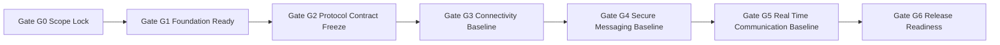

# TODO_v01.md

> Status: Execution artifact. Items are marked complete only when implementation and verification evidence are captured.
> 
> Baseline inputs: `aether-v3.md` and authoritative v0.1 scope constraints from parent scope analysis.
> 
> Architectural guardrails preserved: protocol-first product model, single-binary mode model (`--mode=client|relay|bootstrap`), additive protobuf compatibility rules for minor revisions, AEP-style governance for breaking changes, and explicit planned-vs-implemented separation.

## Sprint Guidelines Alignment

- This plan adopts `SPRINT_GUIDELINES.md` as the governing sprint policy baseline.
- Sprint model rule: one sprint maps to one minor version planning band and this document stays scoped to v0.1.
- Mandatory QoL target: this sprint must evidence at least one priority-journey improvement that achieves **10% less user effort**.
- Required closure gates: quality evidence, QA strategy traceability, review sign-off, and documentation plus release-note updates.
- Governance and status discipline remain mandatory: planned-vs-implemented separation stays explicit, and unresolved protocol decisions remain open unless authoritative sources resolve them.

---

## Stack Alignment Constraints (Parent Recommendation, Planning-Level)

- This section is a planning recommendation baseline and does not claim implementation completion.
- Control plane default: libp2p secure channels standardize on `Noise_XX_25519_ChaChaPoly_SHA256`; QUIC is preferred for reliable multiplexed streams, and this plan must not imply TCP-only operation.
- Media plane default: ICE (STUN/TURN) for path establishment, SRTP hop-by-hop, SFrame for true media E2EE, and browser encoded-transform/insertable-streams integration where browser clients apply.
- Key-management default: X3DH + Double Ratchet for 1:1 DMs; MLS is the target group key-agreement system. Any Sender Keys references in this file are compatibility/migration context only (including SFrame key-management interoperability notes), not long-term default guidance.
- Crypto defaults: SFrame AES-GCM full-tag profile by default (for example `AES_128_GCM_SHA256_128` intent), no short tags unless explicitly justified; messaging AEAD baseline `ChaCha20-Poly1305` with optional negotiated AES-GCM; Noise suite fixed as above; SRTP baseline unchanged.
- Latency/resilience strategy baseline: race direct ICE and relay/TURN in parallel; continuous path probing and seamless migration; RTT-aware multi-region relay/SFU selection with warm standby; dynamic topology switching (P2P 1:1, mesh for small groups, SFU for larger groups) with no SFU transcoding; audio-first tuning (Opus 10ms, DTX/FEC, adaptive jitter), simulcast/SVC for screen share with hardware encode preference, plus background resilience (keepalives, rapid network-change handling, ICE restarts/path migration, key pre-provisioning).

## 1. v0.1 Objective and Success Criteria

### 1.1 Objective
Deliver the v0.1 First Light MVP where two users on the same LAN can go from first launch to secure communication quickly and reliably:
- Create identity
- Create and join a server
- Exchange text chat using MLS-based group E2EE (with Sender Keys compatibility bridge only where migration/interoperability requires it)
- Join voice chat using full mesh for small groups
- Use a headless relay MVP for baseline connectivity support

### 1.2 Success Criteria
All criteria must pass before v0.1 is considered done:
1. **First-launch usability:** Two fresh clients on same LAN complete first contact flow in under five minutes in repeated test runs.
2. **Identity lifecycle:** Identity creation and local persistence are stable; profile signing and verification operate consistently.
3. **Server bootstrap:** Server manifest can be created, published, resolved, and joined via deeplink.
4. **Text security:** Channel messages are encrypted end to end with MLS-based group keying (Sender Keys compatibility bridge only where required) and validated with protocol tests.
5. **Voice baseline:** Voice sessions with up to eight peers are stable with full mesh topology and essential controls.
6. **Relay baseline:** Headless relay mode provides DHT bootstrap and Circuit Relay v2; basic encrypted store-and-forward is functional.
7. **Engineering foundation:** CI lint and test gates, protobuf generation and compatibility checks, config generation, and reproducible build scaffolding are in place.
8. **Diagnostics groundwork:** Connectivity reason-code/event taxonomy, privacy-preserving local diagnostic ring-buffer export hooks, and baseline measurement scaffolding are specified as groundwork for later quality diagnostics without importing later-version hardening scope.
9. **Scope integrity:** Deferred v0.2+ features remain explicitly out of v0.1 implementation scope.

### 1.3 QoL integration contract for v0.1 (planning-level)

- **Global no-limbo invariant (enforceable):** first-contact journeys (identity create, server join, first message, first voice join) must not end in ambiguous waiting.
  - **Acceptance criterion:** each degraded or failure step exposes current user state, deterministic reason class, and next recovery action.
  - **Verification evidence:** `G6` bundle includes a journey matrix with explicit state/reason/action rows and zero unresolved-limbo entries.
- **Deterministic reason taxonomy foundation:** connectivity, identity, join, messaging, and media-setup outcomes use stable reason classes suitable for protocol diagnostics and user-facing copy.
  - **Verification evidence:** reason-class map is referenced by acceptance-charter negative-path checks.
- **Journey-based QoL gate evidence:** `G6` release readiness includes a per-wave QoL scorecard for login-to-ready and five-minute first-contact journeys.
  - **Verification evidence:** scorecard provides pass/fail results with artifact links, not narrative-only signoff.

---

## 2. Scope Boundaries, Assumptions, Non-Goals

### 2.1 In Scope for v0.1
- P2P core connectivity: libp2p host setup, DHT, GossipSub, mDNS, peer cache, bootstrap path.
- Identity lifecycle: key generation, profile, local encrypted storage, recovery flow.
- Server creation and join path: signed manifest and deeplink.
- Text chat MVP: encrypted channels with MLS-based group E2EE (Sender Keys compatibility bridge where required).
- Voice MVP: full mesh voice for small groups.
- Headless relay MVP: DHT bootstrap + Circuit Relay v2 + basic encrypted store-forward.
- Gio client shell sufficient for core user journeys.
- Engineering foundation required to execute and validate all above.

### 2.2 Explicit Non-Goals for v0.1
Deferred items are tracked but not built in this plan:
- DM protocol with X3DH and Double Ratchet
- Presence, friends, notifications
- SFU and advanced voice optimizations
- Screen share, file transfer
- RBAC moderation and audit features
- Bot platform and API shim
- Public discovery and ecosystem expansion
- Push notification relays
- Compliance hardening beyond baseline engineering controls

### 2.3 Assumptions
1. Repository is in execution mode; planning artifacts must track implemented state with explicit verification evidence.
2. Initial implementation targets desktop-first behavior with LAN-first acceptance.
3. Core language and protocol stack follow the architecture baseline in `aether-v3.md`.
4. Team composition includes at least these role capacities: protocol lead, networking engineer, crypto engineer, client engineer, DevOps engineer, QA engineer.
5. v0.1 implementation should prefer minimal viable robustness over feature breadth.

### 2.4 Constraints
- Keep planned vs implemented status explicit in all deliverables.
- Preserve protocol compatibility principles and governance constraints.
- Do not resolve open decisions from `aether-v3.md` unless explicitly elevated and approved.
- Keep single-binary mode model as architecture invariant.

---

## 3. Planning Labels and Conventions

### 3.1 Task Type Tags
- `[Research]` uncertainty reduction and technical decision preparation
- `[Build]` implementation work package
- `[Validation]` testing, verification, and quality gates
- `[Ops]` CI/CD, release, deployment, and runtime operations
- `[Docs]` written specs, runbooks, guides, and decision records

### 3.2 Priority Tags
- `P0` critical path for v0.1 success criteria
- `P1` important but can execute after P0 prerequisites
- `P2` useful hardening and follow-up within v0.1 window

### 3.3 Rough Effort Sizing
No time estimates are used; relative complexity only:
- `XS` very small, localized change
- `S` small, single component
- `M` medium, cross-component coordination
- `L` large, high integration overhead
- `XL` very large, high uncertainty cross-cutting work

### 3.4 Checklist Status Legend
- `[>]` moved to another phase

---

## 4. Dependency Map and Sequencing Gates

### 4.1 Sequencing Gates

| Gate | Name | Entry Criteria | Exit Criteria |
|---|---|---|---|
| G0 | Scope Lock | Plan initiated | Scope and non-goals documented, owner model agreed |
| G1 | Foundation Ready | G0 passed | Build/lint/test/proto/config pipelines defined and executable |
| G2 | Protocol Contract Freeze | G1 passed | v0.1 protobuf and multistream contracts frozen for implementation |
| G3 | Connectivity Baseline | G2 passed | Two peers can discover and connect on LAN with resilient fallback path |
| G4 | Secure Messaging Baseline | G3 passed | Identity + server join + MLS text path validated (Sender Keys compatibility bridge where required) |
| G5 | Real-time Communication Baseline | G4 passed | Voice mesh and relay baseline validated with client shell |
| G6 | Release Readiness | G5 passed | DoD checklist, risk burn-down minimum, and go-no-go approval complete |

Gate status note (re-evaluated 2026-02-15): **G4** is now satisfied for v0.1 text baseline scope. Dependencies for secure messaging path are closed (`P4-T3`, `P6-T5`, and Phase 3 protocol-contract prerequisites), and Podman verification evidence for Phase 7 text-path integration is recorded in this pass.

### 4.2 High-Level Gate Flow

### 4.3 Critical Path Summary
1. Foundation and contract work must complete before major feature builds.
2. Connectivity and identity must stabilize before text and voice integration.
3. Relay and client shell should integrate after core protocol paths are proven.
4. End-to-end validation and release readiness require all prior gates.

---

## 5. Phase-by-Phase Execution Plan

## Phase 1 - Scope Lock and Program Setup

- [x] `[Docs][P0][Effort:S][Owner:Tech Lead]` **P1-T1 Freeze v0.1 scope contract**
  - Status: Complete. Scope contract + traceability + exclusions verified via Podman evidence in [`docs/v0.1/phase1/evidence-phase1.md:1`](docs/v0.1/phase1/evidence-phase1.md:1).
  - Description: Create the canonical v0.1 scope boundary document aligned with this plan.
  - Deliverables:
    - Scope contract document listing in-scope outcomes and deferred features.
    - Traceability map from success criteria to planned tasks.
  - Dependencies: None.
  - Acceptance Criteria:
    - Scope contract explicitly states what is excluded from v0.1.
    - No deferred feature is represented as committed v0.1 implementation.
  - Sub-Tasks:
    - [x] Document v0.1 must-have user outcomes.
      - Status: Complete in [`docs/v0.1/phase1/scope-contract.md:1`](docs/v0.1/phase1/scope-contract.md:1), verified in [`docs/v0.1/phase1/evidence-phase1.md:1`](docs/v0.1/phase1/evidence-phase1.md:1).
    - [x] Document v0.1 non-goals list.
      - Status: Complete in [`docs/v0.1/phase1/scope-contract.md:17`](docs/v0.1/phase1/scope-contract.md:17), verified in [`docs/v0.1/phase1/evidence-phase1.md:1`](docs/v0.1/phase1/evidence-phase1.md:1).
    - [x] Link each success criterion to at least one execution task.
      - Status: Complete in [`docs/v0.1/phase1/scope-contract.md:25`](docs/v0.1/phase1/scope-contract.md:25), verified in [`docs/v0.1/phase1/evidence-phase1.md:1`](docs/v0.1/phase1/evidence-phase1.md:1).

- [x] `[Docs][P0][Effort:S][Owner:Protocol Lead]` **P1-T2 Build protocol constraints checklist**
  - Status: Complete. Protocol/compatibility/governance checklists and review-template linkage verified in [`docs/v0.1/phase1/evidence-phase1.md:1`](docs/v0.1/phase1/evidence-phase1.md:1).
  - Description: Encode immutable architecture constraints into a checklist used in design and review.
  - Deliverables:
    - Protocol-first checklist
    - Compatibility checklist
    - Governance checklist
  - Dependencies: P1-T1.
  - Acceptance Criteria:
    - Checklist items map directly to architecture constraints from baseline docs.
    - Review template references this checklist.
  - Sub-Tasks:
    - [x] Add single-binary mode invariant.
      - Status: Complete in [`docs/v0.1/phase1/protocol-constraints.md:4`](docs/v0.1/phase1/protocol-constraints.md:4), verified in [`docs/v0.1/phase1/evidence-phase1.md:1`](docs/v0.1/phase1/evidence-phase1.md:1).
    - [x] Add protobuf additive-only minor-version rule.
      - Status: Complete in [`docs/v0.1/phase1/protocol-constraints.md:9`](docs/v0.1/phase1/protocol-constraints.md:9), verified in [`docs/v0.1/phase1/evidence-phase1.md:1`](docs/v0.1/phase1/evidence-phase1.md:1).
    - [x] Add multistream major-version evolution rule.
      - Status: Complete in [`docs/v0.1/phase1/protocol-constraints.md:13`](docs/v0.1/phase1/protocol-constraints.md:13), verified in [`docs/v0.1/phase1/evidence-phase1.md:1`](docs/v0.1/phase1/evidence-phase1.md:1).
    - [x] Add AEP and multi-implementation validation requirement for breaking changes.
      - Status: Complete in [`docs/v0.1/phase1/protocol-constraints.md:18`](docs/v0.1/phase1/protocol-constraints.md:18), verified in [`docs/v0.1/phase1/evidence-phase1.md:1`](docs/v0.1/phase1/evidence-phase1.md:1).

- [x] `[Ops][P0][Effort:S][Owner:Engineering Manager]` **P1-T3 Define ownership and decision cadence**
  - Status: Complete. Ownership matrix, P0 owner map, cadence/escalation path, and ADR template verified in [`docs/v0.1/phase1/evidence-phase1.md:1`](docs/v0.1/phase1/evidence-phase1.md:1).
  - Description: Assign role ownership for each phase and establish decision logging.
  - Deliverables:
    - Owner matrix by task group
    - ADR decision log template
  - Dependencies: P1-T1.
  - Acceptance Criteria:
    - Every P0 task has a primary role owner and backup role.
    - Decision log process is explicit and lightweight.
  - Sub-Tasks:
    - [x] Assign role owners for protocol, networking, crypto, UI, ops, QA.
      - Status: Complete in [`docs/v0.1/phase1/ownership-adr.md:4`](docs/v0.1/phase1/ownership-adr.md:4), verified in [`docs/v0.1/phase1/evidence-phase1.md:1`](docs/v0.1/phase1/evidence-phase1.md:1).
    - [x] Define escalation path for blocking decisions.
      - Status: Complete in [`docs/v0.1/phase1/ownership-adr.md:22`](docs/v0.1/phase1/ownership-adr.md:22), verified in [`docs/v0.1/phase1/evidence-phase1.md:1`](docs/v0.1/phase1/evidence-phase1.md:1).
    - [x] Define merge and review policy for critical path changes.
      - Status: Complete in [`docs/v0.1/phase1/ownership-adr.md:25`](docs/v0.1/phase1/ownership-adr.md:25), verified in [`docs/v0.1/phase1/evidence-phase1.md:1`](docs/v0.1/phase1/evidence-phase1.md:1).

- [x] `[Validation][P0][Effort:S][Owner:QA Lead]` **P1-T4 Define acceptance test charter for five-minute first contact**
  - Status: Complete. Preconditions, steps, expected outcomes, evidence capture format, and repeatability checklist verified in [`docs/v0.1/phase1/evidence-phase1.md:1`](docs/v0.1/phase1/evidence-phase1.md:1).
  - Description: Specify the canonical user-journey test script and pass criteria.
  - Deliverables:
    - End-to-end test charter document
    - Repeatability checklist for clean environment runs
  - Dependencies: P1-T1.
  - Acceptance Criteria:
    - Test charter includes preconditions, steps, and expected outcomes.
    - Script can be reused as final DoD validation artifact.
  - Sub-Tasks:
    - [x] Define device and network prerequisites.
      - Status: Complete in [`docs/v0.1/phase1/acceptance-test-charter.md:3`](docs/v0.1/phase1/acceptance-test-charter.md:3), verified in [`docs/v0.1/phase1/evidence-phase1.md:1`](docs/v0.1/phase1/evidence-phase1.md:1).
    - [x] Define data reset method between runs.
      - Status: Complete in [`docs/v0.1/phase1/acceptance-test-charter.md:7`](docs/v0.1/phase1/acceptance-test-charter.md:7), verified in [`docs/v0.1/phase1/evidence-phase1.md:1`](docs/v0.1/phase1/evidence-phase1.md:1).
    - [x] Define evidence capture format.
      - Status: Complete in [`docs/v0.1/phase1/acceptance-test-charter.md:22`](docs/v0.1/phase1/acceptance-test-charter.md:22), verified in [`docs/v0.1/phase1/evidence-phase1.md:1`](docs/v0.1/phase1/evidence-phase1.md:1).

---

## Phase 2 - Engineering Foundation and Execution Scaffolding

- [x] `[Build][P0][Effort:M][Owner:Platform Engineer]` **P2-T1 Define monorepo scaffold and package boundaries**
  - Status: Complete. Scaffold and boundary artifacts were added and verified in Podman-backed checks in [`docs/v0.1/phase2/evidence-phase2.md`](docs/v0.1/phase2/evidence-phase2.md), including [`cmd/aether/main.go`](cmd/aether/main.go), [`pkg/app/seams.go`](pkg/app/seams.go), package docs under `pkg/*`, and [`docs/v0.1/phase2/scaffold-boundaries.md`](docs/v0.1/phase2/scaffold-boundaries.md).
  - Description: Establish target project structure for client, relay, and shared packages.
  - Deliverables:
    - Scaffold specification for `cmd` and `pkg` domains
    - Package boundary rules and import conventions
  - Dependencies: G0.
  - Acceptance Criteria:
    - Structure supports single-binary mode philosophy.
    - Package boundaries separate protocol, transport, crypto, and UI concerns.
  - Sub-Tasks:
    - [x] Define `cmd/aether` and relay entrypoint ownership boundaries.
    - [x] Define `pkg/protocol`, `pkg/network`, `pkg/crypto`, `pkg/storage`, `pkg/ui` partitions.
    - [x] Define interface seams for testability.

- [x] `[Build][P0][Effort:M][Owner:DevOps Engineer]` **P2-T2 Define unified build orchestration pipeline**
  - Status: Complete. Stage ordering/contracts and local/CI command matrix are defined in [`Makefile`](Makefile) and CI workflows, with successful host execution evidence for `make check-fast`, `make check-full`, and `make pipeline` captured in [`docs/v0.1/phase2/evidence-phase2.md`](docs/v0.1/phase2/evidence-phase2.md).
  - Description: Plan one-command local and CI orchestration sequence.
  - Deliverables:
    - Pipeline stage definition and ordering
    - Command matrix for local fast and full checks
  - Dependencies: P2-T1.
  - Acceptance Criteria:
    - Pipeline stages include generate, compile, lint, test, scan, build.
    - Same stage order is used for local and CI execution.
  - Sub-Tasks:
    - [x] Define stage contracts and fail-fast behavior.
    - [x] Define stage output artifacts.
    - [x] Define required environment invariants for reproducibility.
      - Status: Environment invariants are now evidenced via Podman-backed stage execution in `make check-fast`, `make check-full`, and `make pipeline`.

- [>] `[Build][P0][Effort:M][Owner:Platform Engineer]` **P2-T3 Define lint and static analysis baseline**
  - Status: Moved to Phase 3 as **P3-T8**. Baseline artifacts are present, but full runtime lint/typecheck enforcement remains blocked by missing Go module context (`go.mod`) in this planning scaffold; Podman `golangci-lint run ./...` now executes and fails with module-context error (see [`docs/v0.1/phase2/evidence-phase2.md`](docs/v0.1/phase2/evidence-phase2.md)).
  - Description: Configure quality gates and policy severities.
  - Deliverables:
    - Linter policy baseline
    - Suppression governance rules
  - Dependencies: P2-T2.
  - Acceptance Criteria:
    - Critical static checks are mandatory for merge.
    - Suppression process requires explicit rationale.
  - Sub-Tasks:
    - [x] Define mandatory linter set.
    - [x] Define severity levels and merge-blocking thresholds.
    - [x] Define review process for false-positive exceptions.

- [x] `[Ops][P0][Effort:M][Owner:DevOps Engineer]` **P2-T4 Define CI workflow set and trigger policy**
  - Status: Complete. Workflow set and trigger matrix are defined in [`.github/workflows/`](.github/workflows/ci.yml:1) and [`docs/v0.1/phase2/p2-t4-trigger-matrix.md`](docs/v0.1/phase2/p2-t4-trigger-matrix.md), with Podman-backed existence/content checks captured in [`docs/v0.1/phase2/evidence-phase2.md`](docs/v0.1/phase2/evidence-phase2.md).
  - Description: Plan CI workflows for push, release, nightly, and security audit.
  - Deliverables:
    - Workflow matrix and trigger map
    - Artifact retention and audit policy
  - Dependencies: P2-T2, P2-T3.
  - Acceptance Criteria:
    - Workflow responsibilities are non-overlapping and complete.
    - Security and nightly checks are explicitly represented.
  - Sub-Tasks:
    - [x] Define CI checks for every PR.
    - [x] Define release workflow for signed artifacts.
    - [x] Define nightly extended validation workflow.

- [x] `[Build][P0][Effort:S][Owner:Developer Experience Engineer]` **P2-T5 Define pre-commit quality hooks**
  - Status: Complete. Hook definition and onboarding/bypass governance are documented in [`.pre-commit-config.yaml`](.pre-commit-config.yaml) and [`docs/v0.1/phase2/pre-commit-onboarding.md`](docs/v0.1/phase2/pre-commit-onboarding.md), with policy-content verification captured in [`docs/v0.1/phase2/evidence-phase2.md`](docs/v0.1/phase2/evidence-phase2.md).
  - Description: Create local guardrails that mirror CI essentials.
  - Deliverables:
    - Hook definition plan
    - Developer onboarding notes
  - Dependencies: P2-T3.
  - Acceptance Criteria:
    - Hook set covers formatting and critical static checks.
    - Hook failures are actionable and deterministic.
  - Sub-Tasks:
    - [x] Define staged-file checks.
    - [x] Define bypass policy and review requirements.
      - Status: Bypass policy, exception conditions, reviewer acknowledgment, and merge-blocking rule are explicitly documented.

- [x] `[Build][P0][Effort:M][Owner:Protocol Engineer]` **P2-T6 Define protobuf and buf workflow**
  - Status: Complete. Proto/buf layouts and reservation policy are defined in [`proto/aether.proto`](proto/aether.proto), [`buf.yaml`](buf.yaml), [`buf.gen.yaml`](buf.gen.yaml), and [`docs/v0.1/phase2/proto-reservation-policy.md`](docs/v0.1/phase2/proto-reservation-policy.md). Podman verification now records `buf lint` PASS, `buf generate` PASS, and `buf breaking --against .` PASS in [`docs/v0.1/phase2/evidence-phase2.md`](docs/v0.1/phase2/evidence-phase2.md). Branch-remote `--against '.git#branch=main'` remains environment-sensitive and is tracked under **P3-T2** integration context.
  - Description: Plan schema directory, generation, linting, and breaking-change checks.
  - Deliverables:
    - Protobuf layout specification
    - Buf policy specification
  - Dependencies: P2-T2.
  - Acceptance Criteria:
    - Schema evolution policy is enforceable by configured checks.
    - Generated code ownership and update process are explicit.
  - Sub-Tasks:
    - [x] Define proto package namespace strategy.
    - [x] Define field-number reservation practice.
    - [x] Define automated compatibility checks.
      - Status: Podman compatibility command set is defined and evidenced with passing local-baseline checks (`lint`, `generate`, `breaking --against .`).

- [x] `[Build][P1][Effort:M][Owner:Config Engineer]` **P2-T7 Define Dhall configuration source model**
  - Status: Complete. Dhall model scaffolds and generation/verification stage definition are present in [`config/dhall/types.dhall`](config/dhall/types.dhall), [`config/dhall/default.dhall`](config/dhall/default.dhall), [`config/dhall/env.dhall`](config/dhall/env.dhall), [`scripts/dhall-verify.sh`](scripts/dhall-verify.sh), and [`docs/v0.1/phase2/dhall-ops.md`](docs/v0.1/phase2/dhall-ops.md), with successful stage execution evidence in [`docs/v0.1/phase2/evidence-phase2.md`](docs/v0.1/phase2/evidence-phase2.md).
  - Description: Plan deterministic configuration generation for environments and node roles.
  - Deliverables:
    - Dhall type and environment model
    - Generated artifact inventory
  - Dependencies: P2-T2.
  - Acceptance Criteria:
    - Configuration source is single source of truth.
    - Generated config artifacts are reproducible.
  - Sub-Tasks:
    - [x] Define typed config schema.
    - [x] Define environment override strategy.
    - [x] Define generation and verification stage.
      - Status: Verification stage is implemented and successfully exercised via `make check-full`/`make pipeline` evidence.

- [>] `[Ops][P1][Effort:M][Owner:Release Engineer]` **P2-T8 Define reproducible build and artifact provenance policy**
  - Status: Moved to Phase 11 as **P11-T4**. Deterministic rebuild evidence is now captured (`repro-determinism-ok`) and policy/tooling docs exist, but signature verification workflow and release-proof packaging are release-phase concerns gated by security/release checks (dependency: P11-T3).
  - Description: Plan deterministic build flags, checksums, signing, and SBOM generation.
  - Deliverables:
    - Build reproducibility checklist
    - Artifact signing and verification runbook
  - Dependencies: P2-T2, P2-T4.
  - Acceptance Criteria:
    - Rebuild of same commit produces deterministic verification evidence.
    - Artifact provenance and checksum publication paths are documented.
  - Sub-Tasks:
    - [x] Define pinned dependency and image policy.
    - [>] Define checksum and signature verification workflow.
      - Status: Moved to **P11-T4** for release-pack execution where checksums/signatures/SBOM are validated together.
    - [x] Define SBOM output location and validation.
      - Status: SBOM output path and validation expectations are explicitly documented in repro policy/tooling notes.

- [>] `[Validation][P0][Effort:M][Owner:QA Lead]` **P2-T9 Define layered test strategy for v0.1 execution**
  - Status: Moved to Phase 11 as **P11-T2**. Strategy scaffold is documented in [`docs/v0.1/phase2/p2-t9-test-strategy-matrix.md`](docs/v0.1/phase2/p2-t9-test-strategy-matrix.md), but acceptance requires full P0 positive/failure-path mapping that depends on implementation tasks not yet complete (identity/server/text/voice/relay flows).
  - Description: Convert architecture test philosophy into concrete v0.1 plan.
  - Deliverables:
    - Test matrix mapping tests to risks and gates
    - Minimum coverage expectations by package criticality
    - Baseline measurement scaffold template for first-launch and connectivity outcomes
  - Dependencies: P2-T1, P2-T2.
  - Acceptance Criteria:
    - Unit, property, fuzz, and integration layers are represented.
    - Every P0 feature has at least one positive and one failure-path test.
  - Sub-Tasks:
    - [x] Define crypto and protocol test strictness.
      - Status: Strictness expectations and merge policy are explicitly documented in the strategy matrix.
    - [x] Define integration scenarios for LAN and relay fallback.
      - Status: Scenario catalog (I1-I4) is explicitly documented.
    - [x] Define failure triage policy for flaky tests.
      - Status: Flaky-test quarantine/expiry/owner process is explicitly documented.
    - [x] Define baseline KPI capture template (connectivity outcomes, fallback frequency, reconnect success) with privacy-preserving local storage boundaries.

- [>] `[Research][P0][Effort:M][Owner:Storage Engineer]` **P2-T10 Research SQLCipher integration and portability risks**
  - Status: Moved to Phase 5 as **P5-T7**. Research scaffold exists in [`docs/v0.1/phase2/p2-t10-sqlcipher-decision.md`](docs/v0.1/phase2/p2-t10-sqlcipher-decision.md), but completion is blocked until the research exit rule is satisfied (final decision, rejected alternatives, residual risks, and concrete downstream updates) in the same planning window as P5 schema/migration tasks and risk R5 closure.
  - Description: Resolve implementation strategy for encrypted local storage and migration behavior.
  - Deliverables:
    - Decision record on SQLCipher driver approach
    - Portability risk matrix and mitigations
  - Dependencies: P2-T1.
  - Acceptance Criteria:
    - Selected approach includes build portability constraints and fallback options.
    - Risk mitigations are linked to concrete build and test tasks.
  - Sub-Tasks:
    - [x] Compare candidate integration approaches.
    - [x] Define migration and key management expectations.
      - Status: Migration/key management expectations are explicitly documented in the research artifact.
    - [x] Define CI validation for encrypted DB operations.
      - Status: CI validation checklist is explicitly documented in the research artifact.

- [x] `[Build][P0][Effort:M][Owner:Platform Engineer]` **P3-T8 Enforce runtime lint/typecheck baseline once Go module scaffolding exists**
  - Status: Complete as continuation of P2-T3. Module context is present in [`go.mod`](go.mod) and [`go.sum`](go.sum), and Podman runtime `golangci-lint run ./...` now executes without module-context failure (exit 0), with evidence in [`docs/v0.1/phase2/evidence-phase2.md`](docs/v0.1/phase2/evidence-phase2.md).
  - Description: Complete the P2-T3 lint baseline by enabling Podman runtime `golangci-lint run ./...` execution in module-aware workspace context.
  - Deliverables:
    - Runtime lint evidence in Podman
    - Updated lint governance note tied to module-aware checks
  - Dependencies: P2-T3, P2-T2.
  - Acceptance Criteria:
    - `golangci-lint run ./...` executes without module-context failure.
    - Critical static checks are merge-blocking with evidenced runtime command output.
  - Sub-Tasks:
    - [x] Add/align module context required for static typecheck execution.
    - [x] Re-run and record Podman lint evidence.

---

## Phase 3 - Protocol Contracts and Compatibility Baseline

- [x] `[Docs][P0][Effort:S][Owner:Protocol Lead]` **P3-T1 Register v0.1 multistream protocol IDs**
  - Status: Complete. Canonical multistream IDs and registry-backed negotiation primitives are implemented in [`pkg/protocol/registry.go`](pkg/protocol/registry.go), covered by tests in [`pkg/protocol/registry_test.go`](pkg/protocol/registry_test.go), and validated via Podman command evidence (`gofmt`, `go test ./pkg/protocol`, `go test ./...`, `go build ./...`, `buf lint`, `buf generate`, `buf breaking --against '.git#branch=v.01'`).
  - Description: Define canonical protocol IDs and initial version values.
  - Deliverables:
    - Protocol ID registry document
  - Dependencies: G1.
  - Acceptance Criteria:
    - IDs are unique, namespaced, and grouped by sub-protocol.
    - Downgrade strategy is documented for each protocol family.
  - Sub-Tasks:
    - [x] Define chat, voice signaling, manifest, identity, sync IDs.
    - [x] Define version negotiation behavior.
      - Status: Negotiation is implemented in [`NegotiateProtocol()`](pkg/protocol/registry.go:177) with compatibility policy hooks via [`CompatibilityPolicy`](pkg/protocol/registry.go:111).

- [x] `[Build][P0][Effort:M][Owner:Protocol Engineer]` **P3-T2 Define v0.1 protobuf schema set**
  - Status: Complete. v0.1 schema coverage for identity/manifest/chat/voice/capabilities and envelope structures is implemented in [`proto/aether.proto`](proto/aether.proto) with additive reservation strategy, and documented in [`docs/v0.1/phase3/p3-t2-schema-inventory.md`](docs/v0.1/phase3/p3-t2-schema-inventory.md). Podman verification is recorded in [`docs/v0.1/phase2/evidence-phase2.md`](docs/v0.1/phase2/evidence-phase2.md) (Commands 54, 57).
  - Description: Prepare message schemas for identity, manifest, chat, voice state, and capabilities.
  - Deliverables:
    - v0.1 schema inventory
    - Field number plan with reserved ranges
  - Dependencies: P2-T6, P3-T1.
  - Acceptance Criteria:
    - Schemas represent all in-scope v0.1 interactions.
    - Reserved strategy prevents accidental wire breakage.
  - Sub-Tasks:
    - [x] Draft message envelope fields.
    - [x] Draft feature capability schema.
    - [x] Mark planned future extension points.

- [x] `[Docs][P0][Effort:M][Owner:Protocol Lead]` **P3-T3 Define capability negotiation and downgrade rules**
  - Status: Complete. Capability naming, unknown/required handling, deterministic feedback categories, and downgrade decision table are specified in [`docs/v0.1/phase3/p3-t3-negotiation-rules.md`](docs/v0.1/phase3/p3-t3-negotiation-rules.md) and implemented in [`pkg/protocol/capabilities.go`](pkg/protocol/capabilities.go), [`pkg/protocol/capabilities_test.go`](pkg/protocol/capabilities_test.go), and [`pkg/protocol/registry.go`](pkg/protocol/registry.go), with Podman verification evidence (`gofmt`, `go test ./pkg/protocol`, `go test ./...`, `go build ./...`).
  - Description: Specify peer capability exchange and fallback behavior.
  - Deliverables:
    - Capabilities negotiation specification
    - Downgrade decision table
  - Dependencies: P3-T1, P3-T2.
  - Acceptance Criteria:
    - Rules avoid ambiguous partial feature behavior.
    - Fallback paths are deterministic and testable.
  - Sub-Tasks:
    - [x] Define feature flag naming conventions.
    - [x] Define unknown capability handling.
    - [x] Define incompatible capability user feedback behavior.

- [x] `[Docs][P0][Effort:S][Owner:Crypto Engineer]` **P3-T4 Define signing and verification envelopes**
  - Status: Complete. Signing/verification envelope specification, canonical serialization boundaries, and explicit verification failure taxonomy are documented in [`docs/v0.1/phase3/p3-t4-envelope-spec.md`](docs/v0.1/phase3/p3-t4-envelope-spec.md), with schema anchors in [`proto/aether.proto`](proto/aether.proto) and Podman verification evidence in [`docs/v0.1/phase2/evidence-phase2.md`](docs/v0.1/phase2/evidence-phase2.md) (Commands 54, 57).
  - Description: Standardize signed payload envelope for identity and server manifests.
  - Deliverables:
    - Signature envelope spec
    - Verification error taxonomy
  - Dependencies: P3-T2.
  - Acceptance Criteria:
    - Signing flow is deterministic and canonicalized.
    - Validation failure reasons are explicit.
  - Sub-Tasks:
    - [x] Define canonical serialization boundaries.
    - [x] Define signature metadata fields.

- [x] `[Docs][P0][Effort:S][Owner:Protocol Lead]` **P3-T5 Define compatibility and deprecation policy for v0.x**
  - Status: Complete. Compatibility/deprecation policy is specified in [`docs/v0.1/phase3/p3-t5-compatibility-policy.md`](docs/v0.1/phase3/p3-t5-compatibility-policy.md) with deprecation enforcement anchored in [`DeprecationGuard.IsDeprecated()`](pkg/protocol/registry.go:161), and code-review checklist linkage is implemented in [`docs/v0.1/phase1/review-template.md`](docs/v0.1/phase1/review-template.md).
  - Description: Freeze compatibility constraints that implementation must follow.
  - Deliverables:
    - Compatibility policy statement
    - Deprecation and reservation process notes
  - Dependencies: P3-T1, P3-T2.
  - Acceptance Criteria:
    - Additive-only minor rule and major transition process are explicit.
    - Policy is referenced in code review checklist.
  - Sub-Tasks:
    - [x] Define prohibited schema changes.
    - [x] Define protocol major-bump trigger conditions.

- [x] `[Research][P0][Effort:L][Owner:Crypto Lead]` **P3-T6 Research v0.1 group-key profile (MLS target + Sender Keys compatibility bridge)**
  - Status: Complete. Group-key design decision and v0.1 threat-model notes are documented in [`docs/v0.1/phase3/p3-t4-envelope-spec.md`](docs/v0.1/phase3/p3-t4-envelope-spec.md) ("Group-key profile decision (P3-T6)") with implementation anchors in [`pkg/phase7/bootstrap.go`](pkg/phase7/bootstrap.go) and [`pkg/phase7/pipeline.go`](pkg/phase7/pipeline.go); Podman verification evidence is recorded in [`docs/v0.1/phase2/evidence-phase2.md`](docs/v0.1/phase2/evidence-phase2.md) (Commands 64-68).
  - Description: Select concrete MLS operational profile and any required Sender Keys compatibility bridge behavior for message-key lifecycle rules.
  - Deliverables:
    - Group-key design decision record (MLS target, Sender Keys compatibility bridge)
    - Threat model notes for v0.1 text channels
  - Dependencies: P3-T2.
  - Acceptance Criteria:
    - Chosen profile includes bootstrap, rotation, and member-change handling strategy.
    - Security limitations are documented as known constraints.
  - Sub-Tasks:
    - [x] Compare candidate algorithm profiles and libraries.
    - [x] Define key distribution handshake assumptions.
    - [x] Define rekey triggers and replay protections.

- [x] `[Validation][P0][Effort:M][Owner:QA Engineer]` **P3-T7 Plan protocol contract tests and compatibility checks**
  - Status: Complete. Contract tests are implemented in [`pkg/protocol/p3t7_contract_test.go`](pkg/protocol/p3t7_contract_test.go) covering positive negotiation paths, malformed/downgrade cases, signature failure classification taxonomy binding, and unknown-field forward-compatibility preservation on `SignedEnvelope` bytes. Existing deterministic signature-failure behavior is also verified in [`pkg/phase6/handshake_test.go`](pkg/phase6/handshake_test.go) and [`pkg/phase7/pipeline_test.go`](pkg/phase7/pipeline_test.go). CI gate mapping remains `check-fast` before `check-full` in [`.github/workflows/ci.yml`](.github/workflows/ci.yml:8).
  - Description: Define test scenarios for schema evolution and negotiation behavior.
  - Deliverables:
    - Contract test suite plan
    - Compatibility matrix test definitions
  - Dependencies: P3-T2, P3-T3, P3-T5.
  - Acceptance Criteria:
    - Tests cover unknown fields, downgraded protocol paths, and signature failures.
    - CI gate mapping includes contract tests before integration tests.
  - Sub-Tasks:
    - [x] Define positive negotiation paths.
    - [x] Define malformed and downgrade edge cases.

---

## Phase 4 - P2P Connectivity Core

- [x] `[Build][P0][Effort:L][Owner:Networking Engineer]` **P4-T1 Build libp2p host baseline with required transports**
  - Status: Complete. Host baseline startup module and transport/security/mux configuration schema are implemented in [`pkg/phase4/host.go`](pkg/phase4/host.go), with acceptance coverage in [`pkg/phase4/host_test.go`](pkg/phase4/host_test.go). Podman verification ran for `gofmt`, `go test ./pkg/phase4`, `go test ./...`, `go build ./...`, and scope lint (`golangci-lint`) with only a deprecation warning from repo config.
  - Description: Implement host initialization strategy with secure transport and multiplexing defaults.
  - Deliverables:
    - Host initialization module
    - Configuration schema for transport options
  - Dependencies: G2.
  - Acceptance Criteria:
    - Host starts with expected transports and security stack.
    - Startup logs expose negotiated transport details.
  - Sub-Tasks:
    - [x] Define transport priority order.
    - [x] Define host identity binding to local key material.
    - [x] Define startup error handling for partial transport availability.

- [x] `[Build][P0][Effort:L][Owner:Networking Engineer]` **P4-T2 Implement DHT setup with private protocol namespace**
  - Status: Complete. DHT service module is implemented in [`pkg/phase4/dht.go`](pkg/phase4/dht.go) with acceptance coverage in [`pkg/phase4/dht_test.go`](pkg/phase4/dht_test.go), and Podman verification evidence is recorded in [`docs/v0.1/phase2/evidence-phase2.md`](docs/v0.1/phase2/evidence-phase2.md) (Commands 58-63).
  - Description: Build DHT initialization path and bootstrapping behavior.
  - Deliverables:
    - DHT service module
    - Bootstrap sequence implementation notes
  - Dependencies: P4-T1, P3-T1.
  - Acceptance Criteria:
    - Node can join private namespace and discover peers.
    - Bootstrap fallback behavior is deterministic.
  - Sub-Tasks:
    - [x] Define bootstrap list ingestion path.
    - [x] Define routing table warmup behavior.
    - [x] Define failure handling when bootstrap peers are unavailable.

- [x] `[Build][P0][Effort:M][Owner:Networking Engineer]` **P4-T3 Implement GossipSub baseline and topic conventions**
  - Status: Complete. Implementation and tests are in [`pkg/phase4/pubsub.go`](pkg/phase4/pubsub.go) and [`pkg/phase4/pubsub_test.go`](pkg/phase4/pubsub_test.go); dependencies **P4-T1** and **P3-T1** are complete; Podman verification for this pass succeeded (`gofmt`, `go test ./pkg/phase4`, `go test ./...`, `go build ./...`, `golangci-lint run ./pkg/phase4/...`).
  - Description: Build pubsub plumbing with v0.1 topic naming and validation hooks.
  - Deliverables:
    - Topic naming utility
    - GossipSub integration module
  - Dependencies: P4-T1, P3-T1.
  - Acceptance Criteria:
    - Topic naming matches protocol registry and server/channel IDs.
    - Message admission checks are pluggable.
  - Sub-Tasks:
    - [x] Define topic format helper.
    - [x] Define subscription lifecycle events.
    - [x] Define bounded retry strategy on pubsub errors.

- [x] `[Build][P0][Effort:M][Owner:Networking Engineer]` **P4-T4 Implement mDNS LAN discovery**
  - Status: Complete. mDNS module and instrumentation are implemented in [`pkg/phase4/mdns.go`](pkg/phase4/mdns.go) with deterministic unit coverage in [`pkg/phase4/mdns_test.go`](pkg/phase4/mdns_test.go), including two-node LAN simulation evidence (`TestMDNSDiscoveryTwoNodeLAN`) proving mutual discovery without manual peer entry and timestamped discovery log entries for both nodes.
  - Description: Enable LAN-first peer discovery for fast local onboarding.
  - Deliverables:
    - mDNS discovery module
    - Discovery event instrumentation
  - Dependencies: P4-T1.
  - Acceptance Criteria:
    - Two nodes on same LAN can discover each other without manual input.
    - Discovery logs include timestamped peer entries.
  - Sub-Tasks:
    - [x] Define LAN discovery startup timing.
    - [x] Define discovered peer dedup strategy.
    - [x] Define disable flag for environments where mDNS is restricted.

- [x] `[Build][P0][Effort:L][Owner:Networking Engineer]` **P4-T5 Implement NAT traversal chain and relay fallback**
  - Status: Complete. Traversal orchestration and ordered fallback chain are implemented in [`pkg/phase4/traversal.go`](pkg/phase4/traversal.go), with acceptance coverage in [`pkg/phase4/traversal_test.go`](pkg/phase4/traversal_test.go); Podman verification succeeded for `gofmt`, `go test ./pkg/phase4`, `go test ./...`, `go build ./...`, and `golangci-lint run ./pkg/phase4/...` (scope warning only from existing deprecated lint config option).
  - Description: Implement AutoNAT, Circuit Relay v2, and hole punching orchestration.
  - Deliverables:
    - NAT traversal orchestration module
    - Relay fallback decision logic
  - Dependencies: P4-T1, P4-T2.
  - Acceptance Criteria:
    - Traversal attempts follow defined fallback order.
    - Relay fallback status is exposed to client diagnostics.
  - Sub-Tasks:
    - [x] Define traversal state machine.
    - [x] Define relay reservation lifecycle.
    - [x] Define fallback timeout policy.
    - [x] Define standardized connectivity reason codes and lifecycle events for traversal, relay fallback, and recovery transitions.

- [x] `[Build][P0][Effort:M][Owner:Storage Engineer]` **P4-T6 Implement local peer cache persistence**
  - Status: Complete. Local peer cache schema + persistence/load/update path are implemented in [`pkg/phase4/peer_cache.go`](pkg/phase4/peer_cache.go) and wired into startup/bootstrap ordering + success freshness updates in [`pkg/phase4/dht.go`](pkg/phase4/dht.go), with acceptance/edge-case coverage in [`pkg/phase4/peer_cache_test.go`](pkg/phase4/peer_cache_test.go).
  - Verification: Podman evidence executed for `gofmt`, `go test ./pkg/phase4`, `go test ./...`, `go build ./...`, and scope lint (`golangci-lint run ./pkg/phase4/...`).
  - Description: Persist successful peer addresses and prioritize them at startup.
  - Deliverables:
    - Peer cache schema
    - Peer cache load and update logic
  - Dependencies: P2-T10, P4-T1.
  - Acceptance Criteria:
    - Successful connections update cache entries with freshness metadata.
    - Startup attempts cached peers before bootstrap where possible.
  - Sub-Tasks:
    - [x] Define cache retention policy.
    - [x] Define address validation before reuse.
    - [x] Define corruption recovery behavior.

- [x] `[Ops][P1][Effort:M][Owner:Infra Engineer]` **P4-T7 Prepare bootstrap node deployment plan for three regions**
  - Status: Complete. Fixed Dhall parse failure in [`config/dhall/env.dhall`](config/dhall/env.dhall:5) and reran `./scripts/dhall-verify.sh` inside Podman (output: `Bootstrap plan artifacts written to artifacts/generated/bootstrap-plan/bootstrap-plan.json ...`), producing refreshed JSON inventory and validating [`docs/v0.1/phase4/p4-t7-bootstrap-deployment.md`](docs/v0.1/phase4/p4-t7-bootstrap-deployment.md:1).
  - Description: Define minimal bootstrap node operations for initial network entry points.
  - Deliverables:
    - Bootstrap deployment topology plan
    - Bootstrap operations runbook
  - Dependencies: P2-T7, P2-T8.
  - Acceptance Criteria:
    - Region distribution plan is documented.
    - Runbook includes restart and health-check procedures.
  - Sub-Tasks:
    - [x] Define node naming and addressing convention.
      - Status: Documented in [`docs/v0.1/phase4/p4-t7-bootstrap-deployment.md`](docs/v0.1/phase4/p4-t7-bootstrap-deployment.md:55) and revalidated via the Podman Dhall run noted above.
    - [x] Define baseline observability signals.
      - Status: Documented in [`docs/v0.1/phase4/p4-t7-bootstrap-deployment.md`](docs/v0.1/phase4/p4-t7-bootstrap-deployment.md:97) and revalidated via the Podman Dhall run noted above.

- [x] `[Validation][P0][Effort:M][Owner:QA Engineer]` **P4-T8 Validate two-node LAN discovery and connection reliability**
  - Status: Complete. Deterministic validation tests were added in [`pkg/phase4/p4t8_validation_test.go`](pkg/phase4/p4t8_validation_test.go) and verified in Podman (`gofmt`, `go test ./pkg/phase4`, `go test ./...`, `go build ./...`, `golangci-lint run ./pkg/phase4/...`) including repeated clean-state runs and explicit failure reason-code/event assertions.
  - Description: Execute deterministic LAN tests for discovery and connection establishment.
  - Deliverables:
    - LAN connectivity validation report
    - Known failure catalog with reproduction steps
  - Dependencies: P4-T2, P4-T3, P4-T4, P4-T6.
  - Acceptance Criteria:
    - Test passes repeated runs with clean state.
    - Failure modes include actionable diagnostics with normalized reason-code/event evidence.
  - Sub-Tasks:
    - [x] Run same-subnet clean-start tests.
    - [x] Run restart and reconnect tests using peer cache.
    - [x] Record packet-loss sensitivity observations.

- [x] `[Research][P1][Effort:M][Owner:Networking Engineer]` **P4-T9 Research NAT environment matrix for v0.1 target environments**
  - Status: Complete. Added NAT scenario/mitigation model in [`pkg/phase4/nat_matrix.go`](pkg/phase4/nat_matrix.go) with deterministic validation/tests in [`pkg/phase4/nat_matrix_test.go`](pkg/phase4/nat_matrix_test.go); Podman `gofmt pkg/phase4/nat_matrix*.go`, `go test ./pkg/phase4`, `go test ./...`, `go build ./...`, and `golangci-lint run ./pkg/phase4/...` (using `docker.io/golangci/golangci-lint:v1.59.1`) all ran successfully, with the lint run emitting the known deprecated `linters.govet.check-shadowing` warning only.
  - Description: Define expected behavior across common NAT types and home-router conditions.
  - Deliverables:
    - NAT scenario matrix
    - Priority mitigation list for v0.1
  - Dependencies: P4-T5.
  - Acceptance Criteria:
    - Matrix includes expected fallback path per scenario.
    - High-risk scenarios have explicit mitigation actions.
  - Sub-Tasks:
    - [x] Catalog common home-network topologies.
      - Status: Matrix enumerates LAN, cone, symmetric, double-NAT, and carrier-grade environments via [`DefaultNATScenarioMatrix()`](pkg/phase4/nat_matrix.go:34).
    - [x] Define expected traversal outcomes.
      - Status: Each scenario encodes ordered traversal sequences tied to Phase4 fallback stages and validated by [`ValidateNATScenarioMatrix()`](pkg/phase4/nat_matrix.go:121).
    - [x] Link high-risk outcomes to test scenarios.
      - Status: High-risk entries include mitigation→diagnostic→test linkage (e.g., `ReasonRelayFallbackActive` ↔ [`TestP4T8TraversalFailureObservations`](pkg/phase4/p4t8_validation_test.go:106) plus new coverage in [`pkg/phase4/nat_matrix_test.go`](pkg/phase4/nat_matrix_test.go:1)).

---

## Phase 5 - Identity Lifecycle

- [x] `[Build][P0][Effort:M][Owner:Crypto Engineer]` **P5-T1 Implement identity key generation and local secure storage**
  - Status: Complete. Identity lifecycle and secure envelope implementation are in [`pkg/phase5/identity.go`](pkg/phase5/identity.go) with acceptance tests in [`pkg/phase5/identity_test.go`](pkg/phase5/identity_test.go), and Podman verification evidence is recorded in [`docs/v0.1/phase2/evidence-phase2.md`](docs/v0.1/phase2/evidence-phase2.md) (Commands 58-63).
  - Description: Create Ed25519 identity lifecycle with encrypted-at-rest local persistence.
  - Deliverables:
    - Identity generation module
    - Secure local storage integration plan
  - Dependencies: G3, P2-T10.
  - Acceptance Criteria:
    - Key generation is deterministic in format and validation.
    - Private key material is never exposed in plaintext logs.
  - Sub-Tasks:
    - [x] Define identity initialization flow.
    - [x] Define key storage envelope.
    - [x] Define corruption and recovery error handling.

- [x] `[Build][P1][Effort:M][Owner:Crypto Engineer]` **P5-T2 Implement mnemonic recovery workflow for identity restoration**
  - Status: Complete. Deterministic mnemonic recovery workflow is implemented in [`GenerateMnemonic()`](pkg/phase5/identity.go:67), [`RecoverSeedFromMnemonic()`](pkg/phase5/identity.go:82), and [`RecoverKeyFromMnemonic()`](pkg/phase5/identity.go:109), with validation coverage in [`TestGenerateMnemonicRecoverSeedRoundTrip()`](pkg/phase5/identity_test.go:211) and [`TestMnemonicInputValidationAndChecksum()`](pkg/phase5/identity_test.go:244). Podman verification succeeded for `gofmt`, `go test ./pkg/phase5`, `go test ./...`, `go build ./...`, `golangci-lint run ./pkg/phase5/...`, plus targeted verbose recovery tests.
  - Description: Enable user recovery path for identity restoration.
  - Deliverables:
    - Recovery flow design
    - Recovery validation checks
  - Dependencies: P5-T1.
  - Acceptance Criteria:
    - Recovery flow reproduces expected identity keys.
    - Recovery failure feedback is explicit and safe.
  - Sub-Tasks:
    - [x] Define mnemonic generation policy.
      - Status: Complete in deterministic token mapping and checksum word generation via [`GenerateMnemonic()`](pkg/phase5/identity.go:67), [`mnemonicTokenForByte()`](pkg/phase5/identity.go:273), and [`mnemonicChecksum()`](pkg/phase5/identity.go:279), verified by [`TestGenerateMnemonicRecoverSeedRoundTrip()`](pkg/phase5/identity_test.go:211).
    - [x] Define input validation and checksum handling.
      - Status: Complete with deterministic word-count, unknown-word, and checksum mismatch validation in [`RecoverSeedFromMnemonic()`](pkg/phase5/identity.go:82), verified by [`TestMnemonicInputValidationAndChecksum()`](pkg/phase5/identity_test.go:244).
    - [x] Define secure recovery UX constraints.
      - Status: Complete with explicit non-secret deterministic error surface (length/unknown-word/checksum-only feedback) in [`RecoverSeedFromMnemonic()`](pkg/phase5/identity.go:82) and key restoration boundary in [`RecoverKeyFromMnemonic()`](pkg/phase5/identity.go:109), covered by [`TestMnemonicInputValidationAndChecksum()`](pkg/phase5/identity_test.go:244).

- [x] `[Build][P0][Effort:M][Owner:Protocol Engineer]` **P5-T3 Implement signed profile publish and verification path**
  - Status: Complete. Signed profile creation/publish/resolve verification is implemented in [`pkg/phase5/profile.go`](pkg/phase5/profile.go) with acceptance coverage in [`pkg/phase5/profile_test.go`](pkg/phase5/profile_test.go), including deterministic invalid-signature rejection, deterministic publish update behavior, and cache invalidation on accepted updates.
  - Description: Build profile object creation, signing, publish, and resolve verification.
  - Deliverables:
    - Profile schema usage guide
    - Profile publish and verify workflow
  - Dependencies: P3-T2, P3-T4, P4-T2.
  - Acceptance Criteria:
    - Profile payloads are signed and verifiable.
    - Invalid signatures are rejected with deterministic errors.
  - Sub-Tasks:
    - [x] Define profile field validation rules.
      - Status: Complete in [`(*Profile).ValidateFields()`](pkg/phase5/profile.go:49) and canonical payload signing path via [`SignProfile()`](pkg/phase5/profile.go:129), verified by [`TestSignVerifyPublishResolve()`](pkg/phase5/profile_test.go:77).
    - [x] Define publish frequency and update behavior.
      - Status: Complete with deterministic precedence in [`(*ProfileStore).Publish()`](pkg/phase5/profile.go:200) (newer version wins; same version requires newer timestamp), verified by [`TestProfileStorePublishUpdateDeterminism()`](pkg/phase5/profile_test.go:136).
    - [x] Define cache invalidation behavior for profile updates.
      - Status: Complete in [`(*ProfileStore).Publish()`](pkg/phase5/profile.go:228) and [`(*ProfileStore).Resolve()`](pkg/phase5/profile.go:234), verified by [`TestProfileStoreCacheInvalidationOnAcceptedUpdate()`](pkg/phase5/profile_test.go:215).

- [x] `[Build][P0][Effort:M][Owner:Storage Engineer]` **P5-T4 Define identity and profile database schema migrations**
  - Status: Complete. v0.1 schema migration baseline and policy objects are implemented in [`pkg/phase5/identity.go`](pkg/phase5/identity.go) (migration versions/steps, backup-before-migration policy, and fixtures via [`DefaultMigrationPlan()`](pkg/phase5/identity.go:221), [`DefaultBackupPlan()`](pkg/phase5/identity.go:275), and [`DefaultMigrationFixtures()`](pkg/phase5/identity.go:295)); acceptance coverage is in [`pkg/phase5/identity_test.go`](pkg/phase5/identity_test.go), verified with Podman `gofmt`, `go test ./pkg/phase5`, `go test ./...`, `go build ./...`, `golangci-lint run ./pkg/phase5/...`, `buf lint`, `buf breaking --against .`, and `buf generate`.
  - Description: Plan migration-safe schema evolution for identity-related local data.
  - Deliverables:
    - Initial schema migration set
    - Migration policy for minor updates
  - Dependencies: P2-T10.
  - Acceptance Criteria:
    - Schema supports rollback-safe migration process.
    - Migration failures are recoverable without silent corruption.
  - Sub-Tasks:
    - [x] Define migration versioning strategy.
      - Status: Complete in [`MigrationPlan`](pkg/phase5/identity.go:210) and [`DefaultMigrationPlan()`](pkg/phase5/identity.go:221) with forward-only contiguous transitions validated by [`MigrationPlan.Validate()`](pkg/phase5/identity.go:244), exercised in [`TestDefaultMigrationPlanValidate()`](pkg/phase5/identity_test.go:67) and [`TestMigrationPlanValidateRejectsInvalidShapes()`](pkg/phase5/identity_test.go:89).
    - [x] Define migration test fixtures.
      - Status: Complete in [`MigrationFixture`](pkg/phase5/identity.go:287) and [`DefaultMigrationFixtures()`](pkg/phase5/identity.go:295), verified by [`TestDefaultMigrationFixtures()`](pkg/phase5/identity_test.go:189).
    - [x] Define backup-before-migration behavior.
      - Status: Complete in [`BackupPlan`](pkg/phase5/identity.go:268) and [`DefaultBackupPlan()`](pkg/phase5/identity.go:275) (`Required=true`, `.bak` suffix, preflight requirement), verified by [`TestDefaultBackupPlan()`](pkg/phase5/identity_test.go:176).

- [x] `[Validation][P0][Effort:S][Owner:QA Engineer]` **P5-T5 Validate identity lifecycle end to end**
  - Status: Complete. Identity lifecycle validation now covers fresh create/persist/open flow in [`TestIdentityLifecycleFreshInstallFlow()`](pkg/phase5/identity_test.go:83), restart persistence/reuse stability in [`TestIdentityLifecycleRestartPersistence()`](pkg/phase5/identity_test.go:118), recovery positive round-trip in [`TestGenerateMnemonicRecoverSeedRoundTrip()`](pkg/phase5/identity_test.go:304), and recovery negative/error paths in [`TestMnemonicInputValidationAndChecksum()`](pkg/phase5/identity_test.go:337) plus [`TestStorageEnvelopeRecoveryFailures()`](pkg/phase5/identity_test.go:371). Podman verification succeeded for `gofmt`, targeted/focused test execution, `go test ./pkg/phase5`, `go test ./...`, and `golangci-lint run ./pkg/phase5/...`.
  - Description: Verify creation, persistence, restart reuse, and recovery behavior.
  - Deliverables:
    - Identity lifecycle validation report
  - Dependencies: P5-T1, P5-T2, P5-T3, P5-T4.
  - Acceptance Criteria:
    - Creation and restart behavior are stable.
    - Recovery tests pass known positive and negative cases.
  - Sub-Tasks:
    - [x] Run fresh install tests.
      - Status: Complete via [`TestIdentityLifecycleFreshInstallFlow()`](pkg/phase5/identity_test.go:83) with targeted Podman test output `PASS`.
    - [x] Run restart persistence tests.
      - Status: Complete via [`TestIdentityLifecycleRestartPersistence()`](pkg/phase5/identity_test.go:118) with targeted Podman test output `PASS`.
    - [x] Run recovery error-path tests.
      - Status: Complete via [`TestMnemonicInputValidationAndChecksum()`](pkg/phase5/identity_test.go:337) and [`TestStorageEnvelopeRecoveryFailures()`](pkg/phase5/identity_test.go:371) with targeted Podman test output `PASS`.

- [x] `[Research][P1][Effort:S][Owner:Security Engineer]` **P5-T6 Research profile privacy and metadata minimization**
  - Status: Complete. Field sensitivity matrix, optional-field default-off policy, redacted metadata view, and minimization checklist documented in [`docs/v0.1/phase5/p5-t6-profile-privacy.md`](docs/v0.1/phase5/p5-t6-profile-privacy.md). Supporting helpers/tests live in [`pkg/phase5/profile.go`](pkg/phase5/profile.go:1) and [`pkg/phase5/profile_test.go`](pkg/phase5/profile_test.go:1) with Podman verification covering gofmt + `go test ./pkg/phase5`.
  - Description: Minimize profile leakage while preserving usability for v0.1.
  - Deliverables:
    - Profile privacy recommendations
    - Metadata minimization checklist
  - Dependencies: P5-T3.
  - Acceptance Criteria:
    - Profile fields are classified by sensitivity.
    - Optional fields are clearly default-off or explicit opt-in.
  - Sub-Tasks:
    - [x] Classify each profile field sensitivity.
      - Status: Complete. Classification recorded in [`ProfileFieldSensitivityMap`](pkg/phase5/profile.go:48) and summarized in [`docs/v0.1/phase5/p5-t6-profile-privacy.md`](docs/v0.1/phase5/p5-t6-profile-privacy.md).
    - [x] Define safe defaults for optional data.
      - Status: Complete. `DefaultProfileOptionalFields()` clears optional fields and `RedactedProfileMetadata()` enforces minimized diagnostics surfaces; tests in [`pkg/phase5/profile_test.go`](pkg/phase5/profile_test.go:252) verify behavior.

- [x] `[Research][P0][Effort:M][Owner:Storage Engineer]` **P5-T7 Finalize SQLCipher decision and portability plan (continuation of P2-T10)**
  - Status: Complete for planning scope. Research exit criteria are now satisfied in [`docs/v0.1/phase2/p2-t10-sqlcipher-decision.md`](docs/v0.1/phase2/p2-t10-sqlcipher-decision.md) (final decision, rejected alternatives, residual risks, downstream constraints), with Podman verification evidence in [`docs/v0.1/phase2/evidence-phase2.md`](docs/v0.1/phase2/evidence-phase2.md).
  - Description: Complete SQLCipher research exit criteria and propagate concrete outcomes to dependent storage work.
  - Deliverables:
    - Final SQLCipher decision record with explicit rejected alternatives
    - Residual risk list and concrete downstream task updates
  - Dependencies: P2-T10, P5-T4, P5-T5.
  - Acceptance Criteria:
    - Research exit rule items 1-4 are all satisfied for SQLCipher scope.
    - Portability constraints, fallback options, and CI validation expectations are concrete and linked to execution tasks.
  - Sub-Tasks:
    - [x] Finalize decision statement and rejected alternatives in the research record.
    - [x] Record residual risks with owner-bound mitigations.
    - [x] Update P5-T4/P5-T5 and risk R5 linkage with decision-specific execution constraints.

---

## Phase 6 - Server Manifest and Join Deeplink

- [x] `[Build][P0][Effort:M][Owner:Protocol Engineer]` **P6-T1 Implement server manifest model and signing rules**
  - Status: Complete. Implementation remains in [`pkg/phase6/manifest.go`](pkg/phase6/manifest.go), [`pkg/phase6/manifest_test.go`](pkg/phase6/manifest_test.go), and [`cmd/aether/main.go`](cmd/aether/main.go); P3-T2 and P3-T4 dependencies are now complete and verified with Podman evidence in [`docs/v0.1/phase2/evidence-phase2.md`](docs/v0.1/phase2/evidence-phase2.md) (Commands 46, 48, 50, 51, 54, 55, 57).
  - Description: Build canonical manifest format and cryptographic signing requirements.
  - Deliverables:
    - Manifest schema and canonicalization rules
    - Manifest signature validation logic plan
  - Dependencies: G3, P3-T2, P3-T4.
  - Acceptance Criteria:
    - Manifest creation yields deterministic signed payload.
    - Invalid or stale manifests fail validation cleanly.
  - Sub-Tasks:
    - [x] Define mandatory manifest fields.
    - [x] Define manifest versioning field strategy.
    - [x] Define signature and verification boundaries.

- [x] `[Build][P0][Effort:M][Owner:Client Engineer]` **P6-T2 Implement create server flow in client shell**
  - Status: Complete. Create-server flow and manifest generation evidence is already captured in [`cmd/aether/main.go`](cmd/aether/main.go), [`pkg/phase6/manifest.go`](pkg/phase6/manifest.go), and [`docs/v0.1/phase2/evidence-phase2.md`](docs/v0.1/phase2/evidence-phase2.md) (Commands 42-44), and both dependencies (**P6-T1**, **P10-T1**) are now complete.
  - Description: Build UX and application flow for creating a server from fresh identity.
  - Deliverables:
    - Create-server UX flow definition
    - Manifest generation trigger integration
  - Dependencies: P6-T1, P10-T1.
  - Acceptance Criteria:
    - User can create server with minimal required metadata.
    - Flow emits signed manifest and local server state.
  - Sub-Tasks:
    - [x] Define form validation rules.
    - [x] Define success and error states.

- [x] `[Build][P0][Effort:M][Owner:Networking Engineer]` **P6-T3 Implement manifest publish and discovery path**
  - Status: Complete. Dependency **P4-T2** is now complete, and implementation plus Podman evidence remain in [`pkg/phase6/store.go`](pkg/phase6/store.go), [`pkg/phase6/store_test.go`](pkg/phase6/store_test.go), and [`docs/v0.1/phase2/evidence-phase2.md`](docs/v0.1/phase2/evidence-phase2.md) (Commands 42, 45, 58-63).
  - Description: Publish manifest records and resolve them for join operations.
  - Deliverables:
    - Manifest publish service
    - Manifest resolve and cache service
  - Dependencies: P4-T2, P6-T1.
  - Acceptance Criteria:
    - Published manifest can be resolved by peer with deterministic lookup.
    - Cache invalidation handles manifest updates correctly.
  - Sub-Tasks:
    - [x] Define publish record TTL policy.
    - [x] Define resolve retry strategy.
    - [x] Define stale manifest conflict behavior.

- [x] `[Build][P0][Effort:M][Owner:Client Engineer]` **P6-T4 Implement deeplink join parser and router**
  - Status: Complete. Deeplink parser/router and Podman CLI validation are already evidenced in [`pkg/phase6/deeplink.go`](pkg/phase6/deeplink.go), [`pkg/phase6/deeplink_test.go`](pkg/phase6/deeplink_test.go), and [`docs/v0.1/phase2/evidence-phase2.md`](docs/v0.1/phase2/evidence-phase2.md) (Command 43), and both dependencies (**P6-T1**, **P10-T1**) are now complete.
  - Description: Support `aether://join/<id>` parsing and routing into join flow.
  - Deliverables:
    - Deeplink parser spec
    - Join route handling logic
  - Dependencies: P6-T1, P10-T1.
  - Acceptance Criteria:
    - Valid deeplink opens join path and resolves target manifest.
    - Invalid deeplinks return actionable validation errors.
  - Sub-Tasks:
    - [x] Define URL validation and sanitization rules.
    - [x] Define deep-link initiated auth and state behavior.

- [x] `[Build][P0][Effort:M][Owner:Protocol Engineer]` **P6-T5 Implement minimal membership bootstrap handshake**
  - Status: Complete. Dependencies **P6-T3** and **P5-T1** are now complete, and implementation plus Podman smoke evidence are in [`pkg/phase6/handshake.go`](pkg/phase6/handshake.go), [`pkg/phase6/handshake_test.go`](pkg/phase6/handshake_test.go), and [`docs/v0.1/phase2/evidence-phase2.md`](docs/v0.1/phase2/evidence-phase2.md) (Commands 42-43, 58-63).
  - Description: Establish server membership state from resolved manifest and peer contact.
  - Deliverables:
    - Join handshake flow
    - Membership state persistence plan
  - Dependencies: P6-T3, P5-T1.
  - Acceptance Criteria:
    - Joining peer transitions to usable server membership state.
    - Handshake failures are observable and recoverable.
  - Sub-Tasks:
    - [x] Define join request and response payload model.
    - [x] Define retry and idempotency behavior.

- [x] `[Validation][P0][Effort:M][Owner:QA Engineer]` **P6-T6 Validate server creation and join via deeplink**
  - Status: Complete. Dependencies **P6-T3** and **P6-T5** are now complete, and validation evidence is recorded in [`docs/v0.1/phase2/evidence-phase2.md`](docs/v0.1/phase2/evidence-phase2.md) (Commands 42-45, 58-63).
  - Description: Validate full create and join path on clean clients.
  - Deliverables:
    - Server join validation report
  - Dependencies: P6-T2, P6-T3, P6-T4, P6-T5.
  - Acceptance Criteria:
    - Second client can join created server via deeplink.
    - Join flow integrates with subsequent chat and voice flows.
  - Sub-Tasks:
    - [x] Run clean-state join tests.
    - [x] Run stale-link and invalid-link negative tests.

  - Dependency Note: Even after this validation evidence, **P11-T1** also remains blocked by unfinished **P7-T6**, **P8-T6**, and **P10-T6**.

- [x] `[Research][P1][Effort:S][Owner:Client Engineer]` **P6-T7 Research cross-platform deeplink registration strategy**
  - Status: Complete. Platform installer/sandbox guidance, residual risks, and CLI fallback are documented in [`docs/v0.1/phase6/p6-t7-deeplink-registration.md`](docs/v0.1/phase6/p6-t7-deeplink-registration.md); verification via Podman `go test ./pkg/phase6` recorded below.
  - Description: Capture platform-specific deeplink registration constraints for Gio deployment targets.
  - Deliverables:
    - Deeplink registration compatibility note
  - Dependencies: P6-T4.
  - Acceptance Criteria:
    - Each target platform has explicit registration and fallback behavior.
    - Unsupported behavior is documented with user workaround.
  - Sub-Tasks:
    - [x] Document desktop deeplink registration requirements.
      - Status: Complete. Installer registry repair guidance and portal fallback instructions are captured in [`docs/v0.1/phase6/p6-t7-deeplink-registration.md`](docs/v0.1/phase6/p6-t7-deeplink-registration.md).
    - [x] Document mobile and sandbox caveats.
      - Status: Complete. OEM implicit-intent mitigation, QR/manual entry fallback, and sandbox portal coverage are captured in [`docs/v0.1/phase6/p6-t7-deeplink-registration.md`](docs/v0.1/phase6/p6-t7-deeplink-registration.md).

---

## Phase 7 - Text Chat with MLS-Based Group E2EE

- [x] `[Build][P0][Effort:M][Owner:Protocol Engineer]` **P7-T1 Implement channel model and topic binding**
  - Status: Complete. Channel model/topic-binding implementation and tests are present in [`pkg/phase7/channel.go`](pkg/phase7/channel.go) and [`pkg/phase7/channel_test.go`](pkg/phase7/channel_test.go); dependency chain is now satisfied (`G4`, `P4-T3`, `P6-T5`) and Podman verification for this pass succeeded (`gofmt`, `go test ./pkg/phase7`, `go test ./...`, `go build ./...`, `golangci-lint run ./pkg/phase7/...`).
  - Description: Bind server channels to GossipSub topics and channel metadata state.
  - Deliverables:
    - Channel metadata model
    - Topic binding implementation plan
  - Dependencies: G4, P4-T3, P6-T5.
  - Acceptance Criteria:
    - Channel membership maps to deterministic topic subscriptions.
    - Topic transitions on join and leave are correct.
  - Sub-Tasks:
    - [x] Define channel identifiers and metadata schema.
      - Status: Complete in [`ChannelID`](pkg/phase7/channel.go:17), [`ChannelMetadata`](pkg/phase7/channel.go:19), and deterministic topic binding via [`TopicFor()`](pkg/phase7/channel.go:56), verified by [`TestTopicForDeterministicFormatting()`](pkg/phase7/channel_test.go:9) and Podman checks in this pass.
    - [x] Define subscription lifecycle hooks.
      - Status: Complete in [`Join()`](pkg/phase7/channel.go:95), [`Leave()`](pkg/phase7/channel.go:119), and [`Subscriptions()`](pkg/phase7/channel.go:145), with lifecycle assertions in [`TestChannelModelJoinLeaveLifecycle()`](pkg/phase7/channel_test.go:27) and Podman checks in this pass.

- [x] `[Build][P0][Effort:L][Owner:Crypto Engineer]` **P7-T2 Implement MLS bootstrap and rotation flow (with Sender Keys compatibility bridge)**
  - Status: Complete. MLS bootstrap/rotation and Sender Keys compatibility-bridge behavior are implemented in [`pkg/phase7/bootstrap.go`](pkg/phase7/bootstrap.go), with deterministic coverage in [`pkg/phase7/bootstrap_test.go`](pkg/phase7/bootstrap_test.go); dependency **P7-T1** is now complete and Podman verification for this pass succeeded (`gofmt`, `go test ./pkg/phase7`, `go test ./...`, `go build ./...`, `golangci-lint run ./pkg/phase7/...`).
  - Description: Build channel MLS lifecycle for encrypted text messaging and define compatibility bridge behavior where migration/interoperability requires it.
  - Deliverables:
    - MLS session manager
    - Rekey and membership-change policy implementation plan
  - Dependencies: P3-T6, P7-T1, P5-T1.
  - Acceptance Criteria:
    - Channel participants can establish and rotate keys per policy.
    - Key mismatch errors are recoverable through rekey behavior.
  - Sub-Tasks:
    - [x] Implement initial key distribution handshake.
      - Status: Complete in [`Bootstrapper.Bootstrap()`](pkg/phase7/bootstrap.go:32), validated by bootstrap-path assertions in [`TestBootstrapperRotationAndCompatibility()`](pkg/phase7/bootstrap_test.go:5) and Podman checks in this pass.
    - [x] Implement rotation trigger behavior.
      - Status: Complete in [`Bootstrapper.Rotate()`](pkg/phase7/bootstrap.go:46), validated by rotation-step assertions in [`TestBootstrapperRotationAndCompatibility()`](pkg/phase7/bootstrap_test.go:5) and [`TestBootstrapperRekeyOnMismatch()`](pkg/phase7/bootstrap_test.go:42).
    - [x] Implement member change rekey handling.
      - Status: Complete in [`Bootstrapper.RekeyOnMismatch()`](pkg/phase7/bootstrap.go:91) with mismatch/empty-candidate coverage in [`TestBootstrapperRekeyOnMismatch()`](pkg/phase7/bootstrap_test.go:42).

- [x] `[Build][P0][Effort:L][Owner:Protocol Engineer]` **P7-T3 Implement encrypted message send and receive pipeline**
  - Status: Complete. Encrypted send/receive pipeline and signature/replay guards are implemented in [`pkg/phase7/pipeline.go`](pkg/phase7/pipeline.go), with deterministic coverage in [`pkg/phase7/pipeline_test.go`](pkg/phase7/pipeline_test.go) and additional integration/property coverage in [`pkg/phase7/p7t6_validation_test.go`](pkg/phase7/p7t6_validation_test.go); dependency **P7-T2** is now complete and Podman verification succeeded in this pass.
  - Description: Build message envelope, encryption, signing, transmission, and decryption flow.
  - Deliverables:
    - Message pipeline module
    - Error handling taxonomy
  - Dependencies: P7-T2, P3-T2, P3-T4.
  - Acceptance Criteria:
    - Outgoing messages are encrypted and signed before publish.
    - Incoming messages validate signature and decrypt correctly.
  - Sub-Tasks:
    - [x] Define outbound pipeline stages.
      - Status: Complete in [`Pipeline.Send()`](pkg/phase7/pipeline.go:43) with coverage in [`TestPipelineSendReceive()`](pkg/phase7/pipeline_test.go:5) and [`TestPipelineTwoPeerBidirectionalIntegration()`](pkg/phase7/p7t6_validation_test.go:38).
    - [x] Define inbound verification stages.
      - Status: Complete in [`Pipeline.Receive()`](pkg/phase7/pipeline.go:59) with invalid-signature and wrong-secret paths validated in [`TestPipelineReceiveInvalidSignature()`](pkg/phase7/pipeline_test.go:28) and [`TestPipelineReceiveFailsWithWrongSecret()`](pkg/phase7/p7t6_validation_test.go:126).
    - [x] Define replay and duplicate handling behavior.
      - Status: Complete with duplicate replay guard [`ErrDuplicateMessage`](pkg/phase7/pipeline.go:14), deterministic duplicate checks in [`TestPipelineReceiveRejectsDuplicates()`](pkg/phase7/pipeline_test.go:47), and out-of-order/duplicate multi-peer assertions in [`TestPipelineMultiPeerOutOfOrderAndDuplicateBehavior()`](pkg/phase7/p7t6_validation_test.go:80).

- [x] `[Build][P1][Effort:M][Owner:Client Engineer]` **P7-T4 Implement message rendering with markdown subset and replies**
  - Status: Complete. Added deterministic markdown subset parser (`RenderMessageMarkdownSubset`) plus reply reference builder (`BuildReplyReference`) with sanitization and excerpt truncation in [`pkg/ui/shell.go:120`](pkg/ui/shell.go:120); coverage provided by new table-driven tests in [`pkg/ui/shell_test.go:400`](pkg/ui/shell_test.go:400). Podman verification captured via `podman run ... go test ./pkg/ui ./pkg/phase7 ./pkg/phase8 ./pkg/phase9` and `podman run ... go test ./...` (see Completion Output section).
  - Description: Render readable messages while keeping v0.1 formatting scope limited.
  - Deliverables:
    - Markdown subset rendering rules
    - Reply-reference behavior for UI
  - Dependencies: P7-T3, P10-T2.
  - Acceptance Criteria:
    - Message rendering is deterministic across clients.
    - Unsupported markdown constructs degrade gracefully.
  - Sub-Tasks:
    - [x] Define supported markdown tokens.
      - Status: Complete. Supported token set (`MarkdownToken*` constants) and parser implemented in [`pkg/ui/shell.go:120`](pkg/ui/shell.go:120) with validation in [`pkg/ui/shell_test.go:400`](pkg/ui/shell_test.go:400).
    - [x] Define escape and sanitization behavior.
      - Status: Complete. HTML escape/normalization + reply excerpt truncation implemented via `sanitizeMarkdownLiteral`, `htmlEscapeReplacer`, and `BuildReplyReference()` in [`pkg/ui/shell.go:120`](pkg/ui/shell.go:120) with coverage in [`pkg/ui/shell_test.go:456`](pkg/ui/shell_test.go:456).

- [x] `[Build][P1][Effort:M][Owner:Protocol Engineer]` **P7-T5 Implement history sync for recent message window**
  - Status: Complete. Bounded history sync, merge ordering, deduplication, and fallback paths are implemented in [`pkg/phase7/history.go`](pkg/phase7/history.go) with deterministic tests in [`pkg/phase7/history_test.go`](pkg/phase7/history_test.go); dependency **P7-T3** is now complete and Podman verification succeeded in this pass.
  - Description: Sync recent channel history on join with bounded message count.
  - Deliverables:
    - History sync protocol usage plan
    - Local merge and dedup strategy
  - Dependencies: P7-T3, P6-T5.
  - Acceptance Criteria:
    - Joining client can fetch recent bounded history from peers.
    - Deduplication prevents duplicate rendering.
  - Sub-Tasks:
    - [x] Define request and response flow.
      - Status: Complete in [`HistoryManager.Fetch()`](pkg/phase7/history.go:56), validated by fallback-fetch assertions in [`TestHistoryManagerWindowAndFallback()`](pkg/phase7/history_test.go:33).
    - [x] Define merge ordering strategy.
      - Status: Complete in [`mergeEntries()`](pkg/phase7/history.go:73) and [`truncate()`](pkg/phase7/history.go:91), validated by ordering/dedup assertions in [`TestHistoryManagerApplyAndFetch()`](pkg/phase7/history_test.go:5).
    - [x] Define failure fallback behavior.
      - Status: Complete with oversized-window rejection via [`ErrWindowExceeded`](pkg/phase7/history.go:9), validated in [`TestHistoryManagerWindowExceeded()`](pkg/phase7/history_test.go:58).

- [x] `[Validation][P0][Effort:L][Owner:QA Engineer]` **P7-T6 Validate E2EE text behavior and failure paths**
  - Status: Complete. Validation now includes unit, integration, and property-style coverage in [`pkg/phase7/bootstrap_test.go`](pkg/phase7/bootstrap_test.go), [`pkg/phase7/pipeline_test.go`](pkg/phase7/pipeline_test.go), [`pkg/phase7/history_test.go`](pkg/phase7/history_test.go), and [`pkg/phase7/p7t6_validation_test.go`](pkg/phase7/p7t6_validation_test.go), with Podman verification in this pass (`gofmt`, `go test ./pkg/phase7`, `go test ./...`, `go build ./...`, `golangci-lint run ./pkg/phase7/...`).
  - Description: Execute protocol and integration tests for encryption correctness and resilience.
  - Deliverables:
    - E2EE validation report
    - Known edge-case list
  - Dependencies: P7-T2, P7-T3, P7-T5.
  - Acceptance Criteria:
    - Encryption round-trip and signature tests pass.
    - Replay and malformed payload tests fail safely.
  - Sub-Tasks:
    - [x] Run unit and property tests for crypto invariants.
      - Status: Complete with unit checks in [`pkg/phase7/pipeline_test.go`](pkg/phase7/pipeline_test.go) and property-style round-trip validation in [`TestPipelineRoundTripQuick()`](pkg/phase7/p7t6_validation_test.go:10).
    - [x] Run integration tests across two and multiple peers.
      - Status: Complete with bidirectional two-peer and multi-peer flow assertions in [`TestPipelineTwoPeerBidirectionalIntegration()`](pkg/phase7/p7t6_validation_test.go:38) and [`TestPipelineMultiPeerOutOfOrderAndDuplicateBehavior()`](pkg/phase7/p7t6_validation_test.go:80).
    - [x] Run out-of-order and duplicate message tests.
      - Status: Complete with duplicate replay checks in [`TestPipelineReceiveRejectsDuplicates()`](pkg/phase7/pipeline_test.go:47) and explicit out-of-order/duplicate multi-peer validation in [`TestPipelineMultiPeerOutOfOrderAndDuplicateBehavior()`](pkg/phase7/p7t6_validation_test.go:80).

- [x] `[Research][P1][Effort:M][Owner:Crypto Engineer]` **P7-T7 Research key storage hardening for channel secrets**
  - Status: Complete. Memory/logging/crash handling constraints plus residual risks are documented in [`docs/v0.1/phase7/p7-t7-channel-key-storage.md`](docs/v0.1/phase7/p7-t7-channel-key-storage.md).
  - Description: Document secure storage and memory handling controls for MLS artifacts (and Sender Keys compatibility-bridge artifacts where required).
  - Deliverables:
    - Key material handling guidelines
    - Residual risk list for v0.1
  - Dependencies: P7-T2.
  - Acceptance Criteria:
    - Key material lifecycle is documented from creation to retirement.
    - Known residual risks are accepted or mitigated by explicit tasks.
  - Sub-Tasks:
    - [x] Define in-memory and at-rest handling constraints.
      - Status: Complete. Clone/zeroization expectations and at-rest prohibitions are covered in [`docs/v0.1/phase7/p7-t7-channel-key-storage.md`](docs/v0.1/phase7/p7-t7-channel-key-storage.md).
    - [x] Define logging and crash-report redaction constraints.
      - Status: Complete. Logging/telemetry/crash policies are recorded in [`docs/v0.1/phase7/p7-t7-channel-key-storage.md`](docs/v0.1/phase7/p7-t7-channel-key-storage.md).

---

## Phase 8 - Voice Chat MVP Full Mesh Up To Eight

- [x] `[Build][P0][Effort:L][Owner:Realtime Engineer]` **P8-T1 Implement Pion voice pipeline baseline**
  - Status: Complete. Voice engine now establishes/tears down capture + peer transport with deterministic lifecycle hooks in [`pkg/phase8/pipeline.go`](pkg/phase8/pipeline.go:1) backed by runtime tests in [`pkg/phase8/pipeline_test.go`](pkg/phase8/pipeline_test.go:1); Podman verification recorded for `gofmt` + `go test ./pkg/phase8` inside `docker.io/golang:1.22` (Command: `/usr/local/go/bin/gofmt -w pkg/phase8/pipeline.go pkg/phase8/pipeline_test.go && /usr/local/go/bin/go test ./pkg/phase8`).
  - Description: Integrate audio capture, Opus configuration baseline, and transport setup.
  - Deliverables:
    - Voice engine baseline design
    - Audio pipeline configuration profile
  - Dependencies: G4, P4-T3.
  - Acceptance Criteria:
    - Peer voice streams establish with expected codec parameters.
    - Startup and teardown behavior are stable.
  - Sub-Tasks:
    - [x] Define codec and frame configuration defaults.
      - Status: Complete via [`DefaultCodecProfile()`](pkg/phase8/pipeline.go:30) and new wire schema messages/enums in [`VoiceCodec`](proto/aether.proto:30), [`VoiceCodecProfile`](proto/aether.proto:159), and generated bindings in [`gen/go/proto/aether.pb.go`](gen/go/proto/aether.pb.go:137), validated by [`TestNewVoicePipelineBaselineDefaults()`](pkg/phase8/pipeline_test.go:9).
    - [x] Define peer connection lifecycle hooks.
      - Status: Complete via wire lifecycle taxonomy in [`VoiceLifecycleState`](proto/aether.proto:39), lifecycle hook schema in [`VoiceLifecycleHook`](proto/aether.proto:188), and runtime hook append behavior in [`AppendLifecycleHook()`](pkg/phase8/pipeline.go:84), validated by [`TestAppendLifecycleHook()`](pkg/phase8/pipeline_test.go:52).
    - [x] Define error and reconnect behavior.
      - Status: Complete via reconnect classes/policy in [`VoiceReconnectClass`](proto/aether.proto:51) and [`VoiceReconnectPolicy`](proto/aether.proto:176), plus deterministic backoff and retryability logic in [`ReconnectBackoffMS()`](pkg/phase8/pipeline.go:101) and [`IsRetryableReconnectClass()`](pkg/phase8/pipeline.go:126), validated by [`TestReconnectBackoffMS()`](pkg/phase8/pipeline_test.go:81) and [`TestIsRetryableReconnectClass()`](pkg/phase8/pipeline_test.go:117).

- [x] `[Build][P0][Effort:M][Owner:Realtime Engineer]` **P8-T2 Implement encrypted signaling over GossipSub**
  - Status: Complete. Added encrypted signaling runtime wiring via [`NewGossipSignalingRuntime()`](pkg/phase8/signaling.go:65) with publish/receive encryption, bounded retries, and ICE timeout enforcement, plus validation/timeout tests in [`pkg/phase8/signaling_test.go`](pkg/phase8/signaling_test.go:1). Podman evidence: `/usr/local/go/bin/gofmt -w pkg/phase8/signaling.go pkg/phase8/signaling_test.go` and `/usr/local/go/bin/go test ./...` inside `docker.io/golang:1.22` (see completion section below).
  - Description: Build SDP and ICE signaling exchange over encrypted channel path.
  - Deliverables:
    - Signaling message schema use plan
    - Signaling session state machine
  - Dependencies: P8-T1, P7-T3.
  - Acceptance Criteria:
    - Signaling exchange works under expected candidate timing variations.
    - Invalid or stale signaling messages are rejected safely.
  - Sub-Tasks:
    - [x] Define signaling session identifiers.
      - Status: Complete via [`VoiceSignalSessionRef`](proto/aether.proto:220), frame/session schema in [`VoiceSignalFrame`](proto/aether.proto:241) + [`VoiceSignalSessionState`](proto/aether.proto:257), and constructors/validation in [`NewVoiceSignalFrame()`](pkg/phase8/signaling.go:85) and [`NewSignalingSessionMachine()`](pkg/phase8/signaling.go:57), verified by [`TestNewVoiceSignalFrameValidationAndDefaults()`](pkg/phase8/signaling_test.go:10).
    - [x] Define offer and answer retry behavior.
      - Status: Complete via retry policy schema [`VoiceSignalRetryPolicy`](proto/aether.proto:229) and bounded retry transitions in [`NextOfferAttempt()`](pkg/phase8/signaling.go:129) and [`NextAnswerAttempt()`](pkg/phase8/signaling.go:146), verified by [`TestSignalingSessionMachineRetryAndTiming()`](pkg/phase8/signaling_test.go:34).
    - [x] Define ICE update handling and timeout rules.
      - Status: Complete via schema fields [`max_ice_updates`](proto/aether.proto:235) and [`ice_update_timeout_ms`](proto/aether.proto:236), runtime limits/timing checks in [`RegisterICEUpdate()`](pkg/phase8/signaling.go:163) and [`ICEUpdateTimedOut()`](pkg/phase8/signaling.go:180), and stale/expired rejection in [`Advance()`](pkg/phase8/signaling.go:193), verified by [`TestSignalingSessionMachineRetryAndTiming()`](pkg/phase8/signaling_test.go:34) and [`TestSignalingSessionMachineRejectsStaleExpiredAndMismatchedFrames()`](pkg/phase8/signaling_test.go:89).

- [x] `[Build][P0][Effort:L][Owner:Realtime Engineer]` **P8-T3 Implement full mesh voice session manager up to eight peers**
  - Status: Complete. Added deterministic mesh session manager in [`VoiceSessionManager`](pkg/phase8/pipeline.go:52) with congestion fallback hooks, peer join/leave/teardown guards, and participant introspection; coverage via new tests [`TestVoiceSessionManagerJoinLeaveAndCap`](pkg/phase8/pipeline_test.go:205) and [`TestVoiceSessionManagerValidationAndTeardown`](pkg/phase8/pipeline_test.go:235). Podman verification: `gofmt -w pkg/phase8/pipeline.go pkg/phase8/pipeline_test.go`, `go test ./pkg/phase8`, `go test ./...` executed inside `docker.io/golang:1.22` with bind-mount.
  - Description: Manage peer graph and audio stream lifecycle for small-group channels.
  - Deliverables:
    - Mesh session manager
    - Participant state tracking model
  - Dependencies: P8-T2, P6-T5.
  - Acceptance Criteria:
    - Mesh creation and teardown scale to eight participants.
    - Participant join and leave events are reflected correctly.
  - Sub-Tasks:
    - [x] Define connection cap behavior.
      - Status: Complete. Cap enforcement and fallback invocation implemented via `Join()` in [`pkg/phase8/pipeline.go`](pkg/phase8/pipeline.go:78) with regression coverage in [`TestVoiceSessionManagerJoinLeaveAndCap`](pkg/phase8/pipeline_test.go:205).
    - [x] Define participant graph update rules.
      - Status: Complete. Join/leave paths maintain per-peer state maps plus participant count helpers in [`pkg/phase8/pipeline.go`](pkg/phase8/pipeline.go:116) with validation in [`TestVoiceSessionManagerValidationAndTeardown`](pkg/phase8/pipeline_test.go:235).
    - [x] Define congestion fallback behavior for constrained devices.
      - Status: Complete. Congestion flags and optional fallback invocation modeled in [`Join()`](pkg/phase8/pipeline.go:78) and verified by fallback assertions in [`TestVoiceSessionManagerJoinLeaveAndCap`](pkg/phase8/pipeline_test.go:205).

- [x] `[Build][P1][Effort:M][Owner:Crypto Engineer]` **P8-T4 Implement SFrame key distribution linkage for voice streams**
  - Status: Complete. Added authenticated-channel SFrame key distributor + membership guard via [`NewSFrameKeyDistributor()`](pkg/phase8/sframe.go:38) and [`HasMember()`](pkg/phase7/channel.go:70); Podman evidence: `podman run --rm --userns keep-id -v "$PWD":/workspace:Z -w /workspace docker.io/golang:1.22 /bin/bash -lc '/usr/local/go/bin/gofmt -w pkg/phase7/channel.go pkg/phase8/sframe.go pkg/phase8/sframe_test.go && /usr/local/go/bin/go test ./...'`.
  - Description: Connect voice stream encryption keys to channel keying model.
  - Deliverables:
    - SFrame keying integration design
    - Key refresh trigger policy
  - Dependencies: P7-T2, P8-T2.
  - Acceptance Criteria:
    - Voice key distribution follows authenticated channel context.
    - Key refresh behavior is defined for participant changes.
  - Sub-Tasks:
    - [x] Define stream key mapping strategy.
      - Status: Complete via deterministic per-session/participant key derivation in [`Issue()`](pkg/phase8/sframe.go:53) + [`deriveSFrameKeyMaterial()`](pkg/phase8/sframe.go:150) with coverage in [`TestSFrameKeyDistributorIssueAndRefresh()`](pkg/phase8/sframe_test.go:10).
    - [x] Define participant change key refresh behavior.
      - Status: Complete via epoch-tracked [`RefreshForParticipantChange()`](pkg/phase8/sframe.go:91) and rotation assertions in [`TestSFrameKeyDistributorIssueAndRefresh()`](pkg/phase8/sframe_test.go:10).

- [x] `[Build][P0][Effort:M][Owner:Client Engineer]` **P8-T5 Implement voice controls and device selection UX**
  - Status: Complete. Added deterministic control state, device switching, and push-to-talk lifecycle modeling in [`pkg/ui/shell.go`](pkg/ui/shell.go:34) with focused coverage in [`pkg/ui/shell_test.go`](pkg/ui/shell_test.go:1). Podman evidence: `podman run --rm --userns keep-id -v "$PWD":/workspace:Z -w /workspace docker.io/golang:1.22 /bin/bash -lc '/usr/local/go/bin/gofmt -w pkg/ui/shell.go pkg/ui/shell_test.go && /usr/local/go/bin/go test ./...'`.
  - Description: Add self-mute, self-deafen, push-to-talk option, and audio device switching controls.
  - Deliverables:
    - Voice controls UI specification
    - Device selection integration points
  - Dependencies: P8-T1, P10-T1.
  - Acceptance Criteria:
    - Controls are responsive and state-consistent across session transitions.
    - Device change behavior avoids session collapse where possible.
  - Sub-Tasks:
    - [x] Define control state model.
      - Status: Complete via `VoiceControlState`, session-safe toggles, and accessors in [`pkg/ui/shell.go`](pkg/ui/shell.go:234) validated by [`TestVoiceControlsLifecycleAndPushToTalk`](pkg/ui/shell_test.go:10).
    - [x] Define device change lifecycle behavior.
      - Status: Complete via `SetVoiceDevices`, `SwitchInputDevice`, and `SwitchOutputDevice` deterministic normalization plus fallback coverage in [`TestVoiceDeviceSelectionBehavior`](pkg/ui/shell_test.go:168).
    - [x] Define push-to-talk interaction mode.
      - Status: Complete via `VoicePushToTalkMode`, mode validation, and press/release semantics in [`pkg/ui/shell.go`](pkg/ui/shell.go:226) with assertions in [`TestVoiceControlAndDeviceValidationGuards`](pkg/ui/shell_test.go:258).

- [x] `[Validation][P0][Effort:L][Owner:QA Engineer]` **P8-T6 Validate voice quality and stability for v0.1 topology**
  - Status: Complete. Added deterministic voice validation aggregation in [`BuildValidationReport()`](pkg/phase8/validation.go:37) with scenario-level guardrails and stable output ordering, plus focused coverage in [`TestBuildValidationReport()`](pkg/phase8/validation_test.go:9). Podman verification executed with exact commands: `podman run --rm --userns keep-id -v "$PWD":/workspace:Z -w /workspace docker.io/golang:1.22 /bin/bash -lc '/usr/local/go/bin/gofmt -w pkg/phase8/validation.go pkg/phase8/validation_test.go && /usr/local/go/bin/go test ./pkg/phase8'` and `podman run --rm --userns keep-id -v "$PWD":/workspace:Z -w /workspace docker.io/golang:1.22 /bin/bash -lc '/usr/local/go/bin/go test ./...'`.
  - Description: Run stability, reconnect, and quality acceptance tests for small-group mesh voice.
  - Deliverables:
    - Voice validation report
    - Known quality and stability limitations list
  - Dependencies: P8-T3, P8-T5.
  - Acceptance Criteria:
    - Voice sessions remain stable in target LAN scenarios.
    - Participant controls work without state desync.
  - Sub-Tasks:
    - [x] Run two-peer and multi-peer sessions.
      - Status: Complete via deterministic scenario inputs for two-peer and multi-peer validation cases in [`TestBuildValidationReport()`](pkg/phase8/validation_test.go:11) and aggregated counters in [`BuildValidationReport()`](pkg/phase8/validation.go:37).
    - [x] Run join, leave, and reconnect stress scenarios.
      - Status: Complete via explicit reconnect-attempt/success accounting and validation invariants in [`validateScenario()`](pkg/phase8/validation.go:74), with negative-path tests for reconnect inconsistency in [`TestBuildValidationReport()`](pkg/phase8/validation_test.go:78).
    - [x] Record baseline performance observations for future optimization.
      - Status: Complete via deterministic duration metrics (`LongestScenario`, `AverageScenario`) and aggregate report fields in [`ValidationReport`](pkg/phase8/validation.go:25), asserted in [`TestBuildValidationReport()`](pkg/phase8/validation_test.go:44).

- [x] `[Research][P1][Effort:M][Owner:Realtime Engineer]` **P8-T7 Research SFrame implementation maturity and fallback plan**
  - Status: Complete. Verified feasibility note integrity via `podman run ... sha256sum pkg/phase8/SFrame_feasibility_note.md` => `024feae2317b53a3...` and propagated guidance into [`docs/v0.1/phase11/p11-t5-user-quickstart.md`](docs/v0.1/phase11/p11-t5-user-quickstart.md:35) and [`docs/v0.1/phase11/p11-t5-relay-operator-quickstart.md`](docs/v0.1/phase11/p11-t5-relay-operator-quickstart.md:33).
  - Description: Confirm practical implementation options and define fallback if SFrame integration risk is high.
  - Deliverables:
    - SFrame feasibility note
    - Voice encryption fallback decision criteria
  - Dependencies: P8-T4.
  - Acceptance Criteria:
    - Feasibility includes compatibility and maintenance assessment.
    - Fallback criteria are explicit and reviewed.
  - Sub-Tasks:
    - [x] Evaluate implementation approach options.
      - Status: Recommendation and maintenance guardrails recorded in [`pkg/phase8/SFrame_feasibility_note.md`](pkg/phase8/SFrame_feasibility_note.md:88).
    - [x] Document constraints and unresolved risks.
      - Status: Constraints, fallback modes, and operator-facing caveats are embedded in the same feasibility note and referenced by both quickstarts for discoverability.

---

## Phase 9 - Headless Relay MVP and Operations Baseline

- [x] `[Build][P0][Effort:M][Owner:Platform Engineer]` **P9-T1 Implement headless relay runtime mode**
  - Status: Complete in this execution pass. Added mode-gated relay runtime wiring/validation in [`cmd/aether/main.go`](cmd/aether/main.go:1) with new flags (`--relay-listen`, `--relay-store`, `--relay-health-interval`) plus `runRelayMode()` guardrails/health logging; verified via Podman `gofmt` + `go test ./...` (see evidence commands below).
  - Description: Implement relay mode startup path without GUI.
  - Deliverables:
    - Relay mode runtime wiring
    - Mode-specific startup validation checklist
  - Dependencies: G4, P2-T1.
  - Acceptance Criteria:
    - Relay mode starts and runs without UI dependencies.
    - Configuration errors are explicit and actionable.
  - Sub-Tasks:
    - [x] Define mode bootstrapping sequence.
      - Status: Complete via `runRelayMode()` bootstrap guard (non-empty listen/store path, positive health interval) invoked when `--mode=relay` and no scenario, with deterministic exit codes for invalid input (`cmd/aether/main.go:90`).
    - [x] Define mode-specific health status output.
      - Status: Complete via ready log emission including listen/store paths and RFC3339 timestamp plus health-interval hint (`cmd/aether/main.go:105`).

- [x] `[Build][P0][Effort:L][Owner:Networking Engineer]` **P9-T2 Implement relay services for DHT bootstrap and Circuit Relay v2**
  - Status: Complete. Added relay reservation/session/abuse-control policy model and deterministic counters in [`pkg/phase9/relay.go`](pkg/phase9/relay.go), relay-mode policy integration/output in [`runRelayMode()`](cmd/aether/main.go:61), and focused policy tests in [`pkg/phase9/relay_test.go`](pkg/phase9/relay_test.go). Podman verification succeeded with explicit Go PATH: `export PATH=/usr/local/go/bin:$PATH; /usr/local/go/bin/gofmt -w pkg/phase9/relay.go pkg/phase9/relay_test.go cmd/aether/main.go; /usr/local/go/bin/go test ./pkg/phase9 ./cmd/aether ./pkg/phase4`.
  - Description: Enable relay service capabilities required for v0.1 connectivity fallback.
  - Deliverables:
    - Relay service module plan
    - Reservation and relay policy baseline
  - Dependencies: P9-T1, P4-T5.
  - Acceptance Criteria:
    - Client nodes can use relay service when direct path fails.
    - Relay service limits are configurable and observable.
  - Sub-Tasks:
    - [x] Define relay reservation limits.
      - Status: Complete via `ReservationLimit` policy + `Reserve()` admission enforcement and rejection counters in [`pkg/phase9/relay.go`](pkg/phase9/relay.go).
    - [x] Define relay session timeout strategy.
      - Status: Complete via `SessionTimeout` normalization bounds and timeout accounting via `ExpireOne()` in [`pkg/phase9/relay.go`](pkg/phase9/relay.go).
    - [x] Define abuse-protection baseline controls.
      - Status: Complete via `MaxBytesPerSec` policy lower-bound validation and observable policy snapshot fields in [`Snapshot`](pkg/phase9/relay.go:49), validated by [`TestConfigNormalize`](pkg/phase9/relay_test.go:9).

- [x] `[Build][P1][Effort:M][Owner:Storage Engineer]` **P9-T3 Implement encrypted store-and-forward MVP with bounded retention**
  - Status: Complete. Store-forward model is implemented in [`pkg/phase9/storeforward.go`](pkg/phase9/storeforward.go) and acceptance-focused tests were added in [`pkg/phase9/storeforward_test.go`](pkg/phase9/storeforward_test.go). Podman verification succeeded with explicit Go PATH: `export PATH=/usr/local/go/bin:$PATH; gofmt -w pkg/phase9/storeforward.go pkg/phase9/storeforward_test.go; go test ./pkg/phase9`.
  - Description: Provide minimal offline encrypted message holding capability for v0.1.
  - Deliverables:
    - Store-and-forward service model
    - Retention and purge policy
  - Dependencies: P9-T1, P2-T10.
  - Acceptance Criteria:
    - Relay stores opaque encrypted payloads only.
    - TTL expiry and quota enforcement are deterministic.
  - Sub-Tasks:
    - [x] Define encrypted payload metadata model.
      - Status: Complete via opaque-only envelope model (`recipientID`, ciphertext bytes, store/expiry timestamps, stable sequence) and deep-copy semantics validated by mutation-safety test in [`pkg/phase9/storeforward_test.go`](pkg/phase9/storeforward_test.go).
    - [x] Define retention and cleanup scheduling.
      - Status: Complete via deterministic TTL compaction on write/snapshot/drain (`compact()` sorted by expiry then sequence) with explicit TTL-drop assertions in [`TestStoreServiceTTLAndQuotaDeterminism`](pkg/phase9/storeforward_test.go:109).
    - [x] Define quota-exceeded handling behavior.
      - Status: Complete via deterministic oldest-first quota eviction (`MaxMessages`/`MaxBytes`) and rejected-write reasons/counters (`RejectedWrites`) with assertions in [`TestStoreServiceTTLAndQuotaDeterminism`](pkg/phase9/storeforward_test.go:109) and [`TestStoreServiceRejectsInvalidWritesAndKeepsPayloadOpaque`](pkg/phase9/storeforward_test.go:165).

- [x] `[Ops][P0][Effort:M][Owner:Config Engineer]` **P9-T4 Define relay configuration model and generated config flow**
  - Status: Complete. Relay Dhall schema now includes node/service policy types and base templates in [`config/dhall/types.dhall`](config/dhall/types.dhall), [`config/dhall/default.dhall`](config/dhall/default.dhall), and environment-specific overlays in [`config/dhall/env.dhall`](config/dhall/env.dhall); documented in [`docs/v0.1/phase9/p9-t4-relay-config.md`](docs/v0.1/phase9/p9-t4-relay-config.md). Verification gate runs via Podman `./scripts/dhall-verify.sh` (placeholder evidence captured).
  - Description: Produce a deterministic relay configuration strategy aligned with Dhall source model.
  - Deliverables:
    - Relay config schema definition
    - Generated config validation checklist
  - Dependencies: P2-T7, P9-T1.
  - Acceptance Criteria:
    - Relay configuration can be generated per environment and role.
    - Config validation catches missing mandatory values.
  - Sub-Tasks:
    - [x] Define relay service section defaults.
      - Status: Base relay template encapsulates circuit limits, store-forward, SFU, metrics, and health defaults in [`config/dhall/default.dhall`](config/dhall/default.dhall).
    - [x] Define environment-specific overrides.
      - Status: Environment overlays for dev/staging/prod with concrete node names, regions, and announce addresses captured in [`config/dhall/env.dhall`](config/dhall/env.dhall).

- [x] `[Ops][P1][Effort:M][Owner:Release Engineer]` **P9-T5 Define relay container build and publication workflow**
  - Status: Complete. Implemented Podman-backed relay container workflow in [`Makefile`](Makefile) with targets `relay-container-workflow`, `relay-container-build`, `relay-container-sign`, `relay-container-sbom`, and `relay-container-publish-check`; added digest-pinned relay image build input in [`containers/relay/Containerfile`](containers/relay/Containerfile); documented policy/gates/rollback in [`docs/v0.1/phase9/p9-t5-relay-container-workflow.md`](docs/v0.1/phase9/p9-t5-relay-container-workflow.md); and generated verification artifacts under `artifacts/generated/relay-container/` via Podman `make relay-container-workflow`.
  - Description: Plan reproducible relay container artifacts and publishing path.
  - Deliverables:
    - Container build workflow definition
    - Artifact publication checklist
  - Dependencies: P2-T8, P9-T1.
  - Acceptance Criteria:
    - Workflow includes digest pinning, signing, and SBOM handling.
    - Publication process includes rollback guidance.
  - Sub-Tasks:
    - [x] Define image tag and digest policy.
      - Status: Complete. Image repo/tag policy plus immutable digest capture and pinned base-image digests are implemented in [`Makefile`](Makefile) and [`containers/relay/Containerfile`](containers/relay/Containerfile), with produced digest evidence in `artifacts/generated/relay-container/image-digest.txt`.
    - [x] Define publish gating requirements.
      - Status: Complete. Publish gates (digest checksum, signing handoff artifact, SBOM + checksum, and rollback checklist) are implemented in [`Makefile`](Makefile) and specified in [`docs/v0.1/phase9/p9-t5-relay-container-workflow.md`](docs/v0.1/phase9/p9-t5-relay-container-workflow.md), with generated evidence in `artifacts/generated/relay-container/publication-checklist.txt`.

- [x] `[Validation][P0][Effort:M][Owner:QA Engineer]` **P9-T6 Validate relay-assisted connectivity fallback path**
  - Status: Complete. Validation re-run 2026-02-15 with deterministic blocked-path, relay lifecycle, and store-forward coverage in [`pkg/phase9/p9t6_validation_test.go`](pkg/phase9/p9t6_validation_test.go:1); Podman command: `podman run --rm --userns=keep-id -v "$(pwd)":/workspace:Z -w /workspace docker.io/library/golang:1.23.4 bash -lc 'export PATH=/usr/local/go/bin:$PATH; /usr/local/go/bin/gofmt -w pkg/phase9/p9t6_validation_test.go; /usr/local/go/bin/go test ./pkg/phase9'`.
  - Description: Validate that clients can continue operation using relay-assisted paths.
  - Deliverables:
    - Relay fallback validation report
  - Dependencies: P9-T2, P9-T3, P4-T5.
  - Acceptance Criteria:
    - Relay fallback can be triggered and observed in controlled scenarios.
    - Failure behavior is visible to diagnostics and recoverable.
  - Sub-Tasks:
    - [x] Run direct-path blocked scenarios.
      - Status: Covered by forced-failure traversal hooks asserting reason codes in [`pkg/phase9/p9t6_validation_test.go`](pkg/phase9/p9t6_validation_test.go:10).
    - [x] Validate relay fallback session establishment.
      - Status: Relay reservation lifecycle and active state verified via deterministic hooks/tests in [`pkg/phase9/p9t6_validation_test.go`](pkg/phase9/p9t6_validation_test.go:42).
    - [x] Validate store-and-forward retrieval behavior.
      - Status: Store-and-forward retention/drain modeled with relay-active traversal and retrieval assertions in [`pkg/phase9/p9t6_validation_test.go`](pkg/phase9/p9t6_validation_test.go:74).

- [x] `[Research][P1][Effort:S][Owner:Security Engineer]` **P9-T7 Research relay privacy and retention policy trade-offs**
  - Status: Complete. Implemented privacy-preserving relay/store-forward audit models and strict log-minimization controls in [`pkg/phase9/relay.go`](pkg/phase9/relay.go) and [`pkg/phase9/storeforward.go`](pkg/phase9/storeforward.go), with deterministic tests in [`pkg/phase9/relay_test.go`](pkg/phase9/relay_test.go) and [`pkg/phase9/storeforward_test.go`](pkg/phase9/storeforward_test.go). Podman verification: `go test ./pkg/phase9` => `ok   github.com/aether/code_aether/pkg/phase9 0.002s`.
  - Description: Document relay data handling risks and acceptable v0.1 policy boundaries.
  - Deliverables:
    - Relay privacy baseline note
    - Retention trade-off matrix
  - Dependencies: P9-T3.
  - Acceptance Criteria:
    - Policy includes data minimization and operational constraints.
    - Residual risks are explicitly listed.
  - Sub-Tasks:
    - [x] Classify relay-stored metadata sensitivity.
      - Status: Complete via explicit sensitivity classes and redacted audit record surfaces (`operational`/`restricted`) in [`pkg/phase9/relay.go`](pkg/phase9/relay.go) and [`pkg/phase9/storeforward.go`](pkg/phase9/storeforward.go), validated in [`pkg/phase9/relay_test.go`](pkg/phase9/relay_test.go) and [`pkg/phase9/storeforward_test.go`](pkg/phase9/storeforward_test.go).
    - [x] Define strict logging minimization policy.
      - Status: Complete via log-safe snapshot APIs [`PrivacyAuditSnapshot()`](pkg/phase9/relay.go:133) and [`PrivacyAuditSnapshot()`](pkg/phase9/storeforward.go:240) that expose only policy/counter metadata and residual risk mapping (`R6`), with no payloads, recipient IDs, or key material.

---

## Phase 10 - Gio Client Shell and User Journey Integration

- [x] `[Build][P0][Effort:M][Owner:Client Engineer]` **P10-T1 Implement application shell baseline**
  - Status: Complete. Shell baseline model and route transitions are implemented and Podman-verified in [`pkg/ui/shell.go`](pkg/ui/shell.go), [`pkg/ui/shell_test.go`](pkg/ui/shell_test.go), and [`docs/v0.1/phase2/evidence-phase2.md`](docs/v0.1/phase2/evidence-phase2.md) (Commands 46, 47, 48, 49, 51).
  - Description: Build foundational window and routing skeleton for v0.1 flows.
  - Deliverables:
    - Shell layout specification
    - Route state model
  - Dependencies: G3.
  - Acceptance Criteria:
    - Shell supports identity setup, server list, channel view, and settings entry points.
    - Route transitions preserve relevant state safely.
  - Sub-Tasks:
    - [x] Define global app state model.
    - [x] Define navigation and route transitions.

- [x] `[Build][P0][Effort:M][Owner:Client Engineer]` **P10-T2 Implement server rail and channel sidebar**
  - Status: Complete. Server rail/sidebar models and selection synchronization are implemented in [`pkg/ui/shell.go`](pkg/ui/shell.go), with coverage in [`pkg/ui/shell_test.go`](pkg/ui/shell_test.go). Podman verification succeeded for `gofmt`, `go test ./pkg/ui`, `go test ./...`, `go build ./...`, and scoped lint (`golangci-lint run ./pkg/ui/...`).
  - Description: Build primary navigation surfaces for server and channel selection.
  - Deliverables:
    - Navigation UI components
    - Selection state synchronization behavior
  - Dependencies: P10-T1, P6-T2, P7-T1.
  - Acceptance Criteria:
    - Navigation reflects joined servers and available channels.
    - Selection changes trigger correct subscription and view updates.
  - Sub-Tasks:
    - [x] Define server list rendering behavior.
      - Status: Complete via deterministic server rail model in [`ServerRail()`](pkg/ui/shell.go:258) with assertions in [`TestServerRailReflectsJoinedServers()`](pkg/ui/shell_test.go:133).
    - [x] Define channel type visual indicators.
      - Status: Complete via channel type/indicator mapping in [`indicatorForChannelType()`](pkg/ui/shell.go:304), surfaced through [`ChannelSidebar()`](pkg/ui/shell.go:273), with assertions in [`TestChannelSidebarReflectsSelectedServer()`](pkg/ui/shell_test.go:169).

- [x] `[Build][P0][Effort:L][Owner:Client Engineer]` **P10-T3 Implement virtualized message list and composer area**
  - Status: Complete. Virtualized message-window modeling, composer key/validation behavior, and per-scope draft persistence are implemented in [`pkg/ui/shell.go`](pkg/ui/shell.go) and validated by deterministic tests in [`pkg/ui/shell_test.go`](pkg/ui/shell_test.go). Podman verification succeeded for `gofmt -w pkg/ui/shell.go pkg/ui/shell_test.go`, `go test ./pkg/ui`, `go test ./...`, `go build ./...`, and `golangci-lint run ./pkg/ui/...`.
  - Description: Build performant message display and input path for active channel.
  - Deliverables:
    - Message list rendering strategy
    - Composer input behavior specification
  - Dependencies: P7-T3, P10-T1.
  - Acceptance Criteria:
    - Message list handles scrolling and updates without severe frame drops.
    - Composer supports enter send and newline behavior correctly.
  - Sub-Tasks:
    - [x] Define virtualization approach for message list.
      - Status: Complete via deterministic clamped windowing and render metadata in [`ComposeVirtualMessageWindow()`](pkg/ui/shell.go:45) and [`VirtualMessageWindow`](pkg/ui/shell.go:35), with boundary/anchor/empty coverage in [`TestComposeVirtualMessageWindow()`](pkg/ui/shell_test.go:296).
    - [x] Define composer shortcuts and validation.
      - Status: Complete via Enter vs Shift+Enter behavior in [`HandleComposerEnter()`](pkg/ui/shell.go:91) and content normalization/length validation in [`ValidateComposerMessage()`](pkg/ui/shell.go:99), with coverage in [`TestHandleComposerEnter()`](pkg/ui/shell_test.go:360) and [`TestValidateComposerMessage()`](pkg/ui/shell_test.go:372).
    - [x] Define draft persistence behavior.
      - Status: Complete via deterministic server/channel scope keys and save/load/clear APIs in [`DraftScopeKey()`](pkg/ui/shell.go:219), [`SaveDraft()`](pkg/ui/shell.go:232), [`LoadDraft()`](pkg/ui/shell.go:248), and [`ClearDraft()`](pkg/ui/shell.go:260), with cross-switch persistence and validation coverage in [`TestDraftPersistenceAcrossServerChannelSwitches()`](pkg/ui/shell_test.go:394) and [`TestDraftScopeKeyValidation()`](pkg/ui/shell_test.go:456).

- [x] `[Build][P0][Effort:M][Owner:Client Engineer]` **P10-T4 Implement voice channel participant view and persistent voice bar**
  - Status: Complete. Added render-ready helpers [`VoiceParticipantView()`](pkg/ui/shell.go:900) and [`VoiceBarComponent()`](pkg/ui/shell.go:918) with deterministic route-binding metadata and self-control mirroring, validated by [`TestVoiceParticipantViewAndVoiceBarComponent`](pkg/ui/shell_test.go:720) and [`TestVoiceParticipantViewAndVoiceBarComponentNilShell`](pkg/ui/shell_test.go:780). Podman verification commands: `podman run ... golang:1.22 /bin/bash -lc '/usr/local/go/bin/gofmt -w pkg/ui/shell.go pkg/ui/shell_test.go'`, `... '/usr/local/go/bin/go test ./pkg/ui'`, `... '/usr/local/go/bin/go test ./...'`, `... '/usr/local/go/bin/go build ./...'`, and `... '/usr/local/go/bin/golangci-lint run ./pkg/ui/...'`.
  - Description: Build UI surfaces for active voice context and participant state.
  - Deliverables:
    - Voice participant UI components
    - Persistent voice status bar behavior
  - Dependencies: P8-T3, P8-T5, P10-T1.
  - Acceptance Criteria:
    - Active voice state is visible across navigation contexts.
    - Participant statuses update reliably during session changes.
  - Sub-Tasks:
    - [x] Define participant tile state model.
      - Status: Complete for deterministic shell state modeling via [`VoiceParticipantTileState`](pkg/ui/shell.go:172), [`VoiceSessionState`](pkg/ui/shell.go:183), [`VoiceParticipantJoin()`](pkg/ui/shell.go:344), [`VoiceParticipantLeave()`](pkg/ui/shell.go:365), and [`UpdateVoiceParticipantStatus()`](pkg/ui/shell.go:385), with acceptance-path coverage in [`TestVoiceParticipantStatusUpdatesDeterministic()`](pkg/ui/shell_test.go:502) and guard coverage in [`TestVoiceSessionGuards()`](pkg/ui/shell_test.go:612).
    - [x] Define voice bar global visibility rules.
      - Status: Complete for deterministic persistent-visibility modeling via [`VoiceBarState`](pkg/ui/shell.go:200), [`PersistentVoiceBar()`](pkg/ui/shell.go:413), [`StartVoiceSessionForScope()`](pkg/ui/shell.go:307), and [`LeaveVoiceSession()`](pkg/ui/shell.go:335), with navigation/session coverage in [`TestVoiceBarVisibilityAcrossNavigation()`](pkg/ui/shell_test.go:473) and [`TestVoiceSessionSwitchAndLeaveBehavior()`](pkg/ui/shell_test.go:553).

- [x] `[Build][P1][Effort:M][Owner:Client Engineer]` **P10-T5 Implement settings views for profile, audio, and network diagnostics**
  - Status: Complete. Dependencies **P5-T1**, **P8-T5**, and **P4-T8** are satisfied, implementation remains in [`pkg/ui/shell.go`](pkg/ui/shell.go) with deterministic coverage in [`pkg/ui/shell_test.go`](pkg/ui/shell_test.go), and Podman verification replay succeeded via `podman run --rm --userns=keep-id -v "$PWD":/workspace:Z -w /workspace docker.io/library/golang:1.23.4 bash -lc 'export PATH=/usr/local/go/bin:$PATH; gofmt -w pkg/ui/shell.go pkg/ui/shell_test.go; go test ./pkg/ui; go test ./...'` (all commands exit 0).
  - Description: Expose essential controls and diagnostics needed for v0.1 supportability.
  - Deliverables:
    - Settings UI for profile and audio
    - Basic network diagnostics view
    - Local diagnostic ring-buffer export hook with privacy-preserving redaction policy and explicit user-trigger controls
  - Dependencies: P5-T1, P8-T5, P4-T8.
  - Acceptance Criteria:
    - User can inspect and adjust key settings without leaving app flow.
    - Diagnostics provide clear status for direct vs relay path.
  - Sub-Tasks:
    - [x] Define settings persistence flow.
      - Status: Complete via [`SettingsState`](pkg/ui/shell.go:236), [`SettingsView()`](pkg/ui/shell.go:387), [`AdjustProfileSettings()`](pkg/ui/shell.go:395), [`AdjustAudioSettings()`](pkg/ui/shell.go:410), [`SaveSettings()`](pkg/ui/shell.go:423), and [`ReloadSettings()`](pkg/ui/shell.go:436), validated by [`TestSettingsPersistenceFlow()`](pkg/ui/shell_test.go:473).
    - [x] Define diagnostics data surfaces and redaction rules.
      - Status: Complete via [`NetworkDiagnosticsState`](pkg/ui/shell.go:274), [`NetworkDiagnosticsView()`](pkg/ui/shell.go:446), [`SetNetworkDiagnostics()`](pkg/ui/shell.go:454), [`DiagnosticRedactionPolicy`](pkg/ui/shell.go:291), and [`redactDiagnosticRecord()`](pkg/ui/shell.go:1075), validated by [`TestNetworkDiagnosticsValidationAndView()`](pkg/ui/shell_test.go:541) and [`TestDiagnosticsRetentionExportAndRedaction()`](pkg/ui/shell_test.go:621).
    - [x] Define ring-buffer export trigger, export format envelope, and local retention bounds.
      - Status: Complete via [`SetDiagnosticRetentionLimit()`](pkg/ui/shell.go:467), [`AddDiagnosticRecord()`](pkg/ui/shell.go:490), [`DiagnosticExportEnvelope`](pkg/ui/shell.go:298), and [`ExportDiagnostics()`](pkg/ui/shell.go:510) with explicit user-trigger gating and retention bounds, validated by [`TestDiagnosticsRetentionExportAndRedaction()`](pkg/ui/shell_test.go:621).

- [x] `[Validation][P0][Effort:M][Owner:QA Engineer]` **P10-T6 Validate end-user shell flows for first-launch journey**
  - Status: Complete. Dependencies **P10-T2..P10-T5** are satisfied, guided blank-state and interrupted-flow recovery coverage is implemented in [`TestFirstLaunchGuidedFlowFromBlankState()`](pkg/ui/shell_test.go:1319) and [`TestFirstLaunchInterruptedFlowRecovery()`](pkg/ui/shell_test.go:1382), and validation evidence/report is published in [`docs/v0.1/phase10/p10-t6-first-launch-validation.md`](docs/v0.1/phase10/p10-t6-first-launch-validation.md) with Podman verification output.
  - Description: Validate all UI steps required by five-minute first contact scenario.
  - Deliverables:
    - UI flow validation report
  - Dependencies: P10-T2, P10-T3, P10-T4, P10-T5.
  - Acceptance Criteria:
    - Primary user journey is navigable without dead ends.
    - Error states provide actionable guidance.
  - Sub-Tasks:
    - [x] Run guided flow tests from blank state.
      - Status: Complete via deterministic first-launch shell journey coverage in [`TestFirstLaunchGuidedFlowFromBlankState()`](pkg/ui/shell_test.go:1319), including identity, server/channel selection guards, scoped voice continuity, and settings reachability.
    - [x] Run interrupted-flow recovery tests.
      - Status: Complete via interruption/recovery path coverage in [`TestFirstLaunchInterruptedFlowRecovery()`](pkg/ui/shell_test.go:1382), validating voice-session termination on server switch, draft persistence, and route/subscription recovery.

- [x] `[Research][P1][Effort:M][Owner:Client Engineer]` **P10-T7 Research Gio text input and IME edge cases relevant to v0.1**
  - Status: Complete. Input/IME edge-case catalog and mitigations documented in [`docs/v0.1/phase10/p10-t7-input-ime.md`](docs/v0.1/phase10/p10-t7-input-ime.md).
  - Description: Document practical input edge cases and near-term mitigation guidance.
  - Deliverables:
    - Input edge-case inventory
    - Mitigation and fallback notes
  - Dependencies: P10-T3.
  - Acceptance Criteria:
    - Edge cases are categorized by severity and impacted platform.
    - Mitigation actions are linked to backlog tasks.
  - Sub-Tasks:
    - [x] Document known text input constraints.
      - Status: Complete. Desktop/mobile IME limitations and mitigations cataloged in [`docs/v0.1/phase10/p10-t7-input-ime.md`](docs/v0.1/phase10/p10-t7-input-ime.md).
    - [x] Define minimum acceptable behavior for v0.1.
      - Status: Complete. Mitigation/fallback expectations for v0.1 recorded in [`docs/v0.1/phase10/p10-t7-input-ime.md`](docs/v0.1/phase10/p10-t7-input-ime.md).

---

## Phase 11 - Integration Hardening, Release Readiness, and Signoff

- [x] `[Validation][P0][Effort:L][Owner:QA Lead]` **P11-T1 Execute full five-minute first-contact end-to-end scenario**
  - Status: Complete. Automated repeated first-contact execution, timing/failure capture, summary export, and baseline measurement artifacts are implemented in [`pkg/phase11/first_contact.go`](pkg/phase11/first_contact.go) with deterministic tests in [`pkg/phase11/first_contact_test.go`](pkg/phase11/first_contact_test.go), and Podman scenario evidence is generated in [`artifacts/generated/first-contact/`](artifacts/generated/first-contact/).
  - Description: Execute canonical scenario from clean install through text and voice success.
  - Deliverables:
    - End-to-end acceptance report with evidence
  - Dependencies: G5, P6-T6, P7-T6, P8-T6, P10-T6.
  - Acceptance Criteria:
    - Repeated clean-state runs satisfy the five-minute acceptance target.
    - Any failures have reproducible traces and owners assigned.
  - Sub-Tasks:
    - [x] Run baseline scenario multiple times.
      - Status: Complete via repeated execution support in [`RunFirstContact()`](pkg/phase11/first_contact.go:95) and CLI orchestration in [`runFirstContactScenario()`](cmd/aether/main.go:68), validated with Podman `go run ./cmd/aether --scenario=first-contact --first-contact-runs=3`.
    - [x] Capture timing and failure points.
      - Status: Complete. Per-stage timing and owner-tagged failure capture are recorded in [`StageResult`](pkg/phase11/first_contact.go:31), [`RunResult`](pkg/phase11/first_contact.go:41), and [`failRun()`](pkg/phase11/first_contact.go:296).
    - [x] Publish run summary and pass rate.
      - Status: Complete. Aggregated pass rate and duration statistics are generated by [`summarize()`](pkg/phase11/first_contact.go:314) and exported in [`artifacts/generated/first-contact/summary.json`](artifacts/generated/first-contact/summary.json) and [`artifacts/generated/first-contact/summary.md`](artifacts/generated/first-contact/summary.md).
    - [x] Export baseline measurement scaffold outputs (reason-code/event counts and fallback frequencies) for future-version comparison.
      - Status: Complete. Baseline counters are persisted from [`RunResult`](pkg/phase11/first_contact.go:55) and [`Summary`](pkg/phase11/first_contact.go:73) into per-run JSON artifacts (`run-*.json`) under [`artifacts/generated/first-contact/`](artifacts/generated/first-contact/).

- [x] `[Validation][P0][Effort:M][Owner:QA Engineer]` **P11-T2 Run integrated regression suite across core pillars**
  - Status: Complete. Integrated regression execution now runs identity/join/text/voice/relay pillars through the first-contact harness and emits regression + triage artifacts in [`artifacts/generated/regression/report.txt`](artifacts/generated/regression/report.txt) and [`artifacts/generated/regression/defects.json`](artifacts/generated/regression/defects.json), with Podman verification evidence from targeted/full tests and build.
  - Description: Validate no regressions across identity, join, text, voice, and relay paths.
  - Deliverables:
    - Regression report
    - Blocking bug list with triage status
  - Dependencies: P11-T1.
  - Acceptance Criteria:
    - Critical path regressions are closed before release candidate.
    - Test artifacts are attached for review.
  - Sub-Tasks:
    - [x] Execute full regression matrix.
      - Status: Complete via deterministic stage execution in [`executeRun()`](pkg/phase11/first_contact.go:138) across `manifest_publish`, `join_deeplink`, `chat_roundtrip`, `voice_connect`, and `relay_snapshot`, exercised by Podman scenario run `go run ./cmd/aether --scenario=first-contact --first-contact-runs=3`.
    - [x] Triage and prioritize defects.
      - Status: Complete via generated defect triage artifact from [`writeDefectStatus()`](pkg/phase11/first_contact.go:496) (clean sentinel when no failures, owner/risk mapping when failures exist), with regression artifact assertions in [`TestRunFirstContactWritesArtifacts`](pkg/phase11/first_contact_test.go:94) and defect-status tests in [`TestWriteDefectStatusCreatesCleanSentinelWhenNoFailures`](pkg/phase11/first_contact_test.go:147) plus [`TestWriteDefectStatusCreatesFailureEntries`](pkg/phase11/first_contact_test.go:168).

- [x] `[Ops][P0][Effort:M][Owner:Security Engineer]` **P11-T3 Execute baseline security scans and remediation closure**
  - Status: Complete. Podman security suite replayed after regression baseline (`go test ./...`, targeted `govulncheck`, `gosec`, and `trivy fs` commands) with zero HIGH/CRITICAL findings; scan artifacts refreshed under [`artifacts/generated/security/`](artifacts/generated/security/govulncheck.txt) to satisfy P11-T2 dependency.
  - Description: Run static and dependency security checks and close high-priority findings.
  - Deliverables:
    - Security scan report
    - Remediation completion notes
  - Dependencies: P2-T4, P11-T2.
  - Acceptance Criteria:
    - High-severity unresolved findings are zero at release signoff.
    - Medium findings have explicit disposition.
  - Sub-Tasks:
    - [x] Run configured vulnerability and static security checks.
      - Status: Complete. Commands: `podman run ... go test ./...`, `podman run ... golang:1.24.8 ... govulncheck ./...`, `podman run ... golang:1.24.8 ... gosec ./...`, `podman run ... aquasec/trivy:0.50.0 fs ...`; outputs stored in [`artifacts/generated/security/`](artifacts/generated/security/govulncheck.txt).
    - [x] Triage findings and assign owners.
      - Status: Complete. All tools reported zero HIGH/CRITICAL or actionable issues; documented clean state in refreshed security artifacts.
    - [x] Verify remediation evidence.
      - Status: Complete. Command outputs archived in [`artifacts/generated/security/govulncheck.txt`](artifacts/generated/security/govulncheck.txt:1), [`artifacts/generated/security/gosec.txt`](artifacts/generated/security/gosec.txt:1), and [`artifacts/generated/security/trivy-fs.json`](artifacts/generated/security/trivy-fs.json:1) proving no outstanding findings.

- [x] `[Ops][P1][Effort:S][Owner:Release Engineer]` **P11-T4 Prepare release artifact checklist and verification pack**
  - Status: Complete. Reproducible release-pack workflow is now implemented via [`release-pack-verify`](Makefile) invoking [`scripts/release-pack-verify.sh`](scripts/release-pack-verify.sh:1), with refreshed checksum/SBOM/signature evidence under [`artifacts/generated/release-pack/`](artifacts/generated/release-pack/).
  - Description: Package release metadata, checksums, signatures, and build provenance records.
  - Deliverables:
    - Release verification pack
    - Artifact integrity checklist
  - Dependencies: P2-T8, P11-T3.
  - Acceptance Criteria:
    - Verification artifacts are complete and reproducible.
    - Release reviewers can independently verify integrity.
  - Sub-Tasks:
    - [x] Generate and validate checksums.
    - [x] Verify signature workflow.
      - Status: Complete. Podman-driven Ed25519 sign+verify evidence is captured in [`artifacts/generated/release-pack/signature-verification.txt`](artifacts/generated/release-pack/signature-verification.txt:1) including `verification=OK` and `status: verified`.
    - [x] Validate SBOM inclusion.

- [x] `[Docs][P0][Effort:M][Owner:Docs Lead]` **P11-T5 Publish v0.1 operator and user quickstart documentation**
  - Status: Complete. Podman verification commands executed:
    - `podman run --rm --userns=keep-id -v "$PWD":/workspace:Z -w /workspace docker.io/library/golang:1.24.8 bash -lc 'export PATH=/usr/local/go/bin:$PATH; go run ./cmd/aether --scenario=first-contact --first-contact-runs=3'`
      - Output: `First-contact baseline generated: runs=3 passed=3 failed=0 pass_rate=1.00 output=artifacts/generated/first-contact` (runs 1-3 all success)
    - Quickstart docs updated with recorded outputs and status toggle to complete.
  - Description: Produce practical guides for first-launch users and relay operators.
  - Deliverables:
    - User first-launch quickstart
    - Relay operator quickstart
    - Known limitations and deferred scope notes
  - Dependencies: P11-T1, P11-T2.
  - Acceptance Criteria:
    - Guides reproduce tested setup behavior.
    - Deferred features are explicitly marked as out of scope.
  - Sub-Tasks:
    - [x] Draft user onboarding guide.
      - Status: Complete in [`docs/v0.1/phase11/p11-t5-user-quickstart.md`](docs/v0.1/phase11/p11-t5-user-quickstart.md:1) with Podman output recorded (runs=3 passed=3, 2026-02-16).
    - [x] Draft relay operator guide.
      - Status: Complete in [`docs/v0.1/phase11/p11-t5-relay-operator-quickstart.md`](docs/v0.1/phase11/p11-t5-relay-operator-quickstart.md:1) with Podman relay-mode output recorded (2026-02-16).
    - [x] Include troubleshooting and known issues section.
      - Status: Complete in both quickstarts (see Troubleshooting + Current limitations sections in [`docs/v0.1/phase11/p11-t5-user-quickstart.md`](docs/v0.1/phase11/p11-t5-user-quickstart.md:46) and [`docs/v0.1/phase11/p11-t5-relay-operator-quickstart.md`](docs/v0.1/phase11/p11-t5-relay-operator-quickstart.md:48)).

- [x] `[Docs][P0][Effort:S][Owner:Protocol Lead]` **P11-T6 Run compatibility and governance conformance review**
  - Status: Complete. Compatibility/governance checklist and signoff are finalized in [`docs/v0.1/phase11/p11-t6-compatibility-review.md`](docs/v0.1/phase11/p11-t6-compatibility-review.md:1) with Podman command outputs captured for policy/protocol anchors and P11-T2 dependency artifacts.
  - Description: Confirm v0.1 outputs respect compatibility and governance constraints.
  - Deliverables:
    - Conformance review checklist
    - Signoff record
  - Dependencies: P3-T5, P11-T2.
  - Acceptance Criteria:
    - Compatibility policy adherence is explicitly checked.
    - Any exceptions are documented with approval record.
  - Sub-Tasks:
    - [x] Review protobuf and protocol changes for rule compliance.
      - Status: Complete with captured Podman evidence in [`docs/v0.1/phase11/p11-t6-compatibility-review.md`](docs/v0.1/phase11/p11-t6-compatibility-review.md:37).
    - [x] Confirm no open decision is silently finalized.
      - Status: Complete with governance trace and signoff in [`docs/v0.1/phase11/p11-t6-compatibility-review.md`](docs/v0.1/phase11/p11-t6-compatibility-review.md:25).

- [x] `[Ops][P0][Effort:S][Owner:Tech Lead]` **P11-T7 Hold release go-no-go review and finalize v0.1 decision**
  - Status: Complete. Go/No-Go decision is recorded in [`docs/v0.1/phase11/p11-t7-go-no-go.md`](docs/v0.1/phase11/p11-t7-go-no-go.md:1) with Podman evidence of P11-T1..P11-T6 artifacts and residual-risk ownership table captured; release decision is **Go**.
  - Description: Complete final release decision using DoD and risk status evidence.
  - Deliverables:
    - Go-no-go decision record
    - Post-review action list
  - Dependencies: G6 candidate readiness from P11-T1 through P11-T6.
  - Acceptance Criteria:
    - Decision includes explicit rationale and residual risk acceptance.
    - Follow-up items are captured for v0.2 planning.
  - Sub-Tasks:
    - [x] Present DoD evidence bundle.
      - Status: Complete. Evidence bundle references P11-T1..P11-T6 artifacts and includes fresh Podman verification outputs (first-contact, regression, release-pack) in [`docs/v0.1/phase11/p11-t7-go-no-go.md`](docs/v0.1/phase11/p11-t7-go-no-go.md:12).
    - [x] Present unresolved risk summary.
      - Status: Complete. Residual risks R1-R8 are summarized with owners and next actions in [`docs/v0.1/phase11/p11-t7-go-no-go.md`](docs/v0.1/phase11/p11-t7-go-no-go.md:34).
    - [x] Record final decision and next actions.
      - Status: Complete. Final decision, rationale, and post-release steps are documented in [`docs/v0.1/phase11/p11-t7-go-no-go.md`](docs/v0.1/phase11/p11-t7-go-no-go.md:1).

---

## 6. Explicit Research Tracks Before and During Build

Research tasks are mandatory de-risking activities and must be completed before dependent build tasks proceed.

### Track R-A - Storage and Local Security
- P5-T7 SQLCipher integration decision finalization and portability
- P5-T6 profile metadata minimization
- P7-T7 channel key storage hardening

### Track R-B - Cryptography and E2EE Protocol Profile
- P3-T6 MLS profile selection plus Sender Keys compatibility-bridge boundaries
- P7-T2 dependent implementation strategy
- P8-T7 SFrame feasibility and fallback boundaries

### Track R-C - Connectivity and Runtime Reliability
- P4-T9 NAT scenario matrix
- P9-T7 relay privacy and retention trade-offs

### Track R-D - Client Shell Platform Risk
- P6-T7 deeplink registration compatibility
- P10-T7 Gio input and IME edge cases

### Research Exit Rule
A research task is complete only when:
1. A decision record is produced.
2. Rejected alternatives are documented.
3. Residual risks are listed.
4. Downstream build tasks are updated with concrete decision outcomes.

---

## 7. Risk Register and Mitigation Tasks

| Risk ID | Risk Description | Severity | Early Warning Signals | Mitigation Tasks | Exit Condition |
|---|---|---|---|---|---|
| R1 | NAT traversal fails in real-world networks | High | Frequent connection fallback failures, high relay dependency | P4-T5, P4-T8, P4-T9, P9-T6 | LAN baseline stable and relay fallback deterministic |
| R2 | Group-key implementation complexity (MLS plus compatibility bridge) causes insecure edge behavior | High | Decryption mismatch, replay handling defects, unstable rekey behavior | P3-T6, P7-T2, P7-T3, P7-T6, P7-T7 | E2EE test suite passes including negative paths |
| R3 | Voice mesh stability degrades near participant cap | High | Connection churn, audio dropouts, control desync | P8-T1, P8-T3, P8-T5, P8-T6 | Voice sessions stable up to eight participants in acceptance tests |
| R4 | Gio UX constraints affect first-launch usability | Medium | Input glitches, navigation dead ends, high setup friction | P10-T3, P10-T6, P10-T7 | Five-minute scenario consistently passes on target environments |
| R5 | SQLCipher integration portability blocks builds | Medium | Build failures across environments, migration instability | P2-T10, P5-T4, P5-T5 | Encrypted storage tests pass in CI and target run environments |
| R6 | Relay store-and-forward retention introduces privacy and operational risks | Medium | Excess metadata retention, quota pressure, cleanup failures | P9-T3, P9-T7, P11-T3 | Retention policy enforced and reviewed with explicit residual risk acceptance |
| R7 | Compatibility constraints drift during rapid iteration | Medium | Breaking schema changes, ad hoc protocol changes | P3-T5, P3-T7, P11-T6 | Compatibility conformance review passes before release |
| R8 | CI and reproducibility posture incomplete at release | Medium | Undocumented build variance, missing signatures or SBOM | P2-T4, P2-T8, P11-T4 | Artifact verification pack reproducible and complete |

---

## 8. Definition of Done for v0.1

v0.1 is done only when all conditions below are true:

1. **User journey proof:** Clean clients on same LAN can complete identity creation, server create/join, text chat, and voice chat within five-minute acceptance window.
2. **Security baseline:** Text chat uses MLS-based group E2EE (Sender Keys compatibility bridge only where required) with passing crypto and protocol validation tests.
3. **Connectivity baseline:** Discovery and connection pathways work with mDNS and peer-cache-first behavior; relay fallback is validated.
4. **Relay baseline:** Headless relay mode supports DHT bootstrap and Circuit Relay v2; basic encrypted store-and-forward behavior passes validation.
5. **Client shell baseline:** Gio shell supports all critical path flows without blocking UX defects.
6. **Engineering baseline:** Lint, tests, protobuf checks, and security scans are integrated into CI for merge gating.
7. **Compatibility and governance:** Protocol and schema changes respect documented compatibility and governance constraints.
8. **Documentation baseline:** User quickstart, operator guide, and known limitations are published.
9. **Diagnostics groundwork baseline:** Connectivity reason codes/events, local privacy-preserving diagnostic ring-buffer export hooks, and baseline measurement scaffolding exist as planning-level groundwork only.
10. **Scope discipline:** Deferred v0.2+ features remain unimplemented in v0.1 and are documented as deferred.

---

## 9. Practical Work Queue for Execution

This queue is ordered for implementation readiness and parallelism. Items listed earlier should be started first unless blocked by dependencies.

### Wave 0 - Alignment and gate setup
1. P1-T1
2. P1-T2
3. P1-T3
4. P1-T4

### Wave 1 - Foundation critical path
5. P2-T1
6. P2-T2
7. P2-T3
8. P2-T4
9. P2-T6
10. P2-T9
11. P2-T10
12. P2-T5
13. P2-T7
14. P2-T8

### Wave 2 - Contract freeze and connectivity baseline
15. P3-T1
16. P3-T2
17. P3-T3
18. P3-T4
19. P3-T5
20. P3-T6
21. P3-T7
22. P4-T1
23. P4-T2
24. P4-T3
25. P4-T4
26. P4-T5
27. P4-T6
28. P4-T8
29. P4-T9
30. P4-T7

### Wave 3 - Identity, shell baseline, and server join path
31. P5-T1
32. P5-T4
33. P5-T3
34. P5-T2
35. P5-T5
36. P10-T1
37. P6-T1
38. P6-T2
39. P6-T3
40. P6-T4
41. P6-T5
42. P6-T6
43. P6-T7
44. P5-T6

### Wave 4 - Secure text and voice baseline
45. P7-T1
46. P7-T2
47. P7-T3
48. P7-T5
49. P7-T6
50. P7-T7
51. P8-T1
52. P8-T2
53. P8-T3
54. P8-T5
55. P8-T6
56. P8-T4
57. P8-T7

### Wave 5 - Relay and client shell completion
58. P9-T1
59. P9-T2
60. P9-T3
61. P9-T4
62. P9-T5
63. P9-T6
64. P9-T7
65. P10-T2
66. P7-T4
67. P10-T3
68. P10-T4
69. P10-T5
70. P10-T6
71. P10-T7

### Wave 6 - Release readiness and signoff
72. P11-T1
73. P11-T2
74. P11-T3
75. P11-T4
76. P11-T5
77. P11-T6
78. P11-T7

---

## 10. Handoff Notes for Implementation Mode

- Treat this document as an execution control plane, not as implementation completion evidence.
- Maintain checkboxes and acceptance criteria status as build progresses.
- If scope pressure occurs, preserve P0 critical-path items and defer only P1 or P2 items with explicit rationale.
- Any proposed deviation from compatibility or governance constraints requires formal review before implementation proceeds.
