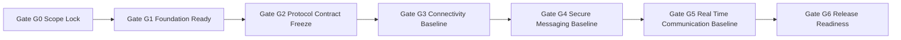

# TODO_v01.md

> Status: Planning artifact only. No implementation is claimed as complete.
> 
> Baseline inputs: `aether-v3.md` and authoritative v0.1 scope constraints from parent scope analysis.
> 
> Architectural guardrails preserved: protocol-first product model, single-binary mode model (`--mode=client|relay|bootstrap`), additive protobuf compatibility rules for minor revisions, AEP-style governance for breaking changes, and explicit planned-vs-implemented separation.

## Sprint Guidelines Alignment

- This plan adopts `SPRINT_GUIDELINES.md` as the governing sprint policy baseline.
- Sprint model rule: one sprint maps to one minor version planning band and this document stays scoped to v0.1.
- Mandatory QoL target: this sprint must evidence at least one priority-journey improvement that achieves **10% less user effort**.
- Required closure gates: quality evidence, QA strategy traceability, review sign-off, and documentation plus release-note updates.
- Governance and status discipline remain mandatory: planned-vs-implemented separation stays explicit, and unresolved protocol decisions remain open unless authoritative sources resolve them.

---

## Stack Alignment Constraints (Parent Recommendation, Planning-Level)

- This section is a planning recommendation baseline and does not claim implementation completion.
- Control plane default: libp2p secure channels standardize on `Noise_XX_25519_ChaChaPoly_SHA256`; QUIC is preferred for reliable multiplexed streams, and this plan must not imply TCP-only operation.
- Media plane default: ICE (STUN/TURN) for path establishment, SRTP hop-by-hop, SFrame for true media E2EE, and browser encoded-transform/insertable-streams integration where browser clients apply.
- Key-management default: X3DH + Double Ratchet for 1:1 DMs; MLS is the target group key-agreement system. Any Sender Keys references in this file are compatibility/migration context only (including SFrame key-management interoperability notes), not long-term default guidance.
- Crypto defaults: SFrame AES-GCM full-tag profile by default (for example `AES_128_GCM_SHA256_128` intent), no short tags unless explicitly justified; messaging AEAD baseline `ChaCha20-Poly1305` with optional negotiated AES-GCM; Noise suite fixed as above; SRTP baseline unchanged.
- Latency/resilience strategy baseline: race direct ICE and relay/TURN in parallel; continuous path probing and seamless migration; RTT-aware multi-region relay/SFU selection with warm standby; dynamic topology switching (P2P 1:1, mesh for small groups, SFU for larger groups) with no SFU transcoding; audio-first tuning (Opus 10ms, DTX/FEC, adaptive jitter), simulcast/SVC for screen share with hardware encode preference, plus background resilience (keepalives, rapid network-change handling, ICE restarts/path migration, key pre-provisioning).

## 1. v0.1 Objective and Success Criteria

### 1.1 Objective
Deliver the v0.1 First Light MVP where two users on the same LAN can go from first launch to secure communication quickly and reliably:
- Create identity
- Create and join a server
- Exchange text chat using MLS-based group E2EE (with Sender Keys compatibility bridge only where migration/interoperability requires it)
- Join voice chat using full mesh for small groups
- Use a headless relay MVP for baseline connectivity support

### 1.2 Success Criteria
All criteria must pass before v0.1 is considered done:
1. **First-launch usability:** Two fresh clients on same LAN complete first contact flow in under five minutes in repeated test runs.
2. **Identity lifecycle:** Identity creation and local persistence are stable; profile signing and verification operate consistently.
3. **Server bootstrap:** Server manifest can be created, published, resolved, and joined via deeplink.
4. **Text security:** Channel messages are encrypted end to end with MLS-based group keying (Sender Keys compatibility bridge only where required) and validated with protocol tests.
5. **Voice baseline:** Voice sessions with up to eight peers are stable with full mesh topology and essential controls.
6. **Relay baseline:** Headless relay mode provides DHT bootstrap and Circuit Relay v2; basic encrypted store-and-forward is functional.
7. **Engineering foundation:** CI lint and test gates, protobuf generation and compatibility checks, config generation, and reproducible build scaffolding are in place.
8. **Diagnostics groundwork:** Connectivity reason-code/event taxonomy, privacy-preserving local diagnostic ring-buffer export hooks, and baseline measurement scaffolding are specified as groundwork for later quality diagnostics without importing later-version hardening scope.
9. **Scope integrity:** Deferred v0.2+ features remain explicitly out of v0.1 implementation scope.

### 1.3 QoL integration contract for v0.1 (planning-level)

- **Global no-limbo invariant (enforceable):** first-contact journeys (identity create, server join, first message, first voice join) must not end in ambiguous waiting.
  - **Acceptance criterion:** each degraded or failure step exposes current user state, deterministic reason class, and next recovery action.
  - **Verification evidence:** `G6` bundle includes a journey matrix with explicit state/reason/action rows and zero unresolved-limbo entries.
- **Deterministic reason taxonomy foundation:** connectivity, identity, join, messaging, and media-setup outcomes use stable reason classes suitable for protocol diagnostics and user-facing copy.
  - **Verification evidence:** reason-class map is referenced by acceptance-charter negative-path checks.
- **Journey-based QoL gate evidence:** `G6` release readiness includes a per-wave QoL scorecard for login-to-ready and five-minute first-contact journeys.
  - **Verification evidence:** scorecard provides pass/fail results with artifact links, not narrative-only signoff.

---

## 2. Scope Boundaries, Assumptions, Non-Goals

### 2.1 In Scope for v0.1
- P2P core connectivity: libp2p host setup, DHT, GossipSub, mDNS, peer cache, bootstrap path.
- Identity lifecycle: key generation, profile, local encrypted storage, recovery flow.
- Server creation and join path: signed manifest and deeplink.
- Text chat MVP: encrypted channels with MLS-based group E2EE (Sender Keys compatibility bridge where required).
- Voice MVP: full mesh voice for small groups.
- Headless relay MVP: DHT bootstrap + Circuit Relay v2 + basic encrypted store-forward.
- Gio client shell sufficient for core user journeys.
- Engineering foundation required to execute and validate all above.

### 2.2 Explicit Non-Goals for v0.1
Deferred items are tracked but not built in this plan:
- DM protocol with X3DH and Double Ratchet
- Presence, friends, notifications
- SFU and advanced voice optimizations
- Screen share, file transfer
- RBAC moderation and audit features
- Bot platform and API shim
- Public discovery and ecosystem expansion
- Push notification relays
- Compliance hardening beyond baseline engineering controls

### 2.3 Assumptions
1. Repository remains documentation-first at planning stage; implementation starts in a later execution mode.
2. Initial implementation targets desktop-first behavior with LAN-first acceptance.
3. Core language and protocol stack follow the architecture baseline in `aether-v3.md`.
4. Team composition includes at least these role capacities: protocol lead, networking engineer, crypto engineer, client engineer, DevOps engineer, QA engineer.
5. v0.1 implementation should prefer minimal viable robustness over feature breadth.

### 2.4 Constraints
- Keep planned vs implemented status explicit in all deliverables.
- Preserve protocol compatibility principles and governance constraints.
- Do not resolve open decisions from `aether-v3.md` unless explicitly elevated and approved.
- Keep single-binary mode model as architecture invariant.

---

## 3. Planning Labels and Conventions

### 3.1 Task Type Tags
- `[Research]` uncertainty reduction and technical decision preparation
- `[Build]` implementation work package
- `[Validation]` testing, verification, and quality gates
- `[Ops]` CI/CD, release, deployment, and runtime operations
- `[Docs]` written specs, runbooks, guides, and decision records

### 3.2 Priority Tags
- `P0` critical path for v0.1 success criteria
- `P1` important but can execute after P0 prerequisites
- `P2` useful hardening and follow-up within v0.1 window

### 3.3 Rough Effort Sizing
No time estimates are used; relative complexity only:
- `XS` very small, localized change
- `S` small, single component
- `M` medium, cross-component coordination
- `L` large, high integration overhead
- `XL` very large, high uncertainty cross-cutting work

---

## 4. Dependency Map and Sequencing Gates

### 4.1 Sequencing Gates

| Gate | Name | Entry Criteria | Exit Criteria |
|---|---|---|---|
| G0 | Scope Lock | Plan initiated | Scope and non-goals documented, owner model agreed |
| G1 | Foundation Ready | G0 passed | Build/lint/test/proto/config pipelines defined and executable |
| G2 | Protocol Contract Freeze | G1 passed | v0.1 protobuf and multistream contracts frozen for implementation |
| G3 | Connectivity Baseline | G2 passed | Two peers can discover and connect on LAN with resilient fallback path |
| G4 | Secure Messaging Baseline | G3 passed | Identity + server join + MLS text path validated (Sender Keys compatibility bridge where required) |
| G5 | Real-time Communication Baseline | G4 passed | Voice mesh and relay baseline validated with client shell |
| G6 | Release Readiness | G5 passed | DoD checklist, risk burn-down minimum, and go-no-go approval complete |

### 4.2 High-Level Gate Flow

### 4.3 Critical Path Summary
1. Foundation and contract work must complete before major feature builds.
2. Connectivity and identity must stabilize before text and voice integration.
3. Relay and client shell should integrate after core protocol paths are proven.
4. End-to-end validation and release readiness require all prior gates.

---

## 5. Phase-by-Phase Execution Plan

## Phase 1 - Scope Lock and Program Setup

- [ ] `[Docs][P0][Effort:S][Owner:Tech Lead]` **P1-T1 Freeze v0.1 scope contract**
  - Description: Create the canonical v0.1 scope boundary document aligned with this plan.
  - Deliverables:
    - Scope contract document listing in-scope outcomes and deferred features.
    - Traceability map from success criteria to planned tasks.
  - Dependencies: None.
  - Acceptance Criteria:
    - Scope contract explicitly states what is excluded from v0.1.
    - No deferred feature is represented as committed v0.1 implementation.
  - Sub-Tasks:
    - [ ] Document v0.1 must-have user outcomes.
    - [ ] Document v0.1 non-goals list.
    - [ ] Link each success criterion to at least one execution task.

- [ ] `[Docs][P0][Effort:S][Owner:Protocol Lead]` **P1-T2 Build protocol constraints checklist**
  - Description: Encode immutable architecture constraints into a checklist used in design and review.
  - Deliverables:
    - Protocol-first checklist
    - Compatibility checklist
    - Governance checklist
  - Dependencies: P1-T1.
  - Acceptance Criteria:
    - Checklist items map directly to architecture constraints from baseline docs.
    - Review template references this checklist.
  - Sub-Tasks:
    - [ ] Add single-binary mode invariant.
    - [ ] Add protobuf additive-only minor-version rule.
    - [ ] Add multistream major-version evolution rule.
    - [ ] Add AEP and multi-implementation validation requirement for breaking changes.

- [ ] `[Ops][P0][Effort:S][Owner:Engineering Manager]` **P1-T3 Define ownership and decision cadence**
  - Description: Assign role ownership for each phase and establish decision logging.
  - Deliverables:
    - Owner matrix by task group
    - ADR decision log template
  - Dependencies: P1-T1.
  - Acceptance Criteria:
    - Every P0 task has a primary role owner and backup role.
    - Decision log process is explicit and lightweight.
  - Sub-Tasks:
    - [ ] Assign role owners for protocol, networking, crypto, UI, ops, QA.
    - [ ] Define escalation path for blocking decisions.
    - [ ] Define merge and review policy for critical path changes.

- [ ] `[Validation][P0][Effort:S][Owner:QA Lead]` **P1-T4 Define acceptance test charter for five-minute first contact**
  - Description: Specify the canonical user-journey test script and pass criteria.
  - Deliverables:
    - End-to-end test charter document
    - Repeatability checklist for clean environment runs
  - Dependencies: P1-T1.
  - Acceptance Criteria:
    - Test charter includes preconditions, steps, and expected outcomes.
    - Script can be reused as final DoD validation artifact.
  - Sub-Tasks:
    - [ ] Define device and network prerequisites.
    - [ ] Define data reset method between runs.
    - [ ] Define evidence capture format.

---

## Phase 2 - Engineering Foundation and Execution Scaffolding

- [ ] `[Build][P0][Effort:M][Owner:Platform Engineer]` **P2-T1 Define monorepo scaffold and package boundaries**
  - Description: Establish target project structure for client, relay, and shared packages.
  - Deliverables:
    - Scaffold specification for `cmd` and `pkg` domains
    - Package boundary rules and import conventions
  - Dependencies: G0.
  - Acceptance Criteria:
    - Structure supports single-binary mode philosophy.
    - Package boundaries separate protocol, transport, crypto, and UI concerns.
  - Sub-Tasks:
    - [ ] Define `cmd/aether` and relay entrypoint ownership boundaries.
    - [ ] Define `pkg/protocol`, `pkg/network`, `pkg/crypto`, `pkg/storage`, `pkg/ui` partitions.
    - [ ] Define interface seams for testability.

- [ ] `[Build][P0][Effort:M][Owner:DevOps Engineer]` **P2-T2 Define unified build orchestration pipeline**
  - Description: Plan one-command local and CI orchestration sequence.
  - Deliverables:
    - Pipeline stage definition and ordering
    - Command matrix for local fast and full checks
  - Dependencies: P2-T1.
  - Acceptance Criteria:
    - Pipeline stages include generate, compile, lint, test, scan, build.
    - Same stage order is used for local and CI execution.
  - Sub-Tasks:
    - [ ] Define stage contracts and fail-fast behavior.
    - [ ] Define stage output artifacts.
    - [ ] Define required environment invariants for reproducibility.

- [ ] `[Build][P0][Effort:M][Owner:Platform Engineer]` **P2-T3 Define lint and static analysis baseline**
  - Description: Configure quality gates and policy severities.
  - Deliverables:
    - Linter policy baseline
    - Suppression governance rules
  - Dependencies: P2-T2.
  - Acceptance Criteria:
    - Critical static checks are mandatory for merge.
    - Suppression process requires explicit rationale.
  - Sub-Tasks:
    - [ ] Define mandatory linter set.
    - [ ] Define severity levels and merge-blocking thresholds.
    - [ ] Define review process for false-positive exceptions.

- [ ] `[Ops][P0][Effort:M][Owner:DevOps Engineer]` **P2-T4 Define CI workflow set and trigger policy**
  - Description: Plan CI workflows for push, release, nightly, and security audit.
  - Deliverables:
    - Workflow matrix and trigger map
    - Artifact retention and audit policy
  - Dependencies: P2-T2, P2-T3.
  - Acceptance Criteria:
    - Workflow responsibilities are non-overlapping and complete.
    - Security and nightly checks are explicitly represented.
  - Sub-Tasks:
    - [ ] Define CI checks for every PR.
    - [ ] Define release workflow for signed artifacts.
    - [ ] Define nightly extended validation workflow.

- [ ] `[Build][P0][Effort:S][Owner:Developer Experience Engineer]` **P2-T5 Define pre-commit quality hooks**
  - Description: Create local guardrails that mirror CI essentials.
  - Deliverables:
    - Hook definition plan
    - Developer onboarding notes
  - Dependencies: P2-T3.
  - Acceptance Criteria:
    - Hook set covers formatting and critical static checks.
    - Hook failures are actionable and deterministic.
  - Sub-Tasks:
    - [ ] Define staged-file checks.
    - [ ] Define bypass policy and review requirements.

- [ ] `[Build][P0][Effort:M][Owner:Protocol Engineer]` **P2-T6 Define protobuf and buf workflow**
  - Description: Plan schema directory, generation, linting, and breaking-change checks.
  - Deliverables:
    - Protobuf layout specification
    - Buf policy specification
  - Dependencies: P2-T2.
  - Acceptance Criteria:
    - Schema evolution policy is enforceable by configured checks.
    - Generated code ownership and update process are explicit.
  - Sub-Tasks:
    - [ ] Define proto package namespace strategy.
    - [ ] Define field-number reservation practice.
    - [ ] Define automated compatibility checks.

- [ ] `[Build][P1][Effort:M][Owner:Config Engineer]` **P2-T7 Define Dhall configuration source model**
  - Description: Plan deterministic configuration generation for environments and node roles.
  - Deliverables:
    - Dhall type and environment model
    - Generated artifact inventory
  - Dependencies: P2-T2.
  - Acceptance Criteria:
    - Configuration source is single source of truth.
    - Generated config artifacts are reproducible.
  - Sub-Tasks:
    - [ ] Define typed config schema.
    - [ ] Define environment override strategy.
    - [ ] Define generation and verification stage.

- [ ] `[Ops][P1][Effort:M][Owner:Release Engineer]` **P2-T8 Define reproducible build and artifact provenance policy**
  - Description: Plan deterministic build flags, checksums, signing, and SBOM generation.
  - Deliverables:
    - Build reproducibility checklist
    - Artifact signing and verification runbook
  - Dependencies: P2-T2, P2-T4.
  - Acceptance Criteria:
    - Rebuild of same commit produces deterministic verification evidence.
    - Artifact provenance and checksum publication paths are documented.
  - Sub-Tasks:
    - [ ] Define pinned dependency and image policy.
    - [ ] Define checksum and signature verification workflow.
    - [ ] Define SBOM output location and validation.

- [ ] `[Validation][P0][Effort:M][Owner:QA Lead]` **P2-T9 Define layered test strategy for v0.1 execution**
  - Description: Convert architecture test philosophy into concrete v0.1 plan.
  - Deliverables:
    - Test matrix mapping tests to risks and gates
    - Minimum coverage expectations by package criticality
    - Baseline measurement scaffold template for first-launch and connectivity outcomes
  - Dependencies: P2-T1, P2-T2.
  - Acceptance Criteria:
    - Unit, property, fuzz, and integration layers are represented.
    - Every P0 feature has at least one positive and one failure-path test.
  - Sub-Tasks:
    - [ ] Define crypto and protocol test strictness.
    - [ ] Define integration scenarios for LAN and relay fallback.
    - [ ] Define failure triage policy for flaky tests.
    - [ ] Define baseline KPI capture template (connectivity outcomes, fallback frequency, reconnect success) with privacy-preserving local storage boundaries.

- [ ] `[Research][P0][Effort:M][Owner:Storage Engineer]` **P2-T10 Research SQLCipher integration and portability risks**
  - Description: Resolve implementation strategy for encrypted local storage and migration behavior.
  - Deliverables:
    - Decision record on SQLCipher driver approach
    - Portability risk matrix and mitigations
  - Dependencies: P2-T1.
  - Acceptance Criteria:
    - Selected approach includes build portability constraints and fallback options.
    - Risk mitigations are linked to concrete build and test tasks.
  - Sub-Tasks:
    - [ ] Compare candidate integration approaches.
    - [ ] Define migration and key management expectations.
    - [ ] Define CI validation for encrypted DB operations.

---

## Phase 3 - Protocol Contracts and Compatibility Baseline

- [ ] `[Docs][P0][Effort:S][Owner:Protocol Lead]` **P3-T1 Register v0.1 multistream protocol IDs**
  - Description: Define canonical protocol IDs and initial version values.
  - Deliverables:
    - Protocol ID registry document
  - Dependencies: G1.
  - Acceptance Criteria:
    - IDs are unique, namespaced, and grouped by sub-protocol.
    - Downgrade strategy is documented for each protocol family.
  - Sub-Tasks:
    - [ ] Define chat, voice signaling, manifest, identity, sync IDs.
    - [ ] Define version negotiation behavior.

- [ ] `[Build][P0][Effort:M][Owner:Protocol Engineer]` **P3-T2 Define v0.1 protobuf schema set**
  - Description: Prepare message schemas for identity, manifest, chat, voice state, and capabilities.
  - Deliverables:
    - v0.1 schema inventory
    - Field number plan with reserved ranges
  - Dependencies: P2-T6, P3-T1.
  - Acceptance Criteria:
    - Schemas represent all in-scope v0.1 interactions.
    - Reserved strategy prevents accidental wire breakage.
  - Sub-Tasks:
    - [ ] Draft message envelope fields.
    - [ ] Draft feature capability schema.
    - [ ] Mark planned future extension points.

- [ ] `[Docs][P0][Effort:M][Owner:Protocol Lead]` **P3-T3 Define capability negotiation and downgrade rules**
  - Description: Specify peer capability exchange and fallback behavior.
  - Deliverables:
    - Capabilities negotiation specification
    - Downgrade decision table
  - Dependencies: P3-T1, P3-T2.
  - Acceptance Criteria:
    - Rules avoid ambiguous partial feature behavior.
    - Fallback paths are deterministic and testable.
  - Sub-Tasks:
    - [ ] Define feature flag naming conventions.
    - [ ] Define unknown capability handling.
    - [ ] Define incompatible capability user feedback behavior.

- [ ] `[Docs][P0][Effort:S][Owner:Crypto Engineer]` **P3-T4 Define signing and verification envelopes**
  - Description: Standardize signed payload envelope for identity and server manifests.
  - Deliverables:
    - Signature envelope spec
    - Verification error taxonomy
  - Dependencies: P3-T2.
  - Acceptance Criteria:
    - Signing flow is deterministic and canonicalized.
    - Validation failure reasons are explicit.
  - Sub-Tasks:
    - [ ] Define canonical serialization boundaries.
    - [ ] Define signature metadata fields.

- [ ] `[Docs][P0][Effort:S][Owner:Protocol Lead]` **P3-T5 Define compatibility and deprecation policy for v0.x**
  - Description: Freeze compatibility constraints that implementation must follow.
  - Deliverables:
    - Compatibility policy statement
    - Deprecation and reservation process notes
  - Dependencies: P3-T1, P3-T2.
  - Acceptance Criteria:
    - Additive-only minor rule and major transition process are explicit.
    - Policy is referenced in code review checklist.
  - Sub-Tasks:
    - [ ] Define prohibited schema changes.
    - [ ] Define protocol major-bump trigger conditions.

- [ ] `[Research][P0][Effort:L][Owner:Crypto Lead]` **P3-T6 Research v0.1 group-key profile (MLS target + Sender Keys compatibility bridge)**
  - Description: Select concrete MLS operational profile and any required Sender Keys compatibility bridge behavior for message-key lifecycle rules.
  - Deliverables:
    - Group-key design decision record (MLS target, Sender Keys compatibility bridge)
    - Threat model notes for v0.1 text channels
  - Dependencies: P3-T2.
  - Acceptance Criteria:
    - Chosen profile includes bootstrap, rotation, and member-change handling strategy.
    - Security limitations are documented as known constraints.
  - Sub-Tasks:
    - [ ] Compare candidate algorithm profiles and libraries.
    - [ ] Define key distribution handshake assumptions.
    - [ ] Define rekey triggers and replay protections.

- [ ] `[Validation][P0][Effort:M][Owner:QA Engineer]` **P3-T7 Plan protocol contract tests and compatibility checks**
  - Description: Define test scenarios for schema evolution and negotiation behavior.
  - Deliverables:
    - Contract test suite plan
    - Compatibility matrix test definitions
  - Dependencies: P3-T2, P3-T3, P3-T5.
  - Acceptance Criteria:
    - Tests cover unknown fields, downgraded protocol paths, and signature failures.
    - CI gate mapping includes contract tests before integration tests.
  - Sub-Tasks:
    - [ ] Define positive negotiation paths.
    - [ ] Define malformed and downgrade edge cases.

---

## Phase 4 - P2P Connectivity Core

- [ ] `[Build][P0][Effort:L][Owner:Networking Engineer]` **P4-T1 Build libp2p host baseline with required transports**
  - Description: Implement host initialization strategy with secure transport and multiplexing defaults.
  - Deliverables:
    - Host initialization module
    - Configuration schema for transport options
  - Dependencies: G2.
  - Acceptance Criteria:
    - Host starts with expected transports and security stack.
    - Startup logs expose negotiated transport details.
  - Sub-Tasks:
    - [ ] Define transport priority order.
    - [ ] Define host identity binding to local key material.
    - [ ] Define startup error handling for partial transport availability.

- [ ] `[Build][P0][Effort:L][Owner:Networking Engineer]` **P4-T2 Implement DHT setup with private protocol namespace**
  - Description: Build DHT initialization path and bootstrapping behavior.
  - Deliverables:
    - DHT service module
    - Bootstrap sequence implementation notes
  - Dependencies: P4-T1, P3-T1.
  - Acceptance Criteria:
    - Node can join private namespace and discover peers.
    - Bootstrap fallback behavior is deterministic.
  - Sub-Tasks:
    - [ ] Define bootstrap list ingestion path.
    - [ ] Define routing table warmup behavior.
    - [ ] Define failure handling when bootstrap peers are unavailable.

- [ ] `[Build][P0][Effort:M][Owner:Networking Engineer]` **P4-T3 Implement GossipSub baseline and topic conventions**
  - Description: Build pubsub plumbing with v0.1 topic naming and validation hooks.
  - Deliverables:
    - Topic naming utility
    - GossipSub integration module
  - Dependencies: P4-T1, P3-T1.
  - Acceptance Criteria:
    - Topic naming matches protocol registry and server/channel IDs.
    - Message admission checks are pluggable.
  - Sub-Tasks:
    - [ ] Define topic format helper.
    - [ ] Define subscription lifecycle events.
    - [ ] Define bounded retry strategy on pubsub errors.

- [ ] `[Build][P0][Effort:M][Owner:Networking Engineer]` **P4-T4 Implement mDNS LAN discovery**
  - Description: Enable LAN-first peer discovery for fast local onboarding.
  - Deliverables:
    - mDNS discovery module
    - Discovery event instrumentation
  - Dependencies: P4-T1.
  - Acceptance Criteria:
    - Two nodes on same LAN can discover each other without manual input.
    - Discovery logs include timestamped peer entries.
  - Sub-Tasks:
    - [ ] Define LAN discovery startup timing.
    - [ ] Define discovered peer dedup strategy.
    - [ ] Define disable flag for environments where mDNS is restricted.

- [ ] `[Build][P0][Effort:L][Owner:Networking Engineer]` **P4-T5 Implement NAT traversal chain and relay fallback**
  - Description: Implement AutoNAT, Circuit Relay v2, and hole punching orchestration.
  - Deliverables:
    - NAT traversal orchestration module
    - Relay fallback decision logic
  - Dependencies: P4-T1, P4-T2.
  - Acceptance Criteria:
    - Traversal attempts follow defined fallback order.
    - Relay fallback status is exposed to client diagnostics.
  - Sub-Tasks:
    - [ ] Define traversal state machine.
    - [ ] Define relay reservation lifecycle.
    - [ ] Define fallback timeout policy.
    - [ ] Define standardized connectivity reason codes and lifecycle events for traversal, relay fallback, and recovery transitions.

- [ ] `[Build][P0][Effort:M][Owner:Storage Engineer]` **P4-T6 Implement local peer cache persistence**
  - Description: Persist successful peer addresses and prioritize them at startup.
  - Deliverables:
    - Peer cache schema
    - Peer cache load and update logic
  - Dependencies: P2-T10, P4-T1.
  - Acceptance Criteria:
    - Successful connections update cache entries with freshness metadata.
    - Startup attempts cached peers before bootstrap where possible.
  - Sub-Tasks:
    - [ ] Define cache retention policy.
    - [ ] Define address validation before reuse.
    - [ ] Define corruption recovery behavior.

- [ ] `[Ops][P1][Effort:M][Owner:Infra Engineer]` **P4-T7 Prepare bootstrap node deployment plan for three regions**
  - Description: Define minimal bootstrap node operations for initial network entry points.
  - Deliverables:
    - Bootstrap deployment topology plan
    - Bootstrap operations runbook
  - Dependencies: P2-T7, P2-T8.
  - Acceptance Criteria:
    - Region distribution plan is documented.
    - Runbook includes restart and health-check procedures.
  - Sub-Tasks:
    - [ ] Define node naming and addressing convention.
    - [ ] Define baseline observability signals.

- [ ] `[Validation][P0][Effort:M][Owner:QA Engineer]` **P4-T8 Validate two-node LAN discovery and connection reliability**
  - Description: Execute deterministic LAN tests for discovery and connection establishment.
  - Deliverables:
    - LAN connectivity validation report
    - Known failure catalog with reproduction steps
  - Dependencies: P4-T2, P4-T3, P4-T4, P4-T6.
  - Acceptance Criteria:
    - Test passes repeated runs with clean state.
    - Failure modes include actionable diagnostics with normalized reason-code/event evidence.
  - Sub-Tasks:
    - [ ] Run same-subnet clean-start tests.
    - [ ] Run restart and reconnect tests using peer cache.
    - [ ] Record packet-loss sensitivity observations.

- [ ] `[Research][P1][Effort:M][Owner:Networking Engineer]` **P4-T9 Research NAT environment matrix for v0.1 target environments**
  - Description: Define expected behavior across common NAT types and home-router conditions.
  - Deliverables:
    - NAT scenario matrix
    - Priority mitigation list for v0.1
  - Dependencies: P4-T5.
  - Acceptance Criteria:
    - Matrix includes expected fallback path per scenario.
    - High-risk scenarios have explicit mitigation actions.
  - Sub-Tasks:
    - [ ] Catalog common home-network topologies.
    - [ ] Define expected traversal outcomes.
    - [ ] Link high-risk outcomes to test scenarios.

---

## Phase 5 - Identity Lifecycle

- [ ] `[Build][P0][Effort:M][Owner:Crypto Engineer]` **P5-T1 Implement identity key generation and local secure storage**
  - Description: Create Ed25519 identity lifecycle with encrypted-at-rest local persistence.
  - Deliverables:
    - Identity generation module
    - Secure local storage integration plan
  - Dependencies: G3, P2-T10.
  - Acceptance Criteria:
    - Key generation is deterministic in format and validation.
    - Private key material is never exposed in plaintext logs.
  - Sub-Tasks:
    - [ ] Define identity initialization flow.
    - [ ] Define key storage envelope.
    - [ ] Define corruption and recovery error handling.

- [ ] `[Build][P1][Effort:M][Owner:Crypto Engineer]` **P5-T2 Implement mnemonic recovery workflow for identity restoration**
  - Description: Enable user recovery path for identity restoration.
  - Deliverables:
    - Recovery flow design
    - Recovery validation checks
  - Dependencies: P5-T1.
  - Acceptance Criteria:
    - Recovery flow reproduces expected identity keys.
    - Recovery failure feedback is explicit and safe.
  - Sub-Tasks:
    - [ ] Define mnemonic generation policy.
    - [ ] Define input validation and checksum handling.
    - [ ] Define secure recovery UX constraints.

- [ ] `[Build][P0][Effort:M][Owner:Protocol Engineer]` **P5-T3 Implement signed profile publish and verification path**
  - Description: Build profile object creation, signing, publish, and resolve verification.
  - Deliverables:
    - Profile schema usage guide
    - Profile publish and verify workflow
  - Dependencies: P3-T2, P3-T4, P4-T2.
  - Acceptance Criteria:
    - Profile payloads are signed and verifiable.
    - Invalid signatures are rejected with deterministic errors.
  - Sub-Tasks:
    - [ ] Define profile field validation rules.
    - [ ] Define publish frequency and update behavior.
    - [ ] Define cache invalidation behavior for profile updates.

- [ ] `[Build][P0][Effort:M][Owner:Storage Engineer]` **P5-T4 Define identity and profile database schema migrations**
  - Description: Plan migration-safe schema evolution for identity-related local data.
  - Deliverables:
    - Initial schema migration set
    - Migration policy for minor updates
  - Dependencies: P2-T10.
  - Acceptance Criteria:
    - Schema supports rollback-safe migration process.
    - Migration failures are recoverable without silent corruption.
  - Sub-Tasks:
    - [ ] Define migration versioning strategy.
    - [ ] Define migration test fixtures.
    - [ ] Define backup-before-migration behavior.

- [ ] `[Validation][P0][Effort:S][Owner:QA Engineer]` **P5-T5 Validate identity lifecycle end to end**
  - Description: Verify creation, persistence, restart reuse, and recovery behavior.
  - Deliverables:
    - Identity lifecycle validation report
  - Dependencies: P5-T1, P5-T2, P5-T3, P5-T4.
  - Acceptance Criteria:
    - Creation and restart behavior are stable.
    - Recovery tests pass known positive and negative cases.
  - Sub-Tasks:
    - [ ] Run fresh install tests.
    - [ ] Run restart persistence tests.
    - [ ] Run recovery error-path tests.

- [ ] `[Research][P1][Effort:S][Owner:Security Engineer]` **P5-T6 Research profile privacy and metadata minimization**
  - Description: Minimize profile leakage while preserving usability for v0.1.
  - Deliverables:
    - Profile privacy recommendations
    - Metadata minimization checklist
  - Dependencies: P5-T3.
  - Acceptance Criteria:
    - Profile fields are classified by sensitivity.
    - Optional fields are clearly default-off or explicit opt-in.
  - Sub-Tasks:
    - [ ] Classify each profile field sensitivity.
    - [ ] Define safe defaults for optional data.

---

## Phase 6 - Server Manifest and Join Deeplink

- [ ] `[Build][P0][Effort:M][Owner:Protocol Engineer]` **P6-T1 Implement server manifest model and signing rules**
  - Description: Build canonical manifest format and cryptographic signing requirements.
  - Deliverables:
    - Manifest schema and canonicalization rules
    - Manifest signature validation logic plan
  - Dependencies: G3, P3-T2, P3-T4.
  - Acceptance Criteria:
    - Manifest creation yields deterministic signed payload.
    - Invalid or stale manifests fail validation cleanly.
  - Sub-Tasks:
    - [ ] Define mandatory manifest fields.
    - [ ] Define manifest versioning field strategy.
    - [ ] Define signature and verification boundaries.

- [ ] `[Build][P0][Effort:M][Owner:Client Engineer]` **P6-T2 Implement create server flow in client shell**
  - Description: Build UX and application flow for creating a server from fresh identity.
  - Deliverables:
    - Create-server UX flow definition
    - Manifest generation trigger integration
  - Dependencies: P6-T1, P10-T1.
  - Acceptance Criteria:
    - User can create server with minimal required metadata.
    - Flow emits signed manifest and local server state.
  - Sub-Tasks:
    - [ ] Define form validation rules.
    - [ ] Define success and error states.

- [ ] `[Build][P0][Effort:M][Owner:Networking Engineer]` **P6-T3 Implement manifest publish and discovery path**
  - Description: Publish manifest records and resolve them for join operations.
  - Deliverables:
    - Manifest publish service
    - Manifest resolve and cache service
  - Dependencies: P4-T2, P6-T1.
  - Acceptance Criteria:
    - Published manifest can be resolved by peer with deterministic lookup.
    - Cache invalidation handles manifest updates correctly.
  - Sub-Tasks:
    - [ ] Define publish record TTL policy.
    - [ ] Define resolve retry strategy.
    - [ ] Define stale manifest conflict behavior.

- [ ] `[Build][P0][Effort:M][Owner:Client Engineer]` **P6-T4 Implement deeplink join parser and router**
  - Description: Support `aether://join/<id>` parsing and routing into join flow.
  - Deliverables:
    - Deeplink parser spec
    - Join route handling logic
  - Dependencies: P6-T1, P10-T1.
  - Acceptance Criteria:
    - Valid deeplink opens join path and resolves target manifest.
    - Invalid deeplinks return actionable validation errors.
  - Sub-Tasks:
    - [ ] Define URL validation and sanitization rules.
    - [ ] Define deep-link initiated auth and state behavior.

- [ ] `[Build][P0][Effort:M][Owner:Protocol Engineer]` **P6-T5 Implement minimal membership bootstrap handshake**
  - Description: Establish server membership state from resolved manifest and peer contact.
  - Deliverables:
    - Join handshake flow
    - Membership state persistence plan
  - Dependencies: P6-T3, P5-T1.
  - Acceptance Criteria:
    - Joining peer transitions to usable server membership state.
    - Handshake failures are observable and recoverable.
  - Sub-Tasks:
    - [ ] Define join request and response payload model.
    - [ ] Define retry and idempotency behavior.

- [ ] `[Validation][P0][Effort:M][Owner:QA Engineer]` **P6-T6 Validate server creation and join via deeplink**
  - Description: Validate full create and join path on clean clients.
  - Deliverables:
    - Server join validation report
  - Dependencies: P6-T2, P6-T3, P6-T4, P6-T5.
  - Acceptance Criteria:
    - Second client can join created server via deeplink.
    - Join flow integrates with subsequent chat and voice flows.
  - Sub-Tasks:
    - [ ] Run clean-state join tests.
    - [ ] Run stale-link and invalid-link negative tests.

- [ ] `[Research][P1][Effort:S][Owner:Client Engineer]` **P6-T7 Research cross-platform deeplink registration strategy**
  - Description: Capture platform-specific deeplink registration constraints for Gio deployment targets.
  - Deliverables:
    - Deeplink registration compatibility note
  - Dependencies: P6-T4.
  - Acceptance Criteria:
    - Each target platform has explicit registration and fallback behavior.
    - Unsupported behavior is documented with user workaround.
  - Sub-Tasks:
    - [ ] Document desktop deeplink registration requirements.
    - [ ] Document mobile and sandbox caveats.

---

## Phase 7 - Text Chat with MLS-Based Group E2EE

- [ ] `[Build][P0][Effort:M][Owner:Protocol Engineer]` **P7-T1 Implement channel model and topic binding**
  - Description: Bind server channels to GossipSub topics and channel metadata state.
  - Deliverables:
    - Channel metadata model
    - Topic binding implementation plan
  - Dependencies: G4, P4-T3, P6-T5.
  - Acceptance Criteria:
    - Channel membership maps to deterministic topic subscriptions.
    - Topic transitions on join and leave are correct.
  - Sub-Tasks:
    - [ ] Define channel identifiers and metadata schema.
    - [ ] Define subscription lifecycle hooks.

- [ ] `[Build][P0][Effort:L][Owner:Crypto Engineer]` **P7-T2 Implement MLS bootstrap and rotation flow (with Sender Keys compatibility bridge)**
  - Description: Build channel MLS lifecycle for encrypted text messaging and define compatibility bridge behavior where migration/interoperability requires it.
  - Deliverables:
    - MLS session manager
    - Rekey and membership-change policy implementation plan
  - Dependencies: P3-T6, P7-T1, P5-T1.
  - Acceptance Criteria:
    - Channel participants can establish and rotate keys per policy.
    - Key mismatch errors are recoverable through rekey behavior.
  - Sub-Tasks:
    - [ ] Implement initial key distribution handshake.
    - [ ] Implement rotation trigger behavior.
    - [ ] Implement member change rekey handling.

- [ ] `[Build][P0][Effort:L][Owner:Protocol Engineer]` **P7-T3 Implement encrypted message send and receive pipeline**
  - Description: Build message envelope, encryption, signing, transmission, and decryption flow.
  - Deliverables:
    - Message pipeline module
    - Error handling taxonomy
  - Dependencies: P7-T2, P3-T2, P3-T4.
  - Acceptance Criteria:
    - Outgoing messages are encrypted and signed before publish.
    - Incoming messages validate signature and decrypt correctly.
  - Sub-Tasks:
    - [ ] Define outbound pipeline stages.
    - [ ] Define inbound verification stages.
    - [ ] Define replay and duplicate handling behavior.

- [ ] `[Build][P1][Effort:M][Owner:Client Engineer]` **P7-T4 Implement message rendering with markdown subset and replies**
  - Description: Render readable messages while keeping v0.1 formatting scope limited.
  - Deliverables:
    - Markdown subset rendering rules
    - Reply-reference behavior for UI
  - Dependencies: P7-T3, P10-T2.
  - Acceptance Criteria:
    - Message rendering is deterministic across clients.
    - Unsupported markdown constructs degrade gracefully.
  - Sub-Tasks:
    - [ ] Define supported markdown tokens.
    - [ ] Define escape and sanitization behavior.

- [ ] `[Build][P1][Effort:M][Owner:Protocol Engineer]` **P7-T5 Implement history sync for recent message window**
  - Description: Sync recent channel history on join with bounded message count.
  - Deliverables:
    - History sync protocol usage plan
    - Local merge and dedup strategy
  - Dependencies: P7-T3, P6-T5.
  - Acceptance Criteria:
    - Joining client can fetch recent bounded history from peers.
    - Deduplication prevents duplicate rendering.
  - Sub-Tasks:
    - [ ] Define request and response flow.
    - [ ] Define merge ordering strategy.
    - [ ] Define failure fallback behavior.

- [ ] `[Validation][P0][Effort:L][Owner:QA Engineer]` **P7-T6 Validate E2EE text behavior and failure paths**
  - Description: Execute protocol and integration tests for encryption correctness and resilience.
  - Deliverables:
    - E2EE validation report
    - Known edge-case list
  - Dependencies: P7-T2, P7-T3, P7-T5.
  - Acceptance Criteria:
    - Encryption round-trip and signature tests pass.
    - Replay and malformed payload tests fail safely.
  - Sub-Tasks:
    - [ ] Run unit and property tests for crypto invariants.
    - [ ] Run integration tests across two and multiple peers.
    - [ ] Run out-of-order and duplicate message tests.

- [ ] `[Research][P1][Effort:M][Owner:Crypto Engineer]` **P7-T7 Research key storage hardening for channel secrets**
  - Description: Document secure storage and memory handling controls for MLS artifacts (and Sender Keys compatibility-bridge artifacts where required).
  - Deliverables:
    - Key material handling guidelines
    - Residual risk list for v0.1
  - Dependencies: P7-T2.
  - Acceptance Criteria:
    - Key material lifecycle is documented from creation to retirement.
    - Known residual risks are accepted or mitigated by explicit tasks.
  - Sub-Tasks:
    - [ ] Define in-memory and at-rest handling constraints.
    - [ ] Define logging and crash-report redaction constraints.

---

## Phase 8 - Voice Chat MVP Full Mesh Up To Eight

- [ ] `[Build][P0][Effort:L][Owner:Realtime Engineer]` **P8-T1 Implement Pion voice pipeline baseline**
  - Description: Integrate audio capture, Opus configuration baseline, and transport setup.
  - Deliverables:
    - Voice engine baseline design
    - Audio pipeline configuration profile
  - Dependencies: G4, P4-T3.
  - Acceptance Criteria:
    - Peer voice streams establish with expected codec parameters.
    - Startup and teardown behavior are stable.
  - Sub-Tasks:
    - [ ] Define codec and frame configuration defaults.
    - [ ] Define peer connection lifecycle hooks.
    - [ ] Define error and reconnect behavior.

- [ ] `[Build][P0][Effort:M][Owner:Realtime Engineer]` **P8-T2 Implement encrypted signaling over GossipSub**
  - Description: Build SDP and ICE signaling exchange over encrypted channel path.
  - Deliverables:
    - Signaling message schema use plan
    - Signaling session state machine
  - Dependencies: P8-T1, P7-T3.
  - Acceptance Criteria:
    - Signaling exchange works under expected candidate timing variations.
    - Invalid or stale signaling messages are rejected safely.
  - Sub-Tasks:
    - [ ] Define signaling session identifiers.
    - [ ] Define offer and answer retry behavior.
    - [ ] Define ICE update handling and timeout rules.

- [ ] `[Build][P0][Effort:L][Owner:Realtime Engineer]` **P8-T3 Implement full mesh voice session manager up to eight peers**
  - Description: Manage peer graph and audio stream lifecycle for small-group channels.
  - Deliverables:
    - Mesh session manager
    - Participant state tracking model
  - Dependencies: P8-T2, P6-T5.
  - Acceptance Criteria:
    - Mesh creation and teardown scale to eight participants.
    - Participant join and leave events are reflected correctly.
  - Sub-Tasks:
    - [ ] Define connection cap behavior.
    - [ ] Define participant graph update rules.
    - [ ] Define congestion fallback behavior for constrained devices.

- [ ] `[Build][P1][Effort:M][Owner:Crypto Engineer]` **P8-T4 Implement SFrame key distribution linkage for voice streams**
  - Description: Connect voice stream encryption keys to channel keying model.
  - Deliverables:
    - SFrame keying integration design
    - Key refresh trigger policy
  - Dependencies: P7-T2, P8-T2.
  - Acceptance Criteria:
    - Voice key distribution follows authenticated channel context.
    - Key refresh behavior is defined for participant changes.
  - Sub-Tasks:
    - [ ] Define stream key mapping strategy.
    - [ ] Define participant change key refresh behavior.

- [ ] `[Build][P0][Effort:M][Owner:Client Engineer]` **P8-T5 Implement voice controls and device selection UX**
  - Description: Add self-mute, self-deafen, push-to-talk option, and audio device switching controls.
  - Deliverables:
    - Voice controls UI specification
    - Device selection integration points
  - Dependencies: P8-T1, P10-T1.
  - Acceptance Criteria:
    - Controls are responsive and state-consistent across session transitions.
    - Device change behavior avoids session collapse where possible.
  - Sub-Tasks:
    - [ ] Define control state model.
    - [ ] Define device change lifecycle behavior.
    - [ ] Define push-to-talk interaction mode.

- [ ] `[Validation][P0][Effort:L][Owner:QA Engineer]` **P8-T6 Validate voice quality and stability for v0.1 topology**
  - Description: Run stability, reconnect, and quality acceptance tests for small-group mesh voice.
  - Deliverables:
    - Voice validation report
    - Known quality and stability limitations list
  - Dependencies: P8-T3, P8-T5.
  - Acceptance Criteria:
    - Voice sessions remain stable in target LAN scenarios.
    - Participant controls work without state desync.
  - Sub-Tasks:
    - [ ] Run two-peer and multi-peer sessions.
    - [ ] Run join, leave, and reconnect stress scenarios.
    - [ ] Record baseline performance observations for future optimization.

- [ ] `[Research][P1][Effort:M][Owner:Realtime Engineer]` **P8-T7 Research SFrame implementation maturity and fallback plan**
  - Description: Confirm practical implementation options and define fallback if SFrame integration risk is high.
  - Deliverables:
    - SFrame feasibility note
    - Voice encryption fallback decision criteria
  - Dependencies: P8-T4.
  - Acceptance Criteria:
    - Feasibility includes compatibility and maintenance assessment.
    - Fallback criteria are explicit and reviewed.
  - Sub-Tasks:
    - [ ] Evaluate implementation approach options.
    - [ ] Document constraints and unresolved risks.

---

## Phase 9 - Headless Relay MVP and Operations Baseline

- [ ] `[Build][P0][Effort:M][Owner:Platform Engineer]` **P9-T1 Implement headless relay runtime mode**
  - Description: Implement relay mode startup path without GUI.
  - Deliverables:
    - Relay mode runtime wiring
    - Mode-specific startup validation checklist
  - Dependencies: G4, P2-T1.
  - Acceptance Criteria:
    - Relay mode starts and runs without UI dependencies.
    - Configuration errors are explicit and actionable.
  - Sub-Tasks:
    - [ ] Define mode bootstrapping sequence.
    - [ ] Define mode-specific health status output.

- [ ] `[Build][P0][Effort:L][Owner:Networking Engineer]` **P9-T2 Implement relay services for DHT bootstrap and Circuit Relay v2**
  - Description: Enable relay service capabilities required for v0.1 connectivity fallback.
  - Deliverables:
    - Relay service module plan
    - Reservation and relay policy baseline
  - Dependencies: P9-T1, P4-T5.
  - Acceptance Criteria:
    - Client nodes can use relay service when direct path fails.
    - Relay service limits are configurable and observable.
  - Sub-Tasks:
    - [ ] Define relay reservation limits.
    - [ ] Define relay session timeout strategy.
    - [ ] Define abuse-protection baseline controls.

- [ ] `[Build][P1][Effort:M][Owner:Storage Engineer]` **P9-T3 Implement encrypted store-and-forward MVP with bounded retention**
  - Description: Provide minimal offline encrypted message holding capability for v0.1.
  - Deliverables:
    - Store-and-forward service model
    - Retention and purge policy
  - Dependencies: P9-T1, P2-T10.
  - Acceptance Criteria:
    - Relay stores opaque encrypted payloads only.
    - TTL expiry and quota enforcement are deterministic.
  - Sub-Tasks:
    - [ ] Define encrypted payload metadata model.
    - [ ] Define retention and cleanup scheduling.
    - [ ] Define quota-exceeded handling behavior.

- [ ] `[Ops][P0][Effort:M][Owner:Config Engineer]` **P9-T4 Define relay configuration model and generated config flow**
  - Description: Produce a deterministic relay configuration strategy aligned with Dhall source model.
  - Deliverables:
    - Relay config schema definition
    - Generated config validation checklist
  - Dependencies: P2-T7, P9-T1.
  - Acceptance Criteria:
    - Relay configuration can be generated per environment and role.
    - Config validation catches missing mandatory values.
  - Sub-Tasks:
    - [ ] Define relay service section defaults.
    - [ ] Define environment-specific overrides.

- [ ] `[Ops][P1][Effort:M][Owner:Release Engineer]` **P9-T5 Define relay container build and publication workflow**
  - Description: Plan reproducible relay container artifacts and publishing path.
  - Deliverables:
    - Container build workflow definition
    - Artifact publication checklist
  - Dependencies: P2-T8, P9-T1.
  - Acceptance Criteria:
    - Workflow includes digest pinning, signing, and SBOM handling.
    - Publication process includes rollback guidance.
  - Sub-Tasks:
    - [ ] Define image tag and digest policy.
    - [ ] Define publish gating requirements.

- [ ] `[Validation][P0][Effort:M][Owner:QA Engineer]` **P9-T6 Validate relay-assisted connectivity fallback path**
  - Description: Validate that clients can continue operation using relay-assisted paths.
  - Deliverables:
    - Relay fallback validation report
  - Dependencies: P9-T2, P9-T3, P4-T5.
  - Acceptance Criteria:
    - Relay fallback can be triggered and observed in controlled scenarios.
    - Failure behavior is visible to diagnostics and recoverable.
  - Sub-Tasks:
    - [ ] Run direct-path blocked scenarios.
    - [ ] Validate relay fallback session establishment.
    - [ ] Validate store-and-forward retrieval behavior.

- [ ] `[Research][P1][Effort:S][Owner:Security Engineer]` **P9-T7 Research relay privacy and retention policy trade-offs**
  - Description: Document relay data handling risks and acceptable v0.1 policy boundaries.
  - Deliverables:
    - Relay privacy baseline note
    - Retention trade-off matrix
  - Dependencies: P9-T3.
  - Acceptance Criteria:
    - Policy includes data minimization and operational constraints.
    - Residual risks are explicitly listed.
  - Sub-Tasks:
    - [ ] Classify relay-stored metadata sensitivity.
    - [ ] Define strict logging minimization policy.

---

## Phase 10 - Gio Client Shell and User Journey Integration

- [ ] `[Build][P0][Effort:M][Owner:Client Engineer]` **P10-T1 Implement application shell baseline**
  - Description: Build foundational window and routing skeleton for v0.1 flows.
  - Deliverables:
    - Shell layout specification
    - Route state model
  - Dependencies: G3.
  - Acceptance Criteria:
    - Shell supports identity setup, server list, channel view, and settings entry points.
    - Route transitions preserve relevant state safely.
  - Sub-Tasks:
    - [ ] Define global app state model.
    - [ ] Define navigation and route transitions.

- [ ] `[Build][P0][Effort:M][Owner:Client Engineer]` **P10-T2 Implement server rail and channel sidebar**
  - Description: Build primary navigation surfaces for server and channel selection.
  - Deliverables:
    - Navigation UI components
    - Selection state synchronization behavior
  - Dependencies: P10-T1, P6-T2, P7-T1.
  - Acceptance Criteria:
    - Navigation reflects joined servers and available channels.
    - Selection changes trigger correct subscription and view updates.
  - Sub-Tasks:
    - [ ] Define server list rendering behavior.
    - [ ] Define channel type visual indicators.

- [ ] `[Build][P0][Effort:L][Owner:Client Engineer]` **P10-T3 Implement virtualized message list and composer area**
  - Description: Build performant message display and input path for active channel.
  - Deliverables:
    - Message list rendering strategy
    - Composer input behavior specification
  - Dependencies: P7-T3, P10-T1.
  - Acceptance Criteria:
    - Message list handles scrolling and updates without severe frame drops.
    - Composer supports enter send and newline behavior correctly.
  - Sub-Tasks:
    - [ ] Define virtualization approach for message list.
    - [ ] Define composer shortcuts and validation.
    - [ ] Define draft persistence behavior.

- [ ] `[Build][P0][Effort:M][Owner:Client Engineer]` **P10-T4 Implement voice channel participant view and persistent voice bar**
  - Description: Build UI surfaces for active voice context and participant state.
  - Deliverables:
    - Voice participant UI components
    - Persistent voice status bar behavior
  - Dependencies: P8-T3, P8-T5, P10-T1.
  - Acceptance Criteria:
    - Active voice state is visible across navigation contexts.
    - Participant statuses update reliably during session changes.
  - Sub-Tasks:
    - [ ] Define participant tile state model.
    - [ ] Define voice bar global visibility rules.

- [ ] `[Build][P1][Effort:M][Owner:Client Engineer]` **P10-T5 Implement settings views for profile, audio, and network diagnostics**
  - Description: Expose essential controls and diagnostics needed for v0.1 supportability.
  - Deliverables:
    - Settings UI for profile and audio
    - Basic network diagnostics view
    - Local diagnostic ring-buffer export hook with privacy-preserving redaction policy and explicit user-trigger controls
  - Dependencies: P5-T1, P8-T5, P4-T8.
  - Acceptance Criteria:
    - User can inspect and adjust key settings without leaving app flow.
    - Diagnostics provide clear status for direct vs relay path.
  - Sub-Tasks:
    - [ ] Define settings persistence flow.
    - [ ] Define diagnostics data surfaces and redaction rules.
    - [ ] Define ring-buffer export trigger, export format envelope, and local retention bounds.

- [ ] `[Validation][P0][Effort:M][Owner:QA Engineer]` **P10-T6 Validate end-user shell flows for first-launch journey**
  - Description: Validate all UI steps required by five-minute first contact scenario.
  - Deliverables:
    - UI flow validation report
  - Dependencies: P10-T2, P10-T3, P10-T4, P10-T5.
  - Acceptance Criteria:
    - Primary user journey is navigable without dead ends.
    - Error states provide actionable guidance.
  - Sub-Tasks:
    - [ ] Run guided flow tests from blank state.
    - [ ] Run interrupted-flow recovery tests.

- [ ] `[Research][P1][Effort:M][Owner:Client Engineer]` **P10-T7 Research Gio text input and IME edge cases relevant to v0.1**
  - Description: Document practical input edge cases and near-term mitigation guidance.
  - Deliverables:
    - Input edge-case inventory
    - Mitigation and fallback notes
  - Dependencies: P10-T3.
  - Acceptance Criteria:
    - Edge cases are categorized by severity and impacted platform.
    - Mitigation actions are linked to backlog tasks.
  - Sub-Tasks:
    - [ ] Document known text input constraints.
    - [ ] Define minimum acceptable behavior for v0.1.

---

## Phase 11 - Integration Hardening, Release Readiness, and Signoff

- [ ] `[Validation][P0][Effort:L][Owner:QA Lead]` **P11-T1 Execute full five-minute first-contact end-to-end scenario**
  - Description: Execute canonical scenario from clean install through text and voice success.
  - Deliverables:
    - End-to-end acceptance report with evidence
  - Dependencies: G5, P6-T6, P7-T6, P8-T6, P10-T6.
  - Acceptance Criteria:
    - Repeated clean-state runs satisfy the five-minute acceptance target.
    - Any failures have reproducible traces and owners assigned.
  - Sub-Tasks:
    - [ ] Run baseline scenario multiple times.
    - [ ] Capture timing and failure points.
    - [ ] Publish run summary and pass rate.
    - [ ] Export baseline measurement scaffold outputs (reason-code/event counts and fallback frequencies) for future-version comparison.

- [ ] `[Validation][P0][Effort:M][Owner:QA Engineer]` **P11-T2 Run integrated regression suite across core pillars**
  - Description: Validate no regressions across identity, join, text, voice, and relay paths.
  - Deliverables:
    - Regression report
    - Blocking bug list with triage status
  - Dependencies: P11-T1.
  - Acceptance Criteria:
    - Critical path regressions are closed before release candidate.
    - Test artifacts are attached for review.
  - Sub-Tasks:
    - [ ] Execute full regression matrix.
    - [ ] Triage and prioritize defects.

- [ ] `[Ops][P0][Effort:M][Owner:Security Engineer]` **P11-T3 Execute baseline security scans and remediation closure**
  - Description: Run static and dependency security checks and close high-priority findings.
  - Deliverables:
    - Security scan report
    - Remediation completion notes
  - Dependencies: P2-T4, P11-T2.
  - Acceptance Criteria:
    - High-severity unresolved findings are zero at release signoff.
    - Medium findings have explicit disposition.
  - Sub-Tasks:
    - [ ] Run configured vulnerability and static security checks.
    - [ ] Triage findings and assign owners.
    - [ ] Verify remediation evidence.

- [ ] `[Ops][P1][Effort:S][Owner:Release Engineer]` **P11-T4 Prepare release artifact checklist and verification pack**
  - Description: Package release metadata, checksums, signatures, and build provenance records.
  - Deliverables:
    - Release verification pack
    - Artifact integrity checklist
  - Dependencies: P2-T8, P11-T3.
  - Acceptance Criteria:
    - Verification artifacts are complete and reproducible.
    - Release reviewers can independently verify integrity.
  - Sub-Tasks:
    - [ ] Generate and validate checksums.
    - [ ] Verify signature workflow.
    - [ ] Validate SBOM inclusion.

- [ ] `[Docs][P0][Effort:M][Owner:Docs Lead]` **P11-T5 Publish v0.1 operator and user quickstart documentation**
  - Description: Produce practical guides for first-launch users and relay operators.
  - Deliverables:
    - User first-launch quickstart
    - Relay operator quickstart
    - Known limitations and deferred scope notes
  - Dependencies: P11-T1, P11-T2.
  - Acceptance Criteria:
    - Guides reproduce tested setup behavior.
    - Deferred features are explicitly marked as out of scope.
  - Sub-Tasks:
    - [ ] Draft user onboarding guide.
    - [ ] Draft relay operator guide.
    - [ ] Include troubleshooting and known issues section.

- [ ] `[Docs][P0][Effort:S][Owner:Protocol Lead]` **P11-T6 Run compatibility and governance conformance review**
  - Description: Confirm v0.1 outputs respect compatibility and governance constraints.
  - Deliverables:
    - Conformance review checklist
    - Signoff record
  - Dependencies: P3-T5, P11-T2.
  - Acceptance Criteria:
    - Compatibility policy adherence is explicitly checked.
    - Any exceptions are documented with approval record.
  - Sub-Tasks:
    - [ ] Review protobuf and protocol changes for rule compliance.
    - [ ] Confirm no open decision is silently finalized.

- [ ] `[Ops][P0][Effort:S][Owner:Tech Lead]` **P11-T7 Hold release go-no-go review and finalize v0.1 decision**
  - Description: Complete final release decision using DoD and risk status evidence.
  - Deliverables:
    - Go-no-go decision record
    - Post-review action list
  - Dependencies: G6 candidate readiness from P11-T1 through P11-T6.
  - Acceptance Criteria:
    - Decision includes explicit rationale and residual risk acceptance.
    - Follow-up items are captured for v0.2 planning.
  - Sub-Tasks:
    - [ ] Present DoD evidence bundle.
    - [ ] Present unresolved risk summary.
    - [ ] Record final decision and next actions.

---

## 6. Explicit Research Tracks Before and During Build

Research tasks are mandatory de-risking activities and must be completed before dependent build tasks proceed.

### Track R-A - Storage and Local Security
- P2-T10 SQLCipher integration and portability
- P5-T6 profile metadata minimization
- P7-T7 channel key storage hardening

### Track R-B - Cryptography and E2EE Protocol Profile
- P3-T6 MLS profile selection plus Sender Keys compatibility-bridge boundaries
- P7-T2 dependent implementation strategy
- P8-T7 SFrame feasibility and fallback boundaries

### Track R-C - Connectivity and Runtime Reliability
- P4-T9 NAT scenario matrix
- P9-T7 relay privacy and retention trade-offs

### Track R-D - Client Shell Platform Risk
- P6-T7 deeplink registration compatibility
- P10-T7 Gio input and IME edge cases

### Research Exit Rule
A research task is complete only when:
1. A decision record is produced.
2. Rejected alternatives are documented.
3. Residual risks are listed.
4. Downstream build tasks are updated with concrete decision outcomes.

---

## 7. Risk Register and Mitigation Tasks

| Risk ID | Risk Description | Severity | Early Warning Signals | Mitigation Tasks | Exit Condition |
|---|---|---|---|---|---|
| R1 | NAT traversal fails in real-world networks | High | Frequent connection fallback failures, high relay dependency | P4-T5, P4-T8, P4-T9, P9-T6 | LAN baseline stable and relay fallback deterministic |
| R2 | Group-key implementation complexity (MLS plus compatibility bridge) causes insecure edge behavior | High | Decryption mismatch, replay handling defects, unstable rekey behavior | P3-T6, P7-T2, P7-T3, P7-T6, P7-T7 | E2EE test suite passes including negative paths |
| R3 | Voice mesh stability degrades near participant cap | High | Connection churn, audio dropouts, control desync | P8-T1, P8-T3, P8-T5, P8-T6 | Voice sessions stable up to eight participants in acceptance tests |
| R4 | Gio UX constraints affect first-launch usability | Medium | Input glitches, navigation dead ends, high setup friction | P10-T3, P10-T6, P10-T7 | Five-minute scenario consistently passes on target environments |
| R5 | SQLCipher integration portability blocks builds | Medium | Build failures across environments, migration instability | P2-T10, P5-T4, P5-T5 | Encrypted storage tests pass in CI and target run environments |
| R6 | Relay store-and-forward retention introduces privacy and operational risks | Medium | Excess metadata retention, quota pressure, cleanup failures | P9-T3, P9-T7, P11-T3 | Retention policy enforced and reviewed with explicit residual risk acceptance |
| R7 | Compatibility constraints drift during rapid iteration | Medium | Breaking schema changes, ad hoc protocol changes | P3-T5, P3-T7, P11-T6 | Compatibility conformance review passes before release |
| R8 | CI and reproducibility posture incomplete at release | Medium | Undocumented build variance, missing signatures or SBOM | P2-T4, P2-T8, P11-T4 | Artifact verification pack reproducible and complete |

---

## 8. Definition of Done for v0.1

v0.1 is done only when all conditions below are true:

1. **User journey proof:** Clean clients on same LAN can complete identity creation, server create/join, text chat, and voice chat within five-minute acceptance window.
2. **Security baseline:** Text chat uses MLS-based group E2EE (Sender Keys compatibility bridge only where required) with passing crypto and protocol validation tests.
3. **Connectivity baseline:** Discovery and connection pathways work with mDNS and peer-cache-first behavior; relay fallback is validated.
4. **Relay baseline:** Headless relay mode supports DHT bootstrap and Circuit Relay v2; basic encrypted store-and-forward behavior passes validation.
5. **Client shell baseline:** Gio shell supports all critical path flows without blocking UX defects.
6. **Engineering baseline:** Lint, tests, protobuf checks, and security scans are integrated into CI for merge gating.
7. **Compatibility and governance:** Protocol and schema changes respect documented compatibility and governance constraints.
8. **Documentation baseline:** User quickstart, operator guide, and known limitations are published.
9. **Diagnostics groundwork baseline:** Connectivity reason codes/events, local privacy-preserving diagnostic ring-buffer export hooks, and baseline measurement scaffolding exist as planning-level groundwork only.
10. **Scope discipline:** Deferred v0.2+ features remain unimplemented in v0.1 and are documented as deferred.

---

## 9. Practical Work Queue for Execution

This queue is ordered for implementation readiness and parallelism. Items listed earlier should be started first unless blocked by dependencies.

### Wave 0 - Alignment and gate setup
1. P1-T1
2. P1-T2
3. P1-T3
4. P1-T4

### Wave 1 - Foundation critical path
5. P2-T1
6. P2-T2
7. P2-T3
8. P2-T4
9. P2-T6
10. P2-T9
11. P2-T10
12. P2-T5
13. P2-T7
14. P2-T8

### Wave 2 - Contract freeze and connectivity baseline
15. P3-T1
16. P3-T2
17. P3-T3
18. P3-T4
19. P3-T5
20. P3-T6
21. P3-T7
22. P4-T1
23. P4-T2
24. P4-T3
25. P4-T4
26. P4-T5
27. P4-T6
28. P4-T8
29. P4-T9
30. P4-T7

### Wave 3 - Identity, shell baseline, and server join path
31. P5-T1
32. P5-T4
33. P5-T3
34. P5-T2
35. P5-T5
36. P10-T1
37. P6-T1
38. P6-T2
39. P6-T3
40. P6-T4
41. P6-T5
42. P6-T6
43. P6-T7
44. P5-T6

### Wave 4 - Secure text and voice baseline
45. P7-T1
46. P7-T2
47. P7-T3
48. P7-T5
49. P7-T6
50. P7-T7
51. P8-T1
52. P8-T2
53. P8-T3
54. P8-T5
55. P8-T6
56. P8-T4
57. P8-T7

### Wave 5 - Relay and client shell completion
58. P9-T1
59. P9-T2
60. P9-T3
61. P9-T4
62. P9-T5
63. P9-T6
64. P9-T7
65. P10-T2
66. P7-T4
67. P10-T3
68. P10-T4
69. P10-T5
70. P10-T6
71. P10-T7

### Wave 6 - Release readiness and signoff
72. P11-T1
73. P11-T2
74. P11-T3
75. P11-T4
76. P11-T5
77. P11-T6
78. P11-T7

---

## 10. Handoff Notes for Implementation Mode

- Treat this document as an execution control plane, not as implementation completion evidence.
- Maintain checkboxes and acceptance criteria status as build progresses.
- If scope pressure occurs, preserve P0 critical-path items and defer only P1 or P2 items with explicit rationale.
- Any proposed deviation from compatibility or governance constraints requires formal review before implementation proceeds.
