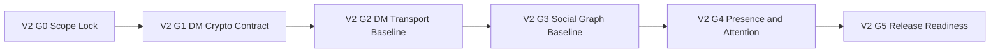

# TODO_v02.md

> Status: Planning artifact only. No implementation is claimed as complete.
>
> Authoritative source for v0.2 scope: `aether-v3.md`.
>
> Sequencing assumption: v0.1 planned outcomes are treated as completed inputs, and v0.2 is sequenced directly after them.
>
> Guardrails are mandatory from `AGENTS.md`: documentation-only repository state, strict planned-vs-implemented separation, protocol-first prioritization, single-binary mode model, additive-only protobuf minor evolution, major changes via new multistream IDs with downgrade negotiation, and AEP process with multi-implementation validation for breaking changes.

---

## Stack Alignment Constraints (Parent Recommendation, Planning-Level)

- This section is recommendation-only planning guidance and does not claim implementation completion.
- Control plane default: libp2p secure channels use `Noise_XX_25519_ChaChaPoly_SHA256` as the single supported suite; QUIC is preferred for reliable multiplexed streams, with no TCP-only framing implied.
- Media plane default (cross-version invariant): ICE (STUN/TURN), SRTP hop-by-hop, SFrame for true media E2EE, and browser encoded-transform/insertable-streams integration where browser media clients apply.
- Key management default: X3DH + Double Ratchet for DMs; MLS for group key agreement. Any Sender Keys references in this file are retained only as compatibility/migration context for interoperability and SFrame key-management transition notes.
- Crypto defaults: SFrame AES-GCM full-tag profile by default (for example `AES_128_GCM_SHA256_128` intent), avoid short tags unless explicitly justified; messaging AEAD baseline `ChaCha20-Poly1305` with optional AES-GCM negotiation; Noise transport suite fixed as above; SRTP baseline unchanged.
- Latency/resilience defaults for dependent realtime pathways: parallel race of direct ICE and relay/TURN, continuous path probing with seamless migration, RTT-aware multi-region relay/SFU selection with warm standby, topology switching (P2P 1:1, mesh small groups, SFU larger groups) without SFU transcoding, and background resilience (keepalives, fast network-change handling, ICE restarts/path migration, key pre-provisioning).

## 1. v0.2 Objective and Success Outcomes

### 1.1 Objective
Deliver **v0.2 Connections** as a protocol-first increment over v0.1 by adding:
- 1:1 DMs using X3DH + Double Ratchet
- Prekey distribution through DHT
- DM transport with direct and offline store-and-forward paths
- Group DMs (up to 50) using MLS, with Sender Keys compatibility bridge where migration/interoperability is required
- Friend requests via public key, QR, and `aether://` link
- Presence states and custom status
- Friends list with online/offline/pending segmentation
- In-app notifications and unread counters
- Mention semantics for `@user`, `@role`, `@everyone`, `@here`
- Basic RBAC baseline: Owner/Admin/Moderator/Member
- Baseline moderation protocol events and decentralized enforcement semantics for redaction/delete, timeout, and ban
- Channel slow mode with deterministic per-channel enforcement

### 1.2 Success Outcomes (verifiable)
1. 1:1 DM cryptographic sessions are negotiable, persistent, recoverable, and test-verified.
2. Prekey bundle publish/retrieve lifecycle works through DHT with rotation and expiry rules.
3. DM delivery works over direct path when available and offline path when peer is unavailable.
4. Group DM lifecycle supports create/invite/join/leave with secure rekey behavior.
5. Friend request lifecycle is complete across public key, QR, and deep-link entry points.
6. Presence behavior is deterministic for online, idle, DND, and invisible states.
7. Custom status text is propagated, bounded, and policy-constrained.
8. Friends list UI contract supports online/offline/pending views with synchronization rules.
9. Notification and unread counters are consistent across DM, group DM, and server contexts.
10. Mention parsing, resolution, authorization, and rendering behaviors are deterministic.
11. Baseline RBAC contract defines Owner/Admin/Moderator/Member role hierarchy and permission boundaries without importing custom-role CRUD.
12. Baseline moderation actions (redaction/delete, timeout, ban) are signed protocol events with deterministic actor-target constraints, reason/failure taxonomy, and auditable outcomes.
13. Slow mode behavior is deterministic under reconnect/replay conditions and compatible with decentralized client-side enforcement rules.

### 1.3 QoL integration contract for v0.2 attention and connection surfaces (planning-level)

- **Unified connection health/recovery clarity:** DM setup, send/receive, presence sync, and baseline call-entry dependencies expose one canonical health surface and deterministic user state.
  - **Acceptance criterion:** for each degraded state, user-visible contract includes current state, reason class, and next action.
  - **Verification evidence:** `V2-G4` package contains a health-state matrix with deterministic transitions and recovery action mapping.
- **Recovery-first call UX baseline handoff:** where v0.2 contracts influence call readiness (identity, presence, notifications, device context), disruption outcomes prioritize rejoin/switch-path/switch-device guidance rather than terminal ambiguity.
  - **Verification evidence:** `V2-G4` scenario set includes rejoin and device-path fallback evidence links.
- **Deterministic reason taxonomy for user-visible outcomes:** notification, mention, moderation, and slow-mode user outcomes map to stable reason classes shared with diagnostics.
  - **Verification evidence:** reason taxonomy table is referenced by negative/degraded test cases in `V2-G4` and release checklist closure.
- **Unread/mention/notification coherence contract:** unread counters, mention badges, and notification triggers must converge deterministically across DM, group DM, and server contexts.
  - **Verification evidence:** coherence matrix includes increment/reset/suppress cases and cross-surface equivalence checks.
- **Cross-device continuity baseline:** draft persistence and read-position continuity are defined as conflict-safe contracts for v0.2 attention surfaces.
  - **Verification evidence:** continuity evidence includes multi-device conflict scenarios with deterministic resolution outcomes.

---

## 2. Scope Derivation from `aether-v3.md` for v0.2 Only

The following roadmap bullets in `aether-v3.md` define v0.2 scope:
- X3DH key agreement + Double Ratchet for 1:1 DMs
- Prekey bundles published to DHT
- DM transport: direct stream or store-and-forward via DHT
- Group DMs (up to 50 members) with MLS target profile and Sender Keys compatibility bridge notes
- Friend requests via public key / QR code / `aether://` link
- Presence system: online, idle (10min auto), DND, invisible
- Custom status text
- Friends list UI with online/offline/pending tabs
- Notification system (in-app badges, unread counts)
- Mentions: `@user`, `@role`, `@everyone`, `@here`
- Basic RBAC baseline: Owner/Admin/Moderator/Member
- Baseline moderation protocol events + enforcement: redaction/delete, timeout, ban
- Channel slow mode (deterministic per-channel enforcement)

No additional v0.3+ capability is promoted into v0.2 scope in this plan beyond these thirteen bullets.

---

## 3. Explicit Out-of-Scope Boundaries for v0.2

To prevent overlap and preserve roadmap integrity, the following remain deferred:
- RNNoise, adaptive voice pipeline expansions, screen share, file transfer (v0.3)
- Advanced RBAC/governance expansion (custom roles, channel overrides hardening, moderation policy versioning, auto-moderation hooks) (v0.4)
- Bot API, Discord shim, emoji/reactions (v0.5)
- Discovery/anti-abuse hardening and scaling expansions beyond v0.3-v0.4 baselines (v0.6)
- Deep history/search/push relay features (v0.7)

Note on `@role` mentions in v0.2: authorization checks must use the v0.2 baseline Owner/Admin/Moderator/Member contract; full custom-role management remains deferred.

---

## 4. Entry Prerequisites from v0.1 (Assumed Completed Inputs)

v0.2 starts from v0.1 outputs being available:
- libp2p host baseline, DHT, mDNS, and peer connectivity flows
- Identity model and key material lifecycle
- Signed manifest/deeplink baseline and encrypted local storage baseline
- MLS-based baseline for channel messaging (with Sender Keys compatibility bridge where migration/interoperability requires it)
- Relay/store-forward baseline and Gio client shell baseline
- CI/test/protobuf/config governance scaffolding baseline

If any prerequisite is missing during execution, it becomes a blocking dependency and must be resolved before dependent v0.2 tasks proceed.

---

## 5. Phase Ordering and Gate Flow

### 5.1 v0.2 Gates

| Gate | Name | Entry Criteria | Exit Criteria |
|---|---|---|---|
| V2-G0 | Scope and constraints lock | v0.2 planning started | Scope, constraints, and verification matrix approved |
| V2-G1 | 1:1 DM crypto contract freeze | V2-G0 complete | X3DH + Double Ratchet protocol and tests specified |
| V2-G2 | DM transport baseline | V2-G1 complete | Prekeys, direct DM path, and offline path contract complete |
| V2-G3 | Social graph baseline | V2-G2 complete | Group DMs + friends lifecycle specified and validated |
| V2-G4 | Presence, attention, and baseline governance | V2-G3 complete | Presence/status/notifications/mentions plus baseline RBAC/moderation/slow-mode contracts integrated and validated |
| V2-G5 | Release readiness | V2-G4 complete | Compatibility/governance conformance + decentralized moderation enforcement checks + docs + handoff complete |

### 5.2 Gate Flow Diagram

---

## 6. Detailed v0.2 Execution Plan by Phase, Task, Sub-Task

Priority legend used below:
- `P0` critical path
- `P1` important follow-through
- `P2` hardening and risk reduction

---

## Phase 0 - Scope Lock, Constraint Control, and Verification Setup

- [ ] **[P0][Order 01] P0-T1 Freeze v0.2 scope contract and traceability map**
  - **Objective:** Convert v0.2 roadmap bullets into an approved scope contract with one-to-one task traceability.
  - **Concrete actions:**
    - [ ] **P0-T1-ST1 Create v0.2 scope-to-roadmap trace table**
      - **Objective:** Ensure every v0.2 roadmap bullet is explicitly mapped to planned tasks.
      - **Concrete actions:** Build a trace table from v0.2 bullets to task IDs and acceptance tests.
      - **Dependencies/prerequisites:** v0.2 scope extraction complete.
      - **Deliverables/artifacts:** Scope traceability matrix.
      - **Acceptance criteria:** All thirteen v0.2 bullets mapped exactly once; no unmapped scope item.
      - **Suggested priority/order:** P0, Order 01.1.
      - **Risks/notes:** Missing mapping causes silent scope gaps.
    - [ ] **P0-T1-ST2 Define v0.2 explicit non-goals and overlap boundaries**
      - **Objective:** Prevent accidental pull-in from v0.3+ roadmap items.
      - **Concrete actions:** Document exclusion list and handoff references to future versions.
      - **Dependencies/prerequisites:** P0-T1-ST1.
      - **Deliverables/artifacts:** v0.2 non-goals section.
      - **Acceptance criteria:** Out-of-scope list reviewed and referenced by all downstream phases.
      - **Suggested priority/order:** P0, Order 01.2.
      - **Risks/notes:** Scope creep risk is highest around voice and RBAC features.
  - **Dependencies/prerequisites:** None.
  - **Deliverables/artifacts:** Approved v0.2 scope contract.
  - **Acceptance criteria:** Scope includes only v0.2 bullets and explicit non-goals.
  - **Suggested priority/order:** P0, Order 01.
  - **Risks/notes:** Any ambiguity at this stage propagates into later task overlap.

- [ ] **[P0][Order 02] P0-T2 Lock protocol compatibility and governance checklist for v0.2**
  - **Objective:** Ensure all v0.2 protocol changes remain compliant with compatibility and governance constraints.
  - **Concrete actions:**
    - [ ] **P0-T2-ST1 Create protobuf evolution checklist for v0.2 changes**
      - **Objective:** Enforce additive-only minor evolution for message schemas.
      - **Concrete actions:** Define prohibited operations and review gate items for schema edits.
      - **Dependencies/prerequisites:** P0-T1.
      - **Deliverables/artifacts:** Protobuf compatibility checklist.
      - **Acceptance criteria:** Checklist explicitly forbids field-number reuse and destructive type changes.
      - **Suggested priority/order:** P0, Order 02.1.
      - **Risks/notes:** Schema drift can cause wire incompatibility.
    - [ ] **P0-T2-ST2 Define major-change trigger and downgrade negotiation checklist**
      - **Objective:** Preserve multistream major version discipline if breaking behavior appears.
      - **Concrete actions:** Document trigger conditions and required downgrade negotiation evidence.
      - **Dependencies/prerequisites:** P0-T2-ST1.
      - **Deliverables/artifacts:** Major-change governance checklist.
      - **Acceptance criteria:** Any major-incompatible proposal must include new multistream ID plan.
      - **Suggested priority/order:** P0, Order 02.2.
      - **Risks/notes:** Breaking changes introduced as minor updates are high-severity defects.
  - **Dependencies/prerequisites:** P0-T1.
  - **Deliverables/artifacts:** Compatibility and governance checklist pack.
  - **Acceptance criteria:** Checklist is referenced in each protocol-touching task.
  - **Suggested priority/order:** P0, Order 02.
  - **Risks/notes:** Without this control, protocol-first discipline weakens quickly.

- [ ] **[P0][Order 03] P0-T3 Establish v0.2 verification matrix and evidence format**
  - **Objective:** Predefine what evidence is required to mark each v0.2 task complete.
  - **Concrete actions:**
    - [ ] **P0-T3-ST1 Define requirement-to-test matrix for all v0.2 scope items**
      - **Objective:** Make validation deterministic and auditable.
      - **Concrete actions:** Map each feature to contract tests, integration tests, and negative-path tests.
      - **Dependencies/prerequisites:** P0-T1.
      - **Deliverables/artifacts:** Requirement-to-test matrix.
      - **Acceptance criteria:** Every scope item has at least one positive and one negative verification path.
      - **Suggested priority/order:** P0, Order 03.1.
      - **Risks/notes:** Unmapped requirements become late-stage surprises.
    - [ ] **P0-T3-ST2 Define evidence artifact schema for completion reviews**
      - **Objective:** Standardize completion proof across teams.
      - **Concrete actions:** Specify mandatory evidence fields for logs, test outputs, and protocol traces.
      - **Dependencies/prerequisites:** P0-T3-ST1.
      - **Deliverables/artifacts:** Evidence template and review checklist.
      - **Acceptance criteria:** Review package format is agreed and reusable by all phases.
      - **Suggested priority/order:** P1, Order 03.2.
      - **Risks/notes:** Inconsistent evidence blocks objective signoff.
  - **Dependencies/prerequisites:** P0-T1, P0-T2.
  - **Deliverables/artifacts:** v0.2 verification matrix and evidence standard.
  - **Acceptance criteria:** V2-G0 exit criteria can be evaluated without ad hoc interpretation.
  - **Suggested priority/order:** P0, Order 03.
  - **Risks/notes:** Weak verification contracts reduce reliability of downstream acceptance.

---

## Phase 1 - 1:1 DM Protocol and Cryptographic Contract Freeze

- [ ] **[P0][Order 04] P1-T1 Define DM protocol surfaces: IDs, schemas, capability negotiation**
  - **Objective:** Formalize all protocol interfaces required for 1:1 DM in v0.2.
  - **Concrete actions:**
    - [ ] **P1-T1-ST1 Register DM-related protocol identifiers and versioning plan**
      - **Objective:** Establish deterministic negotiation points for DM streams.
      - **Concrete actions:** Define protocol registry entries and downgrade paths.
      - **Dependencies/prerequisites:** P0-T2.
      - **Deliverables/artifacts:** DM protocol ID registry entry set.
      - **Acceptance criteria:** IDs are namespaced, unique, and include downgrade behavior.
      - **Suggested priority/order:** P0, Order 04.1.
      - **Risks/notes:** Ambiguous IDs create interoperability failures.
    - [ ] **P1-T1-ST2 Extend protobuf schemas for DM handshake and payload envelopes**
      - **Objective:** Capture DM wire contracts with additive-safe schema design.
      - **Concrete actions:** Define messages for prekey metadata, encrypted payload envelope, and delivery receipts.
      - **Dependencies/prerequisites:** P1-T1-ST1.
      - **Deliverables/artifacts:** Protobuf schema delta for DM protocol.
      - **Acceptance criteria:** Schema passes additive-only checklist and includes reserved-field strategy.
      - **Suggested priority/order:** P0, Order 04.2.
      - **Risks/notes:** Overloading existing channel schemas can blur protocol boundaries.
  - **Dependencies/prerequisites:** P0-T2, P0-T3.
  - **Deliverables/artifacts:** DM protocol contract package.
  - **Acceptance criteria:** Contract is testable and unambiguous for independent implementation.
  - **Suggested priority/order:** P0, Order 04.
  - **Risks/notes:** Contract ambiguity impacts all crypto and transport tasks.

- [ ] **[P0][Order 05] P1-T2 Specify X3DH key agreement profile for v0.2 DMs**
  - **Objective:** Define exact X3DH operational profile and key lifecycle behavior.
  - **Concrete actions:**
    - [ ] **P1-T2-ST1 Define key material model and prekey classes**
      - **Objective:** Lock identity key, signed prekey, and one-time prekey requirements.
      - **Concrete actions:** Specify generation, signing, validity, and replacement rules.
      - **Dependencies/prerequisites:** P1-T1.
      - **Deliverables/artifacts:** X3DH key material specification.
      - **Acceptance criteria:** Required key classes and validity rules are complete and conflict-free.
      - **Suggested priority/order:** P0, Order 05.1.
      - **Risks/notes:** Key lifecycle gaps increase impersonation risk.
    - [ ] **P1-T2-ST2 Define X3DH handshake sequence and failure taxonomy**
      - **Objective:** Make initiation and acceptance flows deterministic.
      - **Concrete actions:** Document message order, verification checks, and explicit failure reasons.
      - **Dependencies/prerequisites:** P1-T2-ST1.
      - **Deliverables/artifacts:** X3DH handshake state flow and error taxonomy.
      - **Acceptance criteria:** Handshake can be executed and validated from protocol docs alone.
      - **Suggested priority/order:** P0, Order 05.2.
      - **Risks/notes:** Handshake edge cases often surface only under replay and stale-prekey scenarios.
  - **Dependencies/prerequisites:** P1-T1.
  - **Deliverables/artifacts:** v0.2 X3DH profile document.
  - **Acceptance criteria:** Profile includes bootstrap, retry, stale key handling, and replay protections.
  - **Suggested priority/order:** P0, Order 05.
  - **Risks/notes:** Under-specified X3DH behavior destabilizes Double Ratchet bootstrap.

- [ ] **[P0][Order 06] P1-T3 Specify Double Ratchet session model and cryptographic validation set**
  - **Objective:** Define robust DM session cryptography for normal and failure paths.
  - **Concrete actions:**
    - [ ] **P1-T3-ST1 Define ratchet state persistence and out-of-order handling rules**
      - **Objective:** Prevent message loss/decrypt failure under network disorder.
      - **Concrete actions:** Specify skipped-message key windows, storage bounds, and resynchronization rules.
      - **Dependencies/prerequisites:** P1-T2.
      - **Deliverables/artifacts:** Ratchet state persistence and reorder handling spec.
      - **Acceptance criteria:** Replay, duplication, and out-of-order cases have deterministic handling.
      - **Suggested priority/order:** P0, Order 06.1.
      - **Risks/notes:** State corruption or unbounded skipped-key growth is a high-risk failure mode.
    - [ ] **P1-T3-ST2 Define cryptographic test vectors and adversarial test requirements**
      - **Objective:** Make implementation validation reproducible.
      - **Concrete actions:** Create deterministic vectors and property/fuzz/negative-path test requirements.
      - **Dependencies/prerequisites:** P1-T3-ST1, P0-T3.
      - **Deliverables/artifacts:** Crypto validation pack for DM sessions.
      - **Acceptance criteria:** Validation pack covers replay, tamper, stale prekey, and corrupted ciphertext paths.
      - **Suggested priority/order:** P0, Order 06.2.
      - **Risks/notes:** Missing adversarial tests allows silent cryptographic regression.
  - **Dependencies/prerequisites:** P1-T2.
  - **Deliverables/artifacts:** Double Ratchet operational spec and test-vector pack.
  - **Acceptance criteria:** V2-G1 exits only when DM crypto contracts are fully testable and review-approved.
  - **Suggested priority/order:** P0, Order 06.
  - **Risks/notes:** Cryptographic contract errors are expensive to correct after transport integration.

---

## Phase 2 - Prekey Distribution and DM Transport Baseline

- [ ] **[P0][Order 07] P2-T1 Define DHT prekey bundle publication and retrieval lifecycle**
  - **Objective:** Ensure discoverable, verifiable, and rotatable prekey material in DHT.
  - **Concrete actions:**
    - [ ] **P2-T1-ST1 Define prekey bundle record schema, signatures, and expiry metadata**
      - **Objective:** Make prekey records tamper-evident and lifecycle-aware.
      - **Concrete actions:** Specify record fields for key IDs, signature chain, publish time, and expiry.
      - **Dependencies/prerequisites:** P1-T2.
      - **Deliverables/artifacts:** DHT prekey record specification.
      - **Acceptance criteria:** Record validation checks are complete and deterministic.
      - **Suggested priority/order:** P0, Order 07.1.
      - **Risks/notes:** Weak record validation can enable prekey poisoning attacks.
    - [ ] **P2-T1-ST2 Define rotation, depletion, and republish rules for prekey inventories**
      - **Objective:** Prevent handshake failures due to depleted one-time prekeys.
      - **Concrete actions:** Establish thresholds, republish triggers, and stale-key invalidation logic.
      - **Dependencies/prerequisites:** P2-T1-ST1.
      - **Deliverables/artifacts:** Prekey inventory lifecycle policy.
      - **Acceptance criteria:** Rotation policy ensures usable prekey availability under expected demand.
      - **Suggested priority/order:** P0, Order 07.2.
      - **Risks/notes:** Poor rotation rules can cause intermittent DM bootstrap failures.
  - **Dependencies/prerequisites:** P1-T2, P1-T3.
  - **Deliverables/artifacts:** DHT prekey lifecycle spec.
  - **Acceptance criteria:** Retrieval and validation flows are documented with negative-path handling.
  - **Suggested priority/order:** P0, Order 07.
  - **Risks/notes:** This is a hard dependency for practical DM initiation.

- [ ] **[P0][Order 08] P2-T2 Define direct DM transport and negotiation behavior**
  - **Objective:** Establish low-latency direct delivery path for online peers.
  - **Concrete actions:**
    - [ ] **P2-T2-ST1 Define direct stream open/close and session-binding semantics**
      - **Objective:** Ensure one DM session maps cleanly to transport state.
      - **Concrete actions:** Specify stream negotiation rules and session identifier handling.
      - **Dependencies/prerequisites:** P1-T1, P2-T1.
      - **Deliverables/artifacts:** Direct DM stream contract.
      - **Acceptance criteria:** Stream lifecycle includes normal close, timeout, and retry triggers.
      - **Suggested priority/order:** P0, Order 08.1.
      - **Risks/notes:** Stream/session mismatch can create decrypt failures and duplicates.
    - [ ] **P2-T2-ST2 Define encrypted envelope metadata minimization and integrity checks**
      - **Objective:** Reduce metadata leakage while preserving delivery semantics.
      - **Concrete actions:** Identify minimal routing metadata and mandatory integrity verification checks.
      - **Dependencies/prerequisites:** P2-T2-ST1.
      - **Deliverables/artifacts:** DM envelope metadata policy.
      - **Acceptance criteria:** Envelope fields are minimal, justified, and verifiable.
      - **Suggested priority/order:** P1, Order 08.2.
      - **Risks/notes:** Excess metadata weakens privacy posture.
  - **Dependencies/prerequisites:** P1-T1, P1-T3, P2-T1.
  - **Deliverables/artifacts:** Direct DM transport behavior spec.
  - **Acceptance criteria:** Direct path behavior is deterministic and independently implementable.
  - **Suggested priority/order:** P0, Order 08.
  - **Risks/notes:** Must align with offline fallback logic to avoid split-brain delivery behavior.

- [ ] **[P0][Order 09] P2-T3 Define offline DM store-and-forward path via DHT with delivery guarantees**
  - **Objective:** Provide reliable DM delivery when recipient is offline.
  - **Concrete actions:**
    - [ ] **P2-T3-ST1 Define mailbox addressing, ciphertext storage, and TTL/replication policy**
      - **Objective:** Make offline storage discoverable and bounded.
      - **Concrete actions:** Specify mailbox key derivation, replication factor, TTL, and garbage collection triggers.
      - **Dependencies/prerequisites:** P2-T1.
      - **Deliverables/artifacts:** DHT mailbox storage specification.
      - **Acceptance criteria:** Storage policy includes bounded retention and cleanup behavior.
      - **Suggested priority/order:** P0, Order 09.1.
      - **Risks/notes:** Incorrect retention behavior can cause either loss or excessive data persistence.
    - [ ] **P2-T3-ST2 Define ack/retry/idempotency semantics for offline retrieval**
      - **Objective:** Prevent duplicate delivery and missed messages.
      - **Concrete actions:** Define message IDs, receipt acknowledgments, retry windows, and deduplication logic.
      - **Dependencies/prerequisites:** P2-T3-ST1, P2-T2.
      - **Deliverables/artifacts:** Delivery guarantee contract for offline DM path.
      - **Acceptance criteria:** At-least-once delivery with dedupe is explicitly verifiable.
      - **Suggested priority/order:** P0, Order 09.2.
      - **Risks/notes:** Weak idempotency handling causes user-visible duplicates.
  - **Dependencies/prerequisites:** P2-T1, P2-T2.
  - **Deliverables/artifacts:** Offline DM transport and reliability spec.
  - **Acceptance criteria:** V2-G2 exits only when direct and offline paths are coherent and test-defined.
  - **Suggested priority/order:** P0, Order 09.
  - **Risks/notes:** Offline behavior is essential for real-world usability.

---

## Phase 3 - Group DM Baseline (MLS Target, Up to 50 Members)

- [ ] **[P0][Order 10] P3-T1 Define Group DM domain model and membership lifecycle**
  - **Objective:** Standardize Group DM creation, membership, and state transitions.
  - **Concrete actions:**
    - [ ] **P3-T1-ST1 Define create/invite/join/leave/remove state machine**
      - **Objective:** Make membership transitions explicit and auditable.
      - **Concrete actions:** Document state transitions and invalid transition handling.
      - **Dependencies/prerequisites:** P2-T3.
      - **Deliverables/artifacts:** Group DM lifecycle state machine spec.
      - **Acceptance criteria:** All transitions have clear preconditions and outcomes.
      - **Suggested priority/order:** P0, Order 10.1.
      - **Risks/notes:** Ambiguous membership transitions lead to key-management inconsistencies.
    - [ ] **P3-T1-ST2 Define membership event schema and ordering guarantees**
      - **Objective:** Keep group state synchronized across peers.
      - **Concrete actions:** Specify event types, ordering metadata, and conflict resolution rules.
      - **Dependencies/prerequisites:** P3-T1-ST1.
      - **Deliverables/artifacts:** Membership event protocol schema.
      - **Acceptance criteria:** Concurrent membership updates have deterministic conflict outcomes.
      - **Suggested priority/order:** P1, Order 10.2.
      - **Risks/notes:** Non-deterministic ordering creates divergent group views.
  - **Dependencies/prerequisites:** P2-T3.
  - **Deliverables/artifacts:** Group DM lifecycle contract.
  - **Acceptance criteria:** Group membership behavior is fully specified and test-mapped.
  - **Suggested priority/order:** P0, Order 10.
  - **Risks/notes:** Membership model must be locked before rekey logic is finalized.

- [ ] **[P0][Order 11] P3-T2 Define Group DM MLS distribution and rotation rules (with Sender Keys compatibility bridge)**
  - **Objective:** Preserve confidentiality and forward secrecy behavior in group contexts.
  - **Concrete actions:**
    - [ ] **P3-T2-ST1 Define initial Sender Key distribution and secure handoff**
      - **Objective:** Ensure members receive valid group key material on join.
      - **Concrete actions:** Specify key envelope flow, sender authentication checks, and bootstrap retries.
      - **Dependencies/prerequisites:** P3-T1, P1-T3.
      - **Deliverables/artifacts:** Group DM key distribution protocol.
      - **Acceptance criteria:** Initial key exchange is authenticated and replay-protected.
      - **Suggested priority/order:** P0, Order 11.1.
      - **Risks/notes:** Weak distribution path can expose group ciphertext.
    - [ ] **P3-T2-ST2 Define rekey triggers for membership changes and compromise response**
      - **Objective:** Ensure departed or removed members lose decryption access.
      - **Concrete actions:** Define mandatory rekey events and rejoin constraints after removal.
      - **Dependencies/prerequisites:** P3-T2-ST1.
      - **Deliverables/artifacts:** Group DM rekey policy.
      - **Acceptance criteria:** Rekey triggers cover add/remove/leave/compromise scenarios.
      - **Suggested priority/order:** P0, Order 11.2.
      - **Risks/notes:** Incomplete rekey policy is a high-severity security risk.
  - **Dependencies/prerequisites:** P3-T1, P1-T3.
  - **Deliverables/artifacts:** Group DM key lifecycle specification.
  - **Acceptance criteria:** Key lifecycle is deterministic and included in validation matrix.
  - **Suggested priority/order:** P0, Order 11.
  - **Risks/notes:** Must remain consistent with MLS target architecture and any explicitly bounded Sender Keys compatibility bridge assumptions.

- [ ] **[P0][Order 12] P3-T3 Define Group DM transport, history behavior, and member-cap enforcement**
  - **Objective:** Provide stable message flow and bounded scale for Group DMs.
  - **Concrete actions:**
    - [ ] **P3-T3-ST1 Define message routing, offline retrieval, and history sync boundaries**
      - **Objective:** Keep Group DM behavior aligned with direct/offline DM transport semantics.
      - **Concrete actions:** Specify fetch windows, sync triggers, and error handling for missing history.
      - **Dependencies/prerequisites:** P2-T3, P3-T1.
      - **Deliverables/artifacts:** Group DM transport and history policy.
      - **Acceptance criteria:** History and transport semantics are deterministic and bounded.
      - **Suggested priority/order:** P1, Order 12.1.
      - **Risks/notes:** Unbounded sync can degrade client performance.
    - [ ] **P3-T3-ST2 Enforce and validate 50-member cap with explicit rejection behavior**
      - **Objective:** Keep v0.2 within planned scale envelope.
      - **Concrete actions:** Define enforcement checks and user-facing rejection reasons for limit breaches.
      - **Dependencies/prerequisites:** P3-T1-ST1.
      - **Deliverables/artifacts:** Group DM cap enforcement specification.
      - **Acceptance criteria:** Exceeding capacity is consistently rejected with deterministic reason codes.
      - **Suggested priority/order:** P1, Order 12.2.
      - **Risks/notes:** Silent over-cap behavior can destabilize key distribution logic.
  - **Dependencies/prerequisites:** P3-T1, P3-T2, P2-T3.
  - **Deliverables/artifacts:** Group DM transport and bounds contract.
  - **Acceptance criteria:** V2-G3 includes validated Group DM lifecycle and limits.
  - **Suggested priority/order:** P0, Order 12.
  - **Risks/notes:** Group DM must remain clearly distinct from server channel architecture.

---

## Phase 4 - Friend Requests and Friends List Baseline

- [ ] **[P0][Order 13] P4-T1 Define friend identity exchange formats: public key, QR, deep link**
  - **Objective:** Provide canonical friend discovery inputs across all entry paths.
  - **Concrete actions:**
    - [ ] **P4-T1-ST1 Define canonical public-key sharing format and validation**
      - **Objective:** Ensure unambiguous parsing and integrity checks.
      - **Concrete actions:** Specify encoding, checksum, and parse failure handling.
      - **Dependencies/prerequisites:** v0.1 identity baseline assumed.
      - **Deliverables/artifacts:** Friend public-key format specification.
      - **Acceptance criteria:** Parser behavior is deterministic for valid and invalid inputs.
      - **Suggested priority/order:** P0, Order 13.1.
      - **Risks/notes:** Ambiguous encoding increases spoofing and UX error risk.
    - [ ] **P4-T1-ST2 Define QR payload and `aether://` friend link payload schema**
      - **Objective:** Standardize machine-readable friend invitation inputs.
      - **Concrete actions:** Define payload fields, signature requirements, and expiry behavior.
      - **Dependencies/prerequisites:** P4-T1-ST1.
      - **Deliverables/artifacts:** QR and deep-link schema definitions.
      - **Acceptance criteria:** QR and link payloads produce equivalent canonical friend request inputs.
      - **Suggested priority/order:** P0, Order 13.2.
      - **Risks/notes:** Link payload schema drift can break cross-client interoperability.
  - **Dependencies/prerequisites:** P0-T2, v0.1 identity prerequisites.
  - **Deliverables/artifacts:** Friend identity exchange contract pack.
  - **Acceptance criteria:** All three entry paths normalize to one canonical request model.
  - **Suggested priority/order:** P0, Order 13.
  - **Risks/notes:** Must not depend on centralized lookup services.

- [ ] **[P0][Order 14] P4-T2 Define friend request lifecycle protocol and trust semantics**
  - **Objective:** Establish deterministic request state management from initiation to resolution.
  - **Concrete actions:**
    - [ ] **P4-T2-ST1 Define request states: pending, accepted, declined, canceled, blocked**
      - **Objective:** Prevent contradictory friend relationship states.
      - **Concrete actions:** Document transition rules and concurrency resolution for simultaneous requests.
      - **Dependencies/prerequisites:** P4-T1.
      - **Deliverables/artifacts:** Friend request state machine.
      - **Acceptance criteria:** State transitions are complete, acyclic, and conflict-resolved.
      - **Suggested priority/order:** P0, Order 14.1.
      - **Risks/notes:** Missing conflict rules cause duplicate or inconsistent relationship states.
    - [ ] **P4-T2-ST2 Define request authenticity checks and anti-spoofing requirements**
      - **Objective:** Ensure incoming requests are attributable to valid identities.
      - **Concrete actions:** Specify signature validation, replay handling, and stale-request expiry rules.
      - **Dependencies/prerequisites:** P4-T2-ST1.
      - **Deliverables/artifacts:** Friend request authenticity policy.
      - **Acceptance criteria:** Forged/expired/replayed request handling is explicitly defined.
      - **Suggested priority/order:** P0, Order 14.2.
      - **Risks/notes:** Weak authenticity checks directly impact user trust.
  - **Dependencies/prerequisites:** P4-T1, P1-T1.
  - **Deliverables/artifacts:** Friend request protocol contract.
  - **Acceptance criteria:** Friend lifecycle can be executed and validated end-to-end.
  - **Suggested priority/order:** P0, Order 14.
  - **Risks/notes:** Friend graph integrity underpins presence and notification relevance.

- [ ] **[P1][Order 15] P4-T3 Define friends list synchronization model and UI state contract**
  - **Objective:** Deliver a stable friends list experience with online/offline/pending segmentation.
  - **Concrete actions:**
    - [ ] **P4-T3-ST1 Define friends list data projections and tab segmentation rules**
      - **Objective:** Keep list categorization deterministic across clients.
      - **Concrete actions:** Specify status-to-tab mapping and tie-break ordering behavior.
      - **Dependencies/prerequisites:** P4-T2.
      - **Deliverables/artifacts:** Friends list projection specification.
      - **Acceptance criteria:** Same source graph always produces same list segmentation.
      - **Suggested priority/order:** P1, Order 15.1.
      - **Risks/notes:** Presence delays can create transient list mismatch; must be bounded.
    - [ ] **P4-T3-ST2 Define UI states for loading, empty, error, and pending actions**
      - **Objective:** Ensure predictable behavior under partial or failed synchronization.
      - **Concrete actions:** Document state transitions and required user actions per state.
      - **Dependencies/prerequisites:** P4-T3-ST1.
      - **Deliverables/artifacts:** Friends list UI state contract.
      - **Acceptance criteria:** No UI state is undefined for common failure paths.
      - **Suggested priority/order:** P1, Order 15.2.
      - **Risks/notes:** Undefined empty/error states reduce usability and supportability.
  - **Dependencies/prerequisites:** P4-T2.
  - **Deliverables/artifacts:** Friends list sync and UI contract.
  - **Acceptance criteria:** Friends list tabs are test-defined and stable under presence updates.
  - **Suggested priority/order:** P1, Order 15.
  - **Risks/notes:** Keep UI contract thin; protocol remains source of truth.

---

## Phase 5 - Presence and Custom Status Contract

- [ ] **[P0][Order 16] P5-T1 Define presence state machine and protocol schema**
  - **Objective:** Formalize presence as protocol state, not UI-only state.
  - **Concrete actions:**
    - [ ] **P5-T1-ST1 Define canonical presence states and transitions**
      - **Objective:** Lock semantics for online, idle, DND, invisible.
      - **Concrete actions:** Specify transition triggers, precedence rules, and fallback defaults.
      - **Dependencies/prerequisites:** P4-T2.
      - **Deliverables/artifacts:** Presence state machine specification.
      - **Acceptance criteria:** Every state transition has explicit trigger and visibility behavior.
      - **Suggested priority/order:** P0, Order 16.1.
      - **Risks/notes:** Ambiguous invisible semantics can leak user activity.
    - [ ] **P5-T1-ST2 Define presence protobuf schema and capability negotiation flags**
      - **Objective:** Provide additive-safe wire contract for presence updates.
      - **Concrete actions:** Define message fields, optional extensions, and backward-compatibility handling.
      - **Dependencies/prerequisites:** P5-T1-ST1, P0-T2.
      - **Deliverables/artifacts:** Presence schema delta and capability flag definitions.
      - **Acceptance criteria:** Schema and flags pass compatibility checks and downgrade behavior is defined.
      - **Suggested priority/order:** P0, Order 16.2.
      - **Risks/notes:** Overly chatty schema can increase network overhead.
  - **Dependencies/prerequisites:** P0-T2, P4-T2.
  - **Deliverables/artifacts:** Presence protocol contract package.
  - **Acceptance criteria:** Presence behavior is protocol-documented and test-mapped.
  - **Suggested priority/order:** P0, Order 16.
  - **Risks/notes:** Presence is consumed by friends list and notification tasks.

- [ ] **[P0][Order 17] P5-T2 Define presence dissemination, staleness, and convergence rules**
  - **Objective:** Keep presence updates timely without creating noisy network traffic.
  - **Concrete actions:**
    - [ ] **P5-T2-ST1 Define publish cadence, debounce, and throttle rules**
      - **Objective:** Balance accuracy with network efficiency.
      - **Concrete actions:** Set update triggers for state transitions and suppress redundant updates.
      - **Dependencies/prerequisites:** P5-T1.
      - **Deliverables/artifacts:** Presence update cadence policy.
      - **Acceptance criteria:** Cadence policy includes anti-flap behavior and bounded update frequency.
      - **Suggested priority/order:** P1, Order 17.1.
      - **Risks/notes:** Aggressive update frequency can inflate bandwidth and CPU costs.
    - [ ] **P5-T2-ST2 Define stale presence detection and offline fallback behavior**
      - **Objective:** Prevent stale online indicators when peers disconnect unexpectedly.
      - **Concrete actions:** Define timeout windows and conflict-resolution precedence for stale entries.
      - **Dependencies/prerequisites:** P5-T2-ST1.
      - **Deliverables/artifacts:** Presence staleness and reconciliation policy.
      - **Acceptance criteria:** Stale-entry cleanup behavior is deterministic and test-defined.
      - **Suggested priority/order:** P0, Order 17.2.
      - **Risks/notes:** Poor stale handling erodes trust in presence indicators.
  - **Dependencies/prerequisites:** P5-T1.
  - **Deliverables/artifacts:** Presence dissemination contract.
  - **Acceptance criteria:** Presence convergence rules are integrated into validation matrix.
  - **Suggested priority/order:** P0, Order 17.
  - **Risks/notes:** Directly affects friends list and mention attention routing quality.

- [ ] **[P1][Order 18] P5-T3 Define custom status text behavior and policy bounds**
  - **Objective:** Add expressive status text without compromising protocol simplicity or safety.
  - **Concrete actions:**
    - [ ] **P5-T3-ST1 Define status text schema, length constraints, and encoding policy**
      - **Objective:** Standardize representation and prevent unbounded payload growth.
      - **Concrete actions:** Specify max length, allowed charset, and normalization behavior.
      - **Dependencies/prerequisites:** P5-T1.
      - **Deliverables/artifacts:** Custom status schema policy.
      - **Acceptance criteria:** Schema constraints are explicit and enforceable.
      - **Suggested priority/order:** P1, Order 18.1.
      - **Risks/notes:** Missing bounds can cause rendering and storage issues.
    - [ ] **P5-T3-ST2 Define propagation, cache invalidation, and redaction behavior**
      - **Objective:** Ensure updated statuses converge and old values are not retained incorrectly.
      - **Concrete actions:** Define update propagation timing and replacement semantics.
      - **Dependencies/prerequisites:** P5-T2.
      - **Deliverables/artifacts:** Status propagation and invalidation policy.
      - **Acceptance criteria:** Status updates are reflected consistently across peers within defined convergence bounds.
      - **Suggested priority/order:** P1, Order 18.2.
      - **Risks/notes:** Cache mismatch can create stale or contradictory status displays.
  - **Dependencies/prerequisites:** P5-T1, P5-T2.
  - **Deliverables/artifacts:** Custom status behavior contract.
  - **Acceptance criteria:** Custom status is integrated into presence model with bounded behavior.
  - **Suggested priority/order:** P1, Order 18.
  - **Risks/notes:** Keep status text feature lightweight; avoid feature creep into profile overhaul.

---

## Phase 6 - Notifications and Mention Semantics

- [ ] **[P0][Order 19] P6-T1 Define notification event model and unread counter rules**
  - **Objective:** Deliver deterministic in-app attention signaling for v0.2 contexts.
  - **Concrete actions:**
    - [ ] **P6-T1-ST1 Define notification event taxonomy across DM, Group DM, and server contexts**
      - **Objective:** Separate event categories for consistent handling and UI rendering.
      - **Concrete actions:** Specify event types, source metadata, and dedupe keys.
      - **Dependencies/prerequisites:** P2-T3, P3-T3, P4-T2.
      - **Deliverables/artifacts:** Notification event taxonomy specification.
      - **Acceptance criteria:** Each event type maps to one handling rule and one counter impact rule.
      - **Suggested priority/order:** P0, Order 19.1.
      - **Risks/notes:** Event overlap can inflate unread counts.
    - [ ] **P6-T1-ST2 Define unread counter increment/reset semantics per context**
      - **Objective:** Keep unread counts accurate and predictable.
      - **Concrete actions:** Document increment triggers, read markers, and reset behavior on navigation.
      - **Dependencies/prerequisites:** P6-T1-ST1.
      - **Deliverables/artifacts:** Unread counter policy.
      - **Acceptance criteria:** Counter behavior is deterministic for all navigation and read states.
      - **Suggested priority/order:** P0, Order 19.2.
      - **Risks/notes:** Counter inconsistency is one of the most visible UX defects.
  - **Dependencies/prerequisites:** P3-T3, P4-T3, P5-T1.
  - **Deliverables/artifacts:** Notification and unread contract.
  - **Acceptance criteria:** Notification behavior is fully mapped to tests and UI contracts.
  - **Suggested priority/order:** P0, Order 19.
  - **Risks/notes:** Needs tight integration with mention semantics.

- [ ] **[P0][Order 20] P6-T2 Define mention parsing, tokenization, and resolution behavior**
  - **Objective:** Standardize how mention tokens are recognized and resolved.
  - **Concrete actions:**
    - [ ] **P6-T2-ST1 Define parser rules for `@user`, `@role`, `@everyone`, `@here`**
      - **Objective:** Ensure consistent mention detection across clients.
      - **Concrete actions:** Specify lexical boundaries, escaping behavior, and ambiguous-token handling.
      - **Dependencies/prerequisites:** P1-T1.
      - **Deliverables/artifacts:** Mention parser specification.
      - **Acceptance criteria:** Parser rules include positive and negative examples for each mention type.
      - **Suggested priority/order:** P0, Order 20.1.
      - **Risks/notes:** Inconsistent parsing leads to cross-client behavior drift.
    - [ ] **P6-T2-ST2 Define mention resolution order and unknown-target fallback behavior**
      - **Objective:** Keep rendering and notification behavior deterministic when targets are missing.
      - **Concrete actions:** Specify resolver precedence and fallback rendering for unresolved mentions.
      - **Dependencies/prerequisites:** P6-T2-ST1, P4-T3.
      - **Deliverables/artifacts:** Mention resolution contract.
      - **Acceptance criteria:** Resolution behavior is deterministic for valid, stale, and unknown targets.
      - **Suggested priority/order:** P0, Order 20.2.
      - **Risks/notes:** Unknown-target behavior must avoid false notifications.
  - **Dependencies/prerequisites:** P6-T1, P4-T3.
  - **Deliverables/artifacts:** Mention parser and resolver specification.
  - **Acceptance criteria:** Mention behavior is protocol-defined and testable.
  - **Suggested priority/order:** P0, Order 20.
  - **Risks/notes:** Must remain compatible with future RBAC expansion.

- [ ] **[P1][Order 21] P6-T3 Define mention authorization and in-app notification surfaces**
  - **Objective:** Prevent mass-mention abuse and present clear attention cues.
  - **Concrete actions:**
    - [ ] **P6-T3-ST1 Define authorization checks for `@role`, `@everyone`, `@here` in v0.2**
      - **Objective:** Apply baseline RBAC controls without importing v0.4 custom-role governance scope.
      - **Concrete actions:** Define authorization rules based on Owner/Admin/Moderator/Member and explicit constraints for out-of-scope role management.
      - **Dependencies/prerequisites:** P6-T2.
      - **Deliverables/artifacts:** Mention authorization policy for v0.2.
      - **Acceptance criteria:** Unauthorized mass mentions are rejected with deterministic reason codes.
      - **Suggested priority/order:** P1, Order 21.1.
      - **Risks/notes:** Over-scoping into full permissions system must be avoided.
    - [ ] **P6-T3-ST2 Define badge and mention-highlight UI behavior by context**
      - **Objective:** Ensure mention events become visible and actionable in app.
      - **Concrete actions:** Specify per-context badge placement, highlight behavior, and clear-on-read logic.
      - **Dependencies/prerequisites:** P6-T1, P6-T2.
      - **Deliverables/artifacts:** Notification surface UI contract.
      - **Acceptance criteria:** Badge and highlight behavior aligns with unread and mention policies.
      - **Suggested priority/order:** P1, Order 21.2.
      - **Risks/notes:** UI inconsistency can mask critical mention events.
  - **Dependencies/prerequisites:** P6-T1, P6-T2, P4-T3.
  - **Deliverables/artifacts:** Mention authorization and attention-surface contract.
  - **Acceptance criteria:** v0.2 mention feature is complete using baseline RBAC without importing v0.4 advanced governance scope.
  - **Suggested priority/order:** P1, Order 21.
  - **Risks/notes:** Keep explicit forward-compatibility hooks for v0.4 custom-role and override model.

- [ ] **[P0][Order 21.5] P6-T4 Define baseline RBAC contract for Owner/Admin/Moderator/Member**
  - **Objective:** Specify deterministic role hierarchy and permission boundaries required by v0.2 moderation/mention controls.
  - **Concrete actions:**
    - [ ] **P6-T4-ST1 Define baseline role hierarchy and actor-target authority matrix**
      - **Objective:** Remove ambiguity in who can perform moderation or mass-mention actions.
      - **Concrete actions:** Define role ordering, escalation constraints, and forbidden actor-target combinations.
      - **Dependencies/prerequisites:** P6-T2, P6-T3.
      - **Deliverables/artifacts:** Baseline RBAC hierarchy and authority matrix.
      - **Acceptance criteria:** Equivalent actor-target requests produce deterministic allow/deny outcomes.
      - **Suggested priority/order:** P0, Order 21.5.1.
      - **Risks/notes:** Ambiguous hierarchy semantics create privilege-escalation risk.
    - [ ] **P6-T4-ST2 Define role-resolution behavior for reconnect/stale-state conditions**
      - **Objective:** Ensure authorization decisions converge under decentralized state propagation.
      - **Concrete actions:** Define stale-role detection, fallback behavior, and deterministic rejection semantics.
      - **Dependencies/prerequisites:** P6-T4-ST1.
      - **Deliverables/artifacts:** RBAC convergence and stale-state handling contract.
      - **Acceptance criteria:** Stale-role scenarios converge to one deterministic enforcement outcome.
      - **Suggested priority/order:** P0, Order 21.5.2.
      - **Risks/notes:** Divergent role state can produce inconsistent enforcement across clients.
  - **Dependencies/prerequisites:** P6-T2, P6-T3.
  - **Deliverables/artifacts:** v0.2 baseline RBAC contract.
  - **Acceptance criteria:** Owner/Admin/Moderator/Member behavior is fully specified and test-mapped.
  - **Suggested priority/order:** P0, Order 21.5.
  - **Risks/notes:** Must remain baseline-only; custom roles and channel overrides stay deferred to v0.4.

- [ ] **[P0][Order 21.6] P6-T5 Define baseline moderation protocol events and slow-mode enforcement semantics**
  - **Objective:** Specify deterministic redaction/delete, timeout, ban, and slow-mode contracts in a decentralized enforcement model.
  - **Concrete actions:**
    - [ ] **P6-T5-ST1 Define signed moderation-event schema and decentralized enforcement requirements**
      - **Objective:** Make moderation behavior protocol-native and auditable rather than UI-only.
      - **Concrete actions:** Define event fields, signer requirements, actor-target preconditions, and official-client enforcement obligations with explicit non-compliance signaling.
      - **Dependencies/prerequisites:** P6-T4.
      - **Deliverables/artifacts:** Baseline moderation-event contract.
      - **Acceptance criteria:** Redaction/delete, timeout, and ban events have deterministic success/failure semantics and signed verification rules.
      - **Suggested priority/order:** P0, Order 21.6.1.
      - **Risks/notes:** Ambiguous enforcement semantics can fragment moderation outcomes.
    - [ ] **P6-T5-ST2 Define channel slow-mode timing semantics and replay/rejoin behavior**
      - **Objective:** Ensure slow mode remains deterministic under network interruptions and event replay.
      - **Concrete actions:** Define timer scope, bypass conditions by baseline role, rejection reason codes, and replay reconciliation behavior.
      - **Dependencies/prerequisites:** P6-T5-ST1.
      - **Deliverables/artifacts:** Slow-mode enforcement and reconciliation policy.
      - **Acceptance criteria:** Equivalent message streams under slow mode yield deterministic accept/reject outcomes across reconnect/replay paths.
      - **Suggested priority/order:** P0, Order 21.6.2.
      - **Risks/notes:** Timer drift can create fairness and trust issues.
  - **Dependencies/prerequisites:** P6-T4.
  - **Deliverables/artifacts:** Baseline moderation + slow-mode contract.
  - **Acceptance criteria:** v0.2 moderation/slow-mode behavior is protocol-defined, signed, and testable without authoritative-node assumptions.
  - **Suggested priority/order:** P0, Order 21.6.
  - **Risks/notes:** Enforcement remains decentralized and client-compliance dependent by design.

---

## Phase 7 - End-to-End Validation, Conformance, and Release Readiness

- [ ] **[P0][Order 22] P7-T1 Define and execute v0.2 end-to-end scenario validation pack**
  - **Objective:** Verify core user journeys across all v0.2 capabilities.
  - **Concrete actions:**
    - [ ] **P7-T1-ST1 Build scenario pack for DM, Group DM, friends, presence, notifications, mentions, baseline RBAC, moderation, and slow mode**
      - **Objective:** Cover all critical interactions in realistic flow sequences.
      - **Concrete actions:** Define baseline scenarios including online and offline transitions.
      - **Dependencies/prerequisites:** P2-T3, P3-T3, P4-T3, P5-T3, P6-T5.
      - **Deliverables/artifacts:** v0.2 scenario test specification.
      - **Acceptance criteria:** Every v0.2 scope bullet appears in at least one end-to-end scenario.
      - **Suggested priority/order:** P0, Order 22.1.
      - **Risks/notes:** Partial scenario coverage hides integration defects.
    - [ ] **P7-T1-ST2 Define failure-recovery scenarios and expected user-visible behavior**
      - **Objective:** Validate resilience under prekey depletion, stale presence, and delayed offline retrieval.
      - **Concrete actions:** Add negative-path scenarios and recovery assertions.
      - **Dependencies/prerequisites:** P7-T1-ST1.
      - **Deliverables/artifacts:** Failure-recovery scenario set.
      - **Acceptance criteria:** Recovery paths are deterministic and produce actionable outcomes.
      - **Suggested priority/order:** P0, Order 22.2.
      - **Risks/notes:** Recovery behavior is often under-specified until late stages.
  - **Dependencies/prerequisites:** P1-T1 through P6-T5.
  - **Deliverables/artifacts:** End-to-end validation evidence bundle.
  - **Acceptance criteria:** V2-G4 to V2-G5 transition backed by scenario evidence.
  - **Suggested priority/order:** P0, Order 22.
  - **Risks/notes:** No release gate should pass without full scenario evidence.

- [ ] **[P0][Order 23] P7-T2 Run compatibility, governance, and unresolved-decision conformance review**
  - **Objective:** Confirm v0.2 plan outputs preserve all architectural guardrails.
  - **Concrete actions:**
    - [ ] **P7-T2-ST1 Audit protobuf and protocol changes for additive/major-version compliance**
      - **Objective:** Verify compatibility policy adherence before release signoff.
      - **Concrete actions:** Run checklist review against all schema and protocol deltas.
      - **Dependencies/prerequisites:** P1-T1 through P6-T3.
      - **Deliverables/artifacts:** Compatibility conformance report.
      - **Acceptance criteria:** No incompatible change is merged without major-version procedure evidence.
      - **Suggested priority/order:** P0, Order 23.1.
      - **Risks/notes:** Late compatibility issues can block release readiness.
    - [ ] **P7-T2-ST2 Validate governance constraints and open-decision posture**
      - **Objective:** Ensure no unresolved open decision is represented as finalized architecture.
      - **Concrete actions:** Review release notes and docs for unresolved-choice wording discipline.
      - **Dependencies/prerequisites:** P7-T2-ST1.
      - **Deliverables/artifacts:** Governance and open-decision review record.
      - **Acceptance criteria:** Breaking-change proposals include AEP trigger path and multi-implementation requirement.
      - **Suggested priority/order:** P0, Order 23.2.
      - **Risks/notes:** Language drift can misrepresent governance maturity.
  - **Dependencies/prerequisites:** P7-T1.
  - **Deliverables/artifacts:** Conformance signoff package.
  - **Acceptance criteria:** All mandatory guardrails are explicitly checked and passed.
  - **Suggested priority/order:** P0, Order 23.
  - **Risks/notes:** This task protects long-term protocol stability.

- [ ] **[P1][Order 24] P7-T3 Finalize v0.2 release gate package and v0.3 handoff backlog**
  - **Objective:** Close v0.2 planning/execution loop with clear completion and forward handoff.
  - **Concrete actions:**
    - [ ] **P7-T3-ST1 Assemble release gate checklist with traceable evidence links**
      - **Objective:** Ensure a single source of truth for go/no-go decisions.
      - **Concrete actions:** Compile acceptance evidence, unresolved risks, and explicit residual-risk acceptance.
      - **Dependencies/prerequisites:** P7-T1, P7-T2.
      - **Deliverables/artifacts:** v0.2 release gate checklist.
      - **Acceptance criteria:** Every v0.2 scope item has explicit pass/fail status and evidence reference.
      - **Suggested priority/order:** P1, Order 24.1.
      - **Risks/notes:** Missing trace links make signoff non-auditable.
    - [ ] **P7-T3-ST2 Create v0.3+ deferral and carry-forward backlog from v0.2 residuals**
      - **Objective:** Preserve roadmap continuity and prevent hidden carry-over work.
      - **Concrete actions:** Capture deferred items with rationale and recommended future owners.
      - **Dependencies/prerequisites:** P7-T3-ST1.
      - **Deliverables/artifacts:** Carry-forward backlog artifact.
      - **Acceptance criteria:** Deferred items are explicitly mapped to future roadmap versions.
      - **Suggested priority/order:** P1, Order 24.2.
      - **Risks/notes:** Untracked residuals become hidden scope in subsequent releases.
  - **Dependencies/prerequisites:** P7-T1, P7-T2.
  - **Deliverables/artifacts:** Final v0.2 release package and forward backlog.
  - **Acceptance criteria:** V2-G5 exit conditions satisfied with explicit signoff record.
  - **Suggested priority/order:** P1, Order 24.
  - **Risks/notes:** Completion package must remain planning-accurate and avoid implementation claims.

---

## 7. Practical Ordered Work Queue (Team Execution)

### Wave A - Scope and contract freeze
1. P0-T1
2. P0-T2
3. P0-T3
4. P1-T1
5. P1-T2
6. P1-T3

### Wave B - DM delivery baseline
7. P2-T1
8. P2-T2
9. P2-T3

### Wave C - Group DMs and friends graph
10. P3-T1
11. P3-T2
12. P3-T3
13. P4-T1
14. P4-T2
15. P4-T3

### Wave D - Presence and attention model
16. P5-T1
17. P5-T2
18. P5-T3
19. P6-T1
20. P6-T2
21. P6-T3

### Wave E - Validation and closure
22. P7-T1
23. P7-T2
24. P7-T3

---

## 8. Definition of Done for v0.2 Planning and Execution Readiness

v0.2 is execution-ready only when all are true:
1. Every v0.2 roadmap bullet is mapped to tasks, sub-tasks, and acceptance criteria.
2. Phase/task/sub-task ordering is dependency-consistent and protocol-first.
3. Compatibility and governance constraints are embedded in review gates.
4. Planned-vs-implemented distinction remains explicit throughout artifacts.
5. No unresolved open decision is presented as finalized architecture.
6. Release gate package and carry-forward backlog are prepared for subsequent execution mode handoff.
