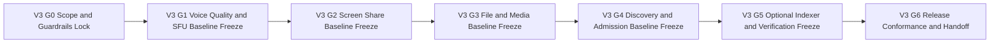

# TODO_v03.md

> Status: Planning artifact only. No implementation completion is claimed in this document.
>
> Authoritative scope source for v0.3: `aether-v3.md` (roadmap bullets under v0.3.0 after Addendum A pull-forward alignment).
>
> Inputs used to derive sequencing and dependency posture: `TODO_v01.md`, `TODO_v02.md`, and `AGENTS.md`.
>
> Sequencing assumption: v0.1 and v0.2 planned outcomes are treated as assumed input dependencies in this plan.
>
> Guardrails are mandatory and inherited from repository guidance:
> - Documentation-only repository state; keep strict planned-vs-implemented separation.
> - Protocol-first priority (protocol/spec contract is the product; UI is a consumer).
> - Single binary network model with mode flags (`--mode=client|relay|bootstrap`), no special node classes.
> - Protobuf compatibility: minor evolution is additive-only.
> - Breaking protocol behavior requires major-version handling (new multistream IDs + downgrade negotiation path).
> - Governance: breaking changes require AEP flow and multi-implementation validation before finalization.
> - Open decisions remain unresolved unless explicitly resolved in source docs.

## Sprint Guidelines Alignment

- This plan adopts `SPRINT_GUIDELINES.md` as the governing sprint policy baseline.
- Sprint model rule: one sprint maps to one minor version planning band and this document stays scoped to v0.3.
- Mandatory QoL target: this sprint must evidence at least one priority-journey improvement that achieves **10% less user effort**.
- Required closure gates: quality evidence, QA strategy traceability, review sign-off, and documentation plus release-note updates.
- Governance and status discipline remain mandatory: planned-vs-implemented separation stays explicit, and unresolved protocol decisions remain open unless authoritative sources resolve them.

---

## Stack Alignment Constraints (Parent Recommendation, Planning-Level)

- This section is recommendation-only planning guidance and does not claim implementation completion.
- Control plane default: libp2p secure channels use `Noise_XX_25519_ChaChaPoly_SHA256` as the single supported suite; QUIC is preferred for reliable multiplexed streams, and this plan must not imply TCP-only operation.
- Media plane default: ICE (STUN/TURN) path establishment, SRTP hop-by-hop, SFrame for true media E2EE, and browser encoded-transform/insertable-streams integration where browser clients apply.
- Key management baseline for cross-version consistency: X3DH + Double Ratchet for DMs; MLS for group key agreement; Sender Keys references in inherited materials are compatibility/migration context only.
- Crypto defaults: SFrame AES-GCM full-tag profile by default (for example `AES_128_GCM_SHA256_128` intent), avoid short tags unless explicitly justified; messaging AEAD baseline `ChaCha20-Poly1305` with optional negotiated AES-GCM; Noise suite fixed as above; SRTP baseline unchanged.
- Latency/resilience strategy baseline: race direct ICE and relay/TURN in parallel; continuous path probing and seamless migration; RTT-aware multi-region relay/SFU selection with warm standby; dynamic topology switching (P2P 1:1, mesh small groups, SFU larger groups) without SFU transcoding; audio-first tuning (Opus 10ms, DTX/FEC, adaptive jitter), simulcast/SVC for screen share with hardware encode preference, and background resilience (keepalives, fast network-change handling, ICE restarts/path migration, key pre-provisioning).

## 1. v0.3 Objective and Measurable Success Outcomes

### 1.1 Objective
Deliver **v0.3 "Clarity"** as a protocol-first execution plan that aligns exactly with the v0.3 roadmap after Addendum A pull-forward by defining:
- Voice quality baseline contracts: RNNoise, adaptive Opus bitrate, adaptive jitter buffer, and FEC+DTX.
- Voice scaling baseline contracts: peer SFU election for 9+ participants and relay SFU mode enablement.
- Screen-sharing baseline contracts: native capture, hardware encoder selection, quality presets, simulcast, and viewer controls.
- Media/file baseline contracts: chunked P2P transfer (up to 25MB) and inline image/file presentation semantics.
- Pulled-forward discovery/admission contracts: `DirectoryEntry` publication/retrieval, explore/discover + preview, and invite/request-to-join.
- Initial optional indexer reference semantics with signed/verifiable responses and explicit non-authoritative trust posture.

### 1.2 Measurable Success Outcomes (planning-level verification targets)
1. RNNoise/ABR/jitter/FEC+DTX contracts define deterministic quality behavior and fallback handling under changing networks.
2. Peer-SFU election and relay-SFU mode contracts define deterministic transition and compatibility behavior for 9+ voice scenarios.
3. Screen-share capture/encode/simulcast/viewer contracts define deterministic quality and degraded-state behavior.
4. File/media transfer contracts define deterministic chunking, integrity, retry, and presentation behavior.
5. Public `DirectoryEntry` publication and retrieval contracts are deterministic for create/update/withdraw/query paths.
6. Explore/discover and server-preview contracts are deterministic for normal, partial-failure, and stale-data conditions.
7. Invite/request-to-join workflows are deterministic, auditable, and policy-consistent.
8. Signed directory/search response verification behavior is deterministic for valid/missing/stale/invalid signatures.
9. Indexer integration semantics remain explicitly optional, community-run, and non-authoritative.
10. Multi-indexer querying and merge/de-dup contracts preserve cryptographic verification and no-authority assumptions.
11. Compatibility/governance controls and open-decision discipline remain gate-auditable across all v0.3 bullets.
12. Release-conformance and execution-handoff evidence package is complete and planning-only.

---

### 1.3 QoL integration contract for v0.3 discovery and media journeys (planning-level)

- **Journey-level no-limbo enforcement:** discovery/admission and media-start journeys must terminate in explicit user state with next-step recovery guidance.
  - **Acceptance criterion:** `V3-G4` and `V3-G6` evidence include deterministic state/reason/action mapping for preview, join, screen-share start, and file-transfer start failures.
- **Unified health and recovery language extension:** v0.3 discovery and media contracts must reuse canonical health-state vocabulary from earlier waves.
  - **Verification evidence:** contract artifacts include shared health-state dictionary references and mismatch checks.
- **Recovery-first call-adjacent UX continuity:** voice and screen-share disruptions specify rejoin, path-switch, and device-switch guidance before terminal failure outcomes.
  - **Verification evidence:** degraded and recovery scenarios in `V3-G1` and `V3-G2` include explicit user-action pathways.

## 2. Scope Derivation from `aether-v3.md` (v0.3 In-Scope Only)

The following roadmap bullets define v0.3 scope and are treated as exact inclusions:

1. RNNoise integration via C FFI.
2. Opus adaptive bitrate (16-128 kbps).
3. Adaptive jitter buffer (20-200ms).
4. FEC + DTX enabled.
5. Peer SFU election for 9+ participant voice channels.
6. Relay SFU mode (`--sfu-enabled=true`).
7. Screen capture: platform-native.
8. Hardware encoder detection and selection.
9. Quality presets: Low/Standard/High/Ultra/Auto.
10. Simulcast encoding (up to 3 layers).
11. Screen-share viewer controls (fullscreen/PiP/zoom-pan).
12. P2P file transfer (inline in chat, up to 25MB, chunked).
13. Image inline preview and file attachment cards.
14. Public `DirectoryEntry` publication + DHT retrieval contract.
15. Explore/Discover browsing + server preview for public listings.
16. Invite system + request-to-join flow.
17. Initial community-run indexer reference + signed/verifiable search responses.

No additional capability outside these bullets is promoted into v0.3 in this plan.

---

## 3. Explicit Out-of-Scope and Anti-Scope-Creep Boundaries

To preserve roadmap integrity and prevent hidden expansion, the following are out of scope for v0.3:

### 3.1 Deferred to v0.4+
- Advanced moderation/governance expansion: custom roles, channel-override hardening, moderation policy versioning, auto-moderation hooks.

### 3.2 Deferred to v0.5+
- Bot API, Discord compatibility shim, slash command system, emoji/reaction platform.

### 3.3 Deferred to v0.6+/v0.7+/later
- Discovery/moderation/anti-abuse hardening and scale-reliability expansions (v0.6+).
- Deep history/search/push relay architecture expansion (v0.7+).

### 3.4 Anti-Scope-Creep Enforcement Rules
1. Any task outside the seventeen v0.3 bullets is rejected or formally deferred.
2. Optional indexers must never be documented as authoritative discovery control planes.
3. Any protocol change requiring incompatible behavior must trigger governance path, not silent inclusion.
4. Any unresolved decision from source docs remains unresolved and tracked as a decision item, not finalized design.
5. UI behavior is expressed as protocol-consumer contract only; protocol definitions remain primary.

---

## 4. Entry Prerequisites from v0.1 and v0.2 (Assumed Completed)

### 4.1 v0.1 baseline prerequisites
- Identity, signed manifests, and base join/deeplink foundations.
- libp2p host + DHT + relay/bootstrap behavior under single-binary assumptions.

### 4.2 v0.2 baseline prerequisites
- Baseline RBAC (Owner/Admin/Moderator/Member) and baseline moderation events (redaction/delete, timeout, ban).
- Slow-mode baseline semantics and mention/notification contracts.
- Compatibility/governance checklists and release evidence discipline.

### 4.3 Dependency handling rule
- Missing prerequisites are blocking dependencies.
- Missing prerequisites are carried back to prior-version backlog and are not silently re-scoped into v0.3.

---

## 5. Gate Model and Flow (V3-G0 through V3-G6)

### 5.1 Gate Definitions

| Gate | Name | Entry Criteria | Exit Criteria |
|---|---|---|---|
| V3-G0 | Scope & guardrails lock | v0.3 planning initiated | Scope lock, exclusions, prerequisites, and verification framework approved |
| V3-G1 | Voice quality and SFU baseline freeze | V3-G0 passed | RNNoise/ABR/jitter/FEC+DTX and SFU-election/relay-SFU contracts specified |
| V3-G2 | Screen-share baseline freeze | V3-G1 passed | Capture/encoder/preset/simulcast/viewer contracts fully specified |
| V3-G3 | File/media transfer baseline freeze | V3-G2 passed | Chunking/integrity/retry and inline media/attachment presentation contracts specified |
| V3-G4 | Discovery/admission baseline freeze | V3-G3 passed | `DirectoryEntry` publish/retrieve, explore/preview, and invite/request contracts fully specified |
| V3-G5 | Optional indexer + signed-verification freeze | V3-G4 passed | Optional community-run non-authoritative indexer behavior and signed-response verification fully specified |
| V3-G6 | Release conformance & handoff | V3-G5 passed | Compatibility/governance conformance, traceability closure, and execution handoff package approved |

### 5.2 Gate Flow Diagram

---

## 6. Detailed v0.3 Execution Plan by Phase

Priority legend:
- `P0` critical path
- `P1` high-value follow-through
- `P2` hardening and residual-risk reduction

Validation artifact IDs:
- `VA-V*` voice/media quality and SFU contracts
- `VA-S*` screen-share contracts
- `VA-F*` file/media transfer contracts
- `VA-D*` directory/explore/preview/admission contracts
- `VA-I*` indexer and signature-verification contracts
- `VA-X*` cross-feature governance/conformance artifacts

---

## Phase 0 - Scope Lock, Constraints, and Verification Framework (V3-G0)

- [ ] **[P0][Order 01] P0-T1 Freeze v0.3 scope and anti-scope boundaries**
  - **Acceptance criteria:** All 17 v0.3 bullets mapped; no out-of-scope item mapped.

- [ ] **[P0][Order 02] P0-T2 Lock compatibility and governance controls**
  - **Acceptance criteria:** Additive protobuf and major-change trigger checklists are attached to all protocol-touching tasks.

- [ ] **[P0][Order 03] P0-T3 Establish gate evidence schema and traceability template**
  - **Acceptance criteria:** Every gate has mandatory pass/fail evidence fields and artifact link requirements across all 17 scope bullets.

---

## Phase 1 - Voice Quality and SFU Baselines (V3-G1)

- [ ] **[P0][Order 04] P1-T1 Define RNNoise + Opus ABR + jitter + FEC/DTX baseline contracts**
  - **Acceptance criteria:** Equivalent network/audio conditions produce deterministic adaptation and fallback behavior, and in-call security disclosure state is explicit (Media E2EE vs Not E2EE) with deterministic reason codes for non-E2EE cases.

- [ ] **[P0][Order 05] P1-T2 Define peer-SFU election contract for 9+ voice sessions**
  - **Acceptance criteria:** Election trigger, tie-break, and transition semantics are deterministic and failure-bounded.

- [ ] **[P1][Order 06] P1-T3 Define relay SFU mode contract (`--sfu-enabled=true`) and interop boundaries**
  - **Acceptance criteria:** Relay SFU enablement and fallback behavior are deterministic and architecture-invariant compliant.

---

## Phase 2 - Screen Share Baselines (V3-G2)

- [ ] **[P0][Order 07] P2-T1 Define native screen-capture and hardware-encoder selection contracts**
  - **Acceptance criteria:** Capture source and encoder-selection behavior is deterministic per platform capability envelope, and screen-share security disclosure state is explicit (Media E2EE vs Not E2EE) with deterministic reason codes for non-E2EE cases.

- [ ] **[P0][Order 08] P2-T2 Define quality-preset and simulcast-layer contracts**
  - **Acceptance criteria:** Preset/layer mapping is deterministic for normal and degraded conditions.

- [ ] **[P1][Order 09] P2-T3 Define viewer controls and render-degradation behavior**
  - **Acceptance criteria:** Fullscreen/PiP/zoom-pan behavior remains deterministic across quality transitions.

---

## Phase 3 - File and Inline Media Baselines (V3-G3)

- [ ] **[P0][Order 10] P3-T1 Define chunked P2P file-transfer contract (up to 25MB) and integrity model**
  - **Acceptance criteria:** Chunking/retry/integrity behavior is deterministic for success, partial failure, and resume paths, and attachment encryption is defined per conversation security mode (E2EE: encrypt with conversation/epoch keys; Clear: explicitly disclosed as server-readable).

- [ ] **[P0][Order 11] P3-T2 Define inline image preview and file-attachment-card presentation contract**
  - **Acceptance criteria:** Inline/attachment rendering and metadata disclosure behavior are deterministic and policy-bounded, including mode-aware metadata rules and explicit “not E2EE” disclosure where Clear mode applies.

- [ ] **[P1][Order 12] P3-T3 Define file-transfer degradation and fallback posture**
  - **Acceptance criteria:** Degraded paths preserve integrity and explicit user-state signaling without protocol ambiguity, and no fallback silently changes the security posture (any mode change requires explicit disclosure).

---

## Phase 4 - Discovery, Preview, and Admission Pull-Forward (V3-G4)

- [ ] **[P0][Order 13] P4-T1 Define `DirectoryEntry` publish/retrieve contract and browse semantics**
  - **Acceptance criteria:** Publication/query behavior is deterministic for create/update/withdraw and stale/degraded paths.

- [ ] **[P0][Order 14] P4-T2 Define explore/discover + server-preview contract for public listings**
  - **Acceptance criteria:** Browse/preview behavior is deterministic with explicit failure and staleness handling.

- [ ] **[P1][Order 15] P4-T3 Define invite/request-to-join state contracts and policy matrix**
  - **Acceptance criteria:** Invite/request lifecycle outcomes are deterministic and auditable across policy combinations.

---

## Phase 5 - Optional Community Indexer + Verification Contracts (V3-G5)

- [ ] **[P0][Order 16] P5-T1 Define optional community-run indexer reference contract and interface boundaries**
  - **Acceptance criteria:** Indexer usage is explicitly optional, community-run, and replaceable.

- [ ] **[P0][Order 17] P5-T2 Define signed search/directory response verification and invalid-signature handling**
  - **Acceptance criteria:** Clients deterministically accept/reject responses based on cryptographic verification.

- [ ] **[P1][Order 18] P5-T3 Define multi-indexer query/merge/de-dup and privacy-preserving query posture**
  - **Acceptance criteria:** Merge behavior preserves non-authoritative trust model and deterministic conflict handling.

---

## Phase 6 - Integrated Validation, Governance Conformance, and Handoff (V3-G6)

- [ ] **[P0][Order 19] P6-T1 Build integrated scenario suite**
  - **Acceptance criteria:** All 17 scope bullets are covered by positive, adverse, degraded, and recovery scenarios.

- [ ] **[P0][Order 20] P6-T2 Run compatibility/governance/open-decision conformance audit**
  - **Acceptance criteria:** No unresolved decision is presented as settled; no incompatible behavior lacks major-path evidence.

- [ ] **[P1][Order 21] P6-T3 Finalize release-conformance checklist and execution handoff dossier**
  - **Acceptance criteria:** Every scope bullet has pass/fail status and evidence links.

---

## 7. Practical Ordered Work Queue (Execution Planning Sequence)

1. P0-T1
2. P0-T2
3. P0-T3
4. P1-T1
5. P1-T2
6. P1-T3
7. P2-T1
8. P2-T2
9. P2-T3
10. P3-T1
11. P3-T2
12. P3-T3
13. P4-T1
14. P4-T2
15. P4-T3
16. P5-T1
17. P5-T2
18. P5-T3
19. P6-T1
20. P6-T2
21. P6-T3

---

## 8. Traceability Mapping (v0.3 Scope Items → Tasks → Validation Artifacts)

| Scope Item ID | v0.3 Scope Bullet | Primary Tasks | Validation Artifacts |
|---|---|---|---|
| S3-01 | RNNoise integration via C FFI | P1-T1 | VA-V1, VA-X1 |
| S3-02 | Opus adaptive bitrate (16-128 kbps) | P1-T1 | VA-V2, VA-X1 |
| S3-03 | Adaptive jitter buffer (20-200ms) | P1-T1 | VA-V3, VA-X1 |
| S3-04 | FEC + DTX enabled | P1-T1 | VA-V4, VA-X1 |
| S3-05 | Peer SFU election for 9+ voice channels | P1-T2 | VA-V5, VA-X1 |
| S3-06 | Relay SFU mode (`--sfu-enabled=true`) | P1-T3 | VA-V6, VA-X1 |
| S3-07 | Screen capture platform-native | P2-T1 | VA-S1, VA-X1 |
| S3-08 | Hardware encoder detection/selection | P2-T1 | VA-S2, VA-X1 |
| S3-09 | Quality presets | P2-T2 | VA-S3, VA-X1 |
| S3-10 | Simulcast up to 3 layers | P2-T2 | VA-S4, VA-X1 |
| S3-11 | Viewer controls (fullscreen/PiP/zoom-pan) | P2-T3 | VA-S5, VA-X1 |
| S3-12 | P2P file transfer up to 25MB chunked | P3-T1, P3-T3 | VA-F1, VA-F2, VA-X1 |
| S3-13 | Image preview + attachment cards | P3-T2 | VA-F3, VA-X1 |
| S3-14 | Public `DirectoryEntry` publish + DHT retrieval | P4-T1 | VA-D1, VA-D2, VA-X1 |
| S3-15 | Explore/Discover + server preview | P4-T2 | VA-D3, VA-D4, VA-X1 |
| S3-16 | Invite + request-to-join flow | P4-T3 | VA-D5, VA-X1 |
| S3-17 | Optional community indexer + signed/verifiable responses | P5-T1, P5-T2, P5-T3 | VA-I1, VA-I2, VA-I3, VA-X1 |

Traceability closure rule:
- Any unmapped scope item blocks V3-G6.

---

## 9. Open Decisions Register (Must Remain Explicitly Unresolved)

| Decision ID | Decision statement | Status | Owner role | Revisit gate | Notes |
|---|---|---|---|---|---|
| OD3-01 | Default freshness/TTL guidance for directory entries under intermittent publisher availability. | Open | Discovery Protocol Lead | V3-G6 | Keep bounded options; do not present one policy as settled without source authority. |
| OD3-02 | Baseline ranking/tie-break heuristic for browse ordering across heterogeneous discovery sources. | Open | Discovery UX/Protocol Lead | V3-G6 | Keep deterministic envelope; avoid claiming optimization finality. |
| OD3-03 | Future post-RNNoise upgrade timeline and criteria beyond v0.3 baseline. | Open | Realtime Media Lead | V3-G6 | Keep upgrade path unresolved unless source docs explicitly settle scope timing. |
| OD3-04 | Default multi-indexer query privacy posture (single vs multi-query by default). | Open | Discovery Privacy Lead | V3-G6 | Keep options explicit and unresolved without authoritative policy decision. |

Handling rule:
- Open decisions must remain in `Open` status and must not be represented as settled architecture in v0.3 artifacts.

---

## 10. Release-Readiness Checklist for Execution Handoff (V3-G6)

- [ ] All 17 v0.3 roadmap bullets are mapped to tasks and artifacts.
- [ ] Voice quality/SFU, screen-share, and file/media baseline contracts are deterministic and test-mapped.
- [ ] Optional indexer posture is explicitly community-run and non-authoritative.
- [ ] Signed response verification behavior is deterministic and test-mapped.
- [ ] `DirectoryEntry` publication/retrieval, explore/preview, and invite/request workflows are deterministic and policy-consistent.
- [ ] No v0.4 advanced governance scope is imported.
- [ ] No v0.6 hardening/scaling scope is imported.
- [ ] Compatibility/governance constraints and open-decision discipline are satisfied.
- [ ] Planned-vs-implemented distinction remains explicit across all sections.

---

## 11. Definition of Done for v0.3 Planning Artifact

This planning artifact is complete when:
1. It captures all mandatory v0.3 scope bullets and no unauthorized scope expansion.
2. It keeps optional indexers explicitly community-run and non-authoritative.
3. It defines deterministic, testable contracts for voice/SFU, screen-share, file/media transfer, and discovery/admission/indexer/verification baselines.
4. It preserves protocol-first, single-binary, compatibility, and governance constraints.
5. It remains planning-only and does not claim implementation completion.
