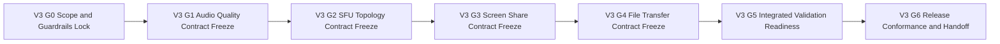

# TODO_v03.md

> Status: Planning artifact only. No implementation completion is claimed in this document.
>
> Authoritative scope source for v0.3: `aether-v3.md` (roadmap bullets under v0.3.0 "Clarity").
>
> Inputs used to derive sequencing and dependency posture: `TODO_v01.md`, `TODO_v02.md`, and `AGENTS.md`.
>
> Sequencing assumption: v0.1 and v0.2 planned outcomes are treated as assumed input dependencies in this plan.
>
> Guardrails are mandatory and inherited from repository guidance:
> - Documentation-only repository state; keep strict planned-vs-implemented separation.
> - Protocol-first priority (protocol/spec contract is the product; UI is a consumer).
> - Single binary network model with mode flags (`--mode=client|relay|bootstrap`), no special node classes.
> - Protobuf compatibility: minor evolution is additive-only.
> - Breaking protocol behavior requires major-version handling (new multistream IDs + downgrade negotiation path), and legacy protocol IDs remain supported for N+2 major versions.
> - Governance: breaking changes require AEP flow and multi-implementation validation before finalization.
> - Open decisions remain unresolved unless explicitly resolved in source docs.

---

## 1. v0.3 Objective and Measurable Success Outcomes

### 1.1 Objective
Deliver **v0.3 "Clarity"** as a protocol-first execution plan that upgrades real-time media quality and collaboration primitives over v0.1/v0.2 baselines by adding:
- Voice quality upgrades: RNNoise integration, adaptive Opus bitrate, adaptive jitter buffering, and FEC+DTX enablement.
- Dynamic voice topology expansion: peer SFU election for larger channels and relay SFU mode operation.
- Screen sharing pipeline: capture, encoder selection, quality presets, simulcast, and rich viewer controls.
- Inline file transfer up to 25MB with chunked transport and image/file inline rendering contracts.

### 1.2 Measurable Success Outcomes (planning-level verification targets)
1. Voice noise suppression contract is defined with deterministic fallback behavior and test evidence requirements.
2. Opus adaptive bitrate policy is specified with bounded ranges, transition rules, and downgrade handling.
3. Adaptive jitter buffer policy is specified with deterministic adjustment semantics and stability constraints.
4. FEC+DTX behavior is explicitly defined for normal, degraded, and silent intervals.
5. Topology selection behavior is deterministic for 2–8 (mesh baseline), 9+ (peer SFU), and relay SFU fallback paths.
6. Peer SFU election and failover are specified with threshold, tie-break, and re-election timing semantics.
7. Relay `--sfu-enabled=true` mode contract is defined without violating single-binary assumptions.
8. Screen capture and encoder selection contracts are defined for supported platform capabilities and fallbacks.
9. Quality presets and simulcast layering are defined with bounded profile envelopes and validation scenarios.
10. Screen share viewer controls (fullscreen, PiP, zoom/pan) are specified with deterministic state transitions.
11. File transfer transport contract supports chunked inline transfer up to 25MB with integrity and resumability semantics.
12. Image previews and attachment cards are defined as rendering contracts, not protocol-breaking behavior.
13. End-to-end validation, governance conformance, and release-handoff evidence are packaged for execution mode handoff.

---

## 2. Scope Derivation from `aether-v3.md` (v0.3 In-Scope Only)

The following 13 roadmap bullets define v0.3 scope and are treated as exact inclusions:

1. RNNoise integration via C FFI for noise cancellation
2. Opus adaptive bitrate (16–128 kbps based on network)
3. Adaptive jitter buffer (20–200ms)
4. FEC + DTX enabled
5. Peer SFU election for 9+ participant voice channels
6. SFU mode in relay nodes (`--sfu-enabled=true`)
7. Screen capture: platform-native (entire screen or window selection)
8. Hardware encoder detection and selection (NVENC/QuickSync/VideoToolbox/VA-API)
9. Quality presets: Low/Standard/High/Ultra/Auto
10. Simulcast encoding (up to 3 layers)
11. Screen share viewer: fullscreen, PiP, zoom/pan
12. P2P file transfer (inline in chat, up to 25MB, chunked)
13. Image inline preview, file attachment cards

No additional capability outside these bullets is promoted into v0.3 in this plan.

---

## 3. Explicit Out-of-Scope and Anti-Scope-Creep Boundaries

To preserve roadmap integrity and prevent hidden expansion, the following are out of scope for v0.3:

### 3.1 Deferred to v0.4+
- RBAC CRUD, permission matrix expansion, moderation workflows, audit-log feature completion.
- Bot API, Discord compatibility shim, slash command system, emoji/reaction platform.
- Discovery and anti-spam platform expansion beyond prior baselines.
- Deep history/search/push relay architecture expansion.

### 3.2 Deferred to v0.6+/v0.7+/v0.8+/v0.9+/v1.0+
- Public discovery and anti-spam platform expansions (v0.6+ trajectory).
- Deep history/search/push relay feature expansions (v0.7+ trajectory).
- DTLN/DeepFilterNet2 upgrades (RNNoise remains v0.3 scope baseline).
- Cascading SFU mesh for 200+ participant architecture.
- IPFS persistent hosting and large-scale relay performance track.
- Broader polish/theme/plugin/template tracks in later roadmap bands.

### 3.3 Anti-Scope-Creep Enforcement Rules
1. Any task introducing new trust/permission semantics outside v0.3 media/file bullets is rejected or deferred.
2. Any protocol change requiring incompatible behavior must trigger governance path, not silent inclusion.
3. Any unresolved decision from source docs remains unresolved and is tracked as a decision item, not finalized design.
4. UI behavior in this plan is expressed as protocol-consumer contract only; protocol definitions remain primary.

---

## 4. Entry Prerequisites from v0.1 and v0.2 (Assumed Completed)

v0.3 execution planning assumes the following input contracts are available as dependencies:

### 4.1 Networking and runtime baseline (from v0.1)
- libp2p host, DHT, GossipSub, relay baseline, connectivity fallback posture.
- Single-binary mode behavior and relay operational baseline.
- Baseline voice pipeline (mesh up to 8) and voice session control skeleton.
- Client shell baseline sufficient for core voice/chat journeys.

### 4.2 Crypto/transport/social contracts baseline (from v0.2)
- DM/social transport contracts and notification primitives assumed available from v0.2 planning outputs.
- Presence and attention model contracts assumed available for reuse in media-file UX signaling.
- Compatibility/governance scaffolding and release-evidence discipline assumed available from prior planning artifacts.

### 4.3 Planning dependency behavior
- If any assumed prerequisite is missing during execution, dependent v0.3 tasks are blocked.
- Missing prerequisites are treated as carry-back dependencies, not silently re-scoped v0.3 work.

---

## 5. Gate Model and Flow (V3-G0 through V3-G6)

### 5.1 Gate Definitions

| Gate | Name | Entry Criteria | Exit Criteria |
|---|---|---|---|
| V3-G0 | Scope & guardrails lock | v0.3 planning initiated | Scope lock, exclusions, prerequisites, and verification framework approved |
| V3-G1 | Audio quality contract freeze | V3-G0 passed | RNNoise + ABR + jitter + FEC/DTX contracts and validation artifacts defined |
| V3-G2 | SFU topology contract freeze | V3-G1 passed | Peer SFU election + relay SFU mode behaviors defined and test-mapped |
| V3-G3 | Screen share pipeline contract freeze | V3-G2 passed | Capture, encoder selection, presets, simulcast, viewer controls fully specified |
| V3-G4 | Inline file transfer contract freeze | V3-G3 passed | Chunked 25MB transfer, inline preview/card behaviors, integrity and failure semantics defined |
| V3-G5 | Integrated validation readiness | V3-G4 passed | Cross-feature scenario pack, risk controls, and conformance checklist complete |
| V3-G6 | Release conformance & handoff | V3-G5 passed | Compatibility/governance conformance (including N+2 legacy protocol-ID support for major bumps), traceability closure, and execution handoff package approved |

### 5.2 Gate Flow Diagram

### 5.3 Gate Convergence Rule
- **Convergence point:** V3-G6 acts as the single release-conformance gate for v0.3 planning handoff.
- No phase is treated as execution-complete without traceable artifacts and acceptance evidence linked to gate exits.

---

## 6. Detailed v0.3 Execution Plan by Phase, Task, and Sub-Task

Priority legend:
- `P0` critical path
- `P1` high-value sequencing follow-through
- `P2` hardening and residual-risk reduction

Validation artifact IDs used below:
- `VA-A*` audio
- `VA-S*` SFU topology
- `VA-C*` screen capture/share
- `VA-F*` file transfer
- `VA-X*` cross-feature integration/conformance

---

## Phase 0 - Scope Lock, Constraint Controls, and Verification Framework (V3-G0)

- [ ] **[P0][Order 01] P0-T1 Freeze v0.3 scope and anti-scope boundaries**
  - **Objective:** Create a one-to-one scope contract from v0.3 roadmap bullets with explicit exclusions.
  - **Concrete actions:**
    - [ ] **P0-T1-ST1 Build v0.3 scope trace base (13 bullets → task IDs)**
      - **Objective:** Ensure zero ambiguity in what is and is not included.
      - **Concrete actions:** Map every roadmap bullet to one or more tasks and planned validation artifacts.
      - **Dependencies/prerequisites:** v0.3 roadmap extraction complete.
      - **Deliverables/artifacts:** Scope trace base table (initial version).
      - **Acceptance criteria:** All 13 bullets mapped; no orphan scope item; no extra item outside bullets.
      - **Suggested priority/order:** P0, Order 01.1.
      - **Risks/notes:** Incomplete mapping causes hidden scope holes.
    - [ ] **P0-T1-ST2 Lock explicit out-of-scope and escalation policy**
      - **Objective:** Prevent v0.4+ and v0.8+ leakage into v0.3 workstreams.
      - **Concrete actions:** Document exclusion list and escalation trigger for newly proposed items.
      - **Dependencies/prerequisites:** P0-T1-ST1.
      - **Deliverables/artifacts:** Out-of-scope policy and change-escalation checklist.
      - **Acceptance criteria:** All phase leads reference exclusion policy before gate submissions.
      - **Suggested priority/order:** P0, Order 01.2.
      - **Risks/notes:** Media pipeline efforts commonly attract adjacent feature creep.
  - **Dependencies/prerequisites:** None.
  - **Deliverables/artifacts:** Approved v0.3 scope contract.
  - **Acceptance criteria:** V3-G0 scope baseline accepted and versioned.
  - **Suggested priority/order:** P0, Order 01.
  - **Risks/notes:** Scope drift at this stage invalidates downstream planning quality.

- [ ] **[P0][Order 02] P0-T2 Lock compatibility and governance controls for v0.3 protocol-touching work**
  - **Objective:** Embed protobuf and multistream governance controls into every protocol-affecting task.
  - **Concrete actions:**
    - [ ] **P0-T2-ST1 Define additive-only protobuf review checklist for v0.3 deltas**
      - **Objective:** Prevent non-backward-compatible schema drift.
      - **Concrete actions:** Document forbidden operations, field reservation policy, and reviewer checkpoints.
      - **Dependencies/prerequisites:** P0-T1.
      - **Deliverables/artifacts:** Protobuf compatibility checklist v0.3.
      - **Acceptance criteria:** Checklist referenced in all schema-affecting tasks.
      - **Suggested priority/order:** P0, Order 02.1.
      - **Risks/notes:** Late schema conflicts can block integration gates.
    - [ ] **P0-T2-ST2 Define major-change governance trigger and downgrade negotiation evidence**
      - **Objective:** Handle unavoidable breaking behavior through formal governance path.
      - **Concrete actions:** Define trigger conditions, required AEP evidence, negotiation test artifacts, and legacy protocol-ID support window requirements (N+2 major versions).
      - **Dependencies/prerequisites:** P0-T2-ST1.
      - **Deliverables/artifacts:** Major-change governance trigger matrix.
      - **Acceptance criteria:** Any breaking proposal includes explicit new multistream path plan, downgrade negotiation evidence, and documented legacy protocol-ID support for N+2 major versions.
      - **Suggested priority/order:** P0, Order 02.2.
      - **Risks/notes:** Silent breaking changes undermine multi-client interoperability.
  - **Dependencies/prerequisites:** P0-T1.
  - **Deliverables/artifacts:** v0.3 compatibility/governance control pack.
  - **Acceptance criteria:** Gate templates include compatibility and governance checkboxes.
  - **Suggested priority/order:** P0, Order 02.
  - **Risks/notes:** Controls must be active before any technical contract freeze.

- [ ] **[P0][Order 03] P0-T3 Establish validation evidence schema and gate-ready artifact model**
  - **Objective:** Standardize completion evidence for deterministic gate decisions.
  - **Concrete actions:**
    - [ ] **P0-T3-ST1 Define requirement-to-validation matrix template for v0.3**
      - **Objective:** Ensure each scope bullet has positive, negative, and fallback verification paths.
      - **Concrete actions:** Build matrix columns for requirement, task IDs, artifacts, and gate ownership.
      - **Dependencies/prerequisites:** P0-T1.
      - **Deliverables/artifacts:** Validation matrix template.
      - **Acceptance criteria:** Template supports all 13 scope bullets and all 7 gates.
      - **Suggested priority/order:** P0, Order 03.1.
      - **Risks/notes:** Weak matrix design reduces auditability at V3-G6.
    - [ ] **P0-T3-ST2 Define evidence bundle schema per gate**
      - **Objective:** Avoid ad hoc evidence formats during late-stage conformance.
      - **Concrete actions:** Specify mandatory evidence fields (trace logs, scenario IDs, failure handling).
      - **Dependencies/prerequisites:** P0-T3-ST1.
      - **Deliverables/artifacts:** Gate evidence schema specification.
      - **Acceptance criteria:** Every gate has a required artifact list with owner role.
      - **Suggested priority/order:** P1, Order 03.2.
      - **Risks/notes:** Inconsistent evidence format delays go/no-go decisions.
  - **Dependencies/prerequisites:** P0-T1, P0-T2.
  - **Deliverables/artifacts:** v0.3 validation/evidence baseline.
  - **Acceptance criteria:** V3-G0 exits only with approved evidence schema.
  - **Suggested priority/order:** P0, Order 03.
  - **Risks/notes:** Missing early verification structure creates expensive rework.

---

## Phase 1 - Audio Quality Upgrade Contracts (RNNoise, ABR, Jitter, FEC+DTX) (V3-G1)

- [ ] **[P0][Order 04] P1-T1 Define RNNoise integration contract via C FFI**
  - **Objective:** Specify deterministic noise-cancellation behavior aligned with low-latency voice constraints.
  - **Concrete actions:**
    - [ ] **P1-T1-ST1 Define RNNoise insertion point and frame lifecycle contract**
      - **Objective:** Place RNNoise in pipeline without destabilizing encode/decode timing.
      - **Concrete actions:** Specify pre-encode processing stage, frame sizing assumptions, and bypass conditions.
      - **Dependencies/prerequisites:** v0.1 voice baseline, P0-T2.
      - **Deliverables/artifacts:** RNNoise pipeline insertion specification.
      - **Acceptance criteria:** Processing order and failure/bypass semantics are deterministic.
      - **Suggested priority/order:** P0, Order 04.1.
      - **Risks/notes:** Incorrect placement can increase latency or degrade quality.
    - [ ] **P1-T1-ST2 Define FFI boundary, safety controls, and fallback behavior**
      - **Objective:** Bound runtime risk at C interface and preserve service continuity.
      - **Concrete actions:** Define ABI assumptions, memory safety checks, and graceful disable path.
      - **Dependencies/prerequisites:** P1-T1-ST1.
      - **Deliverables/artifacts:** RNNoise FFI safety and fallback contract.
      - **Acceptance criteria:** FFI failure path preserves call continuity with explicit telemetry signals.
      - **Suggested priority/order:** P0, Order 04.2.
      - **Risks/notes:** FFI instability can impact client reliability.
  - **Dependencies/prerequisites:** P0-T2, P0-T3.
  - **Deliverables/artifacts:** RNNoise contract pack (`VA-A1`, `VA-A2`).
  - **Acceptance criteria:** RNNoise behavior fully specified for normal/degraded/fallback operation.
  - **Suggested priority/order:** P0, Order 04.
  - **Risks/notes:** Keep future DTLN migration as unresolved forward path, not v0.3 commitment.

- [ ] **[P0][Order 05] P1-T2 Define Opus adaptive bitrate policy (16–128 kbps)**
  - **Objective:** Encode deterministic bitrate adaptation for changing network conditions.
  - **Concrete actions:**
    - [ ] **P1-T2-ST1 Define ABR control loop inputs and transition bands**
      - **Objective:** Ensure adaptation is stable, explainable, and testable.
      - **Concrete actions:** Specify measured inputs (loss, RTT/jitter proxies, congestion signals), hysteresis, and rate-change cadence.
      - **Dependencies/prerequisites:** P1-T1.
      - **Deliverables/artifacts:** ABR control-loop specification.
      - **Acceptance criteria:** Transition rules avoid oscillation under threshold-crossing conditions.
      - **Suggested priority/order:** P0, Order 05.1.
      - **Risks/notes:** Flapping can reduce intelligibility and user trust.
    - [ ] **P1-T2-ST2 Define floor/ceiling behavior and compatibility signaling**
      - **Objective:** Preserve predictable behavior on constrained peers and mixed capabilities.
      - **Concrete actions:** Define min/max handling, profile negotiation hooks, and fallback behavior.
      - **Dependencies/prerequisites:** P1-T2-ST1, P0-T2.
      - **Deliverables/artifacts:** ABR compatibility and fallback policy.
      - **Acceptance criteria:** 16–128 kbps envelope enforcement is deterministic with downgrade semantics.
      - **Suggested priority/order:** P0, Order 05.2.
      - **Risks/notes:** Envelope violations can create interop regressions.
  - **Dependencies/prerequisites:** P1-T1, P0-T2.
  - **Deliverables/artifacts:** ABR policy package (`VA-A3`).
  - **Acceptance criteria:** ABR behavior mapped to positive/negative path validation scenarios.
  - **Suggested priority/order:** P0, Order 05.
  - **Risks/notes:** Must remain consistent with topology transitions defined in Phase 2.

- [ ] **[P0][Order 06] P1-T3 Define adaptive jitter buffer contract (20–200ms)**
  - **Objective:** Stabilize playout while bounding latency under variable network jitter.
  - **Concrete actions:**
    - [ ] **P1-T3-ST1 Define jitter target adaptation semantics and guardrails**
      - **Objective:** Provide explicit grow/shrink behavior and floor/ceiling controls.
      - **Concrete actions:** Define initial target, expansion rules, contraction rules, and anti-thrash constraints.
      - **Dependencies/prerequisites:** P1-T2.
      - **Deliverables/artifacts:** Jitter adaptation specification.
      - **Acceptance criteria:** Buffer remains within 20–200ms bounds across scenario classes.
      - **Suggested priority/order:** P0, Order 06.1.
      - **Risks/notes:** Aggressive shrink can increase underruns; aggressive growth can exceed latency targets.
    - [ ] **P1-T3-ST2 Define jitter-related telemetry and failure diagnostics contract**
      - **Objective:** Ensure observable behavior for tuning and gate validation.
      - **Concrete actions:** Define required metrics/events and validation thresholds for stutter/latency regressions.
      - **Dependencies/prerequisites:** P1-T3-ST1.
      - **Deliverables/artifacts:** Jitter observability and diagnostics contract.
      - **Acceptance criteria:** Validation artifacts can detect and classify over-buffer and under-buffer failure modes.
      - **Suggested priority/order:** P1, Order 06.2.
      - **Risks/notes:** Low observability impairs root-cause analysis.
  - **Dependencies/prerequisites:** P1-T2, P0-T3.
  - **Deliverables/artifacts:** Adaptive jitter contract (`VA-A4`).
  - **Acceptance criteria:** Jitter behavior is deterministic and integrates with ABR/FEC assumptions.
  - **Suggested priority/order:** P0, Order 06.
  - **Risks/notes:** Must align with mouth-to-ear latency goals stated in source architecture.

- [ ] **[P0][Order 07] P1-T4 Define FEC + DTX enablement and interaction policy**
  - **Objective:** Improve resilience and bandwidth efficiency without destabilizing session quality.
  - **Concrete actions:**
    - [ ] **P1-T4-ST1 Define FEC activation and packet-loss recovery assumptions**
      - **Objective:** Establish when FEC is active and how recovery behavior is validated.
      - **Concrete actions:** Specify FEC toggling policy, expected overhead envelope, and loss scenario validation.
      - **Dependencies/prerequisites:** P1-T2, P1-T3.
      - **Deliverables/artifacts:** FEC behavior specification.
      - **Acceptance criteria:** Recovery and overhead expectations are explicit and test-mapped.
      - **Suggested priority/order:** P0, Order 07.1.
      - **Risks/notes:** Misconfigured FEC may waste bandwidth without quality gains.
    - [ ] **P1-T4-ST2 Define DTX silence behavior and talk-spurt transition semantics**
      - **Objective:** Ensure silence suppression does not clip speech onset or create artifacts.
      - **Concrete actions:** Define silence detection assumptions, wake-up behavior, and compatibility with RNNoise.
      - **Dependencies/prerequisites:** P1-T1, P1-T4-ST1.
      - **Deliverables/artifacts:** DTX transition policy.
      - **Acceptance criteria:** DTX behavior includes deterministic rules for silence and rapid reactivation.
      - **Suggested priority/order:** P0, Order 07.2.
      - **Risks/notes:** Poor DTX transitions can harm perceived responsiveness.
  - **Dependencies/prerequisites:** P1-T1, P1-T2, P1-T3.
  - **Deliverables/artifacts:** FEC+DTX contract (`VA-A5`).
  - **Acceptance criteria:** V3-G1 exits only with complete audio-quality contract and validation matrix.
  - **Suggested priority/order:** P0, Order 07.
  - **Risks/notes:** Coupling between ABR/jitter/FEC/DTX requires integrated scenario testing.

---

## Phase 2 - SFU Topology and Relay SFU Mode Contracts (V3-G2)

- [ ] **[P0][Order 08] P2-T1 Define topology-selection contract for voice channels**
  - **Objective:** Formalize deterministic topology switching behavior based on participant count and network conditions.
  - **Concrete actions:**
    - [ ] **P2-T1-ST1 Define topology thresholds and transition triggers**
      - **Objective:** Remove ambiguity between mesh baseline and SFU modes.
      - **Concrete actions:** Specify threshold behavior for 2–8 and 9+ participants and trigger hysteresis.
      - **Dependencies/prerequisites:** Phase 1 outputs.
      - **Deliverables/artifacts:** Topology threshold specification.
      - **Acceptance criteria:** Transition rules include join/leave and degradation-trigger behavior.
      - **Suggested priority/order:** P0, Order 08.1.
      - **Risks/notes:** Thrashing between topologies can destabilize sessions.
    - [ ] **P2-T1-ST2 Define topology negotiation signaling and downgrade semantics**
      - **Objective:** Preserve interoperability among mixed-capability peers.
      - **Concrete actions:** Specify signaling fields, capability checks, and fallback order.
      - **Dependencies/prerequisites:** P2-T1-ST1, P0-T2.
      - **Deliverables/artifacts:** Topology negotiation contract.
      - **Acceptance criteria:** Mixed-capability scenarios have deterministic selected topology.
      - **Suggested priority/order:** P0, Order 08.2.
      - **Risks/notes:** Ambiguous fallback may split channel state.
  - **Dependencies/prerequisites:** P1-T2, P1-T3, P1-T4.
  - **Deliverables/artifacts:** Voice topology selection contract (`VA-S1`).
  - **Acceptance criteria:** Mesh→SFU transition and fallback policies are fully test-defined.
  - **Suggested priority/order:** P0, Order 08.
  - **Risks/notes:** Must remain consistent with no-special-nodes architecture.

- [ ] **[P0][Order 09] P2-T2 Define peer SFU election, health scoring, and failover behavior (9+ participants)**
  - **Objective:** Specify robust election and failover behavior for peer-hosted SFU mode.
  - **Concrete actions:**
    - [ ] **P2-T2-ST1 Define election scoring model, quorum, and tie-break rules**
      - **Objective:** Make SFU selection deterministic and resistant to unstable peer metrics.
      - **Concrete actions:** Define score inputs, weighting, quorum threshold, and deterministic tie-break sequence.
      - **Dependencies/prerequisites:** P2-T1.
      - **Deliverables/artifacts:** Peer SFU election specification.
      - **Acceptance criteria:** Re-running election under same inputs yields same winner.
      - **Suggested priority/order:** P0, Order 09.1.
      - **Risks/notes:** Non-deterministic election can partition media routing.
    - [ ] **P2-T2-ST2 Define heartbeat, failure detection, and re-election timeline**
      - **Objective:** Bound disruption when elected SFU degrades or disconnects.
      - **Concrete actions:** Specify health probes, timeout thresholds, re-election cooldowns, and transition safety.
      - **Dependencies/prerequisites:** P2-T2-ST1.
      - **Deliverables/artifacts:** Peer SFU failover contract.
      - **Acceptance criteria:** Failure and re-election produce predictable service continuity behavior.
      - **Suggested priority/order:** P0, Order 09.2.
      - **Risks/notes:** Over-sensitive failover leads to election churn.
  - **Dependencies/prerequisites:** P2-T1, P0-T3.
  - **Deliverables/artifacts:** Peer SFU election/failover pack (`VA-S2`, `VA-S3`).
  - **Acceptance criteria:** Election and failover scenarios included in gate scenario matrix.
  - **Suggested priority/order:** P0, Order 09.
  - **Risks/notes:** Must preserve E2EE forwarding assumptions and keying boundaries.

- [ ] **[P0][Order 10] P2-T3 Define relay SFU mode contract (`--sfu-enabled=true`)**
  - **Objective:** Specify relay node SFU behavior without introducing separate node classes.
  - **Concrete actions:**
    - [ ] **P2-T3-ST1 Define relay SFU enablement semantics and room/resource policy**
      - **Objective:** Make SFU mode a flag-governed extension of existing relay mode.
      - **Concrete actions:** Define configuration envelope, room caps, participant caps, and load rejection semantics.
      - **Dependencies/prerequisites:** P2-T1.
      - **Deliverables/artifacts:** Relay SFU mode operational contract.
      - **Acceptance criteria:** Mode behavior is explicit and consistent with single-binary assumptions.
      - **Suggested priority/order:** P0, Order 10.1.
      - **Risks/notes:** Hidden special-node semantics violate architecture assumptions.
    - [ ] **P2-T3-ST2 Define relay SFU security/privacy boundaries and observability limits**
      - **Objective:** Maintain media confidentiality and operational supportability.
      - **Concrete actions:** Specify encrypted forwarding assumptions, metadata boundaries, and metric redaction rules.
      - **Dependencies/prerequisites:** P2-T3-ST1.
      - **Deliverables/artifacts:** Relay SFU privacy/observability policy.
      - **Acceptance criteria:** Policy avoids content inspection assumptions and defines minimal metadata exposure.
      - **Suggested priority/order:** P0, Order 10.2.
      - **Risks/notes:** Observability overreach can conflict with privacy posture.
  - **Dependencies/prerequisites:** P2-T1, P0-T2.
  - **Deliverables/artifacts:** Relay SFU contract (`VA-S4`).
  - **Acceptance criteria:** Relay SFU mode fully traceable to scope bullet and gate criteria.
  - **Suggested priority/order:** P0, Order 10.
  - **Risks/notes:** Resource governance is critical for production reliability.

- [ ] **[P1][Order 11] P2-T4 Define SFU path quality validation and fallback playbooks**
  - **Objective:** Provide deterministic fallback behavior from peer SFU to relay SFU where required.
  - **Concrete actions:**
    - [ ] **P2-T4-ST1 Define quality degradation triggers and fallback decision tree**
      - **Objective:** Standardize when topology fallback is invoked.
      - **Concrete actions:** Define trigger thresholds for jitter/loss/participant churn and fallback ordering.
      - **Dependencies/prerequisites:** P2-T2, P2-T3.
      - **Deliverables/artifacts:** SFU fallback decision-tree contract.
      - **Acceptance criteria:** Decision tree is deterministic and test-scenario ready.
      - **Suggested priority/order:** P1, Order 11.1.
      - **Risks/notes:** Incomplete trigger policy causes inconsistent user experience.
    - [ ] **P2-T4-ST2 Define SFU quality scenario set and conformance evidence requirements**
      - **Objective:** Ensure SFU behavior is gate-verifiable and auditable.
      - **Concrete actions:** Define stress scenarios, expected outcomes, and evidence capture schema.
      - **Dependencies/prerequisites:** P2-T4-ST1, P0-T3.
      - **Deliverables/artifacts:** SFU quality validation pack.
      - **Acceptance criteria:** Includes stable-path, degraded-path, and failover-path scenarios.
      - **Suggested priority/order:** P1, Order 11.2.
      - **Risks/notes:** Narrow scenario coverage hides instability risks.
  - **Dependencies/prerequisites:** P2-T2, P2-T3.
  - **Deliverables/artifacts:** SFU validation playbook (`VA-S5`).
  - **Acceptance criteria:** V3-G2 exit package includes fallback and conformance evidence definitions.
  - **Suggested priority/order:** P1, Order 11.
  - **Risks/notes:** Quality playbooks become input to integrated validation in Phase 5.

---

## Phase 3 - Screen Sharing Pipeline Contracts (V3-G3)

- [ ] **[P0][Order 12] P3-T1 Define platform-native screen capture contract**
  - **Objective:** Standardize capture behavior for entire-screen and window selection modes.
  - **Concrete actions:**
    - [ ] **P3-T1-ST1 Define capture source taxonomy and selection lifecycle**
      - **Objective:** Ensure deterministic source listing, selection, and switch behavior.
      - **Concrete actions:** Specify source identifiers, selection events, and source-loss handling.
      - **Dependencies/prerequisites:** P2-T1.
      - **Deliverables/artifacts:** Screen capture source contract.
      - **Acceptance criteria:** Selection and reselection states are deterministic and failure-safe.
      - **Suggested priority/order:** P0, Order 12.1.
      - **Risks/notes:** Platform variability may produce inconsistent source identities.
    - [ ] **P3-T1-ST2 Define permission/consent and privacy-safe error signaling behavior**
      - **Objective:** Ensure denied/withdrawn capture permissions behave predictably.
      - **Concrete actions:** Define permission-denied, revoked-permission, and inaccessible-window semantics.
      - **Dependencies/prerequisites:** P3-T1-ST1.
      - **Deliverables/artifacts:** Capture permission/error policy.
      - **Acceptance criteria:** Permission failure states map to deterministic user-visible outcomes.
      - **Suggested priority/order:** P0, Order 12.2.
      - **Risks/notes:** Permission edge cases are a major source of support burden.
  - **Dependencies/prerequisites:** P0-T2, P0-T3.
  - **Deliverables/artifacts:** Screen capture baseline contract (`VA-C1`).
  - **Acceptance criteria:** Capture behavior fully specified for happy/denied/revoked paths.
  - **Suggested priority/order:** P0, Order 12.
  - **Risks/notes:** Contract must remain platform-agnostic while allowing platform-specific adapters.

- [ ] **[P0][Order 13] P3-T2 Define hardware encoder detection and selection policy**
  - **Objective:** Standardize encoder preference and fallback order across supported hardware paths.
  - **Concrete actions:**
    - [ ] **P3-T2-ST1 Define encoder capability probing and ranking model**
      - **Objective:** Ensure deterministic encoder selection from detected capabilities.
      - **Concrete actions:** Specify probe outputs, capability flags, and ranking/tie-break rules.
      - **Dependencies/prerequisites:** P3-T1.
      - **Deliverables/artifacts:** Encoder detection/ranking specification.
      - **Acceptance criteria:** Same capability set yields same selected encoder path.
      - **Suggested priority/order:** P0, Order 13.1.
      - **Risks/notes:** Inconsistent ranking causes cross-platform quality drift.
    - [ ] **P3-T2-ST2 Define software fallback and overload-protection behavior**
      - **Objective:** Preserve stream continuity when hardware paths are unavailable or unstable.
      - **Concrete actions:** Define fallback codecs, CPU guardrails, and quality degradation policy.
      - **Dependencies/prerequisites:** P3-T2-ST1.
      - **Deliverables/artifacts:** Encoder fallback and overload policy.
      - **Acceptance criteria:** Failure/fallback transitions are deterministic and bounded.
      - **Suggested priority/order:** P0, Order 13.2.
      - **Risks/notes:** Overload behavior may degrade host system responsiveness.
  - **Dependencies/prerequisites:** P3-T1, P0-T2.
  - **Deliverables/artifacts:** Encoder selection contract (`VA-C2`).
  - **Acceptance criteria:** Hardware and software encoder paths are test-defined and comparable.
  - **Suggested priority/order:** P0, Order 13.
  - **Risks/notes:** Keep codec decisions aligned with unresolved future codec strategy where unspecified.

- [ ] **[P0][Order 14] P3-T3 Define quality preset envelopes (Low/Standard/High/Ultra/Auto)**
  - **Objective:** Convert quality labels into deterministic profile envelopes and adaptation behavior.
  - **Concrete actions:**
    - [ ] **P3-T3-ST1 Define static preset envelopes (resolution/FPS/bitrate/codec hints)**
      - **Objective:** Ensure each preset has explicit minimum/target/maximum profile bounds.
      - **Concrete actions:** Specify parameter envelopes and fallback substitutions under constraints.
      - **Dependencies/prerequisites:** P3-T2.
      - **Deliverables/artifacts:** Preset profile specification.
      - **Acceptance criteria:** All five presets have complete bounded envelopes and fallback mapping.
      - **Suggested priority/order:** P0, Order 14.1.
      - **Risks/notes:** Unbounded presets can produce unpredictable bandwidth spikes.
    - [ ] **P3-T3-ST2 Define Auto mode adaptation policy and stability constraints**
      - **Objective:** Provide deterministic auto-adjust behavior under changing conditions.
      - **Concrete actions:** Define adaptation triggers, cool-down windows, and anti-oscillation controls.
      - **Dependencies/prerequisites:** P3-T3-ST1.
      - **Deliverables/artifacts:** Auto mode policy contract.
      - **Acceptance criteria:** Auto mode behavior is explainable, bounded, and scenario-testable.
      - **Suggested priority/order:** P0, Order 14.2.
      - **Risks/notes:** Oscillatory auto behavior can reduce viewer comprehension.
  - **Dependencies/prerequisites:** P3-T2, P0-T3.
  - **Deliverables/artifacts:** Preset and auto adaptation pack (`VA-C3`).
  - **Acceptance criteria:** Quality preset semantics are deterministic and compatible with simulcast rules.
  - **Suggested priority/order:** P0, Order 14.
  - **Risks/notes:** Preset policy must not imply future large-scale cascaded SFU commitments.

- [ ] **[P0][Order 15] P3-T4 Define simulcast encoding contract (up to 3 layers)**
  - **Objective:** Specify layer generation and per-viewer layer selection semantics.
  - **Concrete actions:**
    - [ ] **P3-T4-ST1 Define layer profile schema and sender-side constraints**
      - **Objective:** Standardize up to three-layer encoding behavior.
      - **Concrete actions:** Define layer IDs, profile bounds, and sender capability constraints.
      - **Dependencies/prerequisites:** P3-T3.
      - **Deliverables/artifacts:** Simulcast layer profile contract.
      - **Acceptance criteria:** Layer profiles are bounded, deterministic, and negotiation-ready.
      - **Suggested priority/order:** P0, Order 15.1.
      - **Risks/notes:** Excessive layering may overwhelm weak hardware.
    - [ ] **P3-T4-ST2 Define SFU/receiver layer selection and fallback semantics**
      - **Objective:** Ensure viewers receive the highest sustainable layer without instability.
      - **Concrete actions:** Define selection logic, downgrade/upgrade triggers, and rebuffer thresholds.
      - **Dependencies/prerequisites:** P3-T4-ST1, P2-T1.
      - **Deliverables/artifacts:** Simulcast selection/fallback policy.
      - **Acceptance criteria:** Layer switching behavior is deterministic and test-covered.
      - **Suggested priority/order:** P0, Order 15.2.
      - **Risks/notes:** Frequent switching can degrade readability of shared content.
  - **Dependencies/prerequisites:** P3-T3, P2-T1, P2-T3.
  - **Deliverables/artifacts:** Simulcast contract (`VA-C4`).
  - **Acceptance criteria:** Simulcast semantics validated for both peer SFU and relay SFU contexts.
  - **Suggested priority/order:** P0, Order 15.
  - **Risks/notes:** Ensure no implicit transcoding assumptions are introduced.

- [ ] **[P1][Order 16] P3-T5 Define screen share viewer control contract (fullscreen, PiP, zoom/pan)**
  - **Objective:** Specify viewer-state transitions and interaction rules for readability and usability.
  - **Concrete actions:**
    - [ ] **P3-T5-ST1 Define viewer mode state machine (embedded/fullscreen/PiP)**
      - **Objective:** Ensure deterministic transitions between display contexts.
      - **Concrete actions:** Define legal transitions, interruption handling, and restore behavior.
      - **Dependencies/prerequisites:** P3-T1.
      - **Deliverables/artifacts:** Viewer mode state-machine specification.
      - **Acceptance criteria:** No undefined transition paths across mode changes.
      - **Suggested priority/order:** P1, Order 16.1.
      - **Risks/notes:** Platform PiP limitations may vary; unresolved differences must remain explicit.
    - [ ] **P3-T5-ST2 Define zoom/pan interaction semantics and reset behavior**
      - **Objective:** Preserve visual context and predictable navigation for high-resolution shares.
      - **Concrete actions:** Define zoom bounds, pan inertia/limits, and one-action reset semantics.
      - **Dependencies/prerequisites:** P3-T5-ST1.
      - **Deliverables/artifacts:** Zoom/pan interaction contract.
      - **Acceptance criteria:** Interaction semantics are deterministic and tested against edge bounds.
      - **Suggested priority/order:** P1, Order 16.2.
      - **Risks/notes:** Unclear interaction rules can reduce accessibility and supportability.
  - **Dependencies/prerequisites:** P3-T1, P3-T4.
  - **Deliverables/artifacts:** Viewer controls contract (`VA-C5`).
  - **Acceptance criteria:** V3-G3 exits only with capture→encode→simulcast→viewer behavior end-to-end specified.
  - **Suggested priority/order:** P1, Order 16.
  - **Risks/notes:** Viewer contract must remain decoupled from future theme/polish tracks.

---

## Phase 4 - Inline File Transfer and Attachment Rendering Contracts (V3-G4)

- [ ] **[P0][Order 17] P4-T1 Define inline file transfer transport contract (up to 25MB, chunked)**
  - **Objective:** Specify bounded, resumable, integrity-aware file transfer behavior for inline chat flows.
  - **Concrete actions:**
    - [ ] **P4-T1-ST1 Define file transfer session model and chunking schema**
      - **Objective:** Ensure deterministic segmentation, ordering, and flow control.
      - **Concrete actions:** Define session IDs, chunk size policy, sequence fields, and metadata envelope.
      - **Dependencies/prerequisites:** v0.1/v0.2 transport baselines, P0-T2.
      - **Deliverables/artifacts:** File transfer session/chunking specification.
      - **Acceptance criteria:** Transfer model supports deterministic reconstruction and bounded resource usage.
      - **Suggested priority/order:** P0, Order 17.1.
      - **Risks/notes:** Poor chunk strategy can amplify retransmission overhead.
    - [ ] **P4-T1-ST2 Define size-limit enforcement and rejection semantics**
      - **Objective:** Enforce 25MB ceiling consistently across sender/receiver paths.
      - **Concrete actions:** Specify preflight checks, rejection reason codes, and UI-surface signals.
      - **Dependencies/prerequisites:** P4-T1-ST1.
      - **Deliverables/artifacts:** Size-limit enforcement contract.
      - **Acceptance criteria:** >25MB payloads always rejected with deterministic behavior.
      - **Suggested priority/order:** P0, Order 17.2.
      - **Risks/notes:** Silent truncation is unacceptable and must be explicitly forbidden.
  - **Dependencies/prerequisites:** P0-T2, P0-T3.
  - **Deliverables/artifacts:** File transport core contract (`VA-F1`).
  - **Acceptance criteria:** Transport contract includes send, receive, reject, cancel, and timeout behaviors.
  - **Suggested priority/order:** P0, Order 17.
  - **Risks/notes:** Must align with peer and relay path assumptions from prior phases.

- [ ] **[P0][Order 18] P4-T2 Define integrity, retry, and resumability semantics for chunked transfer**
  - **Objective:** Guarantee correctness under loss, interruption, and duplicate chunk conditions.
  - **Concrete actions:**
    - [ ] **P4-T2-ST1 Define chunk integrity verification and final-assembly validation**
      - **Objective:** Detect corruption early and prevent invalid file assembly.
      - **Concrete actions:** Specify per-chunk checks, final digest validation, and failure recovery behavior.
      - **Dependencies/prerequisites:** P4-T1.
      - **Deliverables/artifacts:** Integrity verification policy.
      - **Acceptance criteria:** Corrupt chunk and corrupt final assembly paths have deterministic failure outcomes.
      - **Suggested priority/order:** P0, Order 18.1.
      - **Risks/notes:** Weak integrity semantics can leak corrupted content into chat history.
    - [ ] **P4-T2-ST2 Define retry windows, dedupe, and resumable transfer checkpoints**
      - **Objective:** Maintain progress under unstable links without duplicate reconstruction.
      - **Concrete actions:** Define retry backoff, chunk dedupe keys, and resume token/checkpoint behavior.
      - **Dependencies/prerequisites:** P4-T2-ST1.
      - **Deliverables/artifacts:** Retry/resume contract.
      - **Acceptance criteria:** Interrupted transfers can resume deterministically without duplication.
      - **Suggested priority/order:** P0, Order 18.2.
      - **Risks/notes:** Resume token misuse can create security or consistency issues.
  - **Dependencies/prerequisites:** P4-T1, P0-T3.
  - **Deliverables/artifacts:** Integrity and reliability pack (`VA-F2`, `VA-F3`).
  - **Acceptance criteria:** Reliability semantics fully test-mapped for positive and negative scenarios.
  - **Suggested priority/order:** P0, Order 18.
  - **Risks/notes:** Retry policy must avoid abusive retransmission loops.

- [ ] **[P1][Order 19] P4-T3 Define inline image preview and file attachment card rendering contract**
  - **Objective:** Specify deterministic chat rendering behavior for transferred files.
  - **Concrete actions:**
    - [ ] **P4-T3-ST1 Define image preview eligibility, sizing, and fallback display rules**
      - **Objective:** Keep preview behavior safe, bounded, and predictable.
      - **Concrete actions:** Define supported preview types, max dimensions, and fallback rendering behavior.
      - **Dependencies/prerequisites:** P4-T1.
      - **Deliverables/artifacts:** Inline image preview policy.
      - **Acceptance criteria:** Preview/fallback decision is deterministic for every file metadata class.
      - **Suggested priority/order:** P1, Order 19.1.
      - **Risks/notes:** Unbounded preview rendering may cause memory pressure.
    - [ ] **P4-T3-ST2 Define attachment card metadata schema and interaction semantics**
      - **Objective:** Standardize attachment cards across platforms and clients.
      - **Concrete actions:** Define required metadata fields, progress/error states, and action affordances.
      - **Dependencies/prerequisites:** P4-T3-ST1.
      - **Deliverables/artifacts:** Attachment card UI contract.
      - **Acceptance criteria:** Card states are complete for pending, complete, failed, canceled, and rejected states.
      - **Suggested priority/order:** P1, Order 19.2.
      - **Risks/notes:** Missing error-state contracts create inconsistent client behavior.
  - **Dependencies/prerequisites:** P4-T1, P4-T2.
  - **Deliverables/artifacts:** Inline rendering contract (`VA-F4`).
  - **Acceptance criteria:** Rendering behavior maps cleanly to transfer state machine.
  - **Suggested priority/order:** P1, Order 19.
  - **Risks/notes:** Rendering contract is consumer behavior; protocol remains source of truth.

- [ ] **[P1][Order 20] P4-T4 Define abuse controls and resource guardrails for file transfer**
  - **Objective:** Prevent v0.3 file transfer from introducing unbounded resource or abuse vectors.
  - **Concrete actions:**
    - [ ] **P4-T4-ST1 Define concurrency limits and backpressure semantics**
      - **Objective:** Bound active transfer pressure per peer/session.
      - **Concrete actions:** Specify per-peer concurrency caps, queue behavior, and throttling outcomes.
      - **Dependencies/prerequisites:** P4-T1, P4-T2.
      - **Deliverables/artifacts:** Transfer concurrency/backpressure policy.
      - **Acceptance criteria:** Resource guardrails are explicit and testable under load.
      - **Suggested priority/order:** P1, Order 20.1.
      - **Risks/notes:** Missing guardrails can degrade chat responsiveness.
    - [ ] **P4-T4-ST2 Define policy hooks for future moderation tracks without importing v0.4 scope**
      - **Objective:** Keep forward compatibility without implementing moderation systems now.
      - **Concrete actions:** Define extension points and unresolved placeholders only.
      - **Dependencies/prerequisites:** P4-T4-ST1.
      - **Deliverables/artifacts:** Forward-compatibility hooks note.
      - **Acceptance criteria:** No RBAC/moderation implementation introduced in v0.3 scope.
      - **Suggested priority/order:** P2, Order 20.2.
      - **Risks/notes:** Boundary drift into v0.4 is a persistent risk.
  - **Dependencies/prerequisites:** P4-T1, P4-T2.
  - **Deliverables/artifacts:** File-transfer guardrail policy (`VA-F5`).
  - **Acceptance criteria:** V3-G4 exits with bounded transfer semantics and anti-abuse controls defined.
  - **Suggested priority/order:** P1, Order 20.
  - **Risks/notes:** Guardrails are critical for production operability.

---

## Phase 5 - Integrated Validation, Conformance, and Release Handoff (V3-G5 → V3-G6)

- [ ] **[P0][Order 21] P5-T1 Build integrated cross-feature scenario validation pack**
  - **Objective:** Verify coherence across audio, SFU, screen share, and file-transfer contracts.
  - **Concrete actions:**
    - [ ] **P5-T1-ST1 Define end-to-end scenario suite across all 13 scope items**
      - **Objective:** Ensure every scope item appears in at least one realistic scenario.
      - **Concrete actions:** Build scenario catalog covering normal, degraded, and recovery flows.
      - **Dependencies/prerequisites:** Completion of Phases 1–4 contracts.
      - **Deliverables/artifacts:** v0.3 integrated scenario specification.
      - **Acceptance criteria:** One-to-many mapping from scope items to scenario IDs is complete.
      - **Suggested priority/order:** P0, Order 21.1.
      - **Risks/notes:** Narrow scenarios hide cross-feature regressions.
    - [ ] **P5-T1-ST2 Define adversarial/failure scenarios and expected recovery behaviors**
      - **Objective:** Ensure graceful degradation under realistic failures.
      - **Concrete actions:** Include SFU churn, permission revocation, encoder fallback, and transfer interruption cases.
      - **Dependencies/prerequisites:** P5-T1-ST1.
      - **Deliverables/artifacts:** Failure-recovery scenario annex.
      - **Acceptance criteria:** Every major failure mode has deterministic expected outcomes.
      - **Suggested priority/order:** P0, Order 21.2.
      - **Risks/notes:** Recovery behavior is commonly under-specified.
  - **Dependencies/prerequisites:** P3-T5, P4-T4.
  - **Deliverables/artifacts:** Integrated scenario pack (`VA-X1`).
  - **Acceptance criteria:** V3-G5 requires complete scenario coverage and evidence schema alignment.
  - **Suggested priority/order:** P0, Order 21.
  - **Risks/notes:** This task drives release confidence.

- [ ] **[P0][Order 22] P5-T2 Run compatibility, governance, and unresolved-decision conformance review**
  - **Objective:** Verify all planned contracts comply with guardrails before handoff.
  - **Concrete actions:**
    - [ ] **P5-T2-ST1 Audit schema/protocol deltas against additive and major-change rules**
      - **Objective:** Ensure protocol versioning discipline is preserved.
      - **Concrete actions:** Execute compatibility checklist against all affected contract artifacts, including explicit verification that any major bump retains legacy protocol-ID support for N+2 major versions.
      - **Dependencies/prerequisites:** P1-T1 through P4-T4.
      - **Deliverables/artifacts:** Compatibility conformance report.
      - **Acceptance criteria:** Any breaking delta is either absent or accompanied by formal governance pathway with explicit N+2 legacy protocol-ID support evidence.
      - **Suggested priority/order:** P0, Order 22.1.
      - **Risks/notes:** Late compatibility failures can block release handoff.
    - [ ] **P5-T2-ST2 Validate unresolved decision handling discipline**
      - **Objective:** Confirm unresolved items are not represented as settled outcomes.
      - **Concrete actions:** Review contracts/docs for wording that overstates finality; record open decisions explicitly.
      - **Dependencies/prerequisites:** P5-T2-ST1.
      - **Deliverables/artifacts:** Open-decision conformance record.
      - **Acceptance criteria:** All unresolved decisions remain marked open with owner and revisit gate.
      - **Suggested priority/order:** P0, Order 22.2.
      - **Risks/notes:** Language drift can mislead implementation teams.
  - **Dependencies/prerequisites:** P5-T1.
  - **Deliverables/artifacts:** Governance conformance package (`VA-X2`).
  - **Acceptance criteria:** V3-G5 cannot progress to V3-G6 without this package.
  - **Suggested priority/order:** P0, Order 22.
  - **Risks/notes:** Protects long-term interoperability and governance integrity.

- [ ] **[P1][Order 23] P5-T3 Finalize release-conformance gate package and execution handoff dossier**
  - **Objective:** Prepare a complete v0.3 handoff package for execution orchestration.
  - **Concrete actions:**
    - [ ] **P5-T3-ST1 Assemble gate checklist with pass/fail and evidence links**
      - **Objective:** Create one authoritative go/no-go artifact for V3-G6.
      - **Concrete actions:** Compile task acceptance results, residual risks, and unresolved decisions.
      - **Dependencies/prerequisites:** P5-T1, P5-T2.
      - **Deliverables/artifacts:** V3-G6 release-conformance checklist.
      - **Acceptance criteria:** Every scope bullet has explicit pass/fail + artifact references.
      - **Suggested priority/order:** P1, Order 23.1.
      - **Risks/notes:** Missing links reduce auditability and execution trust.
    - [ ] **P5-T3-ST2 Build execution handoff backlog and deferral register**
      - **Objective:** Prevent hidden carry-over by capturing unresolved/deferred work explicitly.
      - **Concrete actions:** Document deferred items, rationale, and target roadmap bands.
      - **Dependencies/prerequisites:** P5-T3-ST1.
      - **Deliverables/artifacts:** v0.3 execution handoff dossier.
      - **Acceptance criteria:** Deferred items map to explicit future scope bands (v0.4+, v0.6+, v0.7+, v0.8+, v0.9+, v1.0+).
      - **Suggested priority/order:** P1, Order 23.2.
      - **Risks/notes:** Untracked residuals become hidden execution debt.
  - **Dependencies/prerequisites:** P5-T1, P5-T2.
  - **Deliverables/artifacts:** Final release-conformance and handoff package (`VA-X3`).
  - **Acceptance criteria:** V3-G6 exit criteria satisfied with full traceability closure.
  - **Suggested priority/order:** P1, Order 23.
  - **Risks/notes:** Maintain strict planning-only language throughout package.

---

## 7. Practical Ordered Work Queue (Execution Planning Sequence)

### Wave A - Scope/governance foundation (V3-G0)
1. P0-T1
2. P0-T2
3. P0-T3

### Wave B - Audio contract freeze (V3-G1)
4. P1-T1
5. P1-T2
6. P1-T3
7. P1-T4

### Wave C - SFU topology and relay SFU contract (V3-G2)
8. P2-T1
9. P2-T2
10. P2-T3
11. P2-T4

### Wave D - Screen sharing contract freeze (V3-G3)
12. P3-T1
13. P3-T2
14. P3-T3
15. P3-T4
16. P3-T5

### Wave E - File transfer contract freeze (V3-G4)
17. P4-T1
18. P4-T2
19. P4-T3
20. P4-T4

### Wave F - Integrated validation and handoff (V3-G5 → V3-G6)
21. P5-T1
22. P5-T2
23. P5-T3

---

## 8. Cross-Cutting Risk Register (with Mitigations and Gate Ownership)

| Risk ID | Risk Description | Severity | Affected Scope | Mitigation Plan | Gate Owner |
|---|---|---|---|---|---|
| R-01 | Audio quality regressions from RNNoise + ABR + jitter interactions | High | 1–4 | Integrated audio scenario matrix; explicit fallback behavior; tuning guardrails | V3-G1 owner |
| R-02 | ABR oscillation under unstable links | High | 2 | Hysteresis/cooldown policy; threshold validation scenarios | V3-G1 owner |
| R-03 | Jitter buffer overgrowth causing latency violations | High | 3 | Hard floor/ceiling enforcement and anti-thrash constraints | V3-G1 owner |
| R-04 | Peer SFU election churn due to unstable metrics | High | 5 | Deterministic tie-breaks, health windows, re-election cooldown | V3-G2 owner |
| R-05 | Relay SFU mode interpreted as special node class | Medium | 6 | Explicit single-binary flag semantics; architecture conformance review | V3-G2 owner |
| R-06 | Screen capture permission edge cases create non-deterministic behavior | High | 7 | Permission-denied/revoked policy and failure-state contracts | V3-G3 owner |
| R-07 | Encoder fallback instability on low-power systems | Medium | 8 | Deterministic fallback ladder and overload protection policy | V3-G3 owner |
| R-08 | Simulcast layer switching instability impacts readability | Medium | 10 | Layer-switch hysteresis and bounded transitions | V3-G3 owner |
| R-09 | File chunk corruption/retry loops degrade reliability | High | 12 | Per-chunk and final integrity checks + bounded retry policy | V3-G4 owner |
| R-10 | Hidden scope creep into RBAC/moderation/discovery tracks | High | All | Enforced exclusion checklist at each gate submission | V3-G0/V3-G6 owners |
| R-11 | Compatibility violations in schema/protocol changes | High | All protocol-touching tasks | Additive-only checklist + major-change trigger governance path | V3-G5 owner |
| R-12 | Open decisions accidentally documented as resolved | Medium | All | Open-decision conformance audit before V3-G6 | V3-G5 owner |

---

## 9. Traceability Mapping (v0.3 Scope Items → Tasks → Validation Artifacts)

| Scope Item ID | v0.3 Scope Bullet | Primary Tasks | Validation Artifacts |
|---|---|---|---|
| S3-01 | RNNoise integration via C FFI | P1-T1 | VA-A1, VA-A2, VA-X1 |
| S3-02 | Opus adaptive bitrate (16–128 kbps) | P1-T2 | VA-A3, VA-X1 |
| S3-03 | Adaptive jitter buffer (20–200ms) | P1-T3 | VA-A4, VA-X1 |
| S3-04 | FEC + DTX enabled | P1-T4 | VA-A5, VA-X1 |
| S3-05 | Peer SFU election for 9+ voice channels | P2-T1, P2-T2 | VA-S1, VA-S2, VA-S3, VA-X1 |
| S3-06 | Relay SFU mode (`--sfu-enabled=true`) | P2-T3 | VA-S4, VA-X1 |
| S3-07 | Platform-native screen capture | P3-T1 | VA-C1, VA-X1 |
| S3-08 | Hardware encoder detection/selection | P3-T2 | VA-C2, VA-X1 |
| S3-09 | Quality presets Low/Standard/High/Ultra/Auto | P3-T3 | VA-C3, VA-X1 |
| S3-10 | Simulcast up to 3 layers | P3-T4 | VA-C4, VA-X1 |
| S3-11 | Screen share viewer controls | P3-T5 | VA-C5, VA-X1 |
| S3-12 | Inline P2P file transfer up to 25MB chunked | P4-T1, P4-T2 | VA-F1, VA-F2, VA-F3, VA-X1 |
| S3-13 | Image preview + file attachment cards | P4-T3 | VA-F4, VA-X1 |

Traceability closure rule:
- Every scope item must map to at least one task and one validation artifact before V3-G6.
- Any unmapped item blocks release-conformance gate exit.

---

## 10. Open Decisions Register (Must Remain Explicitly Unresolved)

All decisions in this register remain intentionally unresolved unless authoritative source docs explicitly resolve them.

| Decision ID | Decision statement | Status | Owner role | Revisit gate | Trigger condition | Notes |
|---|---|---|---|---|---|---|
| OD-01 | Whether and when to introduce post-RNNoise noise-cancellation upgrades beyond v0.3. | Open | Audio/Protocol Lead | V3-G6 | New evidence that RNNoise baseline cannot satisfy v0.3 quality/fallback targets under documented constraints. | Treat as forward-roadmap input only; no v0.3 scope expansion. |
| OD-02 | Exact long-term codec preference evolution under cross-platform hardware constraints. | Open | Media Architecture Lead | V3-G6 | Cross-platform capability/quality data indicates material mismatch with current codec assumptions. | Do not encode as finalized codec roadmap in v0.3 artifacts. |
| OD-03 | Future scaling strategy beyond v0.3 SFU boundaries (e.g., cascading mesh details). | Open | Networking/Topology Lead | V3-G6 | Capacity planning evidence shows need for topology beyond current 9+ peer SFU + relay SFU contract. | Keep single-binary invariant; defer architecture expansion to later roadmap bands. |
| OD-04 | Moderation and anti-abuse feature expansion for file/media flows beyond v0.3 guardrails. | Open | Governance & Safety Lead | V3-G6 | Risk/compliance review identifies controls not representable in current v0.3 scope. | Track as deferred governance work; avoid implying implemented moderation systems. |

Handling rule:
- Open decisions must remain in `Open` status, include owner role + revisit gate, and must not be represented as settled architecture in v0.3 artifacts.

---

## 11. Release-Readiness Checklist for Execution Handoff (V3-G6)

v0.3 planning is execution-ready only when all items below are satisfied:

### 11.1 Scope and boundary integrity
- [ ] All 13 v0.3 roadmap bullets mapped to tasks and artifacts.
- [ ] Out-of-scope boundaries documented and referenced in gate templates.
- [ ] No v0.4+/v0.8+/v0.9+/v1.0 scope imported into v0.3 tasks.

### 11.2 Dependency and sequencing integrity
- [ ] v0.1/v0.2 carry-over prerequisites explicitly linked to dependent tasks.
- [ ] Task ordering is dependency-coherent across all phases.
- [ ] Gate criteria are testable and evidence-backed.

### 11.3 Protocol/governance conformance
- [ ] Additive-only protobuf evolution checklist applied where relevant.
- [ ] Any potential breaking change has governance trigger documentation.
- [ ] Multistream major-version and downgrade negotiation constraints preserved.
- [ ] For any major protocol bump, legacy protocol IDs are retained for N+2 major versions with explicit evidence.
- [ ] AEP and multi-implementation validation requirements referenced for breaking paths.

### 11.4 Validation and risk closure
- [ ] Cross-feature scenario suite covers normal, degraded, and recovery paths.
- [ ] Risk register has owner, mitigation, and gate mapping for all high-severity risks.
- [ ] Residual risks are explicitly accepted or deferred with rationale.

### 11.5 Documentation quality and handoff completeness
- [ ] Planned-vs-implemented distinction remains explicit throughout all sections.
- [ ] Open decisions are marked unresolved and tracked for revisit.
- [ ] Release-conformance checklist is complete with pass/fail status and evidence links.
- [ ] Execution handoff dossier and deferral register prepared for orchestration tracking.

---

## 12. Definition of Done for v0.3 Planning Artifact

This planning artifact is complete when:
1. It captures all mandatory v0.3 scope bullets and no unauthorized scope expansion.
2. It provides phase/task/sub-task depth with objective, actions, dependencies, deliverables, acceptance, order, and risks.
3. It enforces protocol-first compatibility and governance constraints in task design.
4. It includes gate model V3-G0 through V3-G6 with explicit convergence at release-conformance.
5. It includes risk register, traceability mapping, and release-readiness checklist suitable for execution handoff.
6. It remains a planning-only document and does not claim implementation completion.
