# TODO_v04.md

> Status: Planning artifact only. No implementation completion is claimed in this document.
>
> Authoritative v0.4 scope source: `aether-v3.md` roadmap bullets under **v0.4.0 — Dominion**.
>
> Inputs used for sequencing, dependency posture, and closure patterns: `TODO_v01.md`, `TODO_v02.md`, `TODO_v03.md`, and `AGENTS.md`.
>
> Guardrails that are mandatory throughout this plan:
> - Repository is documentation-only in this snapshot; maintain strict planned-vs-implemented separation.
> - Protocol-first priority is non-negotiable: protocol/spec contract is the product; UI is a consumer.
> - Network model invariant: single binary with mode flags `--mode=client|relay|bootstrap`; no privileged node classes.
> - Compatibility invariant: protobuf minor evolution is additive-only.
> - Breaking protocol behavior requires major-path governance: new multistream IDs, downgrade negotiation evidence, AEP path, and multi-implementation validation.
> - Open decisions remain unresolved unless source documents explicitly resolve them.

---

## 1. v0.4 Objective and Measurable Success Outcomes

### 1.1 Objective
Deliver **v0.4 Dominion** as a protocol-first execution plan that adds deterministic authorization, server governance, and moderation controls over v0.1–v0.3 baselines by defining:
- Permission bitmask semantics with server-level defaults and channel overrides.
- Role lifecycle management and property contracts.
- Channel categorization and canonical channel-type behavior for text, voice, announcement, and stage.
- Moderation action semantics and enforcement behavior.
- Signed and authorized auditability for governance actions.
- Invite lifecycle controls and server visibility policy states.

### 1.2 Measurable Success Outcomes
1. Permission bitmask model is fully specified with deterministic precedence and override resolution rules.
2. Role CRUD lifecycle is specified with deterministic create/edit/delete/reorder behavior and conflict handling.
3. Role properties are bounded, validated, and propagation-defined for name, color, icon, permissions, hoisted, and mentionable.
4. Channel category and collapse semantics are defined without violating protocol-first boundaries.
5. Channel type contracts for text, voice, announcement, and stage are explicit, testable, and permission-integrated.
6. Moderation actions kick, ban, timeout/mute, delete message, and slow mode are defined with deterministic preconditions, outcomes, and failure codes.
7. Audit log contract defines signed entries and role-authorized visibility with explicit coverage requirements.
8. Invite system `aether://join/<id>/<code>` is specified with max-use, expiry, and deterministic rejection behavior.
9. Server visibility states public, hidden, and password-protected are specified with explicit join-policy behavior and transition rules.
10. Verification/evidence model and scope-to-task traceability are complete and gate-auditable.
11. Release-conformance and handoff package is prepared with strict planned-only wording and explicit deferrals to future roadmap bands.

---

## 2. Exact Scope Derivation from `aether-v3.md` for v0.4 Only

The following roadmap bullets in `aether-v3.md` define v0.4 scope and are treated as exact inclusions:

1. Permission bitmask system server-level plus channel overrides
2. Role CRUD create edit delete reorder
3. Role properties name color icon permissions hoisted mentionable
4. Channel categories collapsible groups
5. Channel types text voice announcement stage
6. Moderation kick ban timeout mute delete message slow mode
7. Audit log signed entries viewable by authorized roles
8. Invite system `aether://join/<id>/<code>` with max uses and expiry
9. Server visibility public hidden password-protected

No additional capability outside these nine bullets is promoted into v0.4 in this plan.

---

## 3. Explicit Out-of-Scope and Anti-Scope-Creep Boundaries

To preserve roadmap integrity, the following are out of scope for v0.4:

### 3.1 Deferred to v0.5+
- Bot API, bot SDKs, slash commands.
- Discord compatibility shim.
- Custom emoji, emoji picker, reactions, incoming webhooks.

### 3.2 Deferred to v0.6+
- Public server directory via DHT, global search, Explore tab, and server preview flows.
- Anti-spam expansion tracks including proof-of-work identity issuance and global reputation behavior.

### 3.3 Deferred to v0.7+
- Deep history and search architecture expansion.
- Push relay and archival role expansion.

### 3.4 Deferred to v0.8+ and later
- Theme and polish tracks, accessibility and i18n expansions.
- Large-scale performance tracks, IPFS hosting, and post-v1 ecosystem tracks.

### 3.5 Anti-Scope-Creep Enforcement Rules
1. Any item not directly traceable to one of the nine v0.4 bullets is rejected or formally deferred.
2. Public server visibility in v0.4 is policy-state semantics only and must not be treated as v0.6 directory/search capability.
3. Channel type additions beyond text, voice, announcement, stage are out of scope.
4. Any incompatible protocol behavior must follow major-version governance path and cannot be silently absorbed as minor evolution.
5. Open decisions remain open; wording must not imply unresolved choices are finalized.

---

## 4. Entry Prerequisites from v0.1 to v0.3 Outputs

v0.4 planning assumes prior-version contract outputs are available as dependencies.

### 4.1 v0.1 prerequisite baseline
- Identity and signed manifest baseline including join deeplink foundation.
- Channel and messaging baseline sufficient to attach permission and moderation semantics.
- Relay and client baseline under single-binary mode assumptions.
- Protocol/versioning and compatibility governance baseline already documented.

### 4.2 v0.2 prerequisite baseline
- Mention parsing/resolution and interim authorization controls exist as pre-RBAC bridge inputs.
- Notification and attention contract baseline exists for moderation/audit user-facing signals.
- Social graph and presence semantics are available as supporting contracts for role mentionability behavior.
- Prior compatibility checklists and release-evidence discipline are available for reuse.

### 4.3 v0.3 prerequisite baseline
- Channel media and relay-SFU operational contracts exist for voice-related channel-type semantics.
- File/attachment contract baseline exists to anchor delete-message moderation behavior for attachment-bearing messages.
- Forward moderation hook posture from v0.3 is treated as dependency input, not as completed v0.4 implementation evidence.

### 4.4 Dependency handling rule
- Missing prerequisites are blocking dependencies.
- Missing prerequisites are carried back to prior-version backlog and are not silently re-scoped into v0.4.

---

## 5. Gate Model and Flow for v0.4

### 5.1 Gate Definitions

| Gate | Name | Entry Criteria | Exit Criteria |
|---|---|---|---|
| V4-G0 | Scope and guardrails lock | v0.4 planning initiated | Scope lock, exclusions, prerequisites, and verification schema approved |
| V4-G1 | Permission and role contract freeze | V4-G0 passed | Permission bitmask, role CRUD, role properties, and auth-evaluation matrix fully specified |
| V4-G2 | Channel structure and type contract freeze | V4-G1 passed | Categories and channel type contracts specified and permission-integrated |
| V4-G3 | Moderation contract freeze | V4-G2 passed | Moderation actions, safeguards, and enforcement semantics specified |
| V4-G4 | Audit accountability contract freeze | V4-G3 passed | Signed audit entries, visibility authorization, and audit coverage matrix specified |
| V4-G5 | Invite and visibility contract freeze | V4-G4 passed | Invite lifecycle and visibility policy states specified with deterministic interaction rules |
| V4-G6 | Integrated validation and governance readiness | V4-G5 passed | Cross-feature scenarios, compatibility checks, open-decision discipline, and risk controls complete |
| V4-G7 | Release conformance and handoff | V4-G6 passed | Full traceability closure, evidence-linked checklist, and execution handoff dossier approved |

### 5.2 Gate Flow Diagram

```mermaid
graph LR
  G0[V4 G0 Scope and Guardrails Lock]
  G1[V4 G1 Permission and Role Contract Freeze]
  G2[V4 G2 Channel Structure Contract Freeze]
  G3[V4 G3 Moderation Contract Freeze]
  G4[V4 G4 Audit Accountability Contract Freeze]
  G5[V4 G5 Invite and Visibility Contract Freeze]
  G6[V4 G6 Integrated Validation Readiness]
  G7[V4 G7 Release Conformance and Handoff]

  G0 --> G1 --> G2 --> G3 --> G4 --> G5 --> G6 --> G7
```

### 5.3 Gate Convergence Rule
- **Single convergence point:** V4-G7 is the only release-conformance exit for v0.4 planning handoff.
- No phase is considered complete without explicit acceptance evidence linked to its gate exit criteria.

---

## 6. Detailed v0.4 Execution Plan by Phase, Task, and Sub-Task

Priority legend:
- `P0` critical path
- `P1` high-value follow-through
- `P2` hardening and residual-risk control

Validation artifact IDs used below:
- `VA-P*` permission and role contracts
- `VA-C*` channel structure and type contracts
- `VA-M*` moderation contracts
- `VA-A*` audit contracts
- `VA-I*` invite and visibility contracts
- `VA-X*` cross-feature validation and handoff

---

## Phase 0 - Scope Lock, Governance Controls, and Evidence Setup (V4-G0)

- [ ] **[P0][Order 01] P0-T1 Freeze v0.4 scope contract and anti-scope boundaries**
  - **Objective:** Create one-to-one mapping from v0.4 roadmap bullets to planned work items and exclusions.
  - **Concrete actions:**
    - [ ] **P0-T1-ST1 Build v0.4 scope trace base 9 bullets to task IDs**
      - **Objective:** Ensure zero ambiguity in v0.4 inclusion boundaries.
      - **Concrete actions:** Map each v0.4 bullet to at least one task and one validation artifact ID.
      - **Dependencies/prerequisites:** v0.4 roadmap extraction complete.
      - **Deliverables/artifacts:** Scope trace base table.
      - **Acceptance criteria:** All 9 bullets mapped; no orphan bullet; no extra capability in mapping.
      - **Suggested priority/order:** P0, Order 01.1.
      - **Risks/notes:** Incomplete mapping creates hidden scope gaps.
    - [ ] **P0-T1-ST2 Lock explicit exclusions and change-escalation policy**
      - **Objective:** Prevent v0.5+ and v0.6+ leakage into v0.4.
      - **Concrete actions:** Document exclusion list, escalation trigger, and required approval path for new proposals.
      - **Dependencies/prerequisites:** P0-T1-ST1.
      - **Deliverables/artifacts:** Out-of-scope and escalation checklist.
      - **Acceptance criteria:** Every phase lead references exclusion checklist before gate submission.
      - **Suggested priority/order:** P0, Order 01.2.
      - **Risks/notes:** Visibility/discovery boundaries are high-risk for accidental creep.
  - **Dependencies/prerequisites:** None.
  - **Deliverables/artifacts:** Approved v0.4 scope contract.
  - **Acceptance criteria:** V4-G0 scope baseline versioned and approved.
  - **Suggested priority/order:** P0, Order 01.
  - **Risks/notes:** Scope drift here invalidates downstream sequencing.

- [ ] **[P0][Order 02] P0-T2 Lock compatibility and governance controls for v0.4 protocol-touching deltas**
  - **Objective:** Embed compatibility and governance invariants before contract freeze work begins.
  - **Concrete actions:**
    - [ ] **P0-T2-ST1 Define additive-only protobuf checklist for RBAC and moderation schema deltas**
      - **Objective:** Prevent destructive schema evolution.
      - **Concrete actions:** Define prohibited operations and reviewer checkpoints for every schema change.
      - **Dependencies/prerequisites:** P0-T1.
      - **Deliverables/artifacts:** v0.4 protobuf compatibility checklist.
      - **Acceptance criteria:** Checklist forbids field-number reuse and non-additive minor changes.
      - **Suggested priority/order:** P0, Order 02.1.
      - **Risks/notes:** Late incompatibilities can block release conformance.
    - [ ] **P0-T2-ST2 Define major-change trigger matrix and downgrade evidence requirements**
      - **Objective:** Ensure breaking behavior follows formal governance path.
      - **Concrete actions:** Define trigger conditions, required new multistream ID plan, downgrade negotiation evidence, AEP linkage, and multi-implementation validation requirements.
      - **Dependencies/prerequisites:** P0-T2-ST1.
      - **Deliverables/artifacts:** Major-change governance trigger matrix.
      - **Acceptance criteria:** Any breaking proposal must include explicit governance package before approval.
      - **Suggested priority/order:** P0, Order 02.2.
      - **Risks/notes:** Silent breaking changes undermine interoperability.
  - **Dependencies/prerequisites:** P0-T1.
  - **Deliverables/artifacts:** v0.4 compatibility and governance control pack.
  - **Acceptance criteria:** All protocol-touching tasks reference this control pack.
  - **Suggested priority/order:** P0, Order 02.
  - **Risks/notes:** Controls must exist before task-level protocol contracts.

- [ ] **[P0][Order 03] P0-T3 Establish v0.4 verification matrix and gate evidence schema**
  - **Objective:** Standardize completion evidence so gate decisions are deterministic.
  - **Concrete actions:**
    - [ ] **P0-T3-ST1 Define requirement-to-validation matrix template for v0.4**
      - **Objective:** Ensure each scope item has positive, negative, and recovery validation paths.
      - **Concrete actions:** Build matrix fields for requirement ID, task IDs, artifact IDs, gate ownership, and evidence status.
      - **Dependencies/prerequisites:** P0-T1.
      - **Deliverables/artifacts:** v0.4 validation matrix template.
      - **Acceptance criteria:** Template supports all 9 scope bullets and all v0.4 gates.
      - **Suggested priority/order:** P0, Order 03.1.
      - **Risks/notes:** Weak matrix structure reduces auditability.
    - [ ] **P0-T3-ST2 Define gate evidence bundle schema and review checklist**
      - **Objective:** Eliminate ad hoc proof formats at gate review time.
      - **Concrete actions:** Define mandatory evidence fields, trace link rules, and pass-fail declaration format.
      - **Dependencies/prerequisites:** P0-T3-ST1.
      - **Deliverables/artifacts:** Gate evidence schema specification.
      - **Acceptance criteria:** Every gate has a mandatory evidence bundle template.
      - **Suggested priority/order:** P1, Order 03.2.
      - **Risks/notes:** Inconsistent bundle format delays gate closure.
  - **Dependencies/prerequisites:** P0-T1, P0-T2.
  - **Deliverables/artifacts:** v0.4 verification and evidence baseline.
  - **Acceptance criteria:** V4-G0 exits only with approved evidence model.
  - **Suggested priority/order:** P0, Order 03.
  - **Risks/notes:** Missing early evidence model creates late-stage rework.

---

## Phase 1 - Permission and Role Contracts (V4-G1)

- [ ] **[P0][Order 04] P1-T1 Define permission bitmask system with server defaults and channel overrides**
  - **Objective:** Specify deterministic permission evaluation foundations for all governed actions.
  - **Concrete actions:**
    - [ ] **P1-T1-ST1 Define canonical permission catalog and bit allocation strategy**
      - **Objective:** Prevent overlap and ambiguity in permission semantics.
      - **Concrete actions:** Define permission namespaces, bit assignments, reserved ranges, and extension policy.
      - **Dependencies/prerequisites:** P0-T2.
      - **Deliverables/artifacts:** Permission catalog and bit allocation specification.
      - **Acceptance criteria:** Every governed action maps to one explicit permission bit or set.
      - **Suggested priority/order:** P0, Order 04.1.
      - **Risks/notes:** Ambiguous bit allocation causes long-term compatibility debt.
    - [ ] **P1-T1-ST2 Define override merge algorithm and precedence rules**
      - **Objective:** Make server-level and channel-level evaluation deterministic.
      - **Concrete actions:** Specify inheritance rules, allow-deny-inherit semantics, conflict tie-breaks, and fallback behavior.
      - **Dependencies/prerequisites:** P1-T1-ST1.
      - **Deliverables/artifacts:** Permission precedence and override algorithm contract.
      - **Acceptance criteria:** Same inputs always produce same authorization outcome.
      - **Suggested priority/order:** P0, Order 04.2.
      - **Risks/notes:** Precedence ambiguity causes inconsistent enforcement across clients.
  - **Dependencies/prerequisites:** P0-T2, P0-T3.
  - **Deliverables/artifacts:** Permission bitmask core contract (`VA-P1`).
  - **Acceptance criteria:** Permission system behavior is complete for server-level and channel-level scopes.
  - **Suggested priority/order:** P0, Order 04.
  - **Risks/notes:** This task is a hard dependency for moderation and audit authorization semantics.

- [ ] **[P0][Order 05] P1-T2 Define role CRUD lifecycle and deterministic reorder semantics**
  - **Objective:** Specify role entity lifecycle and ordering behavior without ambiguity.
  - **Concrete actions:**
    - [ ] **P1-T2-ST1 Define role create edit delete constraints and protection rules**
      - **Objective:** Prevent invalid or unsafe role lifecycle transitions.
      - **Concrete actions:** Define required fields, uniqueness constraints, delete restrictions, and immutable/system role handling rules.
      - **Dependencies/prerequisites:** P1-T1.
      - **Deliverables/artifacts:** Role lifecycle state and constraint specification.
      - **Acceptance criteria:** All CRUD transitions have deterministic preconditions and outcomes.
      - **Suggested priority/order:** P0, Order 05.1.
      - **Risks/notes:** Weak delete protections can create orphaned permissions.
    - [ ] **P1-T2-ST2 Define reorder conflict handling and versioned update semantics**
      - **Objective:** Ensure consistent role hierarchy under concurrent edits.
      - **Concrete actions:** Specify reorder operation model, conflict resolution, and deterministic tie-break strategy.
      - **Dependencies/prerequisites:** P1-T2-ST1.
      - **Deliverables/artifacts:** Role ordering and conflict-resolution contract.
      - **Acceptance criteria:** Concurrent reorder attempts converge deterministically.
      - **Suggested priority/order:** P0, Order 05.2.
      - **Risks/notes:** Role-order races can break moderation authorization correctness.
  - **Dependencies/prerequisites:** P1-T1.
  - **Deliverables/artifacts:** Role CRUD and ordering contract (`VA-P2`).
  - **Acceptance criteria:** CRUD and reorder semantics are independently implementable and test-defined.
  - **Suggested priority/order:** P0, Order 05.
  - **Risks/notes:** Role hierarchy is foundational for moderation authority checks.

- [ ] **[P0][Order 06] P1-T3 Define role properties contract and propagation behavior**
  - **Objective:** Lock deterministic semantics for role property fields and visibility behavior.
  - **Concrete actions:**
    - [ ] **P1-T3-ST1 Define role property schema bounds and validation**
      - **Objective:** Prevent unbounded or invalid role property payloads.
      - **Concrete actions:** Define field constraints for name, color, icon, permissions, hoisted, mentionable including validation and normalization rules.
      - **Dependencies/prerequisites:** P1-T2.
      - **Deliverables/artifacts:** Role property schema and validation policy.
      - **Acceptance criteria:** Every role property has deterministic valid and invalid cases.
      - **Suggested priority/order:** P0, Order 06.1.
      - **Risks/notes:** Insufficient constraints can create interoperability drift.
    - [ ] **P1-T3-ST2 Define property-change propagation and stale-state handling**
      - **Objective:** Ensure role updates converge predictably across peers.
      - **Concrete actions:** Specify event semantics, ordering expectations, and stale-cache replacement behavior.
      - **Dependencies/prerequisites:** P1-T3-ST1.
      - **Deliverables/artifacts:** Role property propagation contract.
      - **Acceptance criteria:** Property updates produce deterministic resulting role view across clients.
      - **Suggested priority/order:** P1, Order 06.2.
      - **Risks/notes:** Divergent role views can cause authorization mismatch.
  - **Dependencies/prerequisites:** P1-T1, P1-T2.
  - **Deliverables/artifacts:** Role properties contract (`VA-P3`).
  - **Acceptance criteria:** Role property model is complete and linked to permission evaluation.
  - **Suggested priority/order:** P0, Order 06.
  - **Risks/notes:** Mentionable and hoisted behaviors must not import non-v0.4 UI scope.

- [ ] **[P0][Order 07] P1-T4 Define authorization evaluation matrix and denial semantics**
  - **Objective:** Translate role and permission contracts into deterministic allow-deny outcomes.
  - **Concrete actions:**
    - [ ] **P1-T4-ST1 Build action-to-permission matrix for governed operations**
      - **Objective:** Ensure every moderated or governed operation references explicit permission checks.
      - **Concrete actions:** Map channel management, moderation actions, audit visibility, invite management, and visibility-state changes to permission bits.
      - **Dependencies/prerequisites:** P1-T1, P1-T2, P1-T3.
      - **Deliverables/artifacts:** Authorization action matrix.
      - **Acceptance criteria:** No governed action lacks explicit permission mapping.
      - **Suggested priority/order:** P0, Order 07.1.
      - **Risks/notes:** Unmapped actions can become privilege-escalation paths.
    - [ ] **P1-T4-ST2 Define denial reason taxonomy and deterministic error codes**
      - **Objective:** Ensure authorization failures are machine-readable and testable.
      - **Concrete actions:** Define denial reason codes and required contextual metadata for auditability.
      - **Dependencies/prerequisites:** P1-T4-ST1.
      - **Deliverables/artifacts:** Authorization denial contract.
      - **Acceptance criteria:** Equivalent denied requests return consistent reason codes.
      - **Suggested priority/order:** P0, Order 07.2.
      - **Risks/notes:** Inconsistent errors reduce debuggability and policy trust.
  - **Dependencies/prerequisites:** P1-T1, P1-T2, P1-T3.
  - **Deliverables/artifacts:** Authorization matrix and denial contract (`VA-P4`).
  - **Acceptance criteria:** V4-G1 exits only when permission and role contracts are fully integrated and test-mapped.
  - **Suggested priority/order:** P0, Order 07.
  - **Risks/notes:** Must align with compatibility controls established in Phase 0.

---

## Phase 2 - Channel Categories and Channel Type Contracts (V4-G2)

- [ ] **[P0][Order 08] P2-T1 Define channel category model and collapsible-group behavior**
  - **Objective:** Specify deterministic category hierarchy and collapse behavior.
  - **Concrete actions:**
    - [ ] **P2-T1-ST1 Define category domain model and parent-child constraints**
      - **Objective:** Prevent malformed category/channel topology.
      - **Concrete actions:** Define category identifiers, ordering semantics, and channel assignment constraints.
      - **Dependencies/prerequisites:** P1-T4.
      - **Deliverables/artifacts:** Category topology contract.
      - **Acceptance criteria:** Category structure rules are explicit and conflict-free.
      - **Suggested priority/order:** P0, Order 08.1.
      - **Risks/notes:** Ambiguous hierarchy semantics complicate permission inheritance.
    - [ ] **P2-T1-ST2 Define collapsible behavior state model and deterministic transitions**
      - **Objective:** Ensure collapse-expand behavior is predictable and bounded.
      - **Concrete actions:** Define collapse state transitions, default behavior, and recovery for missing state updates.
      - **Dependencies/prerequisites:** P2-T1-ST1.
      - **Deliverables/artifacts:** Category collapse-state contract.
      - **Acceptance criteria:** Collapse and expand transitions are deterministic across reconnection and refresh scenarios.
      - **Suggested priority/order:** P1, Order 08.2.
      - **Risks/notes:** State divergence can create inconsistent navigation behavior.
  - **Dependencies/prerequisites:** P1-T4.
  - **Deliverables/artifacts:** Channel category contract (`VA-C1`).
  - **Acceptance criteria:** Category and collapse semantics are fully specified and test-defined.
  - **Suggested priority/order:** P0, Order 08.
  - **Risks/notes:** Category behavior must remain within v0.4 scope and avoid thread/forum expansion.

- [ ] **[P0][Order 09] P2-T2 Define canonical contracts for channel types text voice announcement stage**
  - **Objective:** Provide unambiguous type semantics for v0.4-governed channels.
  - **Concrete actions:**
    - [ ] **P2-T2-ST1 Define per-type capability surface and invariant fields**
      - **Objective:** Prevent type ambiguity at protocol contract level.
      - **Concrete actions:** Define required fields, allowed operations, and prohibited operations by type.
      - **Dependencies/prerequisites:** P2-T1.
      - **Deliverables/artifacts:** Channel type capability contract.
      - **Acceptance criteria:** Each type has deterministic operation boundaries and validation rules.
      - **Suggested priority/order:** P0, Order 09.1.
      - **Risks/notes:** Capability overlap can cause inconsistent moderation handling.
    - [ ] **P2-T2-ST2 Define type transition and migration behavior**
      - **Objective:** Ensure deterministic behavior when channel type changes are allowed.
      - **Concrete actions:** Define legal transitions, data-preservation constraints, and failure semantics for disallowed transitions.
      - **Dependencies/prerequisites:** P2-T2-ST1.
      - **Deliverables/artifacts:** Channel type transition policy.
      - **Acceptance criteria:** Transition outcomes are deterministic for valid and invalid requests.
      - **Suggested priority/order:** P1, Order 09.2.
      - **Risks/notes:** Unclear transition behavior can corrupt channel governance expectations.
  - **Dependencies/prerequisites:** P2-T1, P1-T4.
  - **Deliverables/artifacts:** Channel type contract pack (`VA-C2`).
  - **Acceptance criteria:** All four v0.4 channel types are fully contract-defined and permission-ready.
  - **Suggested priority/order:** P0, Order 09.
  - **Risks/notes:** Must not imply future channel-type roadmap additions.

- [ ] **[P0][Order 10] P2-T3 Define channel-type permission overlays and inheritance behavior**
  - **Objective:** Integrate role-permission model with per-type channel semantics.
  - **Concrete actions:**
    - [ ] **P2-T3-ST1 Define type-specific permission applicability matrix**
      - **Objective:** Ensure each channel type applies only relevant permission checks.
      - **Concrete actions:** Build matrix mapping permission bits to channel type actions and exception handling rules.
      - **Dependencies/prerequisites:** P2-T2, P1-T4.
      - **Deliverables/artifacts:** Channel-type permission applicability matrix.
      - **Acceptance criteria:** No channel-type action has ambiguous permission requirements.
      - **Suggested priority/order:** P0, Order 10.1.
      - **Risks/notes:** Misapplied permissions can create policy bypasses.
    - [ ] **P2-T3-ST2 Define inheritance and override conflict resolution examples and tests**
      - **Objective:** Make precedence behavior auditably deterministic.
      - **Concrete actions:** Provide canonical conflict scenarios and required outcomes for evaluation engine checks.
      - **Dependencies/prerequisites:** P2-T3-ST1.
      - **Deliverables/artifacts:** Permission conflict scenario contract.
      - **Acceptance criteria:** All defined conflict scenarios converge to one deterministic result.
      - **Suggested priority/order:** P0, Order 10.2.
      - **Risks/notes:** Conflict ambiguity is a recurrent source of policy incidents.
  - **Dependencies/prerequisites:** P2-T2, P1-T4.
  - **Deliverables/artifacts:** Channel permission overlay contract (`VA-C3`).
  - **Acceptance criteria:** V4-G2 exits only with category, type, and permission-overlay coherence.
  - **Suggested priority/order:** P0, Order 10.
  - **Risks/notes:** Overlay semantics directly impact moderation correctness in Phase 3.

---

## Phase 3 - Moderation Contracts and Enforcement Semantics (V4-G3)

- [ ] **[P0][Order 11] P3-T1 Define moderation action semantics for kick ban timeout mute delete message slow mode**
  - **Objective:** Specify deterministic behavior for all in-scope moderation actions.
  - **Concrete actions:**
    - [ ] **P3-T1-ST1 Define preconditions target rules and outcome states per action**
      - **Objective:** Remove ambiguity in who can act on whom and with what effect.
      - **Concrete actions:** Define actor-target constraints, action side effects, duration semantics where applicable, and cancellation behavior where supported.
      - **Dependencies/prerequisites:** P2-T3.
      - **Deliverables/artifacts:** Moderation action semantics specification.
      - **Acceptance criteria:** Each action has explicit preconditions, success outcomes, and postconditions.
      - **Suggested priority/order:** P0, Order 11.1.
      - **Risks/notes:** Target-rule ambiguity can create moderation abuse vectors.
    - [ ] **P3-T1-ST2 Define failure taxonomy and deterministic moderation reason codes**
      - **Objective:** Standardize failure handling and observability.
      - **Concrete actions:** Define denial and failure categories such as insufficient permission, invalid target, expired context, and incompatible channel type.
      - **Dependencies/prerequisites:** P3-T1-ST1.
      - **Deliverables/artifacts:** Moderation failure code contract.
      - **Acceptance criteria:** Equivalent failed moderation attempts yield consistent reason codes.
      - **Suggested priority/order:** P0, Order 11.2.
      - **Risks/notes:** Weak failure taxonomy degrades policy explainability.
  - **Dependencies/prerequisites:** P2-T3, P1-T4.
  - **Deliverables/artifacts:** Moderation action contract (`VA-M1`).
  - **Acceptance criteria:** All v0.4 moderation actions are fully specified and test-mapped.
  - **Suggested priority/order:** P0, Order 11.
  - **Risks/notes:** This task is foundational for audit coverage and visibility controls.

- [ ] **[P0][Order 12] P3-T2 Define moderation safeguards idempotency and conflict-resolution behavior**
  - **Objective:** Ensure moderation behavior is stable under retries, races, and partial failures.
  - **Concrete actions:**
    - [ ] **P3-T2-ST1 Define idempotency semantics and duplicate-command handling**
      - **Objective:** Prevent repeated command execution side effects.
      - **Concrete actions:** Define idempotency keys, retry windows, and duplicate-action outcomes.
      - **Dependencies/prerequisites:** P3-T1.
      - **Deliverables/artifacts:** Moderation idempotency policy.
      - **Acceptance criteria:** Duplicate moderation commands resolve deterministically without state corruption.
      - **Suggested priority/order:** P0, Order 12.1.
      - **Risks/notes:** Missing idempotency can amplify operational incidents.
    - [ ] **P3-T2-ST2 Define concurrent-action conflict ordering and resolution rules**
      - **Objective:** Ensure stable outcomes when multiple moderators act on same target/context.
      - **Concrete actions:** Define operation ordering, precedence, and final-state convergence rules.
      - **Dependencies/prerequisites:** P3-T2-ST1.
      - **Deliverables/artifacts:** Moderation conflict-resolution contract.
      - **Acceptance criteria:** Concurrent conflicting actions have deterministic final states.
      - **Suggested priority/order:** P0, Order 12.2.
      - **Risks/notes:** Non-deterministic conflict handling undermines policy trust.
  - **Dependencies/prerequisites:** P3-T1.
  - **Deliverables/artifacts:** Moderation safeguard contract (`VA-M2`).
  - **Acceptance criteria:** Retry and concurrency semantics are complete and auditable.
  - **Suggested priority/order:** P0, Order 12.
  - **Risks/notes:** Safeguards must remain compatible with additive schema evolution rules.

- [ ] **[P0][Order 13] P3-T3 Define slow-mode timing semantics and enforcement boundaries**
  - **Objective:** Specify deterministic slow-mode behavior under normal and edge conditions.
  - **Concrete actions:**
    - [ ] **P3-T3-ST1 Define slow-mode interval bounds and scope by channel type**
      - **Objective:** Bound configuration and ensure predictable applicability.
      - **Concrete actions:** Define allowed interval values, minimum and maximum bounds, and unsupported-context behavior.
      - **Dependencies/prerequisites:** P2-T2, P3-T1.
      - **Deliverables/artifacts:** Slow-mode interval policy.
      - **Acceptance criteria:** Any configured slow-mode value outside bounds is rejected deterministically.
      - **Suggested priority/order:** P0, Order 13.1.
      - **Risks/notes:** Unbounded intervals can produce unusable channels.
    - [ ] **P3-T3-ST2 Define enforcement timers bypass rules and user-visible reason semantics**
      - **Objective:** Ensure clear and consistent message acceptance/rejection behavior.
      - **Concrete actions:** Define per-user timer behavior, bypass authorization conditions, and rejection reason format.
      - **Dependencies/prerequisites:** P3-T3-ST1.
      - **Deliverables/artifacts:** Slow-mode enforcement contract.
      - **Acceptance criteria:** Message acceptance under slow mode is deterministic for every actor category.
      - **Suggested priority/order:** P0, Order 13.2.
      - **Risks/notes:** Inconsistent bypass behavior can create perceived unfairness.
  - **Dependencies/prerequisites:** P2-T2, P1-T4, P3-T1.
  - **Deliverables/artifacts:** Slow-mode contract (`VA-M3`).
  - **Acceptance criteria:** Slow-mode policy is fully integrated with permission and moderation semantics.
  - **Suggested priority/order:** P0, Order 13.
  - **Risks/notes:** Must not import anti-spam platform features from v0.6.

- [ ] **[P1][Order 14] P3-T4 Define moderation state propagation and recovery semantics**
  - **Objective:** Keep moderation outcomes convergent across peer and relay conditions.
  - **Concrete actions:**
    - [ ] **P3-T4-ST1 Define moderation event propagation and ordering rules**
      - **Objective:** Ensure action outcomes are visible and ordered consistently.
      - **Concrete actions:** Define event fields, ordering metadata, and replay behavior for reconnecting peers.
      - **Dependencies/prerequisites:** P3-T2.
      - **Deliverables/artifacts:** Moderation propagation contract.
      - **Acceptance criteria:** Replayed events converge to same moderation state as uninterrupted sessions.
      - **Suggested priority/order:** P1, Order 14.1.
      - **Risks/notes:** Ordering drift can produce temporary policy violations.
    - [ ] **P3-T4-ST2 Define failure recovery and state reconciliation rules**
      - **Objective:** Prevent durable state divergence after transport interruptions.
      - **Concrete actions:** Define reconciliation triggers, source-of-truth precedence, and stale-event handling.
      - **Dependencies/prerequisites:** P3-T4-ST1.
      - **Deliverables/artifacts:** Moderation reconciliation policy.
      - **Acceptance criteria:** Recovery outcomes are deterministic for interrupted and delayed event paths.
      - **Suggested priority/order:** P1, Order 14.2.
      - **Risks/notes:** Weak reconciliation can invalidate audit trust.
  - **Dependencies/prerequisites:** P3-T2, P0-T3.
  - **Deliverables/artifacts:** Moderation convergence contract (`VA-M4`, `VA-M5`).
  - **Acceptance criteria:** V4-G3 exits only with complete moderation action, safeguard, and convergence specifications.
  - **Suggested priority/order:** P1, Order 14.
  - **Risks/notes:** This phase must preserve protocol-first behavior over UI-specific assumptions.

---

## Phase 4 - Audit Log Signed Accountability Contracts (V4-G4)

- [ ] **[P0][Order 15] P4-T1 Define signed audit entry schema and canonical verification contract**
  - **Objective:** Specify tamper-evident and deterministic audit log entry semantics.
  - **Concrete actions:**
    - [ ] **P4-T1-ST1 Define mandatory audit entry fields and canonical serialization rules**
      - **Objective:** Ensure cross-implementation signing and verification consistency.
      - **Concrete actions:** Define required fields for actor target action context timestamp reason and outcome metadata.
      - **Dependencies/prerequisites:** P3-T1.
      - **Deliverables/artifacts:** Audit entry schema and canonicalization specification.
      - **Acceptance criteria:** Entry schema supports all in-scope moderation and governance event types.
      - **Suggested priority/order:** P0, Order 15.1.
      - **Risks/notes:** Ambiguous serialization undermines signature validity.
    - [ ] **P4-T1-ST2 Define signing and verification flow including failure behavior**
      - **Objective:** Ensure deterministic integrity verification.
      - **Concrete actions:** Define signer identity assumptions, verification checks, and failure handling for invalid or missing signatures.
      - **Dependencies/prerequisites:** P4-T1-ST1.
      - **Deliverables/artifacts:** Audit signing and verification contract.
      - **Acceptance criteria:** Signature validation outcomes are deterministic and testable.
      - **Suggested priority/order:** P0, Order 15.2.
      - **Risks/notes:** Signature failure handling must be explicit to avoid silent integrity loss.
  - **Dependencies/prerequisites:** P3-T1, P0-T2.
  - **Deliverables/artifacts:** Signed audit core contract (`VA-A1`).
  - **Acceptance criteria:** Signed-entry model is complete and linked to compatibility controls.
  - **Suggested priority/order:** P0, Order 15.
  - **Risks/notes:** Audit integrity is a release-critical governance requirement.

- [ ] **[P0][Order 16] P4-T2 Define role-authorized audit visibility and query boundaries**
  - **Objective:** Ensure audit visibility adheres strictly to role-based authorization.
  - **Concrete actions:**
    - [ ] **P4-T2-ST1 Define audit-read permission gates and redaction behavior**
      - **Objective:** Prevent unauthorized data exposure in audit views.
      - **Concrete actions:** Define who can view which entries and what fields may be redacted under policy.
      - **Dependencies/prerequisites:** P1-T4, P4-T1.
      - **Deliverables/artifacts:** Audit visibility authorization policy.
      - **Acceptance criteria:** Unauthorized requests are denied deterministically with explicit reason codes.
      - **Suggested priority/order:** P0, Order 16.1.
      - **Risks/notes:** Overexposure in audit data is a high-severity governance risk.
    - [ ] **P4-T2-ST2 Define deterministic query behavior for authorized views**
      - **Objective:** Ensure stable audit retrieval and review behavior.
      - **Concrete actions:** Define ordering, pagination, and filter semantics for authorized audit readers.
      - **Dependencies/prerequisites:** P4-T2-ST1.
      - **Deliverables/artifacts:** Audit query behavior contract.
      - **Acceptance criteria:** Equivalent queries on equivalent state return stable ordered results.
      - **Suggested priority/order:** P1, Order 16.2.
      - **Risks/notes:** Non-deterministic retrieval can compromise incident review workflows.
  - **Dependencies/prerequisites:** P4-T1, P1-T4.
  - **Deliverables/artifacts:** Audit visibility and retrieval contract (`VA-A2`).
  - **Acceptance criteria:** Authorized-role visibility model is complete and test-mapped.
  - **Suggested priority/order:** P0, Order 16.
  - **Risks/notes:** Query behavior must remain within audit-scope boundaries, not full analytics scope.

- [ ] **[P1][Order 17] P4-T3 Define audit coverage matrix and missing-entry failure semantics**
  - **Objective:** Guarantee coverage completeness for governed actions.
  - **Concrete actions:**
    - [ ] **P4-T3-ST1 Build mandatory event-to-audit coverage matrix**
      - **Objective:** Ensure every v0.4 governance action produces required audit entries.
      - **Concrete actions:** Map moderation, role, permission, invite, and visibility changes to required signed audit event types.
      - **Dependencies/prerequisites:** P3-T1, P4-T1.
      - **Deliverables/artifacts:** Audit coverage matrix.
      - **Acceptance criteria:** No governed action lacks explicit audit-entry requirement.
      - **Suggested priority/order:** P1, Order 17.1.
      - **Risks/notes:** Coverage gaps undermine audit trustworthiness.
    - [ ] **P4-T3-ST2 Define behavior when audit-write prerequisites fail**
      - **Objective:** Avoid undefined outcomes under logging-integrity failures.
      - **Concrete actions:** Define deterministic handling for signing failures, storage failures, and replay/duplication conflicts.
      - **Dependencies/prerequisites:** P4-T3-ST1.
      - **Deliverables/artifacts:** Audit failure-handling contract.
      - **Acceptance criteria:** Failure outcomes are deterministic and explicitly testable.
      - **Suggested priority/order:** P1, Order 17.2.
      - **Risks/notes:** Undefined failure semantics can produce un-auditable moderation actions.
  - **Dependencies/prerequisites:** P4-T1, P4-T2.
  - **Deliverables/artifacts:** Audit completeness and failure contract (`VA-A3`, `VA-A4`).
  - **Acceptance criteria:** V4-G4 exits only with signed integrity, authorization, and coverage semantics defined.
  - **Suggested priority/order:** P1, Order 17.
  - **Risks/notes:** This phase is a direct dependency for release-conformance evidence.

---

## Phase 5 - Invite and Server Visibility Contracts (V4-G5)

- [ ] **[P0][Order 18] P5-T1 Define invite lifecycle contract for `aether://join/<id>/<code>` with max uses and expiry**
  - **Objective:** Specify deterministic invite creation validation consumption and expiry behavior.
  - **Concrete actions:**
    - [ ] **P5-T1-ST1 Define invite code schema and deeplink contract fields**
      - **Objective:** Standardize invite format and parsing behavior.
      - **Concrete actions:** Define invite token constraints, canonical deeplink fields, and parse failure handling.
      - **Dependencies/prerequisites:** v0.1 join-deeplink baseline, P1-T4.
      - **Deliverables/artifacts:** Invite schema and deeplink contract.
      - **Acceptance criteria:** Invite links parse deterministically to one canonical invite model.
      - **Suggested priority/order:** P0, Order 18.1.
      - **Risks/notes:** Ambiguous token semantics can create spoofing risk.
    - [ ] **P5-T1-ST2 Define max-use decrement and expiry evaluation semantics**
      - **Objective:** Ensure invite validity checks are deterministic under concurrency.
      - **Concrete actions:** Define consumption sequencing, concurrent redemption conflict handling, and deterministic rejection on invalid state.
      - **Dependencies/prerequisites:** P5-T1-ST1.
      - **Deliverables/artifacts:** Invite usage and expiry policy.
      - **Acceptance criteria:** Equivalent redemption scenarios yield deterministic valid or rejected outcomes.
      - **Suggested priority/order:** P0, Order 18.2.
      - **Risks/notes:** Race conditions can violate max-use guarantees.
  - **Dependencies/prerequisites:** P1-T4, P0-T3.
  - **Deliverables/artifacts:** Invite lifecycle contract (`VA-I1`, `VA-I2`).
  - **Acceptance criteria:** Invite behavior is fully specified for create, consume, expire, and reject paths.
  - **Suggested priority/order:** P0, Order 18.
  - **Risks/notes:** Must remain scoped to invite lifecycle, not broader onboarding redesign.

- [ ] **[P0][Order 19] P5-T2 Define server visibility policy states public hidden password-protected**
  - **Objective:** Specify deterministic server visibility semantics and transitions.
  - **Concrete actions:**
    - [ ] **P5-T2-ST1 Define visibility state semantics and transition rules**
      - **Objective:** Remove ambiguity across visibility-state changes.
      - **Concrete actions:** Define each state behavior, transition constraints, and required authorization for state changes.
      - **Dependencies/prerequisites:** P1-T4.
      - **Deliverables/artifacts:** Server visibility state contract.
      - **Acceptance criteria:** State transitions are deterministic and permission-guarded.
      - **Suggested priority/order:** P0, Order 19.1.
      - **Risks/notes:** Ambiguous state transitions can create accidental exposure.
    - [ ] **P5-T2-ST2 Define password-protected join contract and failure semantics**
      - **Objective:** Ensure protected joins are deterministic and policy-compliant.
      - **Concrete actions:** Define password verification behavior, retry limits, and failure reason codes.
      - **Dependencies/prerequisites:** P5-T2-ST1, P5-T1.
      - **Deliverables/artifacts:** Password-protected join policy.
      - **Acceptance criteria:** Join outcomes for correct and incorrect credentials are deterministic.
      - **Suggested priority/order:** P0, Order 19.2.
      - **Risks/notes:** Credential handling semantics must avoid metadata overexposure.
  - **Dependencies/prerequisites:** P5-T1, P1-T4.
  - **Deliverables/artifacts:** Server visibility contract (`VA-I3`).
  - **Acceptance criteria:** Visibility states are fully specified and integrated with authorization matrix.
  - **Suggested priority/order:** P0, Order 19.
  - **Risks/notes:** Public visibility in v0.4 must not be interpreted as public directory feature.

- [ ] **[P1][Order 20] P5-T3 Define visibility and invite interaction policy with anti-scope boundary controls**
  - **Objective:** Ensure invite and visibility controls interact predictably and remain within v0.4 scope.
  - **Concrete actions:**
    - [ ] **P5-T3-ST1 Build policy matrix for invite validity by visibility state**
      - **Objective:** Make join behavior deterministic across policy combinations.
      - **Concrete actions:** Define allowed and denied combinations for public hidden and password-protected states with invite attributes.
      - **Dependencies/prerequisites:** P5-T1, P5-T2.
      - **Deliverables/artifacts:** Invite-visibility interaction matrix.
      - **Acceptance criteria:** Every visibility state and invite state combination has one deterministic outcome.
      - **Suggested priority/order:** P1, Order 20.1.
      - **Risks/notes:** Missing matrix entries can create join bypasses.
    - [ ] **P5-T3-ST2 Define explicit anti-creep boundary against v0.6 directory semantics**
      - **Objective:** Prevent public-state semantics from expanding into discovery/search scope.
      - **Concrete actions:** Document non-goals and forbidden assumptions for v0.4 visibility behavior.
      - **Dependencies/prerequisites:** P5-T3-ST1.
      - **Deliverables/artifacts:** Visibility anti-scope policy note.
      - **Acceptance criteria:** No v0.6 discovery capability is implied in v0.4 invite or visibility contracts.
      - **Suggested priority/order:** P1, Order 20.2.
      - **Risks/notes:** Scope leakage risk is high due naming overlap with discovery roadmap tracks.
  - **Dependencies/prerequisites:** P5-T1, P5-T2.
  - **Deliverables/artifacts:** Invite-visibility integration contract (`VA-I4`).
  - **Acceptance criteria:** V4-G5 exits with coherent invite and visibility semantics and explicit boundary controls.
  - **Suggested priority/order:** P1, Order 20.
  - **Risks/notes:** This integration is a prerequisite for final cross-feature validation.

---

## Phase 6 - Integrated Validation, Conformance, and Release Handoff (V4-G6 to V4-G7)

- [ ] **[P0][Order 21] P6-T1 Build integrated cross-feature scenario validation pack for all v0.4 scope items**
  - **Objective:** Validate coherence across permissions, channels, moderation, audit, invites, and visibility.
  - **Concrete actions:**
    - [ ] **P6-T1-ST1 Define end-to-end scenario suite covering all 9 scope bullets**
      - **Objective:** Ensure complete coverage and deterministic expected outcomes.
      - **Concrete actions:** Build scenario catalog for normal-path interactions and multi-role governance workflows.
      - **Dependencies/prerequisites:** Completion of Phases 1 through 5 contracts.
      - **Deliverables/artifacts:** Integrated scenario specification.
      - **Acceptance criteria:** Every scope bullet appears in at least one end-to-end scenario with expected result criteria.
      - **Suggested priority/order:** P0, Order 21.1.
      - **Risks/notes:** Incomplete scenario coverage hides integration defects.
    - [ ] **P6-T1-ST2 Define adversarial and recovery scenarios with deterministic outcomes**
      - **Objective:** Validate resilience under policy conflicts and failure conditions.
      - **Concrete actions:** Include conflicting role updates, expired invites, concurrent moderation actions, audit-signature failures, and stale override caches.
      - **Dependencies/prerequisites:** P6-T1-ST1.
      - **Deliverables/artifacts:** Failure-recovery scenario annex.
      - **Acceptance criteria:** Each major failure class has explicit expected outcomes and evidence requirements.
      - **Suggested priority/order:** P0, Order 21.2.
      - **Risks/notes:** Recovery behavior is frequently under-specified without explicit scenario work.
  - **Dependencies/prerequisites:** P3-T4, P4-T3, P5-T3.
  - **Deliverables/artifacts:** Integrated validation pack (`VA-X1`).
  - **Acceptance criteria:** V4-G6 cannot proceed without complete scenario and evidence linkage.
  - **Suggested priority/order:** P0, Order 21.
  - **Risks/notes:** This phase provides release confidence baseline.

- [ ] **[P0][Order 22] P6-T2 Run compatibility governance and unresolved-decision conformance review**
  - **Objective:** Verify all planned outputs preserve architectural and governance constraints.
  - **Concrete actions:**
    - [ ] **P6-T2-ST1 Audit schema and protocol deltas for additive and major-version discipline**
      - **Objective:** Ensure compatibility policy integrity.
      - **Concrete actions:** Apply compatibility checklist to all v0.4 artifacts and verify major-change evidence where applicable including downgrade path and legacy protocol support expectations.
      - **Dependencies/prerequisites:** P1-T1 through P5-T3.
      - **Deliverables/artifacts:** Compatibility conformance report.
      - **Acceptance criteria:** No incompatible delta exists without formal governance pathway evidence.
      - **Suggested priority/order:** P0, Order 22.1.
      - **Risks/notes:** Late compatibility defects can block V4-G7 closure.
    - [ ] **P6-T2-ST2 Validate open-decision handling and anti-scope discipline**
      - **Objective:** Prevent accidental finalization of unresolved choices or roadmap leakage.
      - **Concrete actions:** Review all v0.4 artifacts for open-decision wording discipline and v0.5+ scope contamination.
      - **Dependencies/prerequisites:** P6-T2-ST1.
      - **Deliverables/artifacts:** Governance and open-decision conformance record.
      - **Acceptance criteria:** All unresolved decisions remain marked open with owner and revisit gate.
      - **Suggested priority/order:** P0, Order 22.2.
      - **Risks/notes:** Wording drift can mislead execution teams.
  - **Dependencies/prerequisites:** P6-T1.
  - **Deliverables/artifacts:** Governance conformance package (`VA-X2`).
  - **Acceptance criteria:** V4-G6 cannot advance to V4-G7 without this package.
  - **Suggested priority/order:** P0, Order 22.
  - **Risks/notes:** Protects protocol stability and governance integrity.

- [ ] **[P1][Order 23] P6-T3 Finalize release-conformance package and execution handoff dossier**
  - **Objective:** Deliver one authoritative handoff package for execution orchestration.
  - **Concrete actions:**
    - [ ] **P6-T3-ST1 Assemble V4-G7 checklist with pass fail status and evidence links**
      - **Objective:** Provide a single go-no-go source of truth.
      - **Concrete actions:** Compile scope-item status, acceptance results, residual risks, and explicit evidence references.
      - **Dependencies/prerequisites:** P6-T1, P6-T2.
      - **Deliverables/artifacts:** V4-G7 release-conformance checklist.
      - **Acceptance criteria:** Every scope item has explicit pass-fail declaration with traceable artifacts.
      - **Suggested priority/order:** P1, Order 23.1.
      - **Risks/notes:** Missing evidence links make signoff non-auditable.
    - [ ] **P6-T3-ST2 Build execution handoff backlog and explicit v0.5+ deferral register**
      - **Objective:** Prevent hidden carry-over and preserve roadmap continuity.
      - **Concrete actions:** Capture deferred work, rationale, dependency notes, and target roadmap bands.
      - **Dependencies/prerequisites:** P6-T3-ST1.
      - **Deliverables/artifacts:** v0.4 handoff dossier and deferral register.
      - **Acceptance criteria:** Deferred items map explicitly to future scope bands without implied completion.
      - **Suggested priority/order:** P1, Order 23.2.
      - **Risks/notes:** Untracked residuals become hidden technical planning debt.
  - **Dependencies/prerequisites:** P6-T1, P6-T2.
  - **Deliverables/artifacts:** Final release-conformance and handoff package (`VA-X3`).
  - **Acceptance criteria:** V4-G7 exit criteria satisfied with full traceability and planning-only wording.
  - **Suggested priority/order:** P1, Order 23.
  - **Risks/notes:** Final package quality determines execution-mode readiness.

---

## 7. Practical Ordered Work Queue for v0.4 Execution Planning

### Wave A - Scope and governance foundation V4-G0
1. P0-T1
2. P0-T2
3. P0-T3

### Wave B - Permission and role contract freeze V4-G1
4. P1-T1
5. P1-T2
6. P1-T3
7. P1-T4

### Wave C - Channel structure and type contract freeze V4-G2
8. P2-T1
9. P2-T2
10. P2-T3

### Wave D - Moderation contract freeze V4-G3
11. P3-T1
12. P3-T2
13. P3-T3
14. P3-T4

### Wave E - Audit accountability contract freeze V4-G4
15. P4-T1
16. P4-T2
17. P4-T3

### Wave F - Invite and visibility contract freeze V4-G5
18. P5-T1
19. P5-T2
20. P5-T3

### Wave G - Integrated validation and handoff V4-G6 to V4-G7
21. P6-T1
22. P6-T2
23. P6-T3

---

## 8. Verification Evidence Model and Traceability Expectations

### 8.1 Evidence model rules
1. Every task must produce at least one named artifact with an associated artifact ID.
2. Every scope item must be represented in at least one positive-path and one negative-path scenario.
3. Every gate submission must include a pass-fail decision with explicit evidence links.
4. Every compatibility-sensitive change must include checklist evidence for additive and major-change rules.
5. Every unresolved decision must remain explicitly open and linked to a revisit gate.

### 8.2 Traceability mapping v0.4 scope to tasks and artifacts

| Scope Item ID | v0.4 Scope Bullet | Primary Tasks | Validation Artifacts |
|---|---|---|---|
| S4-01 | Permission bitmask server-level plus channel overrides | P1-T1, P1-T4, P2-T3 | VA-P1, VA-P4, VA-C3, VA-X1 |
| S4-02 | Role CRUD create edit delete reorder | P1-T2 | VA-P2, VA-X1 |
| S4-03 | Role properties name color icon permissions hoisted mentionable | P1-T3 | VA-P3, VA-X1 |
| S4-04 | Channel categories collapsible groups | P2-T1 | VA-C1, VA-X1 |
| S4-05 | Channel types text voice announcement stage | P2-T2, P2-T3 | VA-C2, VA-C3, VA-X1 |
| S4-06 | Moderation actions kick ban timeout mute delete message slow mode | P3-T1, P3-T2, P3-T3, P3-T4 | VA-M1, VA-M2, VA-M3, VA-M4, VA-M5, VA-X1 |
| S4-07 | Audit log signed entries authorized visibility | P4-T1, P4-T2, P4-T3 | VA-A1, VA-A2, VA-A3, VA-A4, VA-X1 |
| S4-08 | Invite system `aether://join/<id>/<code>` max uses expiry | P5-T1, P5-T3 | VA-I1, VA-I2, VA-I4, VA-X1 |
| S4-09 | Server visibility public hidden password-protected | P5-T2, P5-T3 | VA-I3, VA-I4, VA-X1 |

### 8.3 Traceability closure rules
- Any scope item without task mapping blocks V4-G7.
- Any scope item without artifact mapping blocks V4-G7.
- Any gate checklist item without evidence link is treated as not complete.

---

## 9. Cross-Cutting Risk Register with Mitigation and Gate Ownership

| Risk ID | Risk Description | Severity | Affected Scope | Mitigation Plan | Gate Owner |
|---|---|---|---|---|---|
| R4-01 | Permission precedence ambiguity across server and channel layers | High | 1 | Canonical merge algorithm and conflict scenario catalog | V4-G1 owner |
| R4-02 | Role reorder races create inconsistent hierarchy | High | 2 | Versioned reorder operations and deterministic conflict resolution | V4-G1 owner |
| R4-03 | Role property validation gaps permit malformed policy state | Medium | 3 | Explicit bounds and validation matrix for all role properties | V4-G1 owner |
| R4-04 | Category collapse behavior diverges across clients | Medium | 4 | Deterministic collapse-state transition and recovery rules | V4-G2 owner |
| R4-05 | Channel type semantics drift across implementations | High | 5 | Type capability matrix and transition contract with negative tests | V4-G2 owner |
| R4-06 | Moderation retries and conflicts produce non-deterministic target state | High | 6 | Idempotency keys and conflict-ordering rules | V4-G3 owner |
| R4-07 | Slow-mode enforcement bypass or false rejection inconsistencies | High | 6 | Bound interval policy and deterministic timer semantics | V4-G3 owner |
| R4-08 | Audit entries missing or unsigned under failure conditions | High | 7 | Signed-entry contract plus explicit failure semantics | V4-G4 owner |
| R4-09 | Unauthorized audit visibility exposes sensitive governance data | High | 7 | Role-gated audit read policy and redaction behavior | V4-G4 owner |
| R4-10 | Invite max-use or expiry race enables policy bypass | High | 8 | Deterministic consumption sequencing and rejection semantics | V4-G5 owner |
| R4-11 | Public visibility wording drifts into v0.6 discovery semantics | High | 9 | Explicit anti-scope policy and conformance review | V4-G5 and V4-G7 owners |
| R4-12 | Compatibility and governance controls not consistently applied | High | All protocol-touching tasks | Mandatory checklist gating and major-change trigger audit | V4-G6 owner |
| R4-13 | Open decisions are documented as resolved without source authority | Medium | All | Open-decision conformance review prior to V4-G7 | V4-G6 owner |

---

## 10. Open Decisions Register for v0.4 Must Remain Explicitly Unresolved

All decisions in this register remain intentionally unresolved unless authoritative source docs explicitly resolve them.

| Decision ID | Decision statement | Status | Owner role | Revisit gate | Trigger condition | Notes |
|---|---|---|---|---|---|---|
| OD4-01 | Final tie-break strategy when multiple inherited roles and channel overrides conflict at equal precedence. | Open | Protocol and Authorization Lead | V4-G7 | Conformance review finds unresolved ambiguity in equivalent-precedence conflicts. | Keep deterministic placeholder rules explicit but unresolved if source authority is absent. |
| OD4-02 | Stage-channel moderation boundary details beyond v0.4 minimum type and permission semantics. | Open | Channel Governance Lead | V4-G7 | Validation reveals need for capabilities not covered by current v0.4 bullets. | Defer expansion and avoid importing post-v0.4 channel governance scope. |
| OD4-03 | Default audit-retention profile and compaction policy under signed-entry constraints. | Open | Security and Compliance Lead | V4-G7 | Operational evidence identifies unresolved retention tradeoffs. | Keep as unresolved governance item without implying final retention architecture. |
| OD4-04 | Exact forward interaction between v0.4 public visibility state and v0.6 directory publication semantics. | Open | Protocol and Discovery Lead | V4-G7 | Boundary review detects language overlap between visibility and discovery tracks. | v0.4 must define policy state only and keep discovery behavior deferred. |

Handling rule:
- Open decisions must remain in `Open` status, include owner role and revisit gate, and must not be represented as settled architecture in v0.4 artifacts.

---

## 11. Release-Conformance Checklist for Execution Handoff V4-G7

v0.4 planning is execution-ready only when all items below are satisfied.

### 11.1 Scope and boundary integrity
- [ ] All 9 v0.4 roadmap bullets are mapped to tasks and artifacts.
- [ ] Out-of-scope boundaries are documented and referenced in gate checklists.
- [ ] No v0.5+ or v0.6+ capabilities are imported into v0.4 tasks.

### 11.2 Dependency and sequencing integrity
- [ ] v0.1 to v0.3 prerequisite assumptions are linked to dependent tasks.
- [ ] Task ordering is dependency-coherent across all phases.
- [ ] Gate exit criteria are testable and evidence-backed.

### 11.3 Protocol compatibility and governance conformance
- [ ] Additive-only protobuf checklist applied to all schema-touching contracts.
- [ ] Any potentially breaking behavior has explicit major-version governance documentation.
- [ ] New multistream ID and downgrade negotiation requirements are preserved where applicable.
- [ ] AEP path and multi-implementation validation requirement are referenced for breaking-change paths.

### 11.4 Verification and risk closure
- [ ] Integrated scenario suite covers normal, degraded, and recovery paths.
- [ ] High-severity risks have mitigation and gate ownership assignments.
- [ ] Residual risks are explicitly accepted or deferred with rationale.

### 11.5 Documentation quality and handoff completeness
- [ ] Planned-vs-implemented separation is explicit in all sections.
- [ ] Open decisions remain unresolved and tracked with revisit gates.
- [ ] Release-conformance checklist includes pass-fail status and evidence links per scope item.
- [ ] Execution handoff dossier and deferral register are complete and roadmap-aligned.

---

## 12. Definition of Done for v0.4 Planning Artifact

This planning artifact is complete when:
1. It captures all mandatory v0.4 scope bullets and excludes unauthorized scope expansion.
2. It provides gate, phase, task, and sub-task detail with objective, actions, dependencies, deliverables, acceptance criteria, order, and risks.
3. It preserves protocol-first and single-binary architecture invariants.
4. It embeds compatibility and governance constraints for additive evolution and breaking-change pathways.
5. It includes deterministic verification evidence model and traceability closure rules.
6. It includes a final release-conformance and handoff phase suitable for execution orchestration.
7. It remains planning-only and does not claim implementation completion.
