# TODO_v05.md

> Status: Planning artifact only. No implementation completion is claimed in this document.
>
> Authoritative v0.5 scope source: `aether-v3.md` roadmap bullets under **v0.5.0 — Pulse**.
>
> Inputs used for sequencing, dependency posture, closure patterns, and constraint carry-forward: `TODO_v01.md`, `TODO_v02.md`, `TODO_v03.md`, `TODO_v04.md`, and `AGENTS.md`.
>
> Guardrails that are mandatory throughout this plan:
> - Repository snapshot is documentation-only; keep strict planned-vs-implemented separation.
> - Protocol-first priority is non-negotiable: protocol and specification contract are the product; UI and SDK ergonomics are consumers.
> - Network model invariant remains unchanged: single binary with mode flags `--mode=client|relay|bootstrap`; no privileged node classes.
> - Compatibility invariant remains mandatory: protobuf minor evolution is additive-only.
> - Breaking protocol behavior requires major-path governance evidence: new multistream IDs, downgrade negotiation, AEP process, and multi-implementation validation.
> - Open decisions remain unresolved unless source documentation explicitly resolves them.
> - v0.6+ capability is not promoted into v0.5 by implication, convenience, or integration adjacency.

---

## 1. v0.5 Objective and Measurable Success Outcomes

### 1.1 Objective
Deliver **v0.5 Pulse** as a protocol-first execution plan that adds bot extensibility and message-surface augmentation over v0.1–v0.4 baselines by defining deterministic contracts for:
- Native Bot API over gRPC with explicit event and command surfaces.
- Bot SDK track with first-class Go SDK and explicit conformance expectations for community SDKs in Python, JavaScript, and Rust.
- Slash command lifecycle with deterministic autocomplete behavior.
- Discord compatibility shim boundaries via `aether-discord-shim` for specified REST subset, Gateway event translation, pattern-coverage target, and migration constraints.
- Custom emoji lifecycle with server-owner upload and fixed quota policy.
- Emoji picker semantics and canonical `:shortcode:` parsing rules.
- Message reaction lifecycle semantics.
- Incoming webhook contract for POST-to-channel message injection.

### 1.2 Measurable Success Outcomes
1. Native Bot API service, envelope schemas, and event-command interaction semantics are fully specified and independently implementable.
2. Bot event model includes deterministic ordering, replay, and failure semantics required for robust bot behavior.
3. Bot command model includes deterministic validation, execution acknowledgment, error taxonomy, and idempotency semantics.
4. Bot authentication and authorization boundaries are defined and integrated with v0.4 permission and audit constraints.
5. Go SDK is specified as first-class with explicit interface contracts, lifecycle expectations, and version alignment policy.
6. Python, JavaScript, and Rust SDK expectations are defined as community conformance profiles with explicit minimum behavioral parity requirements.
7. Slash command model is fully specified for schema, registration lifecycle, invocation context, and permission-aware execution.
8. Slash autocomplete behavior is deterministic for request format, selection ordering, fallback behavior, and error handling.
9. Discord shim scope is contractually bounded to required REST subset and Gateway translation with explicit non-goals.
10. Discord shim coverage target is measurable and auditable against a defined corpus representing common `discord.py` and `discord.js` patterns.
11. Discord shim limitations and migration guidance are explicitly documented with native Bot API preference and fallback boundaries.
12. Custom emoji upload, storage, quota, deletion, and replacement semantics are deterministic, including fixed max 50 per server rule.
13. Emoji picker and shortcode contracts are deterministic across parse, render, failure, and fallback scenarios.
14. Reaction add/remove/toggle/count semantics are deterministic and integrated with permission and moderation constraints.
15. Incoming webhook endpoint, auth controls, idempotency, retry semantics, and channel routing behaviors are deterministic and auditable.
16. Validation artifact model and scope-to-task traceability are complete and gate-auditable.
17. Release-conformance and handoff package is complete with explicit planning-only language and explicit deferrals beyond v0.5.

---

## 2. Exact Scope Derivation from `aether-v3.md` for v0.5 Only

The following roadmap bullets in `aether-v3.md` define v0.5 scope and are treated as exact inclusions:

1. Native Bot API gRPC events plus commands
2. Bot SDK for Go first-class with community SDKs for Python JavaScript Rust
3. Slash commands with autocomplete
4. Discord compatibility shim `aether-discord-shim` including:
   - REST subset messages channels guilds members roles
   - WebSocket Gateway event translation
   - Coverage target 80 percent common `discord.py` and `discord.js` patterns
   - Documented limitations plus migration guide
5. Custom emoji system where server owners upload with max 50 per server
6. Emoji picker and `:shortcode:` syntax
7. Reactions on messages
8. Incoming webhooks POST to message in channel

No additional capability outside these eight bullets is promoted into v0.5 in this plan.

---

## 3. Explicit Out-of-Scope and Anti-Scope-Creep Boundaries

To preserve roadmap integrity, the following remain out of scope for v0.5:

### 3.1 Deferred to v0.6+
- Public directory and discovery flows including DHT discovery records, global search, Explore tab, and server preview.
- Identity proof-of-work issuance controls, global anti-spam scoring, and trust/reputation systems.
- User blocking and reporting platform expansions beyond existing baseline moderation semantics.

### 3.2 Deferred to v0.7+
- Deep history, archival architecture, long-retention relay roles, full-text search system, and push relay expansion.

### 3.3 Deferred to v0.8+ and later
- Threaded replies, rich link cards, theme expansion, i18n expansion, accessibility expansion, and advanced polish tracks.
- Large-scale SFU mesh and persistent IPFS-hosting scale tracks.
- Post-v1 ecosystem integrations and broad bridge programs beyond scoped Discord compatibility shim boundaries.

### 3.4 v0.5 Anti-Scope-Creep Enforcement Rules
1. Any proposed capability not traceable to one of the eight v0.5 bullets is rejected or formally deferred.
2. Discord shim in v0.5 is a bounded compatibility layer and must not be treated as full Discord API parity.
3. Native Bot API remains preferred interface; shim convenience must not drive protocol-level compromises.
4. Community SDK scope in v0.5 is conformance-profile planning, not full parity guarantee with Go SDK ergonomics.
5. Custom emoji quota remains fixed at max 50 per server for v0.5 and is not broadened in this plan.
6. Incoming webhook scope is strictly inbound POST to channel message path and does not include outbound webhook ecosystem expansion.
7. Any incompatible protocol behavior discovered during planning must enter major-change governance flow; no silent minor-version absorption.
8. Open decisions remain open and explicitly tracked; unresolved items cannot be represented as final architecture.

---

## 4. Entry Prerequisites from v0.1 to v0.4 Outputs

v0.5 planning assumes prior-version contract outputs are available as dependencies.

### 4.1 v0.1 prerequisite baseline
- Identity, manifest, deeplink, and messaging foundations exist for bot and webhook actor modeling.
- Relay and client baseline under single-binary assumptions is available for event routing and API-access modeling.
- Protocol and versioning baseline is available for schema evolution discipline.

### 4.2 v0.2 prerequisite baseline
- Mention parsing and notification baseline exists and is required for slash command and webhook message-context semantics.
- Presence and social graph baseline exists for event-domain references where bot workflows require user presence context.
- Prior validation and evidence discipline is available as template input for v0.5 gates.

### 4.3 v0.3 prerequisite baseline
- Media and attachment transport baseline exists and informs emoji asset-handling envelope constraints.
- Screen/file rendering baseline informs picker-display and message-surface interoperability assumptions.
- Relay and topology contracts from v0.3 remain constraints, not scope additions.

### 4.4 v0.4 prerequisite baseline
- Permission bitmask and role model are required for bot command authorization and emoji-management permissions.
- Moderation and audit contracts are required for deterministic denial semantics and auditable bot/webhook actions.
- Invite and visibility semantics remain baseline context and are not expanded by v0.5 scope.

### 4.5 Carry-back dependency rule
- Missing prerequisites are blocking dependencies for affected v0.5 tasks.
- Missing prerequisites are carried back to prior-version backlog and are not silently re-scoped into v0.5.
- Gate owners must explicitly reference carry-back status in gate evidence when prerequisite gaps exist.

---

## 5. Gate Model and Flow for v0.5

### 5.1 Gate Definitions

| Gate | Name | Entry Criteria | Exit Criteria |
|---|---|---|---|
| V5-G0 | Scope and guardrails lock | v0.5 planning initiated | Scope lock, exclusions, prerequisites, compatibility controls, and evidence schema approved |
| V5-G1 | Bot API protocol contract freeze | V5-G0 passed | gRPC bot service, event model, command model, and auth boundaries fully specified |
| V5-G2 | SDK and slash command contract freeze | V5-G1 passed | Go SDK contract, community SDK conformance profile, slash command and autocomplete contracts fully specified |
| V5-G3 | Discord shim contract freeze | V5-G2 passed | REST subset mapping, Gateway translation, coverage model, and migration boundaries fully specified |
| V5-G4 | Emoji and reaction contract freeze | V5-G3 passed | Custom emoji lifecycle, picker and shortcode semantics, and reaction model fully specified |
| V5-G5 | Incoming webhook contract freeze | V5-G4 passed | Webhook endpoint, auth, idempotency, failure handling, and message-surface boundaries fully specified |
| V5-G6 | Integrated validation and governance readiness | V5-G5 passed | Cross-feature scenarios, compatibility governance review, open-decision discipline, and risk controls complete |
| V5-G7 | Release conformance and handoff | V5-G6 passed | Full traceability closure, evidence-linked checklist, deferral register, and execution handoff dossier approved |

### 5.2 Gate Flow Diagram

```mermaid
graph LR
  G0[V5 G0 Scope and Guardrails Lock]
  G1[V5 G1 Bot API Contract Freeze]
  G2[V5 G2 SDK and Slash Contract Freeze]
  G3[V5 G3 Discord Shim Contract Freeze]
  G4[V5 G4 Emoji and Reaction Contract Freeze]
  G5[V5 G5 Incoming Webhook Contract Freeze]
  G6[V5 G6 Integrated Validation Readiness]
  G7[V5 G7 Release Conformance and Handoff]

  G0 --> G1 --> G2 --> G3 --> G4 --> G5 --> G6 --> G7
```

### 5.3 Gate Convergence Rule
- **Single convergence point:** V5-G7 is the only release-conformance exit for v0.5 planning handoff.
- No phase is complete without explicit acceptance evidence linked to gate exit criteria.

---

## 6. Detailed v0.5 Execution Plan by Phase, Task, and Sub-Task

Priority legend:
- `P0` critical path
- `P1` high-value follow-through
- `P2` hardening and residual-risk control

Validation artifact IDs used below:
- `VA-B*` Bot API contracts
- `VA-S*` SDK and slash contracts
- `VA-D*` Discord shim contracts
- `VA-E*` Emoji and reaction contracts
- `VA-W*` Webhook contracts
- `VA-X*` Integrated validation and handoff contracts

---

## Phase 0 - Scope Lock, Governance Controls, and Evidence Setup (V5-G0)

- [ ] **[P0][Order 01] P0-T1 Freeze v0.5 scope contract and anti-scope boundaries**
  - **Objective:** Create one-to-one mapping from v0.5 roadmap bullets to planned work items and explicit exclusions.
  - **Concrete actions:**
    - [ ] **P0-T1-ST1 Build v0.5 scope trace base 8 bullets to task IDs**
      - **Objective:** Ensure zero ambiguity in v0.5 inclusion boundaries.
      - **Concrete actions:** Map each v0.5 bullet to at least one task and one validation artifact ID.
      - **Dependencies/prerequisites:** v0.5 roadmap extraction complete.
      - **Deliverables/artifacts:** Scope trace base table.
      - **Acceptance criteria:** All 8 bullets mapped; no orphan bullet; no extra capability in mapping.
      - **Suggested priority/order:** P0, Order 01.1.
      - **Risks/notes:** Incomplete mapping introduces hidden execution gaps.
    - [ ] **P0-T1-ST2 Lock explicit exclusions and scope-escalation policy**
      - **Objective:** Prevent v0.6+ and post-v0.5 leakage into v0.5.
      - **Concrete actions:** Document exclusion list, escalation trigger, and approval path for newly proposed items.
      - **Dependencies/prerequisites:** P0-T1-ST1.
      - **Deliverables/artifacts:** Out-of-scope and escalation checklist.
      - **Acceptance criteria:** Every phase lead references exclusions before gate submission.
      - **Suggested priority/order:** P0, Order 01.2.
      - **Risks/notes:** Shim workstreams are high-risk for parity-driven scope expansion.
  - **Dependencies/prerequisites:** None.
  - **Deliverables/artifacts:** Approved v0.5 scope contract.
  - **Acceptance criteria:** V5-G0 scope baseline versioned and approved.
  - **Suggested priority/order:** P0, Order 01.
  - **Risks/notes:** Scope drift here invalidates downstream sequencing.

- [ ] **[P0][Order 02] P0-T2 Lock compatibility and governance controls for v0.5 protocol-touching deltas**
  - **Objective:** Embed compatibility and governance invariants before protocol contract freeze work begins.
  - **Concrete actions:**
    - [ ] **P0-T2-ST1 Define additive-only protobuf checklist for bot shim emoji and webhook schema deltas**
      - **Objective:** Prevent destructive schema evolution.
      - **Concrete actions:** Define prohibited operations and reviewer checkpoints for all schema changes.
      - **Dependencies/prerequisites:** P0-T1.
      - **Deliverables/artifacts:** v0.5 protobuf compatibility checklist.
      - **Acceptance criteria:** Checklist forbids field-number reuse and non-additive minor changes.
      - **Suggested priority/order:** P0, Order 02.1.
      - **Risks/notes:** Late incompatibility findings can block release conformance.
    - [ ] **P0-T2-ST2 Define major-change trigger matrix and downgrade evidence requirements**
      - **Objective:** Ensure breaking behavior follows formal governance path.
      - **Concrete actions:** Define trigger conditions, required new multistream ID plan, downgrade negotiation evidence, AEP linkage, and multi-implementation validation requirements.
      - **Dependencies/prerequisites:** P0-T2-ST1.
      - **Deliverables/artifacts:** Major-change governance trigger matrix.
      - **Acceptance criteria:** Any breaking proposal includes complete governance package before approval.
      - **Suggested priority/order:** P0, Order 02.2.
      - **Risks/notes:** Silent breaking changes undermine interoperability.
  - **Dependencies/prerequisites:** P0-T1.
  - **Deliverables/artifacts:** v0.5 compatibility and governance control pack.
  - **Acceptance criteria:** All protocol-touching tasks reference this control pack.
  - **Suggested priority/order:** P0, Order 02.
  - **Risks/notes:** Controls must exist before task-level protocol contracts.

- [ ] **[P0][Order 03] P0-T3 Establish v0.5 verification matrix and gate evidence schema**
  - **Objective:** Standardize completion evidence so gate decisions are deterministic.
  - **Concrete actions:**
    - [ ] **P0-T3-ST1 Define requirement-to-validation matrix template for v0.5**
      - **Objective:** Ensure each scope item has positive-path, negative-path, and recovery-path validation.
      - **Concrete actions:** Build matrix fields for requirement ID, task IDs, artifact IDs, gate ownership, and evidence status.
      - **Dependencies/prerequisites:** P0-T1.
      - **Deliverables/artifacts:** v0.5 validation matrix template.
      - **Acceptance criteria:** Template supports all 8 scope bullets and all v0.5 gates.
      - **Suggested priority/order:** P0, Order 03.1.
      - **Risks/notes:** Weak matrix structure reduces auditability.
    - [ ] **P0-T3-ST2 Define gate evidence bundle schema and review checklist**
      - **Objective:** Eliminate ad hoc proof formats at gate review time.
      - **Concrete actions:** Define mandatory evidence fields, trace-link rules, and pass-fail declaration format.
      - **Dependencies/prerequisites:** P0-T3-ST1.
      - **Deliverables/artifacts:** Gate evidence schema specification.
      - **Acceptance criteria:** Every gate has mandatory evidence bundle template.
      - **Suggested priority/order:** P1, Order 03.2.
      - **Risks/notes:** Inconsistent evidence format delays gate closure.
  - **Dependencies/prerequisites:** P0-T1, P0-T2.
  - **Deliverables/artifacts:** v0.5 verification and evidence baseline.
  - **Acceptance criteria:** V5-G0 exits only with approved evidence model.
  - **Suggested priority/order:** P0, Order 03.
  - **Risks/notes:** Missing early evidence model creates late-stage rework.

---

## Phase 1 - Bot API Protocol Contract Freeze (V5-G1)

- [ ] **[P0][Order 04] P1-T1 Define Native Bot API gRPC service surface for events and commands**
  - **Objective:** Specify deterministic service contracts for bot connectivity, event intake, and command dispatch.
  - **Concrete actions:**
    - [ ] **P1-T1-ST1 Define gRPC service namespaces and RPC surface map**
      - **Objective:** Prevent ambiguity in API capability boundaries.
      - **Concrete actions:** Define service names, RPC methods, streaming modes, and capability advertisement fields.
      - **Dependencies/prerequisites:** P0-T2.
      - **Deliverables/artifacts:** Bot API service surface specification.
      - **Acceptance criteria:** All v0.5 bot API capabilities map to explicit RPC contracts.
      - **Suggested priority/order:** P0, Order 04.1.
      - **Risks/notes:** Surface ambiguity causes SDK divergence.
    - [ ] **P1-T1-ST2 Define canonical request response envelope schema and version negotiation hooks**
      - **Objective:** Ensure envelope consistency and compatibility discipline.
      - **Concrete actions:** Define envelope fields, correlation IDs, metadata constraints, and negotiation handshake expectations.
      - **Dependencies/prerequisites:** P1-T1-ST1.
      - **Deliverables/artifacts:** Bot API envelope and negotiation contract.
      - **Acceptance criteria:** Equivalent requests and responses are representable in one canonical envelope model.
      - **Suggested priority/order:** P0, Order 04.2.
      - **Risks/notes:** Envelope inconsistency increases long-term compatibility debt.
  - **Dependencies/prerequisites:** P0-T2, P0-T3.
  - **Deliverables/artifacts:** Native Bot API service contract (`VA-B1`).
  - **Acceptance criteria:** Core service contracts are complete and independently implementable.
  - **Suggested priority/order:** P0, Order 04.
  - **Risks/notes:** This is foundational for SDK and shim alignment.

- [ ] **[P0][Order 05] P1-T2 Define bot event taxonomy and deterministic delivery semantics**
  - **Objective:** Specify which events are in scope and how delivery behaves under normal and failure conditions.
  - **Concrete actions:**
    - [ ] **P1-T2-ST1 Define in-scope event categories and payload contracts**
      - **Objective:** Ensure event coverage matches v0.5 scope without introducing adjacent roadmap features.
      - **Concrete actions:** Define event classes, payload fields, and category-specific validation rules.
      - **Dependencies/prerequisites:** P1-T1.
      - **Deliverables/artifacts:** Bot event taxonomy specification.
      - **Acceptance criteria:** Every in-scope event type has deterministic payload schema and validation behavior.
      - **Suggested priority/order:** P0, Order 05.1.
      - **Risks/notes:** Over-broad event sets can pull v0.6+ scope into v0.5.
    - [ ] **P1-T2-ST2 Define event ordering ack replay and recovery semantics**
      - **Objective:** Ensure stable bot behavior across reconnect and partial failure conditions.
      - **Concrete actions:** Define ordering keys, acknowledgment semantics, replay window assumptions, and recovery behavior after disconnect.
      - **Dependencies/prerequisites:** P1-T2-ST1.
      - **Deliverables/artifacts:** Event delivery and recovery contract.
      - **Acceptance criteria:** Event stream behavior is deterministic for connected, reconnecting, and delayed-delivery scenarios.
      - **Suggested priority/order:** P0, Order 05.2.
      - **Risks/notes:** Ordering ambiguity creates non-reproducible bot outcomes.
  - **Dependencies/prerequisites:** P1-T1.
  - **Deliverables/artifacts:** Bot event model contract (`VA-B2`).
  - **Acceptance criteria:** Event model supports all in-scope bot workflows and failure paths.
  - **Suggested priority/order:** P0, Order 05.
  - **Risks/notes:** Event behavior impacts slash and shim translation behavior downstream.

- [ ] **[P0][Order 06] P1-T3 Define bot command invocation lifecycle and deterministic outcomes**
  - **Objective:** Specify command request validation, execution lifecycle, and response semantics.
  - **Concrete actions:**
    - [ ] **P1-T3-ST1 Define command request schema validation and context binding rules**
      - **Objective:** Ensure commands execute only with complete and valid context.
      - **Concrete actions:** Define command payload fields, context identity bindings, permission check hooks, and validation error outcomes.
      - **Dependencies/prerequisites:** P1-T1, P1-T2.
      - **Deliverables/artifacts:** Bot command request and validation contract.
      - **Acceptance criteria:** All invalid command request classes map to deterministic rejection semantics.
      - **Suggested priority/order:** P0, Order 06.1.
      - **Risks/notes:** Weak validation enables undefined execution behavior.
    - [ ] **P1-T3-ST2 Define execution acknowledgment error taxonomy timeout and idempotency behavior**
      - **Objective:** Make command outcomes machine-readable and testable.
      - **Concrete actions:** Define acceptance states, terminal states, reason codes, timeout handling, and duplicate-command behavior.
      - **Dependencies/prerequisites:** P1-T3-ST1.
      - **Deliverables/artifacts:** Bot command outcome contract.
      - **Acceptance criteria:** Equivalent command failure modes return consistent reason codes and state transitions.
      - **Suggested priority/order:** P0, Order 06.2.
      - **Risks/notes:** Inconsistent failures reduce interoperability across SDKs.
  - **Dependencies/prerequisites:** P1-T1, P1-T2.
  - **Deliverables/artifacts:** Bot command lifecycle contract (`VA-B3`).
  - **Acceptance criteria:** Command lifecycle is fully specified for normal, error, and retry paths.
  - **Suggested priority/order:** P0, Order 06.
  - **Risks/notes:** This task is a hard dependency for slash command execution semantics.

- [ ] **[P0][Order 07] P1-T4 Define bot authentication authorization and audit boundary integration**
  - **Objective:** Bind bot API access to deterministic identity, permission, and auditability rules.
  - **Concrete actions:**
    - [ ] **P1-T4-ST1 Define bot credential and session authorization model for API access**
      - **Objective:** Ensure only authorized bot principals can consume events and invoke commands.
      - **Concrete actions:** Define credential classes, scope representation, revocation semantics, and failure reasons for invalid credentials.
      - **Dependencies/prerequisites:** P1-T3, v0.4 permission baseline.
      - **Deliverables/artifacts:** Bot auth and credential contract.
      - **Acceptance criteria:** Auth outcomes are deterministic for valid, expired, revoked, and malformed credential states.
      - **Suggested priority/order:** P0, Order 07.1.
      - **Risks/notes:** Credential ambiguity introduces privilege-escalation risk.
    - [ ] **P1-T4-ST2 Define authorization checks and required audit hooks for bot actions**
      - **Objective:** Align bot actions with v0.4 governance constraints.
      - **Concrete actions:** Map bot action classes to permission checks and required audit-entry triggers where applicable.
      - **Dependencies/prerequisites:** P1-T4-ST1.
      - **Deliverables/artifacts:** Bot authorization and audit integration contract.
      - **Acceptance criteria:** No bot action class lacks explicit authorization and audit behavior mapping.
      - **Suggested priority/order:** P0, Order 07.2.
      - **Risks/notes:** Missing audit hooks weaken governance and incident review quality.
  - **Dependencies/prerequisites:** P1-T3, v0.4 prerequisites.
  - **Deliverables/artifacts:** Bot access-control contract (`VA-B4`).
  - **Acceptance criteria:** V5-G1 exits only when Bot API service, event, command, and access-control contracts are complete.
  - **Suggested priority/order:** P0, Order 07.
  - **Risks/notes:** Must preserve protocol-first semantics without UI-driven policy assumptions.

---

## Phase 2 - SDK and Slash Command Contracts (V5-G2)

- [ ] **[P0][Order 08] P2-T1 Define first-class Go SDK contract and lifecycle expectations**
  - **Objective:** Specify canonical Go SDK interface and behavior aligned with Native Bot API contracts.
  - **Concrete actions:**
    - [ ] **P2-T1-ST1 Define Go SDK package boundaries and core client abstractions**
      - **Objective:** Prevent SDK interface fragmentation across bot workflows.
      - **Concrete actions:** Define client initialization model, event subscription primitives, command invocation interface, and connection lifecycle hooks.
      - **Dependencies/prerequisites:** P1-T1, P1-T2, P1-T3.
      - **Deliverables/artifacts:** Go SDK interface contract.
      - **Acceptance criteria:** Core bot workflows are representable through deterministic SDK interfaces.
      - **Suggested priority/order:** P0, Order 08.1.
      - **Risks/notes:** Incomplete abstractions force unstable downstream wrappers.
    - [ ] **P2-T1-ST2 Define Go SDK error model retry guidance and version compatibility policy**
      - **Objective:** Ensure stable operational behavior across minor evolution.
      - **Concrete actions:** Define error classes, retryability flags, compatibility promises, and deprecation signaling behavior.
      - **Dependencies/prerequisites:** P2-T1-ST1.
      - **Deliverables/artifacts:** Go SDK behavior and versioning contract.
      - **Acceptance criteria:** Equivalent failure conditions map to deterministic SDK error semantics.
      - **Suggested priority/order:** P0, Order 08.2.
      - **Risks/notes:** Unstable error surfaces increase integration fragility.
  - **Dependencies/prerequisites:** P1-T1 through P1-T4.
  - **Deliverables/artifacts:** Go SDK contract pack (`VA-S1`).
  - **Acceptance criteria:** Go SDK is sufficiently specified for first-class implementation planning.
  - **Suggested priority/order:** P0, Order 08.
  - **Risks/notes:** Go SDK contract quality anchors community SDK conformance quality.

- [ ] **[P1][Order 09] P2-T2 Define community SDK conformance profile for Python JavaScript Rust**
  - **Objective:** Define minimum behavior profile for community SDK interoperability with Bot API.
  - **Concrete actions:**
    - [ ] **P2-T2-ST1 Define cross-language minimum conformance matrix**
      - **Objective:** Preserve multi-language interoperability without claiming full parity.
      - **Concrete actions:** Define minimum required features, required behavior invariants, and conformance test dimensions.
      - **Dependencies/prerequisites:** P2-T1.
      - **Deliverables/artifacts:** Community SDK minimum conformance matrix.
      - **Acceptance criteria:** Python JavaScript Rust profiles each map to one explicit conformance checklist.
      - **Suggested priority/order:** P1, Order 09.1.
      - **Risks/notes:** Ambiguous profile claims produce false compatibility expectations.
    - [ ] **P2-T2-ST2 Define support-tier labeling and version synchronization guidance**
      - **Objective:** Keep language ecosystem expectations explicit and realistic.
      - **Concrete actions:** Define support tiers, compatibility tags, and version sync policy relative to Native Bot API and Go SDK baselines.
      - **Dependencies/prerequisites:** P2-T2-ST1.
      - **Deliverables/artifacts:** Community SDK support and version policy.
      - **Acceptance criteria:** Community SDK status and compatibility claims are deterministic and auditable.
      - **Suggested priority/order:** P1, Order 09.2.
      - **Risks/notes:** Overstated support tiers create migration failures.
  - **Dependencies/prerequisites:** P2-T1.
  - **Deliverables/artifacts:** Community SDK conformance profile (`VA-S2`).
  - **Acceptance criteria:** Community SDK scope and conformance boundaries are explicitly defined.
  - **Suggested priority/order:** P1, Order 09.
  - **Risks/notes:** This task must avoid promising implementation completion.

- [ ] **[P0][Order 10] P2-T3 Define slash command schema registration and invocation contract**
  - **Objective:** Specify slash command lifecycle behavior from definition through execution.
  - **Concrete actions:**
    - [ ] **P2-T3-ST1 Define slash command schema model and validation rules**
      - **Objective:** Ensure deterministic command definitions.
      - **Concrete actions:** Define command naming rules, option schema constraints, permission hooks, and localization boundary rules where applicable.
      - **Dependencies/prerequisites:** P1-T3, P1-T4.
      - **Deliverables/artifacts:** Slash command schema contract.
      - **Acceptance criteria:** Every invalid schema class maps to deterministic validation rejection behavior.
      - **Suggested priority/order:** P0, Order 10.1.
      - **Risks/notes:** Schema ambiguity leads to cross-SDK execution drift.
    - [ ] **P2-T3-ST2 Define registration update removal and propagation semantics**
      - **Objective:** Keep slash command catalogs convergent across clients and bots.
      - **Concrete actions:** Define lifecycle state transitions, conflict handling, and deterministic propagation expectations.
      - **Dependencies/prerequisites:** P2-T3-ST1.
      - **Deliverables/artifacts:** Slash command lifecycle contract.
      - **Acceptance criteria:** Command catalog state transitions are deterministic under concurrent updates.
      - **Suggested priority/order:** P0, Order 10.2.
      - **Risks/notes:** Non-deterministic registration behavior causes stale command experiences.
  - **Dependencies/prerequisites:** P1-T3, P1-T4, P2-T1.
  - **Deliverables/artifacts:** Slash command core contract (`VA-S3`).
  - **Acceptance criteria:** Slash command lifecycle is complete and test-mapped.
  - **Suggested priority/order:** P0, Order 10.
  - **Risks/notes:** Must remain within v0.5 scope and not import broader app-command ecosystems.

- [ ] **[P0][Order 11] P2-T4 Define slash autocomplete request response and fallback behavior**
  - **Objective:** Specify deterministic autocomplete semantics and failure handling.
  - **Concrete actions:**
    - [ ] **P2-T4-ST1 Define autocomplete query and response envelope constraints**
      - **Objective:** Ensure predictable suggestion retrieval and ranking behavior.
      - **Concrete actions:** Define query fields, result limits, ordering semantics, and latency budget classification for deterministic client behavior.
      - **Dependencies/prerequisites:** P2-T3.
      - **Deliverables/artifacts:** Autocomplete envelope and ranking contract.
      - **Acceptance criteria:** Equivalent inputs produce deterministic suggestion ordering within defined constraints.
      - **Suggested priority/order:** P0, Order 11.1.
      - **Risks/notes:** Ambiguous ranking semantics create inconsistent UX and bot behavior.
    - [ ] **P2-T4-ST2 Define stale empty and failure fallback semantics**
      - **Objective:** Prevent undefined behavior when autocomplete providers fail or time out.
      - **Concrete actions:** Define timeout behavior, stale data handling, empty-result semantics, and error signaling.
      - **Dependencies/prerequisites:** P2-T4-ST1.
      - **Deliverables/artifacts:** Autocomplete fallback and failure contract.
      - **Acceptance criteria:** All known failure classes map to deterministic user-visible and bot-visible outcomes.
      - **Suggested priority/order:** P0, Order 11.2.
      - **Risks/notes:** Undefined fallbacks can block command invocation reliability.
  - **Dependencies/prerequisites:** P2-T3.
  - **Deliverables/artifacts:** Slash autocomplete contract (`VA-S4`).
  - **Acceptance criteria:** V5-G2 exits only with SDK and slash command contract coherence.
  - **Suggested priority/order:** P0, Order 11.
  - **Risks/notes:** Autocomplete semantics must not imply external search scope from v0.6.

---

## Phase 3 - Discord Shim Contracts and Migration Boundaries (V5-G3)

- [ ] **[P0][Order 12] P3-T1 Define Discord shim REST subset mapping contract**
  - **Objective:** Specify deterministic mapping between shim REST subset and native protocol behaviors.
  - **Concrete actions:**
    - [ ] **P3-T1-ST1 Define endpoint coverage and field-level translation for messages channels guilds members roles**
      - **Objective:** Lock exact REST subset boundaries to prevent parity creep.
      - **Concrete actions:** Document supported endpoints, request and response field mappings, and unsupported-field behavior.
      - **Dependencies/prerequisites:** P1-T1 through P1-T4, P2-T3.
      - **Deliverables/artifacts:** REST subset translation matrix.
      - **Acceptance criteria:** Every supported endpoint has deterministic translation rules and explicit unsupported behavior.
      - **Suggested priority/order:** P0, Order 12.1.
      - **Risks/notes:** Ambiguous field mapping can break common bot patterns.
    - [ ] **P3-T1-ST2 Define HTTP status and error translation semantics**
      - **Objective:** Keep client error handling behavior predictable under shim translation.
      - **Concrete actions:** Define status-code mapping, error payload taxonomy, and retry guidance for translated failures.
      - **Dependencies/prerequisites:** P3-T1-ST1.
      - **Deliverables/artifacts:** REST error translation contract.
      - **Acceptance criteria:** Equivalent failure conditions yield consistent shim error responses.
      - **Suggested priority/order:** P0, Order 12.2.
      - **Risks/notes:** Inconsistent error mapping degrades compatibility reliability.
  - **Dependencies/prerequisites:** P1-T1 through P1-T4, P2-T3.
  - **Deliverables/artifacts:** Discord shim REST contract (`VA-D1`).
  - **Acceptance criteria:** REST subset boundaries are explicit and auditable.
  - **Suggested priority/order:** P0, Order 12.
  - **Risks/notes:** Must not imply support beyond declared subset.

- [ ] **[P0][Order 13] P3-T2 Define Discord shim Gateway event translation and session semantics**
  - **Objective:** Specify deterministic event bridging behavior for WebSocket Gateway compatibility layer.
  - **Concrete actions:**
    - [ ] **P3-T2-ST1 Define Gateway event translation matrix and intent boundary**
      - **Objective:** Ensure predictable event conversions for in-scope compatibility patterns.
      - **Concrete actions:** Map native events to Gateway event classes, define intent exposure scope, and unsupported-event behavior.
      - **Dependencies/prerequisites:** P1-T2, P3-T1.
      - **Deliverables/artifacts:** Gateway event translation matrix.
      - **Acceptance criteria:** Every translated event class has deterministic mapping and payload rules.
      - **Suggested priority/order:** P0, Order 13.1.
      - **Risks/notes:** Translation drift breaks bot runtime assumptions.
    - [ ] **P3-T2-ST2 Define session heartbeat reconnect and resume behavior**
      - **Objective:** Ensure stable Gateway lifecycle behavior under disruptions.
      - **Concrete actions:** Define heartbeat expectations, reconnect flows, resume semantics, and deterministic failure handling.
      - **Dependencies/prerequisites:** P3-T2-ST1.
      - **Deliverables/artifacts:** Gateway session lifecycle contract.
      - **Acceptance criteria:** Session transitions under disconnect and resume conditions are deterministic.
      - **Suggested priority/order:** P0, Order 13.2.
      - **Risks/notes:** Session ambiguity causes duplicate or missing event delivery.
  - **Dependencies/prerequisites:** P3-T1, P1-T2.
  - **Deliverables/artifacts:** Discord shim Gateway contract (`VA-D2`).
  - **Acceptance criteria:** Gateway translation and session semantics are fully specified.
  - **Suggested priority/order:** P0, Order 13.
  - **Risks/notes:** This task is foundational for measurable coverage claims.

- [ ] **[P0][Order 14] P3-T3 Define 80 percent common pattern coverage model and unsupported-feature taxonomy**
  - **Objective:** Make compatibility target measurable, reproducible, and bounded.
  - **Concrete actions:**
    - [ ] **P3-T3-ST1 Build canonical pattern corpus representing common discord.py and discord.js usage**
      - **Objective:** Define what counts toward the v0.5 coverage target.
      - **Concrete actions:** Curate representative pattern catalog, classify by criticality, and define success criteria per pattern.
      - **Dependencies/prerequisites:** P3-T1, P3-T2.
      - **Deliverables/artifacts:** Common-pattern corpus specification.
      - **Acceptance criteria:** Pattern corpus is explicit, versioned, and traceable to coverage scoring.
      - **Suggested priority/order:** P0, Order 14.1.
      - **Risks/notes:** Weak corpus design can inflate coverage claims without real compatibility.
    - [ ] **P3-T3-ST2 Define coverage scoring method and unsupported-feature declaration template**
      - **Objective:** Prevent ambiguous interpretation of target completion.
      - **Concrete actions:** Define scoring algorithm, pass threshold criteria, and mandatory unsupported-feature declaration schema.
      - **Dependencies/prerequisites:** P3-T3-ST1.
      - **Deliverables/artifacts:** Coverage scoring and unsupported taxonomy contract.
      - **Acceptance criteria:** Coverage claim can be audited from evidence artifacts without subjective interpretation.
      - **Suggested priority/order:** P0, Order 14.2.
      - **Risks/notes:** Unclear unsupported declarations create migration risk.
  - **Dependencies/prerequisites:** P3-T1, P3-T2.
  - **Deliverables/artifacts:** Coverage and unsupported-feature contract (`VA-D3`).
  - **Acceptance criteria:** Coverage target and unsupported taxonomy are deterministic and auditable.
  - **Suggested priority/order:** P0, Order 14.
  - **Risks/notes:** Native API preference must remain explicit despite compatibility scoring.

- [ ] **[P1][Order 15] P3-T4 Define documented limitations and migration guide contract**
  - **Objective:** Produce deterministic migration boundaries and explicit native API preference guidance.
  - **Concrete actions:**
    - [ ] **P3-T4-ST1 Define limitations matrix and native equivalent mapping**
      - **Objective:** Ensure unsupported shim behavior has clear native alternatives.
      - **Concrete actions:** Map limitation classes to native Bot API equivalents and required adaptation notes.
      - **Dependencies/prerequisites:** P3-T3.
      - **Deliverables/artifacts:** Shim limitations and native-equivalent matrix.
      - **Acceptance criteria:** Every limitation class has explicit handling path and no ambiguous wording.
      - **Suggested priority/order:** P1, Order 15.1.
      - **Risks/notes:** Missing mappings increase migration friction and regressions.
    - [ ] **P3-T4-ST2 Define migration guide scenario template and success criteria**
      - **Objective:** Make migration guidance operationally actionable and testable.
      - **Concrete actions:** Define canonical migration scenarios, acceptance outcomes, and rollback-safe transition boundaries.
      - **Dependencies/prerequisites:** P3-T4-ST1.
      - **Deliverables/artifacts:** Migration guide contract template.
      - **Acceptance criteria:** Migration guidance is deterministic for in-scope bot patterns and limitations.
      - **Suggested priority/order:** P1, Order 15.2.
      - **Risks/notes:** Ambiguous migration playbooks produce failed adoption paths.
  - **Dependencies/prerequisites:** P3-T3.
  - **Deliverables/artifacts:** Migration-boundary contract (`VA-D4`).
  - **Acceptance criteria:** V5-G3 exits only with REST, Gateway, coverage, and migration-boundary coherence.
  - **Suggested priority/order:** P1, Order 15.
  - **Risks/notes:** Must preserve planning-only posture with no implementation claims.

---

## Phase 4 - Emoji and Reaction Contracts (V5-G4)

- [ ] **[P0][Order 16] P4-T1 Define custom emoji lifecycle and fixed quota semantics**
  - **Objective:** Specify deterministic emoji upload and management behavior with max 50 per server policy.
  - **Concrete actions:**
    - [ ] **P4-T1-ST1 Define emoji upload schema validation and normalization rules**
      - **Objective:** Prevent malformed emoji assets and naming conflicts.
      - **Concrete actions:** Define allowed formats, naming constraints, uniqueness checks, and invalid-upload rejection behavior.
      - **Dependencies/prerequisites:** v0.3 media baseline, v0.4 permission baseline.
      - **Deliverables/artifacts:** Emoji upload and validation contract.
      - **Acceptance criteria:** Equivalent invalid uploads produce deterministic rejection outcomes and reason codes.
      - **Suggested priority/order:** P0, Order 16.1.
      - **Risks/notes:** Weak validation can create cross-client rendering failures.
    - [ ] **P4-T1-ST2 Define quota enforcement replacement deletion and transfer boundaries**
      - **Objective:** Ensure fixed 50-per-server policy is enforceable and deterministic.
      - **Concrete actions:** Define quota checks, replacement behavior, deletion semantics, and rejection behavior at quota boundary.
      - **Dependencies/prerequisites:** P4-T1-ST1.
      - **Deliverables/artifacts:** Emoji quota and lifecycle policy.
      - **Acceptance criteria:** Quota behavior is deterministic under sequential and concurrent management operations.
      - **Suggested priority/order:** P0, Order 16.2.
      - **Risks/notes:** Concurrency gaps can allow quota bypass.
  - **Dependencies/prerequisites:** v0.3 and v0.4 prerequisites.
  - **Deliverables/artifacts:** Custom emoji lifecycle contract (`VA-E1`).
  - **Acceptance criteria:** Emoji lifecycle model fully specifies create, validate, replace, delete, and reject paths.
  - **Suggested priority/order:** P0, Order 16.
  - **Risks/notes:** Must remain fixed to v0.5 quota policy and avoid storage-platform expansion.

- [ ] **[P0][Order 17] P4-T2 Define emoji picker and shortcode parse resolution contract**
  - **Objective:** Specify deterministic selection and text-to-emoji resolution semantics.
  - **Concrete actions:**
    - [ ] **P4-T2-ST1 Define emoji picker data model ordering and fallback behavior**
      - **Objective:** Ensure picker behavior is predictable across clients.
      - **Concrete actions:** Define picker ordering keys, availability filtering, and fallback handling for missing assets.
      - **Dependencies/prerequisites:** P4-T1.
      - **Deliverables/artifacts:** Emoji picker behavior contract.
      - **Acceptance criteria:** Picker ordering and availability behavior is deterministic for equivalent state.
      - **Suggested priority/order:** P0, Order 17.1.
      - **Risks/notes:** Divergent picker ordering weakens cross-client consistency.
    - [ ] **P4-T2-ST2 Define shortcode parsing tokenization resolution and fallback text semantics**
      - **Objective:** Prevent parse ambiguity and rendering divergence.
      - **Concrete actions:** Define `:shortcode:` token rules, collision handling, unresolved-token behavior, and normalization rules.
      - **Dependencies/prerequisites:** P4-T2-ST1.
      - **Deliverables/artifacts:** Shortcode parsing and resolution contract.
      - **Acceptance criteria:** Equivalent message content resolves to deterministic emoji render or fallback text outcomes.
      - **Suggested priority/order:** P0, Order 17.2.
      - **Risks/notes:** Parse ambiguity creates inconsistent message interpretation.
  - **Dependencies/prerequisites:** P4-T1.
  - **Deliverables/artifacts:** Emoji picker and shortcode contract (`VA-E2`).
  - **Acceptance criteria:** Picker and shortcode behavior is complete and test-mapped.
  - **Suggested priority/order:** P0, Order 17.
  - **Risks/notes:** Must avoid adding rich-text expansion outside v0.5 scope.

- [ ] **[P0][Order 18] P4-T3 Define message reaction lifecycle and convergence semantics**
  - **Objective:** Specify deterministic reaction behavior for add remove toggle count and propagation.
  - **Concrete actions:**
    - [ ] **P4-T3-ST1 Define reaction actor rules and add remove toggle semantics**
      - **Objective:** Ensure one deterministic reaction state per actor and emoji per message.
      - **Concrete actions:** Define actor uniqueness rules, add/remove transitions, duplicate handling, and invalid-state rejection behavior.
      - **Dependencies/prerequisites:** P4-T2.
      - **Deliverables/artifacts:** Reaction lifecycle state model.
      - **Acceptance criteria:** Equivalent actor operations converge to deterministic reaction state.
      - **Suggested priority/order:** P0, Order 18.1.
      - **Risks/notes:** Duplicate semantics ambiguity can inflate reaction state.
    - [ ] **P4-T3-ST2 Define reaction count aggregation event emission and recovery behavior**
      - **Objective:** Keep counts and event streams consistent under retries and reconnects.
      - **Concrete actions:** Define count recomputation rules, event emission ordering, and stale-state reconciliation behavior.
      - **Dependencies/prerequisites:** P4-T3-ST1.
      - **Deliverables/artifacts:** Reaction aggregation and recovery contract.
      - **Acceptance criteria:** Reaction counts and events are deterministic under concurrent and recovery scenarios.
      - **Suggested priority/order:** P0, Order 18.2.
      - **Risks/notes:** Non-deterministic counts damage trust in moderation and bot workflows.
  - **Dependencies/prerequisites:** P4-T2, P1-T2.
  - **Deliverables/artifacts:** Reaction lifecycle contract (`VA-E3`).
  - **Acceptance criteria:** Reaction behavior is complete for normal, concurrent, and recovery paths.
  - **Suggested priority/order:** P0, Order 18.
  - **Risks/notes:** Must align with bot event contracts and webhook message behavior.

- [ ] **[P1][Order 19] P4-T4 Define emoji and reaction authorization moderation and audit interactions**
  - **Objective:** Integrate emoji and reaction behavior with v0.4 governance controls.
  - **Concrete actions:**
    - [ ] **P4-T4-ST1 Define permission matrix for emoji management and reaction actions**
      - **Objective:** Ensure governance consistency across user and bot actors.
      - **Concrete actions:** Map emoji create/delete/manage and reaction add/remove actions to permission checks and denial reason taxonomy.
      - **Dependencies/prerequisites:** P4-T1, P4-T3, v0.4 permission baseline.
      - **Deliverables/artifacts:** Emoji-reaction permission matrix.
      - **Acceptance criteria:** No emoji or reaction action class lacks explicit permission mapping.
      - **Suggested priority/order:** P1, Order 19.1.
      - **Risks/notes:** Unmapped actions create policy bypass vectors.
    - [ ] **P4-T4-ST2 Define moderation and audit entry requirements for emoji and reaction actions**
      - **Objective:** Maintain deterministic accountability and incident traceability.
      - **Concrete actions:** Define when actions must emit signed audit entries, redaction policy boundaries, and moderation deletion behavior.
      - **Dependencies/prerequisites:** P4-T4-ST1.
      - **Deliverables/artifacts:** Emoji-reaction governance integration contract.
      - **Acceptance criteria:** Required governance events are deterministic and explicitly testable.
      - **Suggested priority/order:** P1, Order 19.2.
      - **Risks/notes:** Missing audit hooks weaken governance guarantees.
  - **Dependencies/prerequisites:** P4-T1, P4-T3, v0.4 prerequisites.
  - **Deliverables/artifacts:** Emoji and reaction governance contract (`VA-E4`).
  - **Acceptance criteria:** V5-G4 exits only with lifecycle and governance-coherent emoji and reaction contracts.
  - **Suggested priority/order:** P1, Order 19.
  - **Risks/notes:** Must not import broader trust-and-safety scope from v0.6.

---

## Phase 5 - Incoming Webhook Contracts (V5-G5)

- [ ] **[P0][Order 20] P5-T1 Define incoming webhook endpoint contract for POST to channel message**
  - **Objective:** Specify deterministic webhook ingest behavior for in-scope message posting.
  - **Concrete actions:**
    - [ ] **P5-T1-ST1 Define endpoint schema payload fields and validation semantics**
      - **Objective:** Ensure webhook payload contract is unambiguous and bounded.
      - **Concrete actions:** Define required and optional fields, payload-size constraints, and deterministic validation failures.
      - **Dependencies/prerequisites:** P1-T3, P4-T2.
      - **Deliverables/artifacts:** Webhook endpoint and payload contract.
      - **Acceptance criteria:** Equivalent invalid payload classes map to deterministic rejection outcomes.
      - **Suggested priority/order:** P0, Order 20.1.
      - **Risks/notes:** Ambiguous payload model causes incompatible producer behavior.
    - [ ] **P5-T1-ST2 Define channel routing and acceptance rejection semantics**
      - **Objective:** Ensure posted webhook messages map deterministically to target channel outcomes.
      - **Concrete actions:** Define channel resolution rules, authorization checks, and deterministic reason codes for rejection.
      - **Dependencies/prerequisites:** P5-T1-ST1.
      - **Deliverables/artifacts:** Webhook routing and outcome contract.
      - **Acceptance criteria:** Equivalent routing states produce deterministic accept or reject outcomes.
      - **Suggested priority/order:** P0, Order 20.2.
      - **Risks/notes:** Routing ambiguity creates message-injection risk.
  - **Dependencies/prerequisites:** P1-T3, v0.4 permission baseline.
  - **Deliverables/artifacts:** Incoming webhook core contract (`VA-W1`).
  - **Acceptance criteria:** Endpoint and routing semantics are complete and test-defined.
  - **Suggested priority/order:** P0, Order 20.
  - **Risks/notes:** Scope limited to inbound posting behavior only.

- [ ] **[P0][Order 21] P5-T2 Define webhook authentication secret lifecycle and misuse controls**
  - **Objective:** Ensure webhook access is governed by deterministic credential controls.
  - **Concrete actions:**
    - [ ] **P5-T2-ST1 Define secret generation storage redaction rotation and revocation semantics**
      - **Objective:** Prevent credential leakage and undefined rotation behavior.
      - **Concrete actions:** Define secret lifecycle states, disclosure prevention rules, and transition behavior for rotate and revoke actions.
      - **Dependencies/prerequisites:** P5-T1.
      - **Deliverables/artifacts:** Webhook secret lifecycle contract.
      - **Acceptance criteria:** Secret lifecycle transitions are deterministic and auditable.
      - **Suggested priority/order:** P0, Order 21.1.
      - **Risks/notes:** Weak secret lifecycle controls increase compromise impact.
    - [ ] **P5-T2-ST2 Define unauthorized invalid and expired credential failure semantics**
      - **Objective:** Standardize rejection behavior for authentication failures.
      - **Concrete actions:** Define failure taxonomy, status code mapping, and required auditability hooks for repeated misuse.
      - **Dependencies/prerequisites:** P5-T2-ST1.
      - **Deliverables/artifacts:** Webhook auth failure contract.
      - **Acceptance criteria:** Equivalent auth failures return deterministic response semantics.
      - **Suggested priority/order:** P0, Order 21.2.
      - **Risks/notes:** Ambiguous failures reduce abuse detection quality.
  - **Dependencies/prerequisites:** P5-T1.
  - **Deliverables/artifacts:** Webhook auth and secret contract (`VA-W2`).
  - **Acceptance criteria:** Webhook auth controls are complete and policy-coherent.
  - **Suggested priority/order:** P0, Order 21.
  - **Risks/notes:** Must align with bot auth posture without claiming identical mechanism.

- [ ] **[P0][Order 22] P5-T3 Define webhook idempotency retry rate-control and failure-recovery behavior**
  - **Objective:** Specify resilient webhook processing under network and producer instability.
  - **Concrete actions:**
    - [ ] **P5-T3-ST1 Define idempotency key semantics duplicate suppression and replay handling**
      - **Objective:** Prevent duplicate message insertion from retries and replay attempts.
      - **Concrete actions:** Define idempotency fields, replay detection windows, and deterministic duplicate outcomes.
      - **Dependencies/prerequisites:** P5-T2.
      - **Deliverables/artifacts:** Webhook idempotency and replay contract.
      - **Acceptance criteria:** Duplicate submissions with equivalent keys converge to deterministic outcomes.
      - **Suggested priority/order:** P0, Order 22.1.
      - **Risks/notes:** Missing replay controls can amplify abuse and message spam.
    - [ ] **P5-T3-ST2 Define status-code taxonomy retry guidance and recovery boundaries**
      - **Objective:** Ensure producers can react consistently to failures without undefined retries.
      - **Concrete actions:** Define deterministic status codes, retryable vs non-retryable classes, and backoff guidance fields.
      - **Dependencies/prerequisites:** P5-T3-ST1.
      - **Deliverables/artifacts:** Webhook failure and retry contract.
      - **Acceptance criteria:** Every failure class has explicit retry guidance semantics.
      - **Suggested priority/order:** P0, Order 22.2.
      - **Risks/notes:** Unclear retry semantics cause unstable producer behavior.
  - **Dependencies/prerequisites:** P5-T2.
  - **Deliverables/artifacts:** Webhook reliability contract (`VA-W3`).
  - **Acceptance criteria:** Idempotency and retry semantics are complete and testable.
  - **Suggested priority/order:** P0, Order 22.
  - **Risks/notes:** Must remain within inbound webhook scope.

- [ ] **[P1][Order 23] P5-T4 Define webhook message rendering boundaries with emoji and mentions**
  - **Objective:** Specify deterministic message-surface integration behavior for webhook-origin messages.
  - **Concrete actions:**
    - [ ] **P5-T4-ST1 Define allowed message formatting and shortcode handling for webhook payloads**
      - **Objective:** Keep webhook message rendering predictable and scope-bounded.
      - **Concrete actions:** Define supported formatting subset, shortcode parsing behavior, and fallback rendering for unresolved emoji references.
      - **Dependencies/prerequisites:** P4-T2, P5-T1.
      - **Deliverables/artifacts:** Webhook rendering boundary contract.
      - **Acceptance criteria:** Equivalent payload content yields deterministic rendered output classes.
      - **Suggested priority/order:** P1, Order 23.1.
      - **Risks/notes:** Over-expansive formatting support can pull non-v0.5 scope.
    - [ ] **P5-T4-ST2 Define mention handling and permission guardrails for webhook-origin posts**
      - **Objective:** Prevent unauthorized mention amplification through webhook channels.
      - **Concrete actions:** Define mention-resolution behavior, allowed mention classes, and deterministic suppression or rejection outcomes.
      - **Dependencies/prerequisites:** P5-T4-ST1.
      - **Deliverables/artifacts:** Webhook mention guardrail contract.
      - **Acceptance criteria:** Mention behavior is deterministic and aligned with permission constraints.
      - **Suggested priority/order:** P1, Order 23.2.
      - **Risks/notes:** Weak mention guardrails can create abuse vectors.
  - **Dependencies/prerequisites:** P5-T1, P4-T2, v0.2 mention baseline, v0.4 permission baseline.
  - **Deliverables/artifacts:** Webhook message-surface integration contract (`VA-W4`).
  - **Acceptance criteria:** V5-G5 exits only with endpoint, auth, reliability, and rendering-boundary coherence.
  - **Suggested priority/order:** P1, Order 23.
  - **Risks/notes:** Avoids expanding into notification-platform scope.

---

## Phase 6 - Integrated Validation, Conformance, and Release Handoff (V5-G6 to V5-G7)

- [ ] **[P0][Order 24] P6-T1 Build integrated cross-feature scenario validation pack for all v0.5 scope items**
  - **Objective:** Validate coherence across bot API, SDK/slash contracts, shim, emoji/reactions, and webhooks.
  - **Concrete actions:**
    - [ ] **P6-T1-ST1 Define end-to-end scenario suite covering all 8 scope bullets**
      - **Objective:** Ensure complete positive-path coverage with deterministic expected outcomes.
      - **Concrete actions:** Build scenario catalog spanning bot event consumption, slash invocation, shim translation paths, emoji and reaction operations, and webhook posting.
      - **Dependencies/prerequisites:** Completion of Phases 1 through 5 contracts.
      - **Deliverables/artifacts:** Integrated positive-path scenario specification.
      - **Acceptance criteria:** Every scope bullet appears in at least one end-to-end scenario with expected result criteria.
      - **Suggested priority/order:** P0, Order 24.1.
      - **Risks/notes:** Incomplete scenario coverage hides integration defects.
    - [ ] **P6-T1-ST2 Define adversarial and recovery scenarios with deterministic outcomes**
      - **Objective:** Validate resilience under misuse, concurrency, and failure conditions.
      - **Concrete actions:** Include replayed webhook submissions, invalid bot credentials, gateway resume interruptions, emoji quota boundary conflicts, and concurrent reaction toggles.
      - **Dependencies/prerequisites:** P6-T1-ST1.
      - **Deliverables/artifacts:** Failure-recovery scenario annex.
      - **Acceptance criteria:** Each major failure class has explicit expected outcomes and evidence requirements.
      - **Suggested priority/order:** P0, Order 24.2.
      - **Risks/notes:** Recovery behavior is frequently under-specified without explicit scenario work.
  - **Dependencies/prerequisites:** P3-T4, P4-T4, P5-T4.
  - **Deliverables/artifacts:** Integrated validation pack (`VA-X1`).
  - **Acceptance criteria:** V5-G6 cannot proceed without complete scenario and evidence linkage.
  - **Suggested priority/order:** P0, Order 24.
  - **Risks/notes:** This phase provides conformance-confidence baseline.

- [ ] **[P0][Order 25] P6-T2 Run compatibility governance and unresolved-decision conformance review**
  - **Objective:** Verify all planned outputs preserve architecture and governance constraints.
  - **Concrete actions:**
    - [ ] **P6-T2-ST1 Audit schema and protocol deltas for additive and major-version discipline**
      - **Objective:** Ensure compatibility policy integrity.
      - **Concrete actions:** Apply compatibility checklist to all v0.5 artifacts and verify major-change evidence where applicable including downgrade-path requirements.
      - **Dependencies/prerequisites:** P1-T1 through P5-T4.
      - **Deliverables/artifacts:** Compatibility conformance report.
      - **Acceptance criteria:** No incompatible delta exists without formal governance pathway evidence.
      - **Suggested priority/order:** P0, Order 25.1.
      - **Risks/notes:** Late compatibility defects can block V5-G7 closure.
    - [ ] **P6-T2-ST2 Validate open-decision handling and anti-scope discipline**
      - **Objective:** Prevent accidental finalization of unresolved choices or roadmap leakage.
      - **Concrete actions:** Review all v0.5 artifacts for open-decision wording discipline and v0.6+ scope contamination.
      - **Dependencies/prerequisites:** P6-T2-ST1.
      - **Deliverables/artifacts:** Governance and open-decision conformance record.
      - **Acceptance criteria:** Unresolved items remain explicitly open with owner and revisit gate.
      - **Suggested priority/order:** P0, Order 25.2.
      - **Risks/notes:** Wording drift can mislead execution teams.
  - **Dependencies/prerequisites:** P6-T1.
  - **Deliverables/artifacts:** Governance conformance package (`VA-X2`).
  - **Acceptance criteria:** V5-G6 cannot advance to V5-G7 without this package.
  - **Suggested priority/order:** P0, Order 25.
  - **Risks/notes:** Protects protocol stability and scope integrity.

- [ ] **[P1][Order 26] P6-T3 Finalize release-conformance package and execution handoff dossier**
  - **Objective:** Deliver one authoritative handoff package for execution orchestration.
  - **Concrete actions:**
    - [ ] **P6-T3-ST1 Assemble V5-G7 checklist with pass fail status and evidence links**
      - **Objective:** Provide a single go-no-go planning source of truth.
      - **Concrete actions:** Compile scope-item status, acceptance results, residual risks, and explicit evidence references.
      - **Dependencies/prerequisites:** P6-T1, P6-T2.
      - **Deliverables/artifacts:** V5-G7 release-conformance checklist.
      - **Acceptance criteria:** Every scope item has explicit pass-fail declaration with traceable artifacts.
      - **Suggested priority/order:** P1, Order 26.1.
      - **Risks/notes:** Missing evidence links make signoff non-auditable.
    - [ ] **P6-T3-ST2 Build execution handoff backlog and explicit v0.6+ deferral register**
      - **Objective:** Prevent hidden carry-over and preserve roadmap continuity.
      - **Concrete actions:** Capture deferred work, rationale, dependency notes, and target roadmap bands without completion claims.
      - **Dependencies/prerequisites:** P6-T3-ST1.
      - **Deliverables/artifacts:** v0.5 handoff dossier and deferral register.
      - **Acceptance criteria:** Deferred items map explicitly to future scope bands without implied implementation completion.
      - **Suggested priority/order:** P1, Order 26.2.
      - **Risks/notes:** Untracked residuals become hidden planning debt.
  - **Dependencies/prerequisites:** P6-T1, P6-T2.
  - **Deliverables/artifacts:** Final release-conformance and handoff package (`VA-X3`).
  - **Acceptance criteria:** V5-G7 exit criteria satisfied with full traceability and planning-only wording.
  - **Suggested priority/order:** P1, Order 26.
  - **Risks/notes:** Final package quality determines execution-mode readiness.

---

## 7. Practical Ordered Work Queue for v0.5 Execution Planning

### Wave A - Scope and governance foundation V5-G0
1. P0-T1
2. P0-T2
3. P0-T3

### Wave B - Bot API protocol contract freeze V5-G1
4. P1-T1
5. P1-T2
6. P1-T3
7. P1-T4

### Wave C - SDK and slash contract freeze V5-G2
8. P2-T1
9. P2-T2
10. P2-T3
11. P2-T4

### Wave D - Discord shim contract freeze V5-G3
12. P3-T1
13. P3-T2
14. P3-T3
15. P3-T4

### Wave E - Emoji and reaction contract freeze V5-G4
16. P4-T1
17. P4-T2
18. P4-T3
19. P4-T4

### Wave F - Incoming webhook contract freeze V5-G5
20. P5-T1
21. P5-T2
22. P5-T3
23. P5-T4

### Wave G - Integrated validation and handoff V5-G6 to V5-G7
24. P6-T1
25. P6-T2
26. P6-T3

---

## 8. Verification Evidence Model and Traceability Expectations

### 8.1 Evidence model rules
1. Every task must produce at least one named artifact with an associated artifact ID.
2. Every scope item must appear in at least one positive-path and one negative-path scenario.
3. Every gate submission must include pass-fail decision plus explicit evidence links.
4. Every compatibility-sensitive change must include checklist evidence for additive and major-change rules.
5. Every unresolved decision must remain explicitly open and linked to revisit gate.

### 8.2 Traceability mapping v0.5 scope to tasks and artifacts

| Scope Item ID | v0.5 Scope Bullet | Primary Tasks | Validation Artifacts |
|---|---|---|---|
| S5-01 | Native Bot API gRPC events plus commands | P1-T1, P1-T2, P1-T3, P1-T4 | VA-B1, VA-B2, VA-B3, VA-B4, VA-X1 |
| S5-02 | Bot SDK Go first-class plus community SDK profiles | P2-T1, P2-T2 | VA-S1, VA-S2, VA-X1 |
| S5-03 | Slash commands with autocomplete | P2-T3, P2-T4 | VA-S3, VA-S4, VA-X1 |
| S5-04 | Discord shim REST subset plus Gateway translation plus 80 percent coverage plus limitations and migration guide | P3-T1, P3-T2, P3-T3, P3-T4 | VA-D1, VA-D2, VA-D3, VA-D4, VA-X1 |
| S5-05 | Custom emoji upload model max 50 per server | P4-T1, P4-T4 | VA-E1, VA-E4, VA-X1 |
| S5-06 | Emoji picker and shortcode syntax | P4-T2 | VA-E2, VA-X1 |
| S5-07 | Reactions on messages | P4-T3, P4-T4 | VA-E3, VA-E4, VA-X1 |
| S5-08 | Incoming webhooks POST to message in channel | P5-T1, P5-T2, P5-T3, P5-T4 | VA-W1, VA-W2, VA-W3, VA-W4, VA-X1 |

### 8.3 Traceability closure rules
- Any scope item without task mapping blocks V5-G7.
- Any scope item without artifact mapping blocks V5-G7.
- Any gate checklist item without evidence link is treated as incomplete.

---

## 9. Cross-Cutting Risk Register with Mitigation and Gate Ownership

| Risk ID | Risk Description | Severity | Affected Scope | Mitigation Plan | Gate Owner |
|---|---|---|---|---|---|
| R5-01 | Bot event ordering ambiguity causes divergent automation outcomes | High | 1 | Canonical ordering keys and replay semantics in event contract | V5-G1 owner |
| R5-02 | Command retry behavior causes duplicate side effects | High | 1 | Idempotency and deterministic terminal-state rules | V5-G1 owner |
| R5-03 | Bot credential misuse enables unauthorized command execution | High | 1 | Explicit credential lifecycle and auth-failure taxonomy | V5-G1 owner |
| R5-04 | Go SDK and API contract drift under minor evolution | High | 2 | Version compatibility policy and cross-artifact conformance checks | V5-G2 owner |
| R5-05 | Community SDK conformance claims become non-verifiable | Medium | 2 | Explicit conformance matrix and support-tier tags | V5-G2 owner |
| R5-06 | Slash schema ambiguity creates incompatible command registration behavior | High | 3 | Deterministic schema validation and lifecycle state transitions | V5-G2 owner |
| R5-07 | Autocomplete failure handling is inconsistent across clients | Medium | 3 | Standard timeout and fallback semantics with deterministic outcomes | V5-G2 owner |
| R5-08 | Discord REST subset mapping gaps break common bot flows | High | 4 | Endpoint translation matrix and explicit unsupported declarations | V5-G3 owner |
| R5-09 | Gateway session resume ambiguity causes dropped or duplicated events | High | 4 | Deterministic heartbeat reconnect and resume state machine | V5-G3 owner |
| R5-10 | Coverage target is misreported due weak pattern corpus design | Medium | 4 | Versioned pattern corpus plus auditable scoring method | V5-G3 owner |
| R5-11 | Migration guide ambiguity creates failed bot transition plans | Medium | 4 | Native-equivalent mapping and scenario-driven migration template | V5-G3 owner |
| R5-12 | Emoji quota race conditions allow over-limit uploads | High | 5 | Deterministic quota checks with concurrent-operation conflict rules | V5-G4 owner |
| R5-13 | Shortcode parsing ambiguity causes inconsistent message rendering | Medium | 6 | Canonical tokenization and unresolved-token fallback rules | V5-G4 owner |
| R5-14 | Reaction count convergence drift under retries and reconnects | High | 7 | Aggregation recompute rules and recovery reconciliation semantics | V5-G4 owner |
| R5-15 | Webhook replay and duplicate submissions inject unintended messages | High | 8 | Idempotency keys and replay-window controls | V5-G5 owner |
| R5-16 | Webhook auth failures are not auditable for abuse patterns | High | 8 | Auth failure taxonomy and misuse audit hooks | V5-G5 owner |
| R5-17 | Discord shim parity pressure introduces non-v0.5 scope | High | 4 | Anti-scope enforcement checklist at each gate | V5-G3 and V5-G7 owners |
| R5-18 | Protocol compatibility controls are inconsistently applied | High | All protocol-touching tasks | Mandatory compatibility checklist and governance audit in V5-G6 | V5-G6 owner |
| R5-19 | Open decisions become implicitly finalized through wording drift | Medium | All | Open-decision conformance review before V5-G7 | V5-G6 owner |

---

## 10. Open Decisions Register for v0.5 Must Remain Explicitly Unresolved

All decisions in this register remain intentionally unresolved unless authoritative source docs explicitly resolve them.

| Decision ID | Decision statement | Status | Owner role | Revisit gate | Trigger condition | Notes |
|---|---|---|---|---|---|---|
| OD5-01 | Final delivery guarantee profile for Bot API events under prolonged disconnect conditions beyond baseline replay semantics. | Open | Protocol and Runtime Lead | V5-G6 | Conformance review detects unresolved at-least-once versus stricter guarantee assumptions. | Keep deterministic baseline behavior explicit while guarantee class remains open. |
| OD5-02 | Long-tail Discord compatibility strategy outside scoped REST subset and Gateway patterns. | Open | Compatibility Lead | V5-G7 | Coverage review identifies pressure to add unsupported endpoints outside v0.5 scope. | Maintain 80 percent target boundaries and explicit unsupported declarations. |
| OD5-03 | Default retention and lifecycle policy for custom emoji assets across server transfer and archival contexts. | Open | Storage and Governance Lead | V5-G7 | Validation uncovers unresolved retention tradeoffs not covered by v0.5 bullets. | Keep quota and lifecycle semantics in scope while long-term retention remains open. |
| OD5-04 | Preferred webhook signature profile and key-rotation cadence standard for ecosystem guidance. | Open | Security Lead | V5-G6 | Auth contract review finds multiple viable signature approaches with no source-level resolution. | Define required deterministic behavior while leaving final profile choice open. |
| OD5-05 | Cross-language community SDK release governance model beyond minimum conformance labels. | Open | Developer Experience Lead | V5-G7 | Handoff planning requires governance details absent from authoritative source docs. | Keep conformance profile scoped to minimum expectations only. |

Handling rule:
- Open decisions must remain in `Open` status, include owner role and revisit gate, and must not be represented as settled architecture in v0.5 artifacts.

---

## 11. Release-Conformance Checklist for Execution Handoff V5-G7

v0.5 planning is execution-ready only when all items below are satisfied.

### 11.1 Scope and boundary integrity
- [ ] All 8 v0.5 roadmap bullets are mapped to tasks and artifacts.
- [ ] Out-of-scope boundaries are documented and referenced in gate checklists.
- [ ] No v0.6+ capabilities are imported into v0.5 tasks.

### 11.2 Dependency and sequencing integrity
- [ ] v0.1 through v0.4 prerequisite assumptions are linked to dependent tasks.
- [ ] Carry-back dependency rule is referenced wherever prerequisite gaps are discovered.
- [ ] Task ordering is dependency-coherent across all phases.
- [ ] Gate exit criteria are testable and evidence-backed.

### 11.3 Protocol compatibility and governance conformance
- [ ] Additive-only protobuf checklist applied to all schema-touching contracts.
- [ ] Any potentially breaking behavior has explicit major-version governance documentation.
- [ ] New multistream ID and downgrade negotiation requirements are preserved where applicable.
- [ ] AEP path and multi-implementation validation requirements are referenced for breaking-change paths.

### 11.4 Validation and risk closure
- [ ] Integrated scenario suite covers normal, degraded, and recovery paths across all v0.5 scope bullets.
- [ ] High-severity risks have mitigation and gate ownership assignments.
- [ ] Residual risks are explicitly accepted or deferred with rationale.

### 11.5 Documentation quality and handoff completeness
- [ ] Planned-vs-implemented separation is explicit in all sections.
- [ ] Open decisions remain unresolved and tracked with revisit gates.
- [ ] Release-conformance checklist includes pass-fail status and evidence links per scope item.
- [ ] Execution handoff dossier and v0.6+ deferral register are complete and roadmap-aligned.

---

## 12. Definition of Done for v0.5 Planning Artifact

This planning artifact is complete when:
1. It captures all mandatory v0.5 scope bullets and excludes unauthorized scope expansion.
2. It provides gate, phase, task, and sub-task detail with objective, actions, dependencies, deliverables, acceptance criteria, order, and risks.
3. It preserves protocol-first and single-binary architecture invariants.
4. It embeds compatibility and governance constraints for additive evolution and breaking-change pathways.
5. It includes deterministic verification evidence model and traceability closure rules.
6. It includes integrated validation, governance conformance, and release-handoff phases suitable for execution orchestration.
7. It remains planning-only and does not claim implementation completion.
