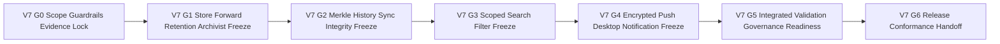

# TODO_v07.md

> Status: Execution plan (implementation required). Items are marked complete only when working code + validation evidence exist.
> 
- Expected evidence anchors (update during execution): `docs/v0.7/phase0/p0-t1-scope-contract.md`, `docs/v0.7/phase0/p0-t2-compatibility-governance-checklist.md`, `docs/v0.7/phase0/p0-t3-verification-evidence-matrix.md`, `docs/v0.7/phase1/p1-t1-store-forward-retention-archivist.md`, `docs/v0.7/phase2/p2-t1-history-sync-merkle.md`, `docs/v0.7/phase3/p3-t1-scoped-search-filters.md`, `docs/v0.7/phase4/p4-t1-push-relay-desktop-notifications.md`, `docs/v0.7/phase5/p5-t1-integrated-validation.md`, `docs/v0.7/phase5/p5-t2-governance-readiness-audit.md`, `docs/v0.7/phase5/p5-t3-release-gate-handoff.md`, `docs/v0.7/phase6/p6-t1-release-conformance-checklist.md`, `docs/v0.7/phase6/p6-t2-handoff-deferral-register.md`, `docs/v0.7/phase6/p6-t3-release-qa-governance-signoff.md`, `docs/v0.7/phase6/p6-t11-operator-runbooks-upgrade-notes.md`, `docs/v0.7/phase6/p6-t12-build-run-validation.md`, `pkg/v07/`, `cmd/aether/`, `cmd/aether-push-relay/`, `tests/e2e/v07/`, `containers/v07/`.
>
> Authoritative v0.7 scope source: `aether-v3.md` roadmap bullets under **v0.7.0 — Archive**.
>
> Inputs used for sequencing, dependency posture, closure patterns, and constraint carry-forward: `aether-v3.md`, `TODO_v01.md`, `TODO_v02.md`, `TODO_v03.md`, `TODO_v04.md`, `TODO_v05.md`, `TODO_v06.md`, and `AGENTS.md`.
>
> Guardrails that are mandatory throughout this plan:
> - Maintain strict planned-vs-implemented separation: specs remain explicit, and completion requires runnable implementations + tests + evidence.
> - Protocol-first priority is non-negotiable: protocol and specification contract are the product; UI behavior is a downstream consumer.
> - Network model invariant remains unchanged: single binary with mode flags `--mode=client|relay|bootstrap`; no privileged node classes.
> - Compatibility invariant remains mandatory: protobuf minor evolution is additive-only.
> - Breaking protocol behavior requires major-path governance evidence: new multistream IDs, downgrade negotiation, AEP process, validation by at least two independent implementations, and N+2 legacy protocol-ID support where relevant.
> - Open decisions remain unresolved unless source documentation explicitly resolves them.
> - Licensing alignment remains explicit: code licensing permissive MIT-like and protocol specification licensing CC-BY-SA.
> - v0.8+ capability is not promoted into v0.7 by implication, convenience, or integration adjacency.

## Sprint Guidelines Alignment

- This plan adopts `SPRINT_GUIDELINES.md` as the governing sprint policy baseline.
- Sprint model rule: one sprint maps to one minor version planning band and this document stays scoped to v0.7.
- Mandatory QoL target: this sprint must evidence at least one priority-journey improvement that achieves **10% less user effort**.
- Required closure gates: quality evidence, QA strategy traceability, review sign-off, and documentation plus release-note updates.
- Governance and status discipline remain mandatory: planned-vs-implemented separation stays explicit, and unresolved protocol decisions remain open unless authoritative sources resolve them.

---

## Stack Alignment Constraints (Parent Recommendation, Planning-Level)

- This section is recommendation-only planning guidance and does not claim implementation completion.
- Control plane default: libp2p secure channels use Noise_XX_25519_ChaChaPoly_SHA256 as the single supported suite; QUIC is preferred for reliable multiplexed streams, and this plan must not imply TCP-only operation.
- Media plane default: ICE (STUN/TURN), SRTP hop-by-hop, SFrame true media E2EE, and browser encoded-transform/insertable-streams integration where browser media clients apply.
- Key-management baseline carried forward: X3DH + Double Ratchet for DMs; MLS for group key agreement; any inherited Sender Keys mentions remain compatibility/migration context only.
- Crypto defaults carried forward: SFrame AES-GCM full-tag default (for example AES_128_GCM_SHA256_128 intent), avoid short tags unless explicitly justified; messaging AEAD baseline ChaCha20-Poly1305 with optional AES-GCM negotiation; Noise suite fixed as above; SRTP baseline unchanged.
- Latency/resilience baseline carried forward for dependent realtime behavior: race direct ICE and relay/TURN in parallel, continuous path probing with seamless migration, RTT-aware multi-region relay/SFU selection with warm standby, dynamic topology switching (P2P 1:1, mesh small groups, SFU larger groups) with no SFU transcoding, and background resilience controls.

## 1. v0.7 Objective and Measurable Success Outcomes

### 1.1 Objective
Deliver **v0.7 Archive** as a protocol-first implementation increment that delivers deterministic offline delivery, verifiable history integrity, scoped local search, and notification relay capabilities on top of v0.1-v0.6 baselines by specifying:
- Robust DHT store-and-forward with 30-day TTL and k=20 replication semantics.
- History synchronization contracts with Merkle-tree-based integrity verification.
- Configurable per-server history-retention policies and purge semantics.
- Archivist capability role contracts for volunteer full-history storage.
- SQLCipher FTS5 full-text search contracts scoped by channel, server, and DMs.
- Search filter contracts for from user, date range, has file, and has link.
- Push relay contracts for encrypted payload forwarding to FCM and APNs where relay cannot read payload.
- Desktop native notification contracts and coherence rules with existing attention baselines.

### 1.2 Measurable Success Outcomes
1. DHT store-and-forward envelope, TTL, replication, retrieval, and purge semantics are fully specified and independently implementable for 30-day TTL and k=20 replication targets.
2. Store-and-forward contracts explicitly preserve relay ciphertext opacity and metadata minimization boundaries.
3. Configurable per-server retention policy model defines defaults, overrides, conflict handling, and deterministic retention-state transitions.
4. Archivist role contract defines voluntary enrollment, capability advertisement, storage obligations, and withdrawal semantics without creating privileged node classes.
5. History sync protocol surfaces define deterministic request/response lifecycle and bounded failure behavior.
6. Merkle tree model and proof verification contract define canonical chunking, root commitment, proof exchange, and mismatch remediation behavior.
7. SQLCipher FTS5 indexing/search contracts define deterministic indexing scope boundaries across channel, server, and DMs.
8. Search query contract includes all required filters from user, date range, has file, and has link with deterministic normalization and invalid-combination behavior.
9. Search result contract defines deterministic response envelope, pagination, scope labels, and partial-failure signaling.
10. Push relay contract defines encrypted payload envelope, provider-bridge boundaries to FCM/APNs, routing/retry behavior, and relay-blind constraints.
11. Desktop native notification contract defines trigger semantics, dedupe/suppression rules, action handling, and degraded-mode behavior.
12. Compatibility/governance controls, gate evidence schema, and scope-to-task traceability are complete and gate-auditable.
13. Integrated validation package covers positive, negative, degraded, and recovery paths for all nine in-scope bullets.
14. Release package is complete with explicit implemented-vs-planned disclosure and explicit deferrals to v0.8+, v0.9+, v1.0+, and post-v1 roadmap bands.

### 1.3 QoL integration contract for v0.7 archive and attention continuity (planning-level)

- **Unread/mention/notification coherence at history scale:** archive sync, push relay, and desktop-native notification contracts must preserve deterministic attention-state convergence across resumed history.
  - **Acceptance criterion:** resumed-history and delayed-delivery scenarios produce coherent unread, mention, and notification outcomes across local and relay-assisted paths.
  - **Verification evidence:** `V7-G5` includes coherence score rows with pass/fail evidence links to `VA-S*` and `VA-P*` artifacts.
- **Cross-device continuity hardening:** draft/read position and notification attention resume across devices must remain deterministic during retention and sync recovery.
  - **Verification evidence:** cross-device resume scenarios show deterministic conflict resolution and explicit user-visible state.
- **No-limbo recovery for history and push flows:** replay, sync mismatch, relay delay, and desktop action failures must always expose state, reason class, and next action.
  - **Verification evidence:** recovery-path matrix in integrated validation demonstrates zero ambiguous terminal states.

---

## 2. Exact Scope Derivation from `aether-v3.md` for v0.7 Only

The following roadmap bullets in `aether-v3.md` define v0.7 scope and are treated as exact inclusions:

1. Robust DHT store-and-forward (30-day TTL, k=20 replication)
2. History sync protocol with Merkle tree verification
3. Configurable history retention per server
4. Archivist role: peers volunteering full history storage
5. SQLCipher FTS5 full-text search scoped by channel/server/DMs
6. Search filters: from user, date range, has file, has link
7. Push notification relay with encrypted payload to FCM/APNs (relay cannot read payload)
8. Desktop native notifications
9. History migration across security-mode epochs (optional re-encryption / History Capsule workflow)

No additional capability outside these nine bullets is promoted into v0.7 in this plan.

---

## 3. Explicit Out-of-Scope and Anti-Scope-Creep Boundaries

To preserve roadmap integrity, the following remain out of scope for v0.7:

### 3.1 Deferred to v0.8+
- Threaded replies and rich link-preview tracks.
- Message pinning, personal bookmarks, theme-system expansion, accessibility expansion, and i18n expansion.
- Noise-cancellation upgrade track beyond RNNoise baseline.

### 3.2 Deferred to v0.9+
- IPFS persistent hosting and pinning ecosystem expansion.
- Large-server hierarchical pubsub optimizations, cascading SFU mesh scaling, and relay-performance stress tracks.
- Battery/performance optimization programs beyond contracts required for v0.7 bullets.

### 3.3 Deferred to v1.0+
- External security audit program and v1.0 protocol standard publication.
- Full public documentation suite, app-store distribution, and bootstrap-infrastructure expansion programs.
- Community relay-node launch operations and reproducible-build release program.

### 3.4 Deferred to post-v1 bands
- v1.1 bridge programs.
- v1.2 collaborative canvas capability set.
- v1.3 forum and wiki capability set.
- v1.4 client plugin and app-directory capability set.

### 3.5 v0.7 Anti-Scope-Creep Enforcement Rules
1. Any proposal not traceable to one of the nine v0.7 bullets is rejected or formally deferred.
2. v0.7 historical search scope is bounded to SQLCipher FTS5 and required filters only; no v0.8+ rich-content expansion is imported.
3. Archivist role in v0.7 is a capability contract and must not be reframed as privileged node class architecture.
4. Push relay scope in v0.7 is encrypted payload forwarding to FCM/APNs with relay blindness; no broader centralized notification platform architecture is introduced.
5. Desktop notification scope in v0.7 is local desktop-native signaling and must not import unrelated mobile UX platform work.
6. Any incompatible protocol behavior discovered during planning must enter major-path governance flow and cannot be silently absorbed as a minor delta.
7. Open decisions remain open and explicitly tracked; unresolved items cannot be represented as finalized architecture.

---

## 4. Entry Prerequisites from v0.1 to v0.6 Outputs

v0.7 planning assumes prior-version contract outputs are available as dependencies.

### 4.1 v0.1 prerequisite baseline
- Headless relay/store-forward baseline exists and provides dependency context for robust TTL and replication expansion.
- SQLCipher local storage baseline and migration discipline exist and are required context for FTS5 search contract definitions.
- Single-binary operational model and relay/client mode assumptions are unchanged.

### 4.2 v0.2 prerequisite baseline
- DM transport direct/offline baseline exists and anchors archive-delivery continuity semantics.
- Notification/unread/mention baseline exists and constrains desktop notification coherence rules.
- Social/presence baselines provide actor context for search filters and retention-policy boundaries.
- Baseline RBAC/moderation and slow-mode semantics exist and constrain retention/search authority boundaries.

### 4.3 v0.3 prerequisite baseline
- Directory publishing/browse baseline exists and provides continuity context for archive/search discoverability posture.
- Invite/request-to-join baseline exists and constrains retention-policy access and history-availability pathways.
- Optional community-run, non-authoritative indexer baseline and signed-response verification posture are dependency inputs only and are not expanded in v0.7.

### 4.4 v0.4 prerequisite baseline
- Role/permission/moderation/audit context exists for server-scoped retention-policy authority boundaries.
- Visibility and invite-state semantics provide policy context for history availability behavior.
- Advanced moderation governance baseline (policy versioning + auto-mod hooks) and auditability constraints shape retention-policy change-event evidence expectations.

### 4.5 v0.5 prerequisite baseline
- Message-surface expansion including emoji/reaction/webhook context exists for search indexing-scope normalization.
- Bot and webhook contracts provide boundary conditions for searchable event/message-origin metadata.
- Prior traceability and conformance closure patterns remain reusable gate inputs.

### 4.6 v0.6 prerequisite baseline
- Discovery/moderation/anti-abuse hardening and scaling baselines exist for abuse-aware relay and archivist-policy assumptions.
- Reputation/reporting/filter contracts provide context for archivist enrollment and history abuse-risk controls.
- v0.6 gate/evidence discipline and release-handoff patterns are direct templates for v0.7 closure model.

### 4.7 Carry-back dependency rule
- Missing prerequisites are blocking dependencies for affected v0.7 tasks.
- Missing prerequisites are carried back to prior-version backlog and are not silently re-scoped into v0.7.
- Gate owners must explicitly reference carry-back status in evidence bundles whenever prerequisite gaps exist.

---

## 5. Gate Model and Flow for v0.7

### 5.1 Gate Definitions

| Gate | Name | Entry Criteria | Exit Criteria |
|---|---|---|---|
| V7-G0 | Scope guardrails and evidence lock | v0.7 planning initiated | Scope lock, exclusions, prerequisites, compatibility controls, and evidence schema approved |
| V7-G1 | Durable store-forward retention archivist contract freeze | V7-G0 passed | DHT store-forward, retention controls, and archivist role contracts fully specified |
| V7-G2 | Merkle history sync integrity contract freeze | V7-G1 passed | History sync lifecycle and Merkle verification semantics fully specified |
| V7-G3 | Scoped FTS5 search and filter contract freeze | V7-G2 passed | SQLCipher FTS5 scoped search and required filter semantics fully specified |
| V7-G4 | Encrypted push relay and desktop notification contract freeze | V7-G3 passed | Relay-blind encrypted push flow and desktop native notification contracts fully specified |
| V7-G5 | Integrated validation and governance readiness | V7-G4 passed | Cross-feature scenarios, risk controls, compatibility-governance review, and open-decision discipline complete |
| V7-G6 | Release conformance and handoff | V7-G5 passed | Full traceability closure, evidence-linked checklist, deferral register, and execution handoff dossier approved |

### 5.2 Gate Flow Diagram

### 5.3 Gate Convergence Rule
- **Single convergence point:** V7-G6 is the only release-conformance exit for v0.7 (spec + reference implementation + validation).
- No phase is complete without explicit acceptance evidence linked to gate exit criteria.

---

## 6. Detailed v0.7 Execution Plan by Phase, Task, and Sub-Task

Priority legend:
- `P0` critical path
- `P1` high-value follow-through
- `P2` hardening and residual-risk control

Validation artifact IDs used below:
- `VA-G*` scope/governance/evidence controls
- `VA-D*` durable store-forward retention archivist contracts
- `VA-H*` history sync and Merkle verification contracts
- `VA-S*` SQLCipher FTS5 scoped search and filter contracts
- `VA-P*` push relay and desktop notification contracts
- `VA-I*` integrated validation and governance readiness artifacts
- `VA-R*` release conformance and handoff artifacts
- `VA-C*` reference implementation code and unit/integration tests
- `VA-E*` end-to-end harness and runnable demo evidence

---

## Phase 0 - Scope Governance and Evidence Foundation (V7-G0)

- [x] **[P0][Order 01] P0-T1 Freeze v0.7 scope contract and anti-scope boundaries**
  - **Objective:** Create one-to-one mapping from the nine v0.7 bullets to planned tasks and validation artifacts.
  - **Concrete actions:**
    - [x] **P0-T1-ST1 Build v0.7 scope trace base 9 bullets to task IDs**
      - **Objective:** Ensure zero ambiguity in v0.7 inclusion boundaries.
      - **Concrete actions:** Map each bullet to at least one primary task, one acceptance target, and one validation artifact ID.
      - **Dependencies/prerequisites:** v0.7 bullet extraction completed.
      - **Deliverables/artifacts:** Scope trace base table (`VA-G1`).
      - **Acceptance criteria:** All 9 bullets mapped with no orphan bullet and no extra capability.
      - **Suggested priority/order:** P0, Order 01.1.
      - **Risks/notes:** Incomplete mapping introduces hidden execution gaps.
    - [x] **P0-T1-ST2 Lock exclusions and scope-escalation pathway**
      - **Objective:** Prevent v0.8+ scope leakage into v0.7 tasks.
      - **Concrete actions:** Define exclusion checklist, escalation trigger, and governance approval path for newly proposed capability.
      - **Dependencies/prerequisites:** P0-T1-ST1.
      - **Deliverables/artifacts:** Out-of-scope and escalation policy (`VA-G2`).
      - **Acceptance criteria:** Every phase lead references this policy before gate submission.
      - **Suggested priority/order:** P0, Order 01.2.
      - **Risks/notes:** Archive workstreams are prone to adjacent-scope expansion.
  - **Dependencies/prerequisites:** None.
  - **Deliverables/artifacts:** Approved v0.7 scope contract (`VA-G1`, `VA-G2`).
  - **Acceptance criteria:** V7-G0 scope baseline is versioned and approved.
  - **Suggested priority/order:** P0, Order 01.
  - **Risks/notes:** Scope drift here invalidates downstream planning quality.

- [x] **[P0][Order 02] P0-T2 Lock compatibility and governance controls for v0.7 protocol-touching deltas**
  - **Objective:** Embed compatibility and governance invariants before domain contract-freeze work begins.
  - **Concrete actions:**
    - [x] **P0-T2-ST1 Define additive-only protobuf checklist for archive sync search and push schema deltas**
      - **Objective:** Prevent destructive schema evolution in minor-version pathways.
      - **Concrete actions:** Create checklist covering field-addition constraints, reserved-field handling, compatibility annotations, and downgrade-safe defaults.
      - **Dependencies/prerequisites:** P0-T1.
      - **Deliverables/artifacts:** Protobuf additive checklist (`VA-G3`).
      - **Acceptance criteria:** All schema-touching tasks attach completed checklist evidence.
      - **Suggested priority/order:** P0, Order 02.1.
      - **Risks/notes:** Silent incompatibilities destabilize multi-client interoperability.
    - [x] **P0-T2-ST2 Define major-path trigger checklist for behavior-breaking proposals**
      - **Objective:** Enforce governance pathway for any breaking behavior.
      - **Concrete actions:** Define mandatory evidence for new multistream IDs, downgrade negotiation path, AEP entry, two-implementation validation, and N+2 legacy protocol-ID support where relevant.
      - **Dependencies/prerequisites:** P0-T2-ST1.
      - **Deliverables/artifacts:** Major-change governance trigger checklist (`VA-G4`).
      - **Acceptance criteria:** Any breaking candidate contains explicit governance-path evidence package.
      - **Suggested priority/order:** P0, Order 02.2.
      - **Risks/notes:** Ambiguous trigger criteria create late-stage governance conflicts.
  - **Dependencies/prerequisites:** P0-T1.
  - **Deliverables/artifacts:** v0.7 compatibility/governance control pack (`VA-G3`, `VA-G4`).
  - **Acceptance criteria:** All protocol-touching tasks reference control pack before approval.
  - **Suggested priority/order:** P0, Order 02.
  - **Risks/notes:** Controls must exist before any protocol-surface freeze.

- [x] **[P0][Order 03] P0-T3 Establish v0.7 verification matrix and gate evidence schema**
  - **Objective:** Standardize completion evidence so gate decisions are deterministic and auditable.
  - **Concrete actions:**
    - [x] **P0-T3-ST1 Define requirement-to-validation matrix template for v0.7**
      - **Objective:** Ensure each scope bullet has positive, negative, degraded, and recovery-path coverage.
      - **Concrete actions:** Define matrix fields for requirement ID, task IDs, artifact IDs, gate ownership, and evidence status.
      - **Dependencies/prerequisites:** P0-T1.
      - **Deliverables/artifacts:** Validation matrix template (`VA-G5`).
      - **Acceptance criteria:** Template supports all 9 bullets and all v0.7 gates.
      - **Suggested priority/order:** P0, Order 03.1.
      - **Risks/notes:** Weak matrix structure reduces auditability.
    - [x] **P0-T3-ST2 Define gate evidence-bundle schema and review checklist**
      - **Objective:** Eliminate ad hoc evidence formats during gate closure.
      - **Concrete actions:** Define required evidence fields, trace-link rules, pass/fail declaration format, and owner sign-off.
      - **Dependencies/prerequisites:** P0-T3-ST1.
      - **Deliverables/artifacts:** Gate evidence schema (`VA-G6`).
      - **Acceptance criteria:** Every gate has mandatory evidence-bundle template.
      - **Suggested priority/order:** P1, Order 03.2.
      - **Risks/notes:** Inconsistent evidence formatting delays gate closure.
  - **Dependencies/prerequisites:** P0-T1, P0-T2.
  - **Deliverables/artifacts:** v0.7 verification/evidence baseline (`VA-G5`, `VA-G6`).
  - **Acceptance criteria:** V7-G0 exits only with approved evidence model.
  - **Suggested priority/order:** P0, Order 03.
  - **Risks/notes:** Missing evidence model creates late-stage rework.

---

## Phase 1 - Durable Store Forward Retention Archivist Contracts (V7-G1)

- [x] **[P0][Order 04] P1-T1 Define robust DHT store-and-forward contract 30-day TTL and k=20 replication**
  - **Objective:** Specify deterministic offline-delivery storage semantics with explicit durability boundaries.
  - **Concrete actions:**
    - [x] **P1-T1-ST1 Define store-forward record schema addressing model and TTL lifecycle semantics**
      - **Objective:** Standardize how ciphertext payloads are addressed stored and expired.
      - **Concrete actions:** Specify payload envelope metadata limits mailbox addressing keys TTL start rules expiry evaluation and deterministic purge states for 30-day retention target.
      - **Dependencies/prerequisites:** P0-T2, v0.1 relay/store-forward baseline.
      - **Deliverables/artifacts:** Store-forward schema and TTL lifecycle contract (`VA-D1`).
      - **Acceptance criteria:** Equivalent payload and clock-state inputs resolve to deterministic retain or purge outcomes.
      - **Suggested priority/order:** P0, Order 04.1.
      - **Risks/notes:** Ambiguous TTL semantics create inconsistent retention behavior across implementations.
    - [x] **P1-T1-ST2 Define k=20 replication placement repair and degraded-mode behavior**
      - **Objective:** Bound durability behavior for nominal and degraded network conditions.
      - **Concrete actions:** Specify replication target k=20 placement policy repair trigger thresholds replica-loss handling and deterministic degraded-mode signaling.
      - **Dependencies/prerequisites:** P1-T1-ST1.
      - **Deliverables/artifacts:** Replication and durability policy contract (`VA-D2`).
      - **Acceptance criteria:** Replication policy explicitly models nominal target attainment and deterministic fallback behavior when target cannot be reached.
      - **Suggested priority/order:** P0, Order 04.2.
      - **Risks/notes:** Under-specified repair behavior can create silent data-loss windows.
  - **Dependencies/prerequisites:** P0-T1 through P0-T3.
  - **Deliverables/artifacts:** Robust store-forward contract pack (`VA-D1`, `VA-D2`).
  - **Acceptance criteria:** V7-G1 cannot proceed without explicit TTL and k=20 durability semantics.
  - **Suggested priority/order:** P0, Order 04.
  - **Risks/notes:** Must preserve relay ciphertext opacity and metadata-minimization boundaries.

- [x] **[P0][Order 05] P1-T2 Define configurable history-retention contract per server**
  - **Objective:** Specify server-scoped retention policy semantics and policy-state transitions.
  - **Concrete actions:**
    - [x] **P1-T2-ST1 Define retention policy schema defaults override precedence and policy authority boundaries**
      - **Objective:** Ensure per-server retention settings are deterministic and governance-aligned.
      - **Concrete actions:** Define policy fields default values override precedence conflict rules and authorized-actor boundaries for policy changes.
      - **Dependencies/prerequisites:** P1-T1, v0.4 permission baseline.
      - **Deliverables/artifacts:** Retention policy schema and authority contract (`VA-D3`).
      - **Acceptance criteria:** Policy-evaluation outcomes are deterministic for equivalent input policy sets.
      - **Suggested priority/order:** P0, Order 05.1.
      - **Risks/notes:** Authority ambiguity can produce unsafe or conflicting retention behavior.
    - [x] **P1-T2-ST2 Define retention transition purge and audit-event semantics**
      - **Objective:** Bind policy changes to deterministic data-lifecycle and evidence behavior.
      - **Concrete actions:** Specify transition timeline behavior purge triggers grandfathering rules and mandatory audit metadata for policy changes.
      - **Dependencies/prerequisites:** P1-T2-ST1.
      - **Deliverables/artifacts:** Retention transition and purge contract (`VA-D4`).
      - **Acceptance criteria:** Policy change events map deterministically to retention-state transitions and evidence outputs.
      - **Suggested priority/order:** P0, Order 05.2.
      - **Risks/notes:** Missing transition semantics can cause retention-policy drift and dispute.
  - **Dependencies/prerequisites:** P1-T1.
  - **Deliverables/artifacts:** Server retention contract pack (`VA-D3`, `VA-D4`).
  - **Acceptance criteria:** V7-G1 requires complete per-server retention configurability semantics.
  - **Suggested priority/order:** P0, Order 05.
  - **Risks/notes:** Keep scope to retention contract semantics and avoid broader compliance-feature expansion.

- [x] **[P0][Order 06] P1-T3 Define Archivist role contract for voluntary full-history storage**
  - **Objective:** Specify capability-role semantics for peers volunteering full-history storage without violating node-model invariants.
  - **Concrete actions:**
    - [x] **P1-T3-ST1 Define archivist enrollment capability advertisement and withdrawal lifecycle**
      - **Objective:** Standardize opt-in and opt-out behavior with deterministic capability visibility.
      - **Concrete actions:** Specify enrollment states capability advertisement metadata withdrawal grace behavior and deterministic deactivation outcomes.
      - **Dependencies/prerequisites:** P1-T1, P1-T2.
      - **Deliverables/artifacts:** Archivist lifecycle and capability-advertisement contract (`VA-D5`).
      - **Acceptance criteria:** Enrollment and withdrawal transitions are deterministic and independently implementable.
      - **Suggested priority/order:** P0, Order 06.1.
      - **Risks/notes:** Ambiguous enrollment semantics can create false durability assumptions.
    - [x] **P1-T3-ST2 Define archivist storage obligations integrity checks and non-privileged role boundaries**
      - **Objective:** Clarify expected behavior while preserving single-binary no-special-node-class model.
      - **Concrete actions:** Define storage expectation envelope integrity verification hooks fallback rules when archivist coverage drops and explicit non-privileged role constraints.
      - **Dependencies/prerequisites:** P1-T3-ST1.
      - **Deliverables/artifacts:** Archivist obligation and boundary contract (`VA-D6`).
      - **Acceptance criteria:** Archivist behavior is capability-scoped and does not imply privileged protocol authority.
      - **Suggested priority/order:** P1, Order 06.2.
      - **Risks/notes:** Language drift can incorrectly imply special-node architecture.
  - **Dependencies/prerequisites:** P1-T1, P1-T2.
  - **Deliverables/artifacts:** Archivist role contract pack (`VA-D5`, `VA-D6`).
  - **Acceptance criteria:** V7-G1 exits only with coherent store-forward retention and archivist semantics.
  - **Suggested priority/order:** P0, Order 06.
  - **Risks/notes:** Keep role semantics voluntary and governance-bounded.

---

## Phase 2 - Merkle History Sync Integrity Contracts (V7-G2)

- [x] **[P0][Order 07] P2-T1 Define history sync protocol surfaces and lifecycle contract**
  - **Objective:** Specify deterministic protocol interactions for history synchronization operations.
  - **Concrete actions:**
    - [x] **P2-T1-ST1 Define history sync stream identifiers capability negotiation and version boundaries**
      - **Objective:** Ensure interoperability and downgrade-safe negotiation behavior.
      - **Concrete actions:** Define stream ID registry entries capability negotiation fields compatibility behavior and downgrade path expectations aligned with governance controls.
      - **Dependencies/prerequisites:** P0-T2, P1-T1 through P1-T3.
      - **Deliverables/artifacts:** History sync protocol-surface contract (`VA-H1`).
      - **Acceptance criteria:** Stream negotiation outcomes are deterministic for supported and unsupported version combinations.
      - **Suggested priority/order:** P0, Order 07.1.
      - **Risks/notes:** Unclear negotiation behavior can break multi-implementation sync.
    - [x] **P2-T1-ST2 Define sync request response and state-transition lifecycle**
      - **Objective:** Standardize bootstrap incremental resume and completion semantics.
      - **Concrete actions:** Specify request scopes response envelopes checkpoint markers resume tokens and deterministic failure and retry states.
      - **Dependencies/prerequisites:** P2-T1-ST1.
      - **Deliverables/artifacts:** History sync lifecycle contract (`VA-H2`).
      - **Acceptance criteria:** Sync lifecycle transitions are deterministic and test-mappable across normal and failure paths.
      - **Suggested priority/order:** P0, Order 07.2.
      - **Risks/notes:** Missing lifecycle states can produce divergent merge behavior.
    - [x] **P2-T1-ST3 Define mode-epoch segmentation and history migration signaling (SecurityMode transitions)**
      - **Objective:** Ensure history sync can represent multiple encryption postures over time without breaking integrity or confusing users.
      - **Concrete actions:** Define `mode_epoch_id` boundaries in history streams, locked-history signaling for viewers lacking prior epoch keys, and optional re-sharing/re-encryption workflow surfaces (“History Capsule”) as an explicit, auditable action.
      - **Dependencies/prerequisites:** P2-T1-ST2, v0.4 SecurityMode baseline.
      - **Deliverables/artifacts:** Mode-epoch history contract (`VA-H7`).
      - **Acceptance criteria:** Epoch segmentation is deterministic, mode transitions are represented explicitly in sync data, and clients can render locked-history states without ambiguity.
      - **Suggested priority/order:** P1, Order 07.3.
      - **Risks/notes:** Without explicit epoch modeling, clients tend to implement incompatible “history rewrite” behavior.
  - **Dependencies/prerequisites:** P1-T1 through P1-T3.
  - **Deliverables/artifacts:** History sync surface/lifecycle contract pack (`VA-H1`, `VA-H2`).
  - **Acceptance criteria:** V7-G2 requires complete sync lifecycle semantics before Merkle proof finalization.
  - **Suggested priority/order:** P0, Order 07.
  - **Risks/notes:** Keep scope to protocol contract and not implementation optimization.

- [x] **[P0][Order 08] P2-T2 Define Merkle tree model and proof verification contract**
  - **Objective:** Specify canonical integrity-verification semantics for synchronized history segments.
  - **Concrete actions:**
    - [x] **P2-T2-ST1 Define canonical chunking hash-domain and root commitment rules**
      - **Objective:** Ensure identical history inputs produce identical Merkle commitments.
      - **Concrete actions:** Specify chunk boundaries canonical ordering hashing domain-separation tags (including `mode_epoch_id` domain separation) and root-derivation rules for channel server and DM scopes.
      - **Dependencies/prerequisites:** P2-T1.
      - **Deliverables/artifacts:** Merkle construction contract (`VA-H3`).
      - **Acceptance criteria:** Equivalent synchronized data sets yield deterministic Merkle roots across implementations.
      - **Suggested priority/order:** P0, Order 08.1.
      - **Risks/notes:** Non-canonical chunking yields unverifiable cross-client state.
    - [x] **P2-T2-ST2 Define proof exchange verification mismatch handling and remediation semantics**
      - **Objective:** Bound behavior when proofs fail or divergence is detected.
      - **Concrete actions:** Define proof payload schema verification algorithm mismatch error taxonomy re-request policy and divergence-resolution transitions.
      - **Dependencies/prerequisites:** P2-T2-ST1.
      - **Deliverables/artifacts:** Merkle proof verification and remediation contract (`VA-H4`).
      - **Acceptance criteria:** All mismatch classes resolve to deterministic remediation or fail-closed outcomes.
      - **Suggested priority/order:** P0, Order 08.2.
      - **Risks/notes:** Weak remediation semantics can permit silent corruption persistence.
  - **Dependencies/prerequisites:** P2-T1.
  - **Deliverables/artifacts:** Merkle integrity contract pack (`VA-H3`, `VA-H4`).
  - **Acceptance criteria:** V7-G2 cannot exit without deterministic Merkle construction and proof behavior.
  - **Suggested priority/order:** P0, Order 08.
  - **Risks/notes:** Integrity semantics are critical for trust in synchronized history.

- [x] **[P1][Order 09] P2-T3 Define sync consistency boundaries across retention and archivist contexts**
  - **Objective:** Ensure history-sync outcomes remain coherent with retention-policy and archivist-role semantics.
  - **Concrete actions:**
    - [x] **P2-T3-ST1 Define retention-aware sync window semantics and unavailable-history signaling**
      - **Objective:** Bound requests against retention and archival availability constraints.
      - **Concrete actions:** Specify behavior for retained, expired, and unavailable ranges including deterministic partial-history signaling and explicit “locked history” signaling across `mode_epoch_id` boundaries.
      - **Dependencies/prerequisites:** P1-T2, P2-T1, P2-T2.
      - **Deliverables/artifacts:** Retention-aware sync window contract (`VA-H5`).
      - **Acceptance criteria:** Equivalent retention states produce deterministic sync-availability outcomes.
      - **Suggested priority/order:** P1, Order 09.1.
      - **Risks/notes:** Ambiguous availability semantics can cause repeated failed synchronization loops.
    - [x] **P2-T3-ST2 Define archivist-assisted sync source selection and fallback semantics**
      - **Objective:** Standardize how peers use archivist sources without violating trust boundaries.
      - **Concrete actions:** Define source preference ordering fallback triggers and proof-required acceptance rules for archivist-originated history segments.
      - **Dependencies/prerequisites:** P1-T3, P2-T3-ST1.
      - **Deliverables/artifacts:** Archivist-assisted sync source contract (`VA-H6`).
      - **Acceptance criteria:** Source selection and fallback behavior are deterministic and integrity-preserving.
      - **Suggested priority/order:** P1, Order 09.2.
      - **Risks/notes:** Poor fallback rules can degrade availability despite valid archivist coverage.
  - **Dependencies/prerequisites:** P1-T2, P1-T3, P2-T1, P2-T2.
  - **Deliverables/artifacts:** Sync-consistency contract pack (`VA-H5`, `VA-H6`).
  - **Acceptance criteria:** V7-G2 exits only with coherent sync behavior across retention and archivist boundaries.
  - **Suggested priority/order:** P1, Order 09.
  - **Risks/notes:** Keep contract language strictly planning-level and protocol-first.

---

## Phase 3 - FTS5 Scoped Search and Filter Contracts (V7-G3)

- [x] **[P0][Order 10] P3-T1 Define SQLCipher FTS5 indexing and scope-boundary contract**
  - **Objective:** Specify deterministic indexing semantics for channel server and DM scope surfaces.
  - **Concrete actions:**
    - [x] **P3-T1-ST1 Define indexed document model tokenization profile and scope partition keys**
      - **Objective:** Ensure FTS5 index behavior is canonical and scope-aware.
      - **Concrete actions:** Specify document fields tokenization normalization profile partition keys (including `mode_epoch_id`) and scope labels for channel server and DM records, including locked-history indexing behavior.
      - **Dependencies/prerequisites:** P2-T1, v0.1 SQLCipher baseline.
      - **Deliverables/artifacts:** FTS5 document/index model contract (`VA-S1`).
      - **Acceptance criteria:** Equivalent message corpora produce deterministic index entries and scope partitioning.
      - **Suggested priority/order:** P0, Order 10.1.
      - **Risks/notes:** Inconsistent tokenization profiles reduce cross-client search predictability.
    - [x] **P3-T1-ST2 Define index update delete and retention-coupled lifecycle semantics**
      - **Objective:** Bind index lifecycle behavior to message and retention state changes.
      - **Concrete actions:** Specify insert update delete and purge behaviors including deterministic handling for retention expiry and sync backfill events.
      - **Dependencies/prerequisites:** P1-T2, P3-T1-ST1.
      - **Deliverables/artifacts:** FTS5 index lifecycle contract (`VA-S2`).
      - **Acceptance criteria:** Index lifecycle outcomes are deterministic across equivalent message and retention events.
      - **Suggested priority/order:** P0, Order 10.2.
      - **Risks/notes:** Lifecycle drift can produce stale or phantom search results.
  - **Dependencies/prerequisites:** P1-T2, P2-T1.
  - **Deliverables/artifacts:** SQLCipher FTS5 scope/index contract pack (`VA-S1`, `VA-S2`).
  - **Acceptance criteria:** V7-G3 requires complete scoped-indexing and lifecycle behavior.
  - **Suggested priority/order:** P0, Order 10.
  - **Risks/notes:** Scope boundaries must remain explicit and cannot leak across DM/server contexts.

- [x] **[P0][Order 11] P3-T2 Define search query and response contract with required filters**
  - **Objective:** Specify deterministic query semantics including all required v0.7 filters.
  - **Concrete actions:**
    - [x] **P3-T2-ST1 Define query schema normalization and filter-combination behavior**
      - **Objective:** Eliminate ambiguity in filter construction and validation.
      - **Concrete actions:** Specify query fields for text scope from user date range has file has link plus canonical normalization and invalid-combination rejection rules.
      - **Dependencies/prerequisites:** P3-T1.
      - **Deliverables/artifacts:** Filtered search query contract (`VA-S3`).
      - **Acceptance criteria:** Equivalent search intents map to deterministic canonical queries with deterministic invalid-input handling.
      - **Suggested priority/order:** P0, Order 11.1.
      - **Risks/notes:** Filter ambiguity can create inconsistent results and user mistrust.
    - [x] **P3-T2-ST2 Define response envelope ranking order pagination and partial-failure semantics**
      - **Objective:** Standardize search-result handling under normal and degraded paths.
      - **Concrete actions:** Specify result envelope ordering constraints pagination token semantics match metadata and partial-failure signaling.
      - **Dependencies/prerequisites:** P3-T2-ST1.
      - **Deliverables/artifacts:** Filtered search response contract (`VA-S4`).
      - **Acceptance criteria:** Clients can deterministically parse complete and partial responses with consistent pagination continuation behavior.
      - **Suggested priority/order:** P0, Order 11.2.
      - **Risks/notes:** Pagination instability can break reproducibility and evidence audits.
  - **Dependencies/prerequisites:** P3-T1.
  - **Deliverables/artifacts:** Search filter contract pack (`VA-S3`, `VA-S4`).
  - **Acceptance criteria:** V7-G3 cannot exit without explicit from user date range has file has link semantics.
  - **Suggested priority/order:** P0, Order 11.
  - **Risks/notes:** Keep required filters exact and avoid expanding to non-roadmap filter sets.

- [x] **[P1][Order 12] P3-T3 Define search authorization and scope-isolation guarantees**
  - **Objective:** Ensure scoped search results respect privacy and authorization boundaries.
  - **Concrete actions:**
    - [x] **P3-T3-ST1 Define scope-authorization checks across channel server and DM contexts**
      - **Objective:** Prevent unauthorized cross-scope result exposure.
      - **Concrete actions:** Specify authorization-evaluation order denial outcomes and deterministic redaction behavior for out-of-scope matches.
      - **Dependencies/prerequisites:** P3-T1, P3-T2, v0.4 permission baseline.
      - **Deliverables/artifacts:** Search authorization and scope-isolation contract (`VA-S5`).
      - **Acceptance criteria:** Equivalent authorization states produce deterministic inclusion or exclusion outcomes.
      - **Suggested priority/order:** P1, Order 12.1.
      - **Risks/notes:** Scope-leak defects are high-impact privacy failures.
    - [x] **P3-T3-ST2 Define encrypted-at-rest and evidence requirements for scoped-search operations**
      - **Objective:** Preserve SQLCipher-at-rest posture and auditable search behavior contracts.
      - **Concrete actions:** Specify at-rest assumptions sensitive-field handling and evidence requirements for search-scope enforcement checks.
      - **Dependencies/prerequisites:** P3-T3-ST1.
      - **Deliverables/artifacts:** Scoped-search privacy and evidence contract (`VA-S6`).
      - **Acceptance criteria:** Search operations preserve scope isolation and planning-level privacy constraints with deterministic audit signals.
      - **Suggested priority/order:** P2, Order 12.2.
      - **Risks/notes:** Overly broad logging language can violate minimization constraints.
  - **Dependencies/prerequisites:** P3-T1, P3-T2.
  - **Deliverables/artifacts:** Search-boundary assurance pack (`VA-S5`, `VA-S6`).
  - **Acceptance criteria:** V7-G3 exits only with deterministic scoped-search isolation behavior.
  - **Suggested priority/order:** P1, Order 12.
  - **Risks/notes:** Maintain strict focus on v0.7 scope and avoid unrelated compliance-feature expansion.

---

## Phase 4 - Encrypted Push Relay and Desktop Notification Contracts (V7-G4)

- [x] **[P0][Order 13] P4-T1 Define encrypted push relay envelope and relay-blind forwarding contract**
  - **Objective:** Specify push-relay semantics where payload is unreadable to relay operators.
  - **Concrete actions:**
    - [x] **P4-T1-ST1 Define encrypted push envelope metadata-minimization and integrity fields**
      - **Objective:** Standardize provider-ready encrypted payload structure without plaintext leakage.
      - **Concrete actions:** Specify encrypted payload envelope fields provider-target metadata integrity tags nonce requirements and explicit relay-visible minimal metadata set.
      - **Dependencies/prerequisites:** P0-T2, v0.2 notification baseline.
      - **Deliverables/artifacts:** Encrypted push envelope contract (`VA-P1`).
      - **Acceptance criteria:** Relay-visible fields cannot reveal plaintext content under contract-defined threat assumptions.
      - **Suggested priority/order:** P0, Order 13.1.
      - **Risks/notes:** Excess metadata exposure undermines relay-blind design goals.
    - [x] **P4-T1-ST2 Define FCM/APNs forwarding mapping and relay-blind processing rules**
      - **Objective:** Bound provider-bridge behavior while preserving payload confidentiality.
      - **Concrete actions:** Specify mapping rules to FCM/APNs fields forwarding constraints provider-error normalization and deterministic failure signaling without payload decryption.
      - **Dependencies/prerequisites:** P4-T1-ST1.
      - **Deliverables/artifacts:** Provider forwarding and relay-blind processing contract (`VA-P2`).
      - **Acceptance criteria:** Forwarding semantics are deterministic across FCM/APNs pathways and preserve relay blindness.
      - **Suggested priority/order:** P0, Order 13.2.
      - **Risks/notes:** Provider-field mismatches can introduce silent delivery gaps.
  - **Dependencies/prerequisites:** P0-T1 through P0-T3.
  - **Deliverables/artifacts:** Encrypted push relay contract pack (`VA-P1`, `VA-P2`).
  - **Acceptance criteria:** V7-G4 cannot proceed without explicit relay-cannot-read constraints and provider forwarding semantics.
  - **Suggested priority/order:** P0, Order 13.
  - **Risks/notes:** Must preserve decentralized posture and avoid centralization assumptions.

- [x] **[P0][Order 14] P4-T2 Define push registration routing retry and token-lifecycle contract**
  - **Objective:** Specify deterministic push-routing and provider-interaction behavior for encrypted notifications.
  - **Concrete actions:**
    - [x] **P4-T2-ST1 Define token registration rotation revocation and binding semantics**
      - **Objective:** Ensure push endpoints remain current and safely managed.
      - **Concrete actions:** Specify token lifecycle states binding to device identity rotation events revocation behavior and stale-token handling outcomes.
      - **Dependencies/prerequisites:** P4-T1.
      - **Deliverables/artifacts:** Push token lifecycle contract (`VA-P3`).
      - **Acceptance criteria:** Token lifecycle transitions are deterministic and audit-mappable.
      - **Suggested priority/order:** P0, Order 14.1.
      - **Risks/notes:** Token lifecycle ambiguity can cause notification loss or misrouting.
    - [x] **P4-T2-ST2 Define retry backoff dedupe and failure-taxonomy semantics**
      - **Objective:** Bound delivery-attempt behavior under provider and network failures.
      - **Concrete actions:** Specify retry windows backoff policy dedupe keys dead-letter conditions and deterministic terminal-failure states.
      - **Dependencies/prerequisites:** P4-T2-ST1.
      - **Deliverables/artifacts:** Push routing/retry/failure contract (`VA-P4`).
      - **Acceptance criteria:** Equivalent failure sequences yield deterministic retry and terminal outcomes.
      - **Suggested priority/order:** P1, Order 14.2.
      - **Risks/notes:** Unbounded retry semantics can amplify relay load and alert fatigue.
  - **Dependencies/prerequisites:** P4-T1.
  - **Deliverables/artifacts:** Push lifecycle reliability contract pack (`VA-P3`, `VA-P4`).
  - **Acceptance criteria:** V7-G4 exits only with deterministic registration and delivery-attempt semantics.
  - **Suggested priority/order:** P0, Order 14.
  - **Risks/notes:** Keep scope to required encrypted push relay behavior.

- [x] **[P0][Order 15] P4-T3 Define desktop native notification contract and coherence boundaries**
  - **Objective:** Specify deterministic desktop-native notification behavior for message events.
  - **Concrete actions:**
    - [x] **P4-T3-ST1 Define desktop notification trigger dedupe suppression and state-coherence rules**
      - **Objective:** Ensure consistent user-visible behavior across message and attention states.
      - **Concrete actions:** Specify trigger conditions dedupe keys suppression windows silent-mode interactions and unread-counter coherence with existing attention baselines.
      - **Dependencies/prerequisites:** v0.2 notification baseline, P3-T2.
      - **Deliverables/artifacts:** Desktop notification trigger/coherence contract (`VA-P5`).
      - **Acceptance criteria:** Equivalent event streams produce deterministic notification and suppression outcomes.
      - **Suggested priority/order:** P0, Order 15.1.
      - **Risks/notes:** Over-notification or under-notification can degrade usability trust.
    - [x] **P4-T3-ST2 Define desktop notification action handling and degraded-mode fallback semantics**
      - **Objective:** Bound behavior for click actions focus transitions and unavailable-notification channels.
      - **Concrete actions:** Specify action outcomes focus/open transitions stale-message handling and deterministic fallback states when desktop notification APIs are unavailable.
      - **Dependencies/prerequisites:** P4-T3-ST1.
      - **Deliverables/artifacts:** Desktop notification action/fallback contract (`VA-P6`).
      - **Acceptance criteria:** Action and fallback outcomes are deterministic and test-mappable.
      - **Suggested priority/order:** P1, Order 15.2.
      - **Risks/notes:** Missing fallback semantics can create inconsistent platform behavior.
  - **Dependencies/prerequisites:** P3-T2, P4-T1, P4-T2.
  - **Deliverables/artifacts:** Desktop notification contract pack (`VA-P5`, `VA-P6`).
  - **Acceptance criteria:** V7-G4 cannot exit without coherent desktop trigger and action behavior.
  - **Suggested priority/order:** P0, Order 15.
  - **Risks/notes:** Keep contract strictly desktop-native and in v0.7 scope.

---

## Phase 5 - Integrated Validation and Governance Readiness (V7-G5)

- [x] **[P0][Order 16] P5-T1 Build cross-feature validation scenario pack and residual-risk controls**
  - **Objective:** Validate coherence across offline delivery, integrity sync, scoped search, and notification contracts.
  - **Concrete actions:**
    - [x] **P5-T1-ST1 Define integrated scenario suite positive negative degraded recovery paths**
      - **Objective:** Ensure complete behavioral coverage before release-conformance review.
      - **Concrete actions:** Build scenario IDs spanning all nine bullets with expected outcomes and evidence collection requirements.
      - **Dependencies/prerequisites:** P1-T1 through P4-T3.
      - **Deliverables/artifacts:** Integrated validation scenario pack (`VA-I1`).
      - **Acceptance criteria:** Every scope bullet appears in at least one positive and one adverse-path scenario.
      - **Suggested priority/order:** P0, Order 16.1.
      - **Risks/notes:** Missing adverse-path coverage hides production-critical failure modes.
    - [x] **P5-T1-ST2 Define residual-risk register and owner-bound mitigation plan**
      - **Objective:** Make unresolved operational and governance risks explicit before handoff.
      - **Concrete actions:** Assign risk IDs likelihood/impact tags mitigation owners and gate-check references.
      - **Dependencies/prerequisites:** P5-T1-ST1.
      - **Deliverables/artifacts:** v0.7 risk register (`VA-I2`).
      - **Acceptance criteria:** High-severity risks have explicit mitigation and acceptance owner.
      - **Suggested priority/order:** P0, Order 16.2.
      - **Risks/notes:** Unowned residual risk undermines release-governance quality.
  - **Dependencies/prerequisites:** P1-T1 through P4-T3.
  - **Deliverables/artifacts:** Integrated validation and risk baseline (`VA-I1`, `VA-I2`).
  - **Acceptance criteria:** V7-G5 requires full scenario coverage and active risk controls.
  - **Suggested priority/order:** P0, Order 16.
  - **Risks/notes:** This phase is convergence-critical.

- [x] **[P0][Order 17] P5-T2 Run compatibility-governance and open-decision conformance review**
  - **Objective:** Verify all planned outputs preserve compatibility discipline and unresolved-decision handling rules.
  - **Concrete actions:**
    - [x] **P5-T2-ST1 Audit schema/protocol deltas for additive-only and major-path compliance including N+2 handling**
      - **Objective:** Ensure compatibility policy integrity across all protocol-touching contracts.
      - **Concrete actions:** Apply `VA-G3` and `VA-G4` checklists to all artifacts and verify major-path evidence includes new multistream IDs downgrade negotiation AEP two-implementation validation and N+2 legacy protocol-ID support where relevant.
      - **Dependencies/prerequisites:** P1-T1 through P4-T3.
      - **Deliverables/artifacts:** Compatibility conformance report (`VA-I3`).
      - **Acceptance criteria:** No incompatible delta is present without formal major-path governance evidence.
      - **Suggested priority/order:** P0, Order 17.1.
      - **Risks/notes:** Late compatibility defects can block V7-G6 closure.
    - [x] **P5-T2-ST2 Validate open-decision handling and anti-scope discipline**
      - **Objective:** Prevent accidental closure of unresolved items and roadmap leakage.
      - **Concrete actions:** Audit all artifacts for unresolved-decision wording discipline and v0.8+ contamination.
      - **Dependencies/prerequisites:** P5-T2-ST1.
      - **Deliverables/artifacts:** Governance/open-decision conformance record (`VA-I4`).
      - **Acceptance criteria:** Unresolved items remain open with owner and revisit gate and out-of-scope contamination is absent.
      - **Suggested priority/order:** P0, Order 17.2.
      - **Risks/notes:** Wording drift can mislead implementation teams.
  - **Dependencies/prerequisites:** P5-T1.
  - **Deliverables/artifacts:** Governance conformance package (`VA-I3`, `VA-I4`).
  - **Acceptance criteria:** V7-G5 cannot advance to V7-G6 without this package.
  - **Suggested priority/order:** P0, Order 17.
  - **Risks/notes:** Protects long-term interoperability and roadmap integrity.

- [x] **[P1][Order 18] P5-T3 Execute gate-readiness dry run for V7-G1 through V7-G5 evidence completeness**
  - **Objective:** Surface gate-evidence defects before final release-conformance assembly.
  - **Concrete actions:**
    - [x] **P5-T3-ST1 Perform per-gate checklist rehearsal with evidence-link verification**
      - **Objective:** Confirm each gate has complete and auditable evidence bundles.
      - **Concrete actions:** Run checklist walkthrough for V7-G1 V7-G2 V7-G3 V7-G4 V7-G5 and mark missing evidence links.
      - **Dependencies/prerequisites:** P5-T1, P5-T2.
      - **Deliverables/artifacts:** Gate-readiness rehearsal log (`VA-I5`).
      - **Acceptance criteria:** All detected evidence gaps have explicit owner and closure action.
      - **Suggested priority/order:** P1, Order 18.1.
      - **Risks/notes:** Skipping rehearsal increases final-gate churn risk.
    - [x] **P5-T3-ST2 Build corrective-action register for unresolved readiness gaps**
      - **Objective:** Ensure readiness gaps are explicitly tracked and resolved before V7-G6.
      - **Concrete actions:** Record gap IDs owner role closure criteria and dependency impact for each unresolved item.
      - **Dependencies/prerequisites:** P5-T3-ST1.
      - **Deliverables/artifacts:** Readiness corrective-action register (`VA-I6`).
      - **Acceptance criteria:** No high-severity readiness gap remains unowned.
      - **Suggested priority/order:** P1, Order 18.2.
      - **Risks/notes:** Unowned readiness gaps degrade release confidence.
  - **Dependencies/prerequisites:** P5-T1, P5-T2.
  - **Deliverables/artifacts:** Gate-readiness package (`VA-I5`, `VA-I6`).
  - **Acceptance criteria:** V7-G5 exits only with auditable readiness evidence.
  - **Suggested priority/order:** P1, Order 18.
  - **Risks/notes:** Preserve strict planned-vs-implemented separation and ensure evidence is linked.

---

## Phase 6 - Reference Implementation, E2E Validation, and v0.7 Shipping (V7-G6)

- [x] **[P0][Order 19] P6-T1 Assemble V7-G6 release-conformance checklist with pass/fail evidence links**
  - **Objective:** Provide one authoritative gate artifact for final conformance decision.
  - **Concrete actions:**
    - [x] **P6-T1-ST1 Compile scope-item pass/fail status and evidence references**
      - **Objective:** Ensure each v0.7 scope bullet has explicit conformance status.
      - **Concrete actions:** Build checklist rows for S7-01 through S7-08 with acceptance status evidence links residual risks and sign-off fields.
      - **Dependencies/prerequisites:** P5-T1, P5-T2, P5-T3.
      - **Deliverables/artifacts:** V7-G6 release-conformance checklist (`VA-R1`).
      - **Acceptance criteria:** Every scope bullet has explicit pass/fail declaration and traceable evidence references.
      - **Suggested priority/order:** P0, Order 19.1.
      - **Risks/notes:** Missing references reduce auditability and handoff trust.
    - [x] **P6-T1-ST2 Verify gate exit criteria closure and unresolved-risk disposition**
      - **Objective:** Confirm gate criteria are explicitly satisfied or formally deferred.
      - **Concrete actions:** Validate closure status for all gate criteria and record residual-risk acceptance or deferral rationale.
      - **Dependencies/prerequisites:** P6-T1-ST1.
      - **Deliverables/artifacts:** Gate closure and risk-disposition record (`VA-R2`).
      - **Acceptance criteria:** No unresolved high-severity gate criterion remains without explicit disposition record.
      - **Suggested priority/order:** P0, Order 19.2.
      - **Risks/notes:** Unresolved gate criteria can invalidate final handoff confidence.
  - **Dependencies/prerequisites:** P5-T1 through P5-T3.
  - **Deliverables/artifacts:** Release-conformance package (`VA-R1`, `VA-R2`).
  - **Acceptance criteria:** V7-G6 cannot close without full pass/fail traceability.
  - **Suggested priority/order:** P0, Order 19.
  - **Risks/notes:** Checklist is the authoritative go/no-go release artifact.

- [x] **[P1][Order 20] P6-T2 Build operator handoff dossier and explicit deferral register**
  - **Objective:** Deliver operator-facing handoff package (how to run + how to validate) with explicit future-band deferrals.
  - **Concrete actions:**
    - [x] **P6-T2-ST1 Assemble execution handoff dossier with ordered task waves and dependency notes**
      - **Objective:** Enable downstream execution mode to start implementation with minimal ambiguity.
      - **Concrete actions:** Compile ordered tasks gate dependencies artifact expectations and governance checks in one package.
      - **Dependencies/prerequisites:** P6-T1.
      - **Deliverables/artifacts:** v0.7 execution handoff dossier (`VA-R3`).
      - **Acceptance criteria:** Handoff dossier includes all tasks dependencies gates and artifact expectations needed for execution orchestration.
      - **Suggested priority/order:** P1, Order 20.1.
      - **Risks/notes:** Fragmented handoff artifacts increase execution misalignment risk.
    - [x] **P6-T2-ST2 Build explicit deferral register for v0.8+ v0.9+ v1.0+ post-v1 bands**
      - **Objective:** Prevent hidden carry-over and preserve roadmap continuity.
      - **Concrete actions:** Capture deferred items rationale target roadmap band owner role and carry-forward dependency notes.
      - **Dependencies/prerequisites:** P6-T2-ST1.
      - **Deliverables/artifacts:** v0.7 deferral register (`VA-R4`).
      - **Acceptance criteria:** Deferred items map explicitly to future roadmap bands without implied completion claims.
      - **Suggested priority/order:** P1, Order 20.2.
      - **Risks/notes:** Untracked deferrals become hidden scope debt.
  - **Dependencies/prerequisites:** P6-T1.
  - **Deliverables/artifacts:** Handoff package and deferral register (`VA-R3`, `VA-R4`).
  - **Acceptance criteria:** V7-G6 requires complete handoff and deferral artifacts.
  - **Suggested priority/order:** P1, Order 20.
  - **Risks/notes:** Maintain strict planned-vs-implemented separation throughout release package.

- [x] **[P1][Order 21] P6-T3 Finalize release QA, governance signoff, and residual-risk disposition**
  - **Objective:** Confirm implementation quality, validation results, and governance conformance before v0.7 ship decision.
  - **Concrete actions:**
    - [x] **P6-T3-ST1 Run final release-language and unresolved-decision audit**
      - **Objective:** Ensure release notes and docs are truthful, and unresolved open decisions remain explicitly open.
      - **Concrete actions:** Audit release notes, docs, and public-facing claims for planned-vs-implemented discipline and unresolved-decision language consistency.
      - **Dependencies/prerequisites:** P6-T2.
      - **Deliverables/artifacts:** Planning-language and open-decision audit report (`VA-R5`).
      - **Acceptance criteria:** No misleading capability claims; any incomplete items are explicitly deferred.
      - **Suggested priority/order:** P1, Order 21.1.
      - **Risks/notes:** Wording defects can misstate delivery status and governance posture.
    - [x] **P6-T3-ST2 Record final governance-signoff with compatibility invariant confirmations**
      - **Objective:** Provide auditable final signoff of compatibility and governance constraints.
      - **Concrete actions:** Record signoff statements for additive-only minor evolution major-path trigger handling N+2 relevance handling protocol-first and single-binary invariants.
      - **Dependencies/prerequisites:** P6-T3-ST1.
      - **Deliverables/artifacts:** Final governance-signoff record (`VA-R6`).
      - **Acceptance criteria:** Signoff record explicitly confirms all mandatory invariants and gate-convergence criteria.
      - **Suggested priority/order:** P1, Order 21.2.
      - **Risks/notes:** Missing explicit signoff can create ambiguity at execution start.
  - **Dependencies/prerequisites:** P6-T1, P6-T2.
  - **Deliverables/artifacts:** Planning-quality and final governance package (`VA-R5`, `VA-R6`).
  - **Acceptance criteria:** V7-G6 exits only with complete final-audit and governance-signoff evidence.
  - **Suggested priority/order:** P1, Order 21.
  - **Risks/notes:** Final package quality determines execution-mode readiness.

- [x] **[P0][Order 22] P6-T4 Implement robust DHT store-and-forward (30-day TTL, k=20 replication)**
  - **Objective:** Turn the v0.7 store-forward contract (`P1-T1`) into a working, interoperable reference implementation, extending the v0.1 relay store-forward MVP into a DHT-backed replication model.
  - **Concrete actions:**
    - [x] **P6-T4-ST1 Implement store-forward envelope, addressing, and relay-blindness constraints**
      - **Objective:** Ensure payloads remain opaque, with deterministic addressing and minimal metadata for routing.
      - **Concrete actions:** Implement protobuf messages and canonical key-derivation; enforce max-size limits; ensure logs/metrics never include payload or plaintext identifiers.
      - **Dependencies/prerequisites:** `P1-T1-ST1`, `P0-T2-ST1`, v0.1 store-forward MVP.
      - **Deliverables/artifacts:** Envelope + key-derivation code and tests (`VA-C1`).
      - **Acceptance criteria:** Unit tests demonstrate deterministic keying, size bounds, and log/metric redaction.
      - **Suggested priority/order:** P0, Order 22.1.
      - **Risks/notes:** Any metadata creep here becomes permanent privacy debt.
    - [x] **P6-T4-ST2 Implement DHT put/get flows with k=20 replication placement and dedupe**
      - **Objective:** Provide deterministic write semantics with explicit duplicate handling and bounded retry.
      - **Concrete actions:** Implement replica placement selection; store dedupe keys; enforce idempotent re-put behavior; define backoff and terminal failure taxonomy.
      - **Dependencies/prerequisites:** `P1-T1-ST2`.
      - **Deliverables/artifacts:** DHT store-forward write/read implementation and tests (`VA-C2`).
      - **Acceptance criteria:** Integration tests show a single logical message is stored once per replica set and can be fetched after sender/recipient restarts.
      - **Suggested priority/order:** P0, Order 22.2.
      - **Risks/notes:** Non-deterministic placement creates interop and durability ambiguity.
    - [x] **P6-T4-ST3 Implement repair, partial-failure degraded-mode, and quota/abuse controls**
      - **Objective:** Ensure store-forward remains stable under churn and adversarial inputs.
      - **Concrete actions:** Implement replica repair sweep; enforce per-recipient quotas; apply rate limits; return stable reason codes for rejects.
      - **Dependencies/prerequisites:** `P1-T1-ST2`, v0.6 rate-limit/scoring posture.
      - **Deliverables/artifacts:** Repair + quota controls with tests (`VA-C3`).
      - **Acceptance criteria:** Degraded-mode tests demonstrate deterministic outcomes under replica loss and quota pressure.
      - **Suggested priority/order:** P0, Order 22.3.
      - **Risks/notes:** Repair can amplify load if not bounded.
    - [x] **P6-T4-ST4 Implement TTL lifecycle, purge scheduling, and deterministic compaction**
      - **Objective:** Enforce 30-day TTL without unbounded growth and without clock-skew chaos.
      - **Concrete actions:** Implement TTL evaluation rules; schedule purge; implement compaction ordering rules; add clock-skew safe comparisons.
      - **Dependencies/prerequisites:** `P1-T1-ST1`.
      - **Deliverables/artifacts:** TTL + purge implementation and tests (`VA-C4`).
      - **Acceptance criteria:** Tests prove deterministic purge decisions given identical inputs and bounded skew assumptions.
      - **Suggested priority/order:** P0, Order 22.4.
      - **Risks/notes:** Clock skew can cause premature deletion if not handled.
  - **Dependencies/prerequisites:** `P1-T1`.
  - **Deliverables/artifacts:** Store-forward reference implementation package + tests (`VA-C1`-`VA-C4`).
  - **Acceptance criteria:** A recipient that was offline receives messages after reconnect via replicated DHT retrieval, with TTL enforced.
  - **Suggested priority/order:** P0, Order 22.
  - **Risks/notes:** This is a core “working system” gate; treat failures as release blockers.

- [x] **[P0][Order 23] P6-T5 Implement per-server history retention enforcement**
  - **Objective:** Implement retention policy evaluation and purge behavior defined in `P1-T2` so servers enforce configured limits consistently.
  - **Concrete actions:**
    - [x] **P6-T5-ST1 Implement retention policy config load, precedence, and audit-event emission**
      - **Objective:** Ensure policy authority boundaries and overrides are deterministic.
      - **Concrete actions:** Implement config parsing; enforce precedence rules; emit audit events on policy changes; expose current policy to clients.
      - **Dependencies/prerequisites:** `P1-T2-ST1`.
      - **Deliverables/artifacts:** Retention config + audit code and tests (`VA-C5`).
      - **Acceptance criteria:** Policy changes are reflected deterministically across restart and emit stable audit records.
      - **Suggested priority/order:** P0, Order 23.1.
      - **Risks/notes:** Ambiguous policy authority causes interop divergence.
    - [x] **P6-T5-ST2 Implement purge execution and tombstone semantics aligned to history sync**
      - **Objective:** Prevent history sync from resurrecting purged content.
      - **Concrete actions:** Implement purge executor; create tombstones as required; ensure Merkle roots reflect purge; ensure clients handle “missing-by-policy” deterministically.
      - **Dependencies/prerequisites:** `P1-T2-ST2`, `P2-T1`.
      - **Deliverables/artifacts:** Purge executor + tombstone handling tests (`VA-C6`).
      - **Acceptance criteria:** Sync tests prove purged content is not reintroduced and clients receive stable reason codes.
      - **Suggested priority/order:** P0, Order 23.2.
      - **Risks/notes:** Incorrect tombstoning breaks Merkle proofs and sync convergence.
  - **Dependencies/prerequisites:** `P1-T2`, `P6-T4` (storage substrate).
  - **Deliverables/artifacts:** Retention enforcement implementation (`VA-C5`-`VA-C6`).
  - **Acceptance criteria:** Retention policy is enforced across message history, and purge is visible/consistent to clients.
  - **Suggested priority/order:** P0, Order 23.
  - **Risks/notes:** Treat retention divergence as a release blocker.

- [x] **[P0][Order 24] P6-T6 Implement Archivist role as voluntary full-history storage**
  - **Objective:** Implement the Archivist capability defined in `P1-T3` as a non-privileged opt-in role that increases durability without creating authority nodes.
  - **Concrete actions:**
    - [x] **P6-T6-ST1 Implement archivist capability advertisement and withdrawal lifecycle**
      - **Objective:** Make participation discoverable and revocable.
      - **Concrete actions:** Implement capability announcement record; enforce TTL/refresh; implement withdrawal and tombstone of capability.
      - **Dependencies/prerequisites:** `P1-T3-ST1`.
      - **Deliverables/artifacts:** Archivist advertisement implementation + tests (`VA-C7`).
      - **Acceptance criteria:** Nodes can join/leave archivist role and peers converge on capability state.
      - **Suggested priority/order:** P0, Order 24.1.
      - **Risks/notes:** Capability records can be abused for tracking; minimize metadata.
    - [x] **P6-T6-ST2 Implement archivist storage obligations and integrity checks**
      - **Objective:** Ensure archivists store and serve history chunks without special privileges.
      - **Concrete actions:** Implement storage interface; integrity-check sampling; request/response handling; enforce quotas and opt-out.
      - **Dependencies/prerequisites:** `P1-T3-ST2`, `P6-T4`, `P6-T7`.
      - **Deliverables/artifacts:** Archivist storage service + tests (`VA-C8`).
      - **Acceptance criteria:** History sync can fetch from an archivist when original peers are offline, with verification enforced.
      - **Suggested priority/order:** P0, Order 24.2.
      - **Risks/notes:** Archivists must not learn plaintext; keep ciphertext-only posture.
  - **Dependencies/prerequisites:** `P1-T3`, `P6-T4`.
  - **Deliverables/artifacts:** Archivist role implementation (`VA-C7`-`VA-C8`).
  - **Acceptance criteria:** A server can optionally rely on archivists for extended availability without changing trust model.
  - **Suggested priority/order:** P0, Order 24.
  - **Risks/notes:** Avoid any UI wording that implies archivists are trusted authorities.

- [x] **[P0][Order 25] P6-T7 Implement history sync with Merkle verification and History Capsule workflow**
  - **Objective:** Implement interoperable history synchronization with integrity proofs, and support optional migration across security-mode epochs.
  - **Concrete actions:**
    - [x] **P6-T7-ST1 Implement Merkle tree builder and proof verifier for history chunks**
      - **Objective:** Ensure content-addressed, verifiable synchronization.
      - **Concrete actions:** Implement canonical chunking; build Merkle roots; implement proof verification; return stable mismatch taxonomy.
      - **Dependencies/prerequisites:** `P2-T2`.
      - **Deliverables/artifacts:** Merkle builder/verifier implementation + tests (`VA-C9`).
      - **Acceptance criteria:** Proof verification tests include positive and tamper cases and produce deterministic outcomes.
      - **Suggested priority/order:** P0, Order 25.1.
      - **Risks/notes:** Chunk profile mismatches are a major interop risk; keep canonical.
    - [x] **P6-T7-ST2 Implement sync session lifecycle (resume, paging, backpressure, retries)**
      - **Objective:** Make sync robust under disconnects and large histories.
      - **Concrete actions:** Implement resumable cursors; bounded page sizes; backpressure; retry policy with dedupe; explicit terminal-failure reasons.
      - **Dependencies/prerequisites:** `P2-T1`.
      - **Deliverables/artifacts:** Sync session implementation + tests (`VA-C10`).
      - **Acceptance criteria:** Sync completes across forced disconnects without duplication and without infinite retry.
      - **Suggested priority/order:** P0, Order 25.2.
      - **Risks/notes:** Resume bugs can cause duplicate ingestion or missing ranges.
    - [x] **P6-T7-ST3 Implement retention-aware sync reconciliation and archivist-aware sourcing**
      - **Objective:** Ensure sync respects server retention and can optionally source from archivists.
      - **Concrete actions:** Apply retention rules during reconciliation; include tombstones; allow fetching missing chunks from archivists with proof verification.
      - **Dependencies/prerequisites:** `P2-T3`, `P6-T5`, `P6-T6`.
      - **Deliverables/artifacts:** Retention/archivist-aware sync reconciliation tests (`VA-C11`).
      - **Acceptance criteria:** Sync converges even when some content is missing due to retention or policy.
      - **Suggested priority/order:** P0, Order 25.3.
      - **Risks/notes:** Policy-missing data must not be treated as corruption.
    - [x] **P6-T7-ST4 Implement History Capsule re-encryption workflow surfaces**
      - **Objective:** Provide an explicit, auditable user/admin action to migrate history across key epochs.
      - **Concrete actions:** Implement capsule creation; implement optional re-share/re-encrypt; store capsule metadata; ensure old clients see deterministic “locked history” state.
      - **Dependencies/prerequisites:** `P2-T1`, `P2-T3`.
      - **Deliverables/artifacts:** History Capsule workflow implementation + tests (`VA-C12`).
      - **Acceptance criteria:** Migration is explicit, reversible by policy, and does not silently re-encrypt without audit evidence.
      - **Suggested priority/order:** P1, Order 25.4.
      - **Risks/notes:** This is complex; ship behind an explicit operator/user action gate if needed.
  - **Dependencies/prerequisites:** `P2-T1` through `P2-T3`.
  - **Deliverables/artifacts:** History sync reference implementation (`VA-C9`-`VA-C12`).
  - **Acceptance criteria:** A new device can verify and sync history to convergence using Merkle proofs, respecting retention and security-mode epochs.
  - **Suggested priority/order:** P0, Order 25.
  - **Risks/notes:** Treat proof failures and non-deterministic reconciliation as release blockers.

- [x] **[P0][Order 26] P6-T8 Implement SQLCipher FTS5 scoped search and required filters**
  - **Objective:** Implement local full-text search that is scope-isolated (server/channel/DM) and supports required filter constraints.
  - **Concrete actions:**
    - [x] **P6-T8-ST1 Implement SQLCipher schema migrations and FTS5 indexing pipeline**
      - **Objective:** Ensure encrypted local storage supports efficient search without leaking plaintext.
      - **Concrete actions:** Add migrations; implement FTS tables; build incremental indexer; handle rebuild/resync; add limits for attachment metadata.
      - **Dependencies/prerequisites:** `P3-T1`.
      - **Deliverables/artifacts:** DB migrations + indexer code + tests (`VA-C13`).
      - **Acceptance criteria:** Index rebuild is deterministic and does not corrupt history; tests cover upgrade path.
      - **Suggested priority/order:** P0, Order 26.1.
      - **Risks/notes:** Incorrect migrations can brick clients; include rollback strategy.
    - [x] **P6-T8-ST2 Implement query normalization, filter evaluation, and pagination**
      - **Objective:** Guarantee deterministic search results and stable paging.
      - **Concrete actions:** Implement query parser; implement filters (from user, date range, has file, has link); define stable sort; implement cursor pagination.
      - **Dependencies/prerequisites:** `P3-T2`.
      - **Deliverables/artifacts:** Query engine + filter tests (`VA-C14`).
      - **Acceptance criteria:** Filter combinations behave deterministically and match contract examples.
      - **Suggested priority/order:** P0, Order 26.2.
      - **Risks/notes:** Ranking ambiguity can cause cross-client “why different?” trust issues.
    - [x] **P6-T8-ST3 Enforce scope isolation and DM/server separation**
      - **Objective:** Prevent search from leaking unauthorized content across scopes.
      - **Concrete actions:** Enforce per-scope DB views; require explicit scope tokens; add tests for cross-scope rejection.
      - **Dependencies/prerequisites:** `P3-T3`.
      - **Deliverables/artifacts:** Scope isolation enforcement + tests (`VA-C15`).
      - **Acceptance criteria:** Tests prove DM and server scopes cannot be queried across boundaries.
      - **Suggested priority/order:** P0, Order 26.3.
      - **Risks/notes:** Search leakage is a critical security issue.
  - **Dependencies/prerequisites:** `P3-T1` through `P3-T3`.
  - **Deliverables/artifacts:** Search implementation package (`VA-C13`-`VA-C15`).
  - **Acceptance criteria:** Client search works offline on encrypted DB, respects scope and filters, and is validated by scenario tests.
  - **Suggested priority/order:** P0, Order 26.
  - **Risks/notes:** Treat any scope leak as a release blocker.

- [x] **[P0][Order 27] P6-T9 Implement encrypted push relay and desktop native notifications**
  - **Objective:** Provide reliable wake/attention signals without exposing message content to the relay operator, and deliver desktop notification UX.
  - **Concrete actions:**
    - [x] **P6-T9-ST1 Implement device token registration and encrypted wake envelope generation**
      - **Objective:** Support token lifecycle, rotation, and minimal metadata.
      - **Concrete actions:** Implement client token registration; implement server routing; encrypt wake payload; include dedupe keys and TTL.
      - **Dependencies/prerequisites:** `P4-T2`, `P4-T1`.
      - **Deliverables/artifacts:** Client/server token + envelope implementation + tests (`VA-C16`).
      - **Acceptance criteria:** Tokens rotate without breaking delivery; payload remains opaque to relay.
      - **Suggested priority/order:** P0, Order 27.1.
      - **Risks/notes:** Token handling can leak identity correlations; minimize and document.
    - [x] **P6-T9-ST2 Implement push relay service with provider adapters and strict observability redaction**
      - **Objective:** Provide a deployable push relay that forwards encrypted payloads to FCM/APNs.
      - **Concrete actions:** Implement relay service binary; implement provider adapters with mock/test mode; implement rate limits; ensure logs contain only redacted metadata.
      - **Dependencies/prerequisites:** `P4-T1`, `P4-T2`.
      - **Deliverables/artifacts:** `cmd/aether-push-relay` + container recipe + tests (`VA-C17`).
      - **Acceptance criteria:** Integration tests using mock providers demonstrate forward + retry + dedupe semantics.
      - **Suggested priority/order:** P0, Order 27.2.
      - **Risks/notes:** Provider failure storms must be bounded.
    - [x] **P6-T9-ST3 Implement desktop notification triggers, dedupe, and coherence boundaries**
      - **Objective:** Ensure desktop notifications are consistent with unread/mention semantics and do not spam.
      - **Concrete actions:** Implement OS notification adapters; implement dedupe window; respect muted channels and do-not-disturb; integrate with existing attention model.
      - **Dependencies/prerequisites:** `P4-T3`.
      - **Deliverables/artifacts:** Desktop notification implementation + tests (`VA-C18`).
      - **Acceptance criteria:** Desktop notifications fire only when expected and are suppressed under mute/DND policies.
      - **Suggested priority/order:** P1, Order 27.3.
      - **Risks/notes:** Cross-platform notification APIs differ; define minimal supported set.
  - **Dependencies/prerequisites:** `P4-T1` through `P4-T3`.
  - **Deliverables/artifacts:** Push relay + desktop notification implementation (`VA-C16`-`VA-C18`).
  - **Acceptance criteria:** A sleeping/offline client is woken/alerted via encrypted push signal, and desktop clients show native notifications deterministically.
  - **Suggested priority/order:** P0, Order 27.
  - **Risks/notes:** Relay-blindness is a hard requirement; any plaintext leak is a blocker.

- [x] **[P0][Order 28] P6-T10 Build v0.7 end-to-end harness and run release smoke suite**
  - **Objective:** Produce a reproducible “works on a laptop” proof that v0.7 is a working client+server system, not just contracts.
  - **Concrete actions:**
    - [x] **P6-T10-ST1 Create docker-compose based local network harness**
      - **Objective:** Enable deterministic multi-node testing with minimal operator setup.
      - **Concrete actions:** Add compose definitions for bootstrap, 2 relays, optional push relay, and 2 clients; wire env/config; add teardown scripts.
      - **Dependencies/prerequisites:** `P6-T4` through `P6-T9`.
      - **Deliverables/artifacts:** `containers/v07/docker-compose.e2e.yml` + README (`VA-E1`).
      - **Acceptance criteria:** `docker compose up` yields a stable network with health endpoints green.
      - **Suggested priority/order:** P0, Order 28.1.
      - **Risks/notes:** Flaky harness = untestable system.
    - [x] **P6-T10-ST2 Implement scenario-based E2E tests for each scope bullet**
      - **Objective:** Convert the scope bullets into runnable regression tests.
      - **Concrete actions:** Implement scenarios for offline delivery, history sync, retention purge visibility, archivist sourcing, search+filters, push wake, desktop notifications, and history capsule migration.
      - **Dependencies/prerequisites:** `P5-T1` (scenario definitions), `P6-T4` through `P6-T9`.
      - **Deliverables/artifacts:** `tests/e2e/v07/*` + CI runner hooks (`VA-E2`).
      - **Acceptance criteria:** All scenarios pass locally and in CI with deterministic output.
      - **Suggested priority/order:** P0, Order 28.2.
      - **Risks/notes:** Scenario determinism matters more than raw performance here.
  - **Dependencies/prerequisites:** `P5-T1` through `P5-T3`, `P6-T4` through `P6-T9`.
  - **Deliverables/artifacts:** E2E harness + scenario suite (`VA-E1`-`VA-E2`).
  - **Acceptance criteria:** A new contributor can run one command and observe a passing end-to-end v0.7 system demo.
  - **Suggested priority/order:** P0, Order 28.
  - **Risks/notes:** This is the “working system” proof; treat as a ship blocker.

- [x] **[P1][Order 29] P6-T11 Publish operator runbooks and upgrade notes for v0.7**
  - **Objective:** Ensure relay operators and client users have runnable guidance for v0.7 features (store-forward, retention, archivists, search, push relay).
  - **Concrete actions:**
    - [x] **P6-T11-ST1 Write relay/bootstrap configuration and operations runbooks**
      - **Objective:** Make server-side operation reproducible for community operators.
      - **Concrete actions:** Document flags/config; document storage sizing; document backup/restore; document metrics and privacy posture; include troubleshooting.
      - **Dependencies/prerequisites:** `P6-T4` through `P6-T6`.
      - **Deliverables/artifacts:** `docs/v0.7/runbooks/relay.md`, `docs/v0.7/runbooks/bootstrap.md` (`VA-R3`).
      - **Acceptance criteria:** A fresh operator can deploy and validate a relay/boot node from docs alone.
      - **Suggested priority/order:** P1, Order 29.1.
      - **Risks/notes:** Missing runbooks makes a “working system” non-operational.
    - [x] **P6-T11-ST2 Write client migration notes (history sync/search/push/notifications)**
      - **Objective:** Prevent upgrade surprises and silent behavior changes.
      - **Concrete actions:** Document DB migrations, search indexing rebuild behavior, notification defaults, and retention visibility.
      - **Dependencies/prerequisites:** `P6-T7` through `P6-T9`.
      - **Deliverables/artifacts:** `docs/v0.7/upgrade-notes.md` (`VA-R4`).
      - **Acceptance criteria:** Upgrade notes explicitly call out user-visible changes and recovery actions.
      - **Suggested priority/order:** P1, Order 29.2.
      - **Risks/notes:** Upgrades without notes create support load and loss of trust.
  - **Dependencies/prerequisites:** `P6-T10`.
  - **Deliverables/artifacts:** Operator runbooks + upgrade notes (`VA-R3`-`VA-R4`).
  - **Acceptance criteria:** Documentation supports a reproducible deployment and upgrade path.
  - **Suggested priority/order:** P1, Order 29.
  - **Risks/notes:** Keep docs aligned with actual commands/config used in E2E harness.

- [x] **[P0][Order 30] P6-T12 Validate build/run targets for client and relay modes**
  - **Objective:** Ensure v0.7 produces a runnable client and runnable server binary with stable mode flags.
  - **Concrete actions:**
    - [x] **P6-T12-ST1 Produce local build scripts and verify `--mode=client|relay|bootstrap` smoke**
      - **Objective:** Prevent “it compiles but doesn’t run” failures.
      - **Concrete actions:** Provide `make build` (or equivalent); run smoke commands for each mode; verify help output and default config load.
      - **Dependencies/prerequisites:** `P6-T10`.
      - **Deliverables/artifacts:** Build scripts + smoke logs (`VA-E3`).
      - **Acceptance criteria:** A single documented build command produces binaries that start in each mode.
      - **Suggested priority/order:** P0, Order 30.1.
      - **Risks/notes:** Mode-flag regressions are common and release-blocking.
  - **Dependencies/prerequisites:** `P6-T4` through `P6-T11`.
  - **Deliverables/artifacts:** Build/run validation evidence (`VA-E3`).
  - **Acceptance criteria:** Client and relay are runnable and exercised by the E2E harness.
  - **Suggested priority/order:** P0, Order 30.
  - **Risks/notes:** This is the minimum “working server + working client” bar.

---

## 7. Suggested Execution Waves and Sequencing

### Wave A - Scope governance evidence foundation V7-G0
1. P0-T1
2. P0-T2
3. P0-T3

### Wave B - Durable store-forward retention archivist contracts V7-G1
4. P1-T1
5. P1-T2
6. P1-T3

### Wave C - Merkle history sync integrity contracts V7-G2
7. P2-T1
8. P2-T2
9. P2-T3

### Wave D - FTS5 scoped search filter contracts V7-G3
10. P3-T1
11. P3-T2
12. P3-T3

### Wave E - Encrypted push and desktop notification contracts V7-G4
13. P4-T1
14. P4-T2
15. P4-T3

### Wave F - Integrated validation and governance readiness V7-G5
16. P5-T1
17. P5-T2
18. P5-T3

### Wave G - Shipping work: implementation + E2E + release conformance (V7-G6)
19. P6-T1
20. P6-T2
21. P6-T3
22. P6-T4
23. P6-T5
24. P6-T6
25. P6-T7
26. P6-T8
27. P6-T9
28. P6-T10
29. P6-T11
30. P6-T12

---

## 8. Verification Evidence Model and Traceability Expectations

### 8.1 Evidence model rules
1. Every task produces at least one named artifact with an associated artifact ID.
2. Every scope item appears in at least one positive-path and one adverse-path validation scenario.
3. Every gate submission includes explicit pass/fail decision and evidence links.
4. Every compatibility-sensitive delta includes additive and major-path checklist evidence.
5. Every unresolved decision remains explicitly open and linked to revisit gate.

### 8.2 Traceability mapping v0.7 scope to tasks artifacts and acceptance anchors

| Scope Item ID | v0.7 Scope Bullet | Primary Tasks | Validation Artifacts | Acceptance Anchor |
|---|---|---|---|---|
| S7-01 | Robust DHT store-and-forward 30-day TTL k=20 replication | P1-T1 P6-T4 P6-T10 | VA-D1 VA-D2 VA-C1 VA-C2 VA-C3 VA-C4 VA-E1 VA-E2 | P6-T4 acceptance + P6-T10 scenario coverage |
| S7-02 | History sync protocol with Merkle tree verification | P2-T1 P2-T2 P2-T3 P6-T7 P6-T10 | VA-H1 VA-H2 VA-H3 VA-H4 VA-H5 VA-H6 VA-C9 VA-C10 VA-C11 VA-E1 VA-E2 | P6-T7 acceptance + P6-T10 scenario coverage |
| S7-03 | Configurable history retention per server | P1-T2 P6-T5 P6-T10 | VA-D3 VA-D4 VA-C5 VA-C6 VA-E1 VA-E2 | P6-T5 acceptance + P6-T10 scenario coverage |
| S7-04 | Archivist role peers volunteering full history storage | P1-T3 P6-T6 P6-T10 | VA-D5 VA-D6 VA-C7 VA-C8 VA-E1 VA-E2 | P6-T6 acceptance + P6-T10 scenario coverage |
| S7-05 | SQLCipher FTS5 full-text search scoped by channel server DMs | P3-T1 P3-T3 P6-T8 P6-T10 | VA-S1 VA-S2 VA-S5 VA-S6 VA-C13 VA-C15 VA-E1 VA-E2 | P6-T8 acceptance + P6-T10 scenario coverage |
| S7-06 | Search filters from user date range has file has link | P3-T2 P6-T8 P6-T10 | VA-S3 VA-S4 VA-C14 VA-E1 VA-E2 | P6-T8 acceptance + P6-T10 scenario coverage |
| S7-07 | Push notification relay with encrypted payload to FCM APNs relay cannot read payload | P4-T1 P4-T2 P6-T9 P6-T10 | VA-P1 VA-P2 VA-P3 VA-P4 VA-C16 VA-C17 VA-E1 VA-E2 | P6-T9 acceptance + P6-T10 scenario coverage |
| S7-08 | Desktop native notifications | P4-T3 P6-T9 P6-T10 | VA-P5 VA-P6 VA-C18 VA-E1 VA-E2 | P6-T9 acceptance + P6-T10 scenario coverage |
| S7-09 | History migration across security-mode epochs optional re-encryption History Capsule workflow | P2-T1 P2-T2 P2-T3 P6-T7 P6-T10 | VA-H1 VA-H2 VA-H3 VA-H4 VA-H7 VA-C12 VA-E1 VA-E2 | P6-T7 acceptance + P6-T10 scenario coverage |

### 8.3 Traceability closure rules
- Any scope item without task mapping blocks V7-G6.
- Any scope item without artifact mapping blocks V7-G6.
- Any scope item without acceptance anchor blocks V7-G6.
- Any gate checklist item without evidence link is treated as incomplete.

---

## 9. Risk Register Planning-Level

| Risk ID | Description | Severity | Affected Scope | Mitigation in Plan | Owner Role |
|---|---|---|---|---|---|
| R7-01 | Scope creep from v0.7 into v0.8+ rich-content and UX tracks | High | S7-05 S7-06 S7-08 | Exclusion policy and anti-scope audits at V7-G0 and V7-G5 | V7-G0 owner |
| R7-02 | TTL and replication semantics diverge across implementations | High | S7-01 | Canonical TTL and k=20 replication contracts with degraded-mode scenarios | V7-G1 owner |
| R7-03 | Retention-policy authority ambiguity causes inconsistent purge behavior | High | S7-03 | Deterministic policy schema authority boundaries and transition audit requirements | V7-G1 owner |
| R7-04 | Archivist role language drifts into privileged-node architecture | Medium | S7-04 | Explicit non-privileged capability constraints in archivist contract | V7-G1 owner |
| R7-05 | Merkle chunking mismatch prevents interoperable proof verification | High | S7-02 | Canonical chunking and proof-remediation contract with mismatch test coverage | V7-G2 owner |
| R7-06 | Search filter normalization ambiguity yields inconsistent query results | Medium | S7-06 | Canonical query normalization and invalid-combination rules | V7-G3 owner |
| R7-07 | Scoped search leaks unauthorized DM or server content | High | S7-05 S7-06 | Scope-authorization contract and redaction semantics with evidence checks | V7-G3 owner |
| R7-08 | Relay metadata exposure undermines encrypted push confidentiality goals | High | S7-07 | Metadata-minimization and relay-blind envelope constraints | V7-G4 owner |
| R7-09 | Push retry semantics create delivery storms or silent drops | Medium | S7-07 | Deterministic retry backoff dedupe and terminal-failure taxonomy | V7-G4 owner |
| R7-10 | Desktop notification behavior is inconsistent across degraded states | Medium | S7-08 | Explicit trigger suppression action and fallback contracts | V7-G4 owner |
| R7-11 | Breaking changes introduced without major-path governance evidence | High | All protocol-touching tasks | Mandatory VA-G4 and VA-I3 governance checks with explicit evidence | V7-G5 owner |
| R7-12 | Open decisions are represented as settled outcomes | Medium | All | Open-decision conformance audit before V7-G6 | V7-G5 owner |

---

## 10. Open Decisions Tracking

| Open Decision ID | Open Question | Status | Owner Role | Revisit Gate | Trigger for Revisit | Handling Rule |
|---|---|---|---|---|---|---|
| OD7-01 | Preferred replica-placement strategy under heterogeneous relay availability while preserving k=20 intent. | Open | Storage Protocol Lead | V7-G1 | Validation scenarios reveal unresolved tradeoffs between durability and network overhead. | Keep strategy options bounded and explicit do not present one as final unless source docs resolve it. |
| OD7-02 | Canonical Merkle chunk-size profile across mixed message-size distributions. | Open | Sync Integrity Lead | V7-G2 | Interop tests show competing chunk profiles with different proof-size and recovery tradeoffs. | Keep chunk profile choices explicit as open within bounded contract envelope. |
| OD7-03 | Default scoped-search ranking profile under sparse historical datasets. | Open | Search Protocol Lead | V7-G3 | Search validation shows unresolved ranking tradeoffs not fixed by source documentation. | Keep ranking defaults open with deterministic tie-break and normalization rules. |
| OD7-04 | Community default topology for encrypted push relay operation to minimize centralization risk. | Open | Notification Relay Governance Lead | V7-G4 | Governance review indicates unresolved deployment tradeoffs for relay federation defaults. | Keep deployment model open and explicitly avoid presenting centralized default as settled architecture. |

Handling rule:
- Open decisions remain in `Open` status include owner role and revisit gate and are never represented as settled architecture in v0.7 artifacts.

---

## 11. Release-Conformance Checklist for v0.7 Shipping (V7-G6)

v0.7 is considered **shipped** only when all items below are satisfied and evidence is linked (code, tests, and runnable demo), not merely when contracts are written.

### 11.1 Build and test integrity
- [x] `go test ./...` passes for all default build tags used by clients and relays.
- [x] Unit + integration tests exist for all v0.7 implementation packages (`VA-C*`) and include adverse-path coverage (tamper, quota, retention purge, invalid tokens).
- [x] All privacy/observability surfaces are redaction-reviewed (no plaintext payloads, keys, or sensitive identifiers in logs/metrics).

### 11.2 One-command runnable demo (working server + working client)
- [x] A reproducible local harness exists (`containers/v07/docker-compose.e2e.yml`) that brings up:
  - 1 bootstrap node
  - 2 relays (store-forward enabled)
  - optional push relay (mock provider mode accepted for CI)
  - 2 clients (headless scenario runner accepted)
- [x] A scenario suite exists (`tests/e2e/v07/*`) and can be run by a new contributor with a single command.
- [ ] Harness + scenarios pass in CI with deterministic output (`VA-E*`).

### 11.3 Scope-bullet acceptance (each must have at least one E2E scenario and one unit/integration test)
- [x] **S7-01** Store-and-forward: offline recipient receives messages after reconnect; TTL enforced; k=20 replication intent demonstrated under partial loss.
- [x] **S7-02** History sync: new device syncs history with Merkle verification; tamper/mismatch produces deterministic failure taxonomy.
- [x] **S7-03** Retention: server policy purge is executed; clients observe stable tombstone/“missing-by-policy” behavior; sync convergence preserved.
- [x] **S7-04** Archivists: voluntary archivist sourcing works without privileged trust; withdrawal is handled deterministically.
- [x] **S7-05/S7-06** Search: SQLCipher FTS5 works offline; scope isolation is enforced; filters behave deterministically.
- [x] **S7-07** Push relay: relay cannot read payload; retry/dedupe works; token lifecycle works.
- [x] **S7-08** Desktop notifications: triggers are coherent with unread/mute/DND; dedupe prevents spam.
- [x] **S7-09** History Capsule: migration across security-mode epochs is explicit, auditable, and does not silently re-encrypt.

### 11.4 Upgrade and rollback safety
- [ ] v0.6 → v0.7 upgrade path is tested on an existing encrypted DB (schema migrations, search indexing rebuild, retention defaults).
- [x] A documented rollback posture exists (what can be rolled back, what cannot, and how to recover).

### 11.5 Operational readiness (minimal)
- [x] Relay/bootstrap runbooks exist and match the harness configuration (`P6-T11`).
- [x] Push relay runbook exists (including mock mode for CI and real-provider mode for production).
- [x] Storage sizing guidance exists for store-forward + archivist operation.
- [x] Privacy posture (what is logged, what is retained, what is exported) is explicitly documented.

---

## 12. Definition of Done for v0.7

v0.7 is complete when:
1. All nine v0.7 roadmap bullets are implemented in the reference client + reference relay (not only specified).
2. The v0.7 end-to-end harness and scenario suite (`VA-E*`) passes locally and in CI.
3. Compatibility/governance constraints remain satisfied (additive-only protobuf, major-path evidence for any breaking behavior).
4. Operator and upgrade documentation exists for the shipped behavior (not aspirational behavior).
5. Any remaining gaps are explicitly captured in a deferral register with target version and owner role (no “silent TODOs”).
