# TODO_v08.md

> Status: Planning artifact only. No implementation completion is claimed in this document.
>
> Authoritative v0.8 scope source: `aether-v3.md` roadmap bullets under **v0.8.0 — Echo**.
>
> Inputs used for sequencing, dependency posture, closure patterns, and constraint carry-forward: `aether-v3.md`, `TODO_v01.md`, `TODO_v02.md`, `TODO_v03.md`, `TODO_v04.md`, `TODO_v05.md`, `TODO_v06.md`, `TODO_v07.md`, and `AGENTS.md`.
>
> Guardrails that are mandatory throughout this plan:
> - Repository snapshot is documentation-only; maintain strict planned-vs-implemented separation.
> - Protocol-first priority is non-negotiable: protocol and specification contract are the product; UI behavior is a downstream consumer.
> - Network model invariant remains unchanged: single binary with mode flags `--mode=client|relay|bootstrap`; no privileged node classes.
> - Compatibility invariant remains mandatory: protobuf minor evolution is additive-only.
> - Breaking protocol behavior requires major-path governance evidence: new multistream IDs, downgrade negotiation, AEP process, and validation by at least two independent implementations (plus N+2 legacy protocol-ID support where relevant).
> - Open decisions remain unresolved unless source documentation explicitly resolves them.
> - Licensing alignment remains explicit: code licensing permissive MIT-like and protocol specification licensing CC-BY-SA.
> - v0.9+ capability is not promoted into v0.8 by implication, convenience, or integration adjacency.

## Sprint Guidelines Alignment

- This plan adopts `SPRINT_GUIDELINES.md` as the governing sprint policy baseline.
- Sprint model rule: one sprint maps to one minor version planning band and this document stays scoped to v0.8.
- Mandatory QoL target: this sprint must evidence at least one priority-journey improvement that achieves **10% less user effort**.
- Required closure gates: quality evidence, QA strategy traceability, review sign-off, and documentation plus release-note updates.
- Governance and status discipline remain mandatory: planned-vs-implemented separation stays explicit, and unresolved protocol decisions remain open unless authoritative sources resolve them.

---

## Stack Alignment Constraints (Parent Recommendation, Planning-Level)

- This section is recommendation-only planning guidance and does not claim implementation completion.
- Control plane default: libp2p secure channels use Noise_XX_25519_ChaChaPoly_SHA256 as the single supported suite; QUIC is preferred for reliable multiplexed streams, and this plan must not imply TCP-only operation.
- Media plane default: ICE (STUN/TURN), SRTP hop-by-hop, SFrame true media E2EE, and browser encoded-transform/insertable-streams integration where browser media clients apply.
- Key-management baseline carried forward: X3DH + Double Ratchet for DMs; MLS for group key agreement; any inherited Sender Keys mentions remain compatibility/migration context only.
- Crypto defaults carried forward: SFrame AES-GCM full-tag default (for example AES_128_GCM_SHA256_128 intent), avoid short tags unless explicitly justified; messaging AEAD baseline ChaCha20-Poly1305 with optional AES-GCM negotiation; Noise suite fixed as above; SRTP baseline unchanged.
- Latency/resilience baseline carried forward for dependent realtime behavior: race direct ICE and relay/TURN in parallel, continuous path probing with seamless migration, RTT-aware multi-region relay/SFU selection with warm standby, dynamic topology switching (P2P 1:1, mesh small groups, SFU larger groups) with no SFU transcoding, and background resilience controls.

## A. Status and Source-of-Truth Framing

### A.1 Planning-only status
This document is a planning artifact for v0.8 scope definition, sequencing, governance, and execution handoff readiness. It does not claim that any implementation task is complete.

### A.2 Source-of-truth hierarchy
1. `aether-v3.md` roadmap bullets for **v0.8.0 — Echo** are the sole source of in-scope capability.
2. `AGENTS.md` provides mandatory repository and governance guardrails.
3. `TODO_v01.md` through `TODO_v07.md` provide continuity patterns for gate structure, evidence discipline, and anti-scope-creep controls.

### A.3 Framing constraints carried forward
- Protocol contract remains primary; client/UI planning serves protocol-consistent behavior.
- Single-binary mode model remains invariant (`--mode=client|relay|bootstrap`).
- Compatibility and governance constraints apply to all protocol-touching proposals.
- Open decisions are explicitly tracked and remain unresolved unless source docs resolve them.

---

## B. v0.8 Objective and Measurable Success Outcomes

### B.1 Objective
Deliver **v0.8 Echo** as a protocol-first planning artifact that defines conversation-depth, rich-content presentation, personalization, accessibility, localization, and voice-noise-cancellation upgrade contracts on top of v0.1-v0.7 baselines by specifying:
- Threaded reply model and sub-conversation boundaries.
- OpenGraph/Twitter link-preview contracts with client-side fetch boundaries.
- Message pinning and personal-bookmark semantics.
- Theme system contracts for built-in themes and custom JSON themes.
- Accessibility contracts for screen readers, high contrast, and keyboard navigation.
- i18n contracts for the seven listed languages.
- Noise-cancellation upgrade contract from RNNoise to DTLN.

### B.2 Measurable success outcomes
1. Threaded reply contract defines deterministic parent-child relationship, reply routing, timeline rendering rules, and failure handling.
2. Link-preview contract defines deterministic client-side fetch envelope, metadata normalization, trust/safety boundaries, and fallback behavior.
3. Pinning and personal-bookmark contracts define actor boundaries, visibility scope, lifecycle transitions, and conflict resolution.
4. Theme contract defines built-in theme token baselines (Dark, Midnight, Light, AMOLED Black) and custom JSON schema validation behavior.
5. Accessibility contract defines screen-reader semantics, high-contrast behavior, and keyboard-navigation traversal rules with deterministic fallback behavior.
6. i18n contract defines locale coverage for English, Spanish, German, French, Japanese, Chinese, and Portuguese, with fallback and missing-key handling.
7. Voice-processing contract defines RNNoise-to-DTLN transition envelope, quality verification boundaries, and safe fallback strategy when DTLN path is unavailable.
8. Compatibility/governance controls, evidence model, and scope traceability are complete and gate-auditable.
9. Integrated validation package covers positive, negative, degraded, and recovery scenarios across all seven in-scope bullets.
10. Release-conformance and execution-handoff package is complete with explicit planning-only wording and explicit deferrals to v0.9+, v1.0+, and post-v1 roadmap bands.

### B.3 QoL integration contract for v0.8 polish wave (planning-level)

- **Hidden-delight micro-interactions as release-level QoL contract:** auto-heal toasts, smart device prompts, and exact attention resume are planned acceptance requirements within v0.8 in-scope surfaces.
  - **Acceptance criterion:** each micro-interaction has deterministic trigger/suppress rules and fallback behavior; none may imply undefined state.
  - **Verification evidence:** `V8-G7` includes a micro-interaction scorecard with pass/fail evidence links.
- **Recovery-first call-adjacent polish continuity:** DTLN migration and thread/link interactions that intersect active call context preserve rejoin/switch-path/switch-device guidance.
  - **Verification evidence:** integrated degraded scenarios include explicit recovery guidance validation.
- **No-limbo and reason-taxonomy continuity for polished surfaces:** threads, previews, bookmarks, theming, accessibility, and i18n error/degraded states map to deterministic reason classes with next actions.
  - **Verification evidence:** per-surface reason/state/action matrix attached to `V8-G8` release-conformance dossier.

---

## C. Exact Scope Derivation from `aether-v3.md` (v0.8 Only)

The following roadmap bullets in `aether-v3.md` define v0.8 scope and are treated as exact inclusions:

1. Threaded replies (sub-conversations)
2. OpenGraph/Twitter card link previews (fetched client-side)
3. Message pinning + personal bookmarks
4. Theme system: Dark, Midnight, Light, AMOLED Black + custom JSON themes
5. Accessibility: screen reader support, high contrast, keyboard nav
6. i18n: English, Spanish, German, French, Japanese, Chinese, Portuguese
7. Upgrade noise cancellation from RNNoise to DTLN

No additional capability outside these seven bullets is promoted into v0.8 in this plan.

---

## D. Explicit Out-of-Scope and Anti-Scope-Creep Boundaries

To preserve roadmap integrity, the following remain out of scope for v0.8:

### D.1 Deferred to v0.9+
- IPFS integration and persistent file-hosting expansion.
- Large-server optimization tracks, hierarchical GossipSub, cascading SFU mesh, and broad performance/stress campaigns.
- Mobile battery optimization programs as a dedicated roadmap track.
- Mobile wake-policy centralization-risk resolution remains an open decision deferred to v0.9+ governance and validation gates.

### D.2 Deferred to v1.0+
- External security audit and publication of protocol specification v1.0 as open standard.
- Full documentation/publication program (user/admin/developer/API docs), landing/comparison sites, and app-store release operations.
- Bootstrap infrastructure expansion and community relay-node launch programs.

### D.3 Deferred to post-v1 bands
- v1.1 bridge/integration programs.
- v1.2 collaborative canvas capability set.
- v1.3 forum/wiki capability set.
- v1.4 plugin/app-directory capability set.

### D.4 v0.8 anti-scope-creep enforcement rules
1. Any proposal not traceable to one of the seven v0.8 bullets is rejected or formally deferred.
2. Link-preview scope is bounded to OpenGraph/Twitter-card behavior and client-side fetch constraints; no broader crawler/service platform is imported.
3. Theme scope is bounded to listed built-in themes plus custom JSON themes; no plugin-store or external theme marketplace scope is imported.
4. Accessibility scope is bounded to screen reader, high contrast, keyboard navigation; broader compliance programs remain out of scope unless separately sourced.
5. i18n scope is bounded to the seven listed non-English languages plus English; no additional language packs are implied in v0.8 scope.
6. DTLN upgrade scope is bounded to noise-cancellation path migration; no unrelated voice-topology/performance roadmap bands are imported.
7. Any incompatible protocol behavior discovered during planning must enter major-path governance flow and cannot be silently absorbed as minor evolution.
8. Open decisions remain open and explicitly tracked; unresolved items cannot be represented as finalized architecture.

---

## E. Entry Prerequisites from v0.1-v0.7 Outputs

v0.8 planning assumes prior-version contract outputs are available as dependencies.

### E.1 v0.1 prerequisite baseline
- Core protocol/versioning scaffolding and encrypted messaging baseline exist.
- Single-binary deployment and relay/client mode assumptions are unchanged.
- Evidence and planned-vs-implemented discipline baselines exist.

### E.2 v0.2 prerequisite baseline
- DM, social, mention, notification, and presence baselines exist for thread and bookmark mention-context coherence.
- Existing attention/unread contracts constrain pin/bookmark and notification interaction behavior.

### E.3 v0.3 prerequisite baseline
- Directory publishing/browse baseline exists and informs thread/link-preview interaction with discoverability surfaces.
- Invite/request-to-join baseline exists and constrains thread visibility and join-context behavior.
- Optional community-run, non-authoritative indexer baseline and signed-response verification posture remain dependency context only.

### E.4 v0.4 prerequisite baseline
- RBAC/moderation/audit context exists for pin-management authority and thread visibility boundaries.
- Server/channel policy boundaries constrain thread and pinned-surface behavior.

### E.5 v0.5 prerequisite baseline
- Expanded message-surface semantics (emoji/reactions/webhooks) provide context for rich content rendering interactions.
- API and event-surface consistency constraints inform bookmark/pin and thread event planning.

### E.6 v0.6 prerequisite baseline
- Discovery/trust/safety controls constrain link-preview and content-surface risk posture.
- Abuse-prevention and policy-handling baselines provide context for accessibility/i18n edge-case moderation behavior.

### E.7 v0.7 prerequisite baseline
- History/search/notification baseline exists and constrains thread and pin/bookmark history interactions.
- Existing desktop-notification contract context informs v0.8 UX coherence requirements.
- v0.7 evidence and gate closure patterns are reused as direct planning templates.

### E.8 Carry-back dependency rule
- Missing prerequisites are blocking dependencies for affected v0.8 tasks.
- Missing prerequisites are carried back to prior-version backlog and are not silently re-scoped into v0.8.
- Gate owners must explicitly reference carry-back status in evidence bundles when prerequisite gaps exist.

---

## F. Gate Model and Flow (Named Gates, Table, Mermaid)

### F.1 Gate definitions

| Gate | Name | Entry Criteria | Exit Criteria |
|---|---|---|---|
| V8-G0 | Scope/guardrails/evidence lock | v0.8 planning initiated | Scope lock, exclusions, prerequisites, compatibility controls, and evidence schema approved |
| V8-G1 | Conversation depth contract freeze | V8-G0 passed | Threaded replies and pin/bookmark contracts fully specified |
| V8-G2 | Rich-link preview contract freeze | V8-G1 passed | OpenGraph/Twitter card client-side fetch and rendering contracts fully specified |
| V8-G3 | Theme system contract freeze | V8-G2 passed | Built-in themes and custom JSON theme contracts fully specified |
| V8-G4 | Accessibility contract freeze | V8-G3 passed | Screen-reader, high-contrast, and keyboard-navigation contracts fully specified |
| V8-G5 | i18n contract freeze | V8-G4 passed | Locale coverage, fallback rules, and localization-governance contracts fully specified |
| V8-G6 | Noise-cancellation migration contract freeze | V8-G5 passed | RNNoise-to-DTLN transition and fallback contracts fully specified |
| V8-G7 | Integrated validation and governance readiness | V8-G6 passed | Cross-feature validation scenarios, compatibility/governance audit, and open-decision discipline complete |
| V8-G8 | Release conformance and handoff | V8-G7 passed | Full traceability closure, evidence-linked checklist, deferral register, and execution handoff dossier approved |

### F.2 Gate flow diagram

```mermaid
graph LR
  G0[V8 G0 Scope Guardrails and Evidence Lock]
  G1[V8 G1 Threads and Pin Bookmark Contract Freeze]
  G2[V8 G2 Rich Link Preview Contract Freeze]
  G3[V8 G3 Theme Contract Freeze]
  G4[V8 G4 Accessibility Contract Freeze]
  G5[V8 G5 i18n Contract Freeze]
  G6[V8 G6 RNNoise to DTLN Contract Freeze]
  G7[V8 G7 Integrated Validation Governance Readiness]
  G8[V8 G8 Release Conformance Handoff]

  G0 --> G1 --> G2 --> G3 --> G4 --> G5 --> G6 --> G7 --> G8
```

### F.3 Gate convergence rule
- **Single convergence point:** V8-G8 is the only release-conformance exit for v0.8 planning handoff.
- No phase is complete without explicit acceptance evidence linked to gate exit criteria.

---

## G. Detailed Execution Plan by Phases, Tasks, and Sub-Tasks

Priority legend:
- `P0` critical path
- `P1` high-value follow-through
- `P2` hardening and residual-risk control

Validation artifact ID taxonomy for v0.8:
- `VA-G*` scope/governance/evidence controls
- `VA-C*` conversation-depth contracts (threads, pinning, bookmarks)
- `VA-P*` rich-link preview contracts
- `VA-T*` theme-system contracts
- `VA-A*` accessibility contracts
- `VA-N*` i18n contracts
- `VA-V*` voice noise-cancellation migration contracts
- `VA-X*` integrated validation and governance-readiness artifacts
- `VA-R*` release conformance and handoff artifacts

### Phase 0 - Scope, Governance, and Evidence Foundation (V8-G0)

- [ ] **[P0][Order 01] P0-T1 Freeze v0.8 scope contract and anti-scope boundaries**
  - **Objective:** Create one-to-one mapping from the seven v0.8 bullets to planned tasks and validation artifacts.
  - **Concrete actions:**
    - [ ] **P0-T1-ST1 Build v0.8 scope trace base (7 bullets to task IDs)**
      - **Objective:** Ensure zero ambiguity in v0.8 inclusion boundaries.
      - **Concrete actions:** Map each bullet to at least one primary task, one acceptance anchor, and one validation artifact ID.
      - **Dependencies/prerequisites:** v0.8 bullet extraction completed.
      - **Deliverables/artifacts:** Scope trace base table (`VA-G1`).
      - **Acceptance criteria:** All 7 bullets mapped; no orphan bullet; no extra capability included.
      - **Suggested priority/order:** P0, Order 01.1.
      - **Risks/notes:** Incomplete mapping introduces hidden execution gaps.
    - [ ] **P0-T1-ST2 Lock exclusions and scope-escalation pathway**
      - **Objective:** Prevent v0.9+ scope leakage into v0.8 tasks.
      - **Concrete actions:** Define exclusion checklist, escalation trigger, and governance approval path for newly proposed capabilities.
      - **Dependencies/prerequisites:** P0-T1-ST1.
      - **Deliverables/artifacts:** Out-of-scope and escalation policy (`VA-G2`).
      - **Acceptance criteria:** Every phase lead references this policy before gate submission.
      - **Suggested priority/order:** P0, Order 01.2.
      - **Risks/notes:** Polish-oriented workstreams are high-risk for adjacent scope import.
  - **Dependencies/prerequisites:** None.
  - **Deliverables/artifacts:** Approved v0.8 scope contract (`VA-G1`, `VA-G2`).
  - **Acceptance criteria:** V8-G0 scope baseline is versioned and approved.
  - **Suggested priority/order:** P0, Order 01.
  - **Risks/notes:** Scope drift here invalidates downstream planning quality.

- [ ] **[P0][Order 02] P0-T2 Lock compatibility and governance controls for v0.8 protocol-touching deltas**
  - **Objective:** Embed compatibility and governance invariants before domain contract-freeze work begins.
  - **Concrete actions:**
    - [ ] **P0-T2-ST1 Define additive-only protobuf checklist for v0.8 schema-touching surfaces**
      - **Objective:** Prevent destructive schema evolution in minor-version pathways.
      - **Concrete actions:** Create checklist covering field-addition constraints, reserved-field handling, compatibility annotations, and downgrade-safe defaults.
      - **Dependencies/prerequisites:** P0-T1.
      - **Deliverables/artifacts:** Protobuf additive checklist (`VA-G3`).
      - **Acceptance criteria:** All schema-touching tasks attach completed checklist evidence.
      - **Suggested priority/order:** P0, Order 02.1.
      - **Risks/notes:** Silent incompatibilities destabilize multi-client interoperability.
    - [ ] **P0-T2-ST2 Define major-path trigger checklist for behavior-breaking proposals**
      - **Objective:** Enforce governance pathway for any breaking behavior.
      - **Concrete actions:** Define mandatory evidence for new multistream IDs, downgrade negotiation, AEP path, two-implementation validation, and N+2 legacy protocol-ID support where relevant.
      - **Dependencies/prerequisites:** P0-T2-ST1.
      - **Deliverables/artifacts:** Major-change governance trigger checklist (`VA-G4`).
      - **Acceptance criteria:** Any breaking candidate includes explicit governance-path evidence package.
      - **Suggested priority/order:** P0, Order 02.2.
      - **Risks/notes:** Ambiguous trigger criteria create late-stage governance conflicts.
  - **Dependencies/prerequisites:** P0-T1.
  - **Deliverables/artifacts:** v0.8 compatibility/governance control pack (`VA-G3`, `VA-G4`).
  - **Acceptance criteria:** All protocol-touching tasks reference control pack before approval.
  - **Suggested priority/order:** P0, Order 02.
  - **Risks/notes:** Controls must exist before any contract freeze gate.

- [ ] **[P0][Order 03] P0-T3 Establish v0.8 verification matrix and gate evidence schema**
  - **Objective:** Standardize completion evidence so gate decisions are deterministic and auditable.
  - **Concrete actions:**
    - [ ] **P0-T3-ST1 Define requirement-to-validation matrix template for v0.8**
      - **Objective:** Ensure each scope bullet has positive, negative, degraded, and recovery-path coverage.
      - **Concrete actions:** Define matrix fields for requirement ID, task IDs, artifact IDs, gate ownership, and evidence status.
      - **Dependencies/prerequisites:** P0-T1.
      - **Deliverables/artifacts:** Validation matrix template (`VA-G5`).
      - **Acceptance criteria:** Template supports all 7 bullets and all v0.8 gates.
      - **Suggested priority/order:** P0, Order 03.1.
      - **Risks/notes:** Weak templates cause inconsistent closure decisions.
    - [ ] **P0-T3-ST2 Define gate evidence bundle schema and naming conventions**
      - **Objective:** Normalize artifact packaging and review quality across phase leads.
      - **Concrete actions:** Define evidence structure per gate: scope references, decision logs, risk updates, checklist links, and unresolved decisions.
      - **Dependencies/prerequisites:** P0-T3-ST1.
      - **Deliverables/artifacts:** Gate evidence schema (`VA-G6`).
      - **Acceptance criteria:** Every gate has an auditable pass/fail package template.
      - **Suggested priority/order:** P0, Order 03.2.
      - **Risks/notes:** Inconsistent evidence packaging impairs governance review.
  - **Dependencies/prerequisites:** P0-T1, P0-T2.
  - **Deliverables/artifacts:** v0.8 evidence baseline (`VA-G5`, `VA-G6`).
  - **Acceptance criteria:** V8-G0 exits only with approved evidence model.
  - **Suggested priority/order:** P0, Order 03.
  - **Risks/notes:** Missing early evidence discipline causes late-stage rework.

### Phase 1 - Conversation Depth Contracts: Threads, Pinning, Bookmarks (V8-G1)

- [ ] **[P0][Order 04] P1-T1 Define threaded reply conversation model and lifecycle**
  - **Objective:** Specify deterministic threaded-reply behavior as sub-conversation contracts.
  - **Concrete actions:**
    - [ ] **P1-T1-ST1 Define thread relationship model (parent message, reply lineage, scope boundaries)**
      - **Objective:** Standardize thread structure and association semantics.
      - **Concrete actions:** Define parent reference rules, allowed depth/shape semantics, orphan handling, and canonical thread identifiers.
      - **Dependencies/prerequisites:** P0-T1, v0.7 history/message baselines.
      - **Deliverables/artifacts:** Thread relationship schema contract (`VA-C1`).
      - **Acceptance criteria:** Thread relationships resolve deterministically across clients.
      - **Suggested priority/order:** P0, Order 04.1.
      - **Risks/notes:** Ambiguous lineage semantics produce interop divergence.
    - [ ] **P1-T1-ST2 Define thread lifecycle and failure semantics**
      - **Objective:** Ensure deterministic behavior for create/read/update/delete-adjacent thread states.
      - **Concrete actions:** Specify thread activation, archival visibility behavior, deleted-parent handling, and degraded fallback rendering.
      - **Dependencies/prerequisites:** P1-T1-ST1.
      - **Deliverables/artifacts:** Thread lifecycle and failure contract (`VA-C2`).
      - **Acceptance criteria:** Edge-case outcomes are deterministic and testable.
      - **Suggested priority/order:** P0, Order 04.2.
      - **Risks/notes:** Poor failure semantics can degrade conversation continuity.
  - **Dependencies/prerequisites:** P0-T1 through P0-T3.
  - **Deliverables/artifacts:** Threaded reply contract package (`VA-C1`, `VA-C2`).
  - **Acceptance criteria:** V8-G1 thread-model criteria met with evidence links.
  - **Suggested priority/order:** P0, Order 04.
  - **Risks/notes:** Thread semantics must remain scope-bounded and protocol-consistent.

- [ ] **[P0][Order 05] P1-T2 Define message pinning and personal bookmark semantics**
  - **Objective:** Specify deterministic behavior for shared pinning and user-scoped bookmarks.
  - **Concrete actions:**
    - [ ] **P1-T2-ST1 Define pinning scope and authority boundaries**
      - **Objective:** Ensure consistent pin visibility and role-governed mutation behavior.
      - **Concrete actions:** Define pin ownership model, actor authorization assumptions, per-scope limits (server/channel/thread context), and order semantics.
      - **Dependencies/prerequisites:** P1-T1, v0.4 role/permission baseline.
      - **Deliverables/artifacts:** Pinning scope and authority contract (`VA-C3`).
      - **Acceptance criteria:** Pin lifecycle and visibility behavior are deterministic.
      - **Suggested priority/order:** P0, Order 05.1.
      - **Risks/notes:** Authorization ambiguity can cause moderation conflict.
    - [ ] **P1-T2-ST2 Define personal bookmark lifecycle and privacy boundaries**
      - **Objective:** Ensure user-scoped bookmark behavior is deterministic and isolated.
      - **Concrete actions:** Specify local/user scope, sync expectations, bookmark metadata shape, and deletion/recovery semantics.
      - **Dependencies/prerequisites:** P1-T2-ST1.
      - **Deliverables/artifacts:** Bookmark lifecycle contract (`VA-C4`).
      - **Acceptance criteria:** Bookmark behavior is deterministic and does not leak across users.
      - **Suggested priority/order:** P0, Order 05.2.
      - **Risks/notes:** Privacy boundary confusion creates trust and UX risk.
  - **Dependencies/prerequisites:** P0-T1 through P0-T3, P1-T1.
  - **Deliverables/artifacts:** Pin/bookmark contract package (`VA-C3`, `VA-C4`).
  - **Acceptance criteria:** V8-G1 pin/bookmark criteria met with evidence links.
  - **Suggested priority/order:** P0, Order 05.
  - **Risks/notes:** Must not import broader content-management scope.

- [ ] **[P1][Order 06] P1-T3 Define thread-pin-bookmark interaction and boundary conditions**
  - **Objective:** Prevent interaction ambiguity between sub-conversations, pins, and personal saves.
  - **Concrete actions:**
    - [ ] **P1-T3-ST1 Define cross-surface interaction matrix**
      - **Objective:** Specify expected behavior when pinned/bookmarked messages are inside threads or moved across contexts.
      - **Concrete actions:** Document interaction matrix for rendering, navigation, and stale-reference handling.
      - **Dependencies/prerequisites:** P1-T1, P1-T2.
      - **Deliverables/artifacts:** Cross-surface interaction matrix (`VA-C5`).
      - **Acceptance criteria:** No unresolved interaction state remains in matrix.
      - **Suggested priority/order:** P1, Order 06.1.
      - **Risks/notes:** Missing matrix coverage creates regression risk.
    - [ ] **P1-T3-ST2 Define anti-creep boundary notes for future rich-content expansion**
      - **Objective:** Keep v0.8 contract extensible without importing v0.9+/v1 tracks.
      - **Concrete actions:** Record explicit extension hooks and non-goal statements.
      - **Dependencies/prerequisites:** P1-T3-ST1.
      - **Deliverables/artifacts:** Boundary and extensibility note (`VA-C6`).
      - **Acceptance criteria:** Future hooks do not alter v0.8 scope boundaries.
      - **Suggested priority/order:** P1, Order 06.2.
      - **Risks/notes:** Extensibility language can unintentionally expand scope.
  - **Dependencies/prerequisites:** P1-T1, P1-T2.
  - **Deliverables/artifacts:** Conversation-depth interaction package (`VA-C5`, `VA-C6`).
  - **Acceptance criteria:** V8-G1 exits with coherent conversation-depth contract set.
  - **Suggested priority/order:** P1, Order 06.
  - **Risks/notes:** Interaction ambiguity propagates into multiple downstream domains.

### Phase 2 - OpenGraph/Twitter Link Preview Contracts (V8-G2)

- [ ] **[P0][Order 07] P2-T1 Define client-side fetch envelope and metadata acquisition boundaries**
  - **Objective:** Specify deterministic behavior for client-side preview fetch as required by roadmap scope.
  - **Concrete actions:**
    - [ ] **P2-T1-ST1 Define URL eligibility normalization and fetch initiation rules**
      - **Objective:** Ensure consistent candidate detection and fetch triggering behavior.
      - **Concrete actions:** Define URL normalization, protocol allow/deny assumptions, dedupe behavior, and non-fetch fallback states.
      - **Dependencies/prerequisites:** P0-T1, P1-T1.
      - **Deliverables/artifacts:** URL eligibility/fetch-initiation contract (`VA-P1`).
      - **Acceptance criteria:** Fetch trigger behavior is deterministic across clients.
      - **Suggested priority/order:** P0, Order 07.1.
      - **Risks/notes:** Ambiguous eligibility rules produce inconsistent preview behavior.
    - [ ] **P2-T1-ST2 Define client-side fetch boundary and safety constraints**
      - **Objective:** Keep preview acquisition bounded and privacy-aware without introducing unsourced infrastructure.
      - **Concrete actions:** Specify fetch timeout, redirect-handling envelope, request metadata minimization, and local failure handling.
      - **Dependencies/prerequisites:** P2-T1-ST1, v0.6 trust/safety baseline.
      - **Deliverables/artifacts:** Client-side fetch boundary/safety contract (`VA-P2`).
      - **Acceptance criteria:** No server-centralized crawler assumptions are introduced.
      - **Suggested priority/order:** P0, Order 07.2.
      - **Risks/notes:** Over-expansion into centralized fetch architecture violates scope.
  - **Dependencies/prerequisites:** P0-T1 through P0-T3.
  - **Deliverables/artifacts:** Fetch-envelope package (`VA-P1`, `VA-P2`).
  - **Acceptance criteria:** V8-G2 fetch-boundary criteria met with evidence links.
  - **Suggested priority/order:** P0, Order 07.
  - **Risks/notes:** Preview behavior must remain client-side per roadmap wording.

- [ ] **[P0][Order 08] P2-T2 Define OpenGraph/Twitter-card normalization and render-data contract**
  - **Objective:** Standardize extraction and canonicalization behavior for OG/Twitter metadata.
  - **Concrete actions:**
    - [ ] **P2-T2-ST1 Define metadata precedence and canonical field mapping**
      - **Objective:** Ensure deterministic mapping from fetched metadata to preview model.
      - **Concrete actions:** Specify OG vs Twitter-card precedence, missing-field handling, canonical title/description/image/url fields.
      - **Dependencies/prerequisites:** P2-T1.
      - **Deliverables/artifacts:** Metadata mapping contract (`VA-P3`).
      - **Acceptance criteria:** Equivalent inputs yield equivalent preview models.
      - **Suggested priority/order:** P0, Order 08.1.
      - **Risks/notes:** Inconsistent precedence causes user-visible divergence.
    - [ ] **P2-T2-ST2 Define invalid/malicious metadata handling and safe fallback**
      - **Objective:** Bound malformed data behavior and avoid unsafe rendering assumptions.
      - **Concrete actions:** Define malformed-field handling, oversized-content trimming, and null-preview fallback semantics.
      - **Dependencies/prerequisites:** P2-T2-ST1.
      - **Deliverables/artifacts:** Metadata failure/safety contract (`VA-P4`).
      - **Acceptance criteria:** Invalid metadata paths have deterministic fallback outcomes.
      - **Suggested priority/order:** P0, Order 08.2.
      - **Risks/notes:** Unsafe metadata handling increases abuse surface.
  - **Dependencies/prerequisites:** P2-T1.
  - **Deliverables/artifacts:** Preview normalization package (`VA-P3`, `VA-P4`).
  - **Acceptance criteria:** V8-G2 normalization criteria met with evidence links.
  - **Suggested priority/order:** P0, Order 08.
  - **Risks/notes:** Must remain within exact OpenGraph/Twitter-card scope.

- [ ] **[P1][Order 09] P2-T3 Define preview rendering lifecycle and cache/degraded behavior**
  - **Objective:** Define user-surface stability for preview rendering without expanding scope.
  - **Concrete actions:**
    - [ ] **P2-T3-ST1 Define render states and transition rules**
      - **Objective:** Standardize loading/success/failure/no-preview state behavior.
      - **Concrete actions:** Document rendering states, transition triggers, stale-data handling, and deterministic placeholder semantics.
      - **Dependencies/prerequisites:** P2-T2.
      - **Deliverables/artifacts:** Preview render-state contract (`VA-P5`).
      - **Acceptance criteria:** State transitions are deterministic and testable.
      - **Suggested priority/order:** P1, Order 09.1.
      - **Risks/notes:** Unclear state model causes UX inconsistency.
    - [ ] **P2-T3-ST2 Define local cache boundaries and invalidation semantics**
      - **Objective:** Stabilize preview behavior under repeated-view scenarios.
      - **Concrete actions:** Specify cache key model, freshness assumptions, invalidation events, and offline fallback behavior.
      - **Dependencies/prerequisites:** P2-T3-ST1.
      - **Deliverables/artifacts:** Cache/invalidation contract (`VA-P6`).
      - **Acceptance criteria:** Cache behavior is deterministic and bounded.
      - **Suggested priority/order:** P1, Order 09.2.
      - **Risks/notes:** Cache ambiguity can produce stale or inconsistent previews.
  - **Dependencies/prerequisites:** P2-T1, P2-T2.
  - **Deliverables/artifacts:** Preview rendering package (`VA-P5`, `VA-P6`).
  - **Acceptance criteria:** V8-G2 exits with coherent end-to-end preview contracts.
  - **Suggested priority/order:** P1, Order 09.
  - **Risks/notes:** Scope remains limited to OG/Twitter card previews.

### Phase 3 - Theme System Contracts (V8-G3)

- [ ] **[P0][Order 10] P3-T1 Define built-in theme token contracts and invariants**
  - **Objective:** Specify deterministic token and semantic-color behavior for Dark/Midnight/Light/AMOLED Black.
  - **Concrete actions:**
    - [ ] **P3-T1-ST1 Define canonical theme token taxonomy and semantic usage rules**
      - **Objective:** Ensure all built-in themes map to a shared semantic token model.
      - **Concrete actions:** Specify required tokens, token semantics, and prohibited token coupling patterns.
      - **Dependencies/prerequisites:** P0-T1, P2-T3.
      - **Deliverables/artifacts:** Built-in theme token contract (`VA-T1`).
      - **Acceptance criteria:** All four built-in themes conform to one canonical token taxonomy.
      - **Suggested priority/order:** P0, Order 10.1.
      - **Risks/notes:** Token inconsistency creates rendering drift.
    - [ ] **P3-T1-ST2 Define theme-selection and runtime-switch behavior**
      - **Objective:** Ensure deterministic behavior when users switch themes.
      - **Concrete actions:** Define selection persistence, transition behavior, and degraded fallback when tokens are invalid/unavailable.
      - **Dependencies/prerequisites:** P3-T1-ST1.
      - **Deliverables/artifacts:** Theme-switch lifecycle contract (`VA-T2`).
      - **Acceptance criteria:** Runtime-switch behavior is deterministic across supported surfaces.
      - **Suggested priority/order:** P0, Order 10.2.
      - **Risks/notes:** Runtime transition inconsistency harms usability.
  - **Dependencies/prerequisites:** P0-T1 through P0-T3.
  - **Deliverables/artifacts:** Built-in theme package (`VA-T1`, `VA-T2`).
  - **Acceptance criteria:** V8-G3 built-in-theme criteria met with evidence links.
  - **Suggested priority/order:** P0, Order 10.
  - **Risks/notes:** Must not import plugin architecture or marketplace scope.

- [ ] **[P0][Order 11] P3-T2 Define custom JSON theme schema and validation rules**
  - **Objective:** Specify custom theme format and deterministic validation outcomes.
  - **Concrete actions:**
    - [ ] **P3-T2-ST1 Define custom JSON theme schema (required/optional fields and constraints)**
      - **Objective:** Standardize format for custom theme interchange.
      - **Concrete actions:** Define schema version fields, token field constraints, and backward-compatible extension points.
      - **Dependencies/prerequisites:** P3-T1.
      - **Deliverables/artifacts:** Custom JSON schema contract (`VA-T3`).
      - **Acceptance criteria:** Custom theme documents validate deterministically against schema.
      - **Suggested priority/order:** P0, Order 11.1.
      - **Risks/notes:** Weak schema constraints create non-portable themes.
    - [ ] **P3-T2-ST2 Define schema validation errors and fallback behavior**
      - **Objective:** Ensure deterministic handling of invalid custom theme payloads.
      - **Concrete actions:** Specify validation-failure taxonomy, user-visible fallback behavior, and non-destructive recovery path.
      - **Dependencies/prerequisites:** P3-T2-ST1.
      - **Deliverables/artifacts:** Validation/fallback contract (`VA-T4`).
      - **Acceptance criteria:** Invalid theme payloads yield deterministic fallback outcomes.
      - **Suggested priority/order:** P0, Order 11.2.
      - **Risks/notes:** Non-deterministic errors degrade supportability.
  - **Dependencies/prerequisites:** P3-T1.
  - **Deliverables/artifacts:** Custom-theme package (`VA-T3`, `VA-T4`).
  - **Acceptance criteria:** V8-G3 custom-theme criteria met with evidence links.
  - **Suggested priority/order:** P0, Order 11.
  - **Risks/notes:** Must preserve additive-only evolution for schema-touching changes.

- [ ] **[P1][Order 12] P3-T3 Define theme interoperability boundaries with accessibility and i18n layers**
  - **Objective:** Prevent contradictory contract assumptions across UX domains.
  - **Concrete actions:**
    - [ ] **P3-T3-ST1 Define theme/a11y interaction matrix and precedence rules**
      - **Objective:** Ensure high-contrast and theme behaviors remain deterministic when combined.
      - **Concrete actions:** Document precedence rules, override semantics, and constrained fallback patterns.
      - **Dependencies/prerequisites:** P3-T1, P4-T1.
      - **Deliverables/artifacts:** Theme-a11y interaction matrix (`VA-T5`).
      - **Acceptance criteria:** No unresolved precedence conflicts remain.
      - **Suggested priority/order:** P1, Order 12.1.
      - **Risks/notes:** Conflicting precedence rules can fragment accessibility behavior.
    - [ ] **P3-T3-ST2 Define theme resource localization boundary notes**
      - **Objective:** Bound theme-level localizable labels and metadata assumptions.
      - **Concrete actions:** Record localizable/non-localizable theme metadata and fallback expectations.
      - **Dependencies/prerequisites:** P3-T3-ST1.
      - **Deliverables/artifacts:** Theme-localization boundary note (`VA-T6`).
      - **Acceptance criteria:** Theme contracts remain coherent with i18n scope and no extra scope is imported.
      - **Suggested priority/order:** P1, Order 12.2.
      - **Risks/notes:** Theme metadata can accidentally import broader localization scope.
  - **Dependencies/prerequisites:** P3-T1, P3-T2.
  - **Deliverables/artifacts:** Theme interoperability package (`VA-T5`, `VA-T6`).
  - **Acceptance criteria:** V8-G3 exits with coherent theme-domain boundaries.
  - **Suggested priority/order:** P1, Order 12.
  - **Risks/notes:** Interop gaps create downstream rework in Phases 4 and 5.

### Phase 4 - Accessibility Contracts (V8-G4)

- [ ] **[P0][Order 13] P4-T1 Define screen-reader semantics and announcement behavior**
  - **Objective:** Specify deterministic screen-reader support behavior across key surfaces.
  - **Concrete actions:**
    - [ ] **P4-T1-ST1 Define accessible role/label state model for v0.8 surfaces**
      - **Objective:** Establish minimal complete semantics for message, thread, pin/bookmark, and preview elements.
      - **Concrete actions:** Define role and label expectations, dynamic-state announcements, and missing-state fallback semantics.
      - **Dependencies/prerequisites:** P1-T1, P1-T2, P2-T3.
      - **Deliverables/artifacts:** Screen-reader role/label contract (`VA-A1`).
      - **Acceptance criteria:** Required surfaces have deterministic role/label semantics.
      - **Suggested priority/order:** P0, Order 13.1.
      - **Risks/notes:** Missing semantics create accessibility regressions.
    - [ ] **P4-T1-ST2 Define announcement throttling and dedupe rules**
      - **Objective:** Prevent excessive or contradictory assistive announcements.
      - **Concrete actions:** Specify dedupe strategy, timing assumptions, and degraded fallback behavior.
      - **Dependencies/prerequisites:** P4-T1-ST1.
      - **Deliverables/artifacts:** Screen-reader announcement contract (`VA-A2`).
      - **Acceptance criteria:** Announcement behavior is deterministic and non-overwhelming.
      - **Suggested priority/order:** P0, Order 13.2.
      - **Risks/notes:** Over-verbose announcements harm usability.
  - **Dependencies/prerequisites:** P3-T3.
  - **Deliverables/artifacts:** Screen-reader contract package (`VA-A1`, `VA-A2`).
  - **Acceptance criteria:** V8-G4 screen-reader criteria met with evidence links.
  - **Suggested priority/order:** P0, Order 13.
  - **Risks/notes:** Accessibility semantics must stay aligned with protocol-surface behavior.

- [ ] **[P0][Order 14] P4-T2 Define high-contrast mode behavior and theme interaction**
  - **Objective:** Specify deterministic high-contrast behavior that coexists with theme contracts.
  - **Concrete actions:**
    - [ ] **P4-T2-ST1 Define high-contrast token override model and fallback rules**
      - **Objective:** Ensure readable contrast outcomes under all built-in/custom themes.
      - **Concrete actions:** Define override precedence, required contrast boundaries, and fallback to safe baseline tokens.
      - **Dependencies/prerequisites:** P3-T1, P3-T2, P4-T1.
      - **Deliverables/artifacts:** High-contrast token override contract (`VA-A3`).
      - **Acceptance criteria:** Contrast behavior is deterministic with defined fallback path.
      - **Suggested priority/order:** P0, Order 14.1.
      - **Risks/notes:** Poor precedence rules can invalidate high-contrast behavior.
    - [ ] **P4-T2-ST2 Define degraded-mode behavior for incomplete theme/high-contrast combinations**
      - **Objective:** Ensure deterministic safe behavior when theme inputs are incomplete.
      - **Concrete actions:** Specify degraded render states, substitution strategy, and user-visible diagnostics.
      - **Dependencies/prerequisites:** P4-T2-ST1.
      - **Deliverables/artifacts:** High-contrast degraded-mode contract (`VA-A4`).
      - **Acceptance criteria:** Incomplete inputs still produce predictable accessible output.
      - **Suggested priority/order:** P0, Order 14.2.
      - **Risks/notes:** Missing degraded behavior creates accessibility dead-ends.
  - **Dependencies/prerequisites:** P4-T1, P3-T3.
  - **Deliverables/artifacts:** High-contrast contract package (`VA-A3`, `VA-A4`).
  - **Acceptance criteria:** V8-G4 high-contrast criteria met with evidence links.
  - **Suggested priority/order:** P0, Order 14.
  - **Risks/notes:** Must remain within v0.8 accessibility bullet scope.

- [ ] **[P1][Order 15] P4-T3 Define keyboard navigation graph and deterministic focus behavior**
  - **Objective:** Specify deterministic keyboard traversal across v0.8-relevant interactive surfaces.
  - **Concrete actions:**
    - [ ] **P4-T3-ST1 Define focus-order graph for core surfaces**
      - **Objective:** Standardize focus progression for threads, previews, pins/bookmarks, and settings surfaces.
      - **Concrete actions:** Document focus graph, cycle behavior, modal boundaries, and escape semantics.
      - **Dependencies/prerequisites:** P1-T3, P2-T3, P3-T2.
      - **Deliverables/artifacts:** Focus-order contract (`VA-A5`).
      - **Acceptance criteria:** Focus progression is deterministic and auditable.
      - **Suggested priority/order:** P1, Order 15.1.
      - **Risks/notes:** Non-deterministic focus behavior undermines accessibility guarantees.
    - [ ] **P4-T3-ST2 Define keyboard shortcut collision and fallback handling**
      - **Objective:** Prevent ambiguous command handling across contexts.
      - **Concrete actions:** Specify precedence rules, collision resolution, and fallback-to-safe-navigation behavior.
      - **Dependencies/prerequisites:** P4-T3-ST1.
      - **Deliverables/artifacts:** Keyboard shortcut collision contract (`VA-A6`).
      - **Acceptance criteria:** Conflicting keybindings resolve deterministically.
      - **Suggested priority/order:** P1, Order 15.2.
      - **Risks/notes:** Unresolved collisions cause inconsistent behavior.
  - **Dependencies/prerequisites:** P4-T1, P4-T2.
  - **Deliverables/artifacts:** Keyboard-navigation contract package (`VA-A5`, `VA-A6`).
  - **Acceptance criteria:** V8-G4 exits with coherent keyboard-navigation contract set.
  - **Suggested priority/order:** P1, Order 15.
  - **Risks/notes:** Navigation behavior must remain bounded to v0.8 surfaces.

### Phase 5 - Internationalization Contracts (V8-G5)

- [ ] **[P0][Order 16] P5-T1 Define locale model and language coverage contract for v0.8**
  - **Objective:** Specify deterministic locale support model for listed languages only.
  - **Concrete actions:**
    - [ ] **P5-T1-ST1 Define locale identifiers and required coverage set**
      - **Objective:** Normalize locale identifiers and mandatory coverage requirements.
      - **Concrete actions:** Define locale key set for English, Spanish, German, French, Japanese, Chinese, Portuguese and canonical fallback to English.
      - **Dependencies/prerequisites:** P0-T1, P4-T3.
      - **Deliverables/artifacts:** Locale coverage contract (`VA-N1`).
      - **Acceptance criteria:** Required language set is explicit and complete with deterministic identifiers.
      - **Suggested priority/order:** P0, Order 16.1.
      - **Risks/notes:** Ambiguous locale identifiers cause inconsistent lookup behavior.
    - [ ] **P5-T1-ST2 Define resource-domain partitioning and ownership boundaries**
      - **Objective:** Keep localization resources modular and auditable.
      - **Concrete actions:** Partition resources by domain (conversation, preview, theme settings, accessibility labels) and define ownership/review boundaries.
      - **Dependencies/prerequisites:** P5-T1-ST1.
      - **Deliverables/artifacts:** Resource-domain partitioning contract (`VA-N2`).
      - **Acceptance criteria:** Resource ownership is explicit and conflict-resistant.
      - **Suggested priority/order:** P0, Order 16.2.
      - **Risks/notes:** Poor partitioning increases translation drift risk.
  - **Dependencies/prerequisites:** P0-T1 through P0-T3, P3-T3, P4-T1.
  - **Deliverables/artifacts:** Locale-coverage package (`VA-N1`, `VA-N2`).
  - **Acceptance criteria:** V8-G5 coverage criteria met with evidence links.
  - **Suggested priority/order:** P0, Order 16.
  - **Risks/notes:** Must not imply additional languages beyond roadmap list.

- [ ] **[P0][Order 17] P5-T2 Define localization runtime behavior, fallback, and formatting semantics**
  - **Objective:** Ensure deterministic runtime behavior for localized content presentation.
  - **Concrete actions:**
    - [ ] **P5-T2-ST1 Define missing-key fallback and substitution rules**
      - **Objective:** Avoid undefined behavior when localized strings are incomplete.
      - **Concrete actions:** Specify missing-key hierarchy, interpolation behavior, and fallback visibility policy.
      - **Dependencies/prerequisites:** P5-T1.
      - **Deliverables/artifacts:** Localization fallback contract (`VA-N3`).
      - **Acceptance criteria:** Missing-key behavior is deterministic and testable.
      - **Suggested priority/order:** P0, Order 17.1.
      - **Risks/notes:** Undefined fallback behavior can block usability.
    - [ ] **P5-T2-ST2 Define locale-sensitive formatting rules for date/time/count text**
      - **Objective:** Standardize formatting behavior across supported locales.
      - **Concrete actions:** Define deterministic formatting assumptions, pluralization policy envelope, and degraded fallback behavior.
      - **Dependencies/prerequisites:** P5-T2-ST1.
      - **Deliverables/artifacts:** Locale-formatting contract (`VA-N4`).
      - **Acceptance criteria:** Formatting behavior remains consistent and bounded.
      - **Suggested priority/order:** P0, Order 17.2.
      - **Risks/notes:** Formatting ambiguity yields inconsistent UX.
  - **Dependencies/prerequisites:** P5-T1.
  - **Deliverables/artifacts:** Runtime-localization package (`VA-N3`, `VA-N4`).
  - **Acceptance criteria:** V8-G5 runtime i18n criteria met with evidence links.
  - **Suggested priority/order:** P0, Order 17.
  - **Risks/notes:** Must retain planning-only language for translation-quality expectations.

- [ ] **[P1][Order 18] P5-T3 Define localization governance and quality evidence model**
  - **Objective:** Establish repeatable localization review and change-control process for v0.8 surfaces.
  - **Concrete actions:**
    - [ ] **P5-T3-ST1 Define translation review workflow and evidence checkpoints**
      - **Objective:** Ensure localization changes are auditable and reversible.
      - **Concrete actions:** Define review roles, approval criteria, and evidence links for locale-resource updates.
      - **Dependencies/prerequisites:** P5-T1, P5-T2.
      - **Deliverables/artifacts:** Localization governance workflow (`VA-N5`).
      - **Acceptance criteria:** Every locale update has deterministic review/approval path.
      - **Suggested priority/order:** P1, Order 18.1.
      - **Risks/notes:** Weak governance enables inconsistent locale quality.
    - [ ] **P5-T3-ST2 Define localization regression scenarios and closure thresholds**
      - **Objective:** Bound risk from missing or invalid localized resources.
      - **Concrete actions:** Define scenario set for fallback, formatting, and accessibility-label localization failures.
      - **Dependencies/prerequisites:** P5-T3-ST1.
      - **Deliverables/artifacts:** Localization regression matrix (`VA-N6`).
      - **Acceptance criteria:** Regression scenarios are complete for all listed locales and key surfaces.
      - **Suggested priority/order:** P1, Order 18.2.
      - **Risks/notes:** Incomplete scenario coverage creates hidden localization defects.
  - **Dependencies/prerequisites:** P5-T1, P5-T2, P4-T1.
  - **Deliverables/artifacts:** Localization-governance package (`VA-N5`, `VA-N6`).
  - **Acceptance criteria:** V8-G5 exits with complete localization governance evidence.
  - **Suggested priority/order:** P1, Order 18.
  - **Risks/notes:** Governance must remain proportional to planning scope.

### Phase 6 - Noise-Cancellation Upgrade Contracts: RNNoise to DTLN (V8-G6)

- [ ] **[P0][Order 19] P6-T1 Define RNNoise-to-DTLN processing contract and migration boundaries**
  - **Objective:** Specify deterministic migration contract from RNNoise baseline to DTLN path.
  - **Concrete actions:**
    - [ ] **P6-T1-ST1 Define DTLN processing-stage contract and I/O assumptions**
      - **Objective:** Standardize pipeline-stage semantics for voice input/output noise suppression.
      - **Concrete actions:** Define pre/post processing boundaries, data-shape assumptions, and control-surface expectations.
      - **Dependencies/prerequisites:** v0.3 voice baseline, P0-T2.
      - **Deliverables/artifacts:** DTLN processing-stage contract (`VA-V1`).
      - **Acceptance criteria:** DTLN stage integration assumptions are deterministic and implementation-agnostic.
      - **Suggested priority/order:** P0, Order 19.1.
      - **Risks/notes:** Ambiguous stage boundaries create cross-client inconsistencies.
    - [ ] **P6-T1-ST2 Define migration compatibility envelope and fallback to RNNoise path**
      - **Objective:** Ensure service continuity when DTLN path is unavailable or degraded.
      - **Concrete actions:** Specify fallback triggers, degradation signaling, and non-breaking migration constraints.
      - **Dependencies/prerequisites:** P6-T1-ST1.
      - **Deliverables/artifacts:** Migration/fallback contract (`VA-V2`).
      - **Acceptance criteria:** Fallback behavior is deterministic and preserves baseline voice operability.
      - **Suggested priority/order:** P0, Order 19.2.
      - **Risks/notes:** Poor fallback strategy can regress voice usability.
  - **Dependencies/prerequisites:** P0-T1 through P0-T3, v0.3 baseline.
  - **Deliverables/artifacts:** DTLN migration package (`VA-V1`, `VA-V2`).
  - **Acceptance criteria:** V8-G6 migration criteria met with evidence links.
  - **Suggested priority/order:** P0, Order 19.
  - **Risks/notes:** Must not import unrelated SFU/performance roadmap work.

- [ ] **[P0][Order 20] P6-T2 Define DTLN quality and degradation validation envelope**
  - **Objective:** Establish planning-level quality-validation boundaries for upgrade confidence.
  - **Concrete actions:**
    - [ ] **P6-T2-ST1 Define quality evaluation scenario matrix for representative noise profiles**
      - **Objective:** Ensure validation includes realistic signal/noise conditions.
      - **Concrete actions:** Define scenario classes, expected outcome taxonomy, and evidence thresholds.
      - **Dependencies/prerequisites:** P6-T1.
      - **Deliverables/artifacts:** Quality scenario matrix (`VA-V3`).
      - **Acceptance criteria:** Matrix covers normal, adverse, and degraded input profiles.
      - **Suggested priority/order:** P0, Order 20.1.
      - **Risks/notes:** Narrow scenario coverage hides regressions.
    - [ ] **P6-T2-ST2 Define degraded-path diagnostics and operator evidence expectations**
      - **Objective:** Enable deterministic triage for upgrade-related audio regressions.
      - **Concrete actions:** Specify diagnostic signal set, classification taxonomy, and evidence handoff requirements.
      - **Dependencies/prerequisites:** P6-T2-ST1.
      - **Deliverables/artifacts:** Degraded-path diagnostics contract (`VA-V4`).
      - **Acceptance criteria:** Degraded paths have explicit classification and mitigation guidance.
      - **Suggested priority/order:** P0, Order 20.2.
      - **Risks/notes:** Weak diagnostics increase incident resolution time.
  - **Dependencies/prerequisites:** P6-T1.
  - **Deliverables/artifacts:** Quality/degradation package (`VA-V3`, `VA-V4`).
  - **Acceptance criteria:** V8-G6 quality criteria met with evidence links.
  - **Suggested priority/order:** P0, Order 20.
  - **Risks/notes:** Quality envelope must remain planning contract, not completion claim.

- [ ] **[P1][Order 21] P6-T3 Define rollout governance and cross-version interoperability boundaries**
  - **Objective:** Ensure upgrade rollout remains governance-compliant and interoperability-safe.
  - **Concrete actions:**
    - [ ] **P6-T3-ST1 Define rollout-state signaling and compatibility assumptions**
      - **Objective:** Bound mixed-state environments where RNNoise and DTLN paths coexist during transition.
      - **Concrete actions:** Define state signaling semantics, compatibility expectations, and non-breaking behavior envelope.
      - **Dependencies/prerequisites:** P6-T1, P0-T2.
      - **Deliverables/artifacts:** Rollout-state compatibility contract (`VA-V5`).
      - **Acceptance criteria:** Mixed-state behavior is deterministic and documented.
      - **Suggested priority/order:** P1, Order 21.1.
      - **Risks/notes:** Mixed-state ambiguity can fragment user experience.
    - [ ] **P6-T3-ST2 Define major-path escalation trigger examples for voice behavior changes**
      - **Objective:** Make governance escalation operationally actionable.
      - **Concrete actions:** Document trigger examples requiring new multistream IDs + downgrade negotiation + AEP + multi-implementation validation.
      - **Dependencies/prerequisites:** P6-T3-ST1.
      - **Deliverables/artifacts:** Voice major-path trigger annex (`VA-V6`).
      - **Acceptance criteria:** Breaking-change triggers are explicit and referenced by gate reviews.
      - **Suggested priority/order:** P1, Order 21.2.
      - **Risks/notes:** Missing explicit triggers increases governance bypass risk.
  - **Dependencies/prerequisites:** P6-T1, P6-T2.
  - **Deliverables/artifacts:** Rollout-governance package (`VA-V5`, `VA-V6`).
  - **Acceptance criteria:** V8-G6 exits with governance-compliant voice-upgrade plan.
  - **Suggested priority/order:** P1, Order 21.
  - **Risks/notes:** Preserve additive-evolution discipline for minor-version pathways.

### Phase 7 - Integrated Validation and Governance Readiness (V8-G7)

- [ ] **[P0][Order 22] P7-T1 Build integrated cross-feature validation matrix**
  - **Objective:** Validate combined behavior across all seven scope bullets.
  - **Concrete actions:**
    - [ ] **P7-T1-ST1 Define cross-feature end-to-end scenarios (positive/negative/degraded/recovery)**
      - **Objective:** Ensure domain interactions are validated, not only isolated features.
      - **Concrete actions:** Build scenario set spanning threads + previews + themes + accessibility + i18n + DTLN transitions.
      - **Dependencies/prerequisites:** P1-T1 through P6-T3.
      - **Deliverables/artifacts:** Integrated scenario matrix (`VA-X1`).
      - **Acceptance criteria:** Every v0.8 scope item appears in integrated scenario coverage.
      - **Suggested priority/order:** P0, Order 22.1.
      - **Risks/notes:** Missing interaction coverage hides systemic defects.
    - [ ] **P7-T1-ST2 Define integrated pass/fail thresholds and evidence-link requirements**
      - **Objective:** Standardize gate-readiness judgments.
      - **Concrete actions:** Specify threshold taxonomy, evidence-link schema, and unresolved-item handling rules.
      - **Dependencies/prerequisites:** P7-T1-ST1.
      - **Deliverables/artifacts:** Integrated validation criteria (`VA-X2`).
      - **Acceptance criteria:** Gate decisions are deterministic and auditable.
      - **Suggested priority/order:** P0, Order 22.2.
      - **Risks/notes:** Ambiguous thresholds create inconsistent gate outcomes.
  - **Dependencies/prerequisites:** All domain phases complete at contract level.
  - **Deliverables/artifacts:** Integrated validation package (`VA-X1`, `VA-X2`).
  - **Acceptance criteria:** V8-G7 integrated-validation criteria met with evidence links.
  - **Suggested priority/order:** P0, Order 22.
  - **Risks/notes:** Integration phase is critical for release-conformance confidence.

- [ ] **[P0][Order 23] P7-T2 Perform compatibility, governance, and invariant conformance audit**
  - **Objective:** Confirm conformance with additive evolution, major-path governance, and architecture invariants.
  - **Concrete actions:**
    - [ ] **P7-T2-ST1 Run additive-only protobuf and schema-delta conformance audit**
      - **Objective:** Confirm all schema-touching proposals remain minor-version safe.
      - **Concrete actions:** Audit all artifact deltas against `VA-G3`, document pass/fail and exceptions.
      - **Dependencies/prerequisites:** P0-T2, P1-T1 through P6-T3.
      - **Deliverables/artifacts:** Additive-conformance report (`VA-X3`).
      - **Acceptance criteria:** All minor-path deltas are compliant or escalated.
      - **Suggested priority/order:** P0, Order 23.1.
      - **Risks/notes:** Non-compliant deltas can silently break interoperability.
    - [ ] **P7-T2-ST2 Run major-path trigger and invariant conformance audit**
      - **Objective:** Ensure breaking proposals are routed through full governance path.
      - **Concrete actions:** Validate trigger evidence for new multistream IDs, downgrade negotiation, AEP entry, two-implementation validation, and single-binary invariant compliance.
      - **Dependencies/prerequisites:** P7-T2-ST1.
      - **Deliverables/artifacts:** Governance/invariant audit report (`VA-X4`).
      - **Acceptance criteria:** Any breaking candidate has complete governance package and explicit status.
      - **Suggested priority/order:** P0, Order 23.2.
      - **Risks/notes:** Incomplete governance evidence blocks release handoff.
  - **Dependencies/prerequisites:** P7-T1.
  - **Deliverables/artifacts:** Compatibility/governance conformance package (`VA-X3`, `VA-X4`).
  - **Acceptance criteria:** V8-G7 governance criteria met with evidence links.
  - **Suggested priority/order:** P0, Order 23.
  - **Risks/notes:** Governance integrity is non-negotiable.

- [ ] **[P1][Order 24] P7-T3 Perform open-decision and licensing alignment conformance review**
  - **Objective:** Ensure unresolved questions remain open and licensing language remains aligned.
  - **Concrete actions:**
    - [ ] **P7-T3-ST1 Validate open-decision handling discipline across all artifacts**
      - **Objective:** Prevent unresolved items from being written as settled architecture.
      - **Concrete actions:** Audit open-decision references for status, owner role, revisit gate, and handling rule compliance.
      - **Dependencies/prerequisites:** P1-T1 through P7-T2.
      - **Deliverables/artifacts:** Open-decision conformance report (`VA-X5`).
      - **Acceptance criteria:** All unresolved items remain explicitly open.
      - **Suggested priority/order:** P1, Order 24.1.
      - **Risks/notes:** Wording drift can create false certainty.
    - [ ] **P7-T3-ST2 Validate licensing and repository-state language consistency**
      - **Objective:** Preserve code-license/protocol-license and planning-only wording alignment.
      - **Concrete actions:** Check all artifact language for MIT-like code license alignment, CC-BY-SA protocol-spec alignment, and documentation-only repository framing.
      - **Dependencies/prerequisites:** P7-T3-ST1.
      - **Deliverables/artifacts:** Licensing/repository-language conformance note (`VA-X6`).
      - **Acceptance criteria:** No section contradicts repository guardrails or licensing statements.
      - **Suggested priority/order:** P1, Order 24.2.
      - **Risks/notes:** Inconsistent legal/governance wording undermines trust.
  - **Dependencies/prerequisites:** P7-T1, P7-T2.
  - **Deliverables/artifacts:** Open-decision/licensing conformance package (`VA-X5`, `VA-X6`).
  - **Acceptance criteria:** V8-G7 exits with governance-readiness integrity confirmed.
  - **Suggested priority/order:** P1, Order 24.
  - **Risks/notes:** Keep unresolved policy questions visible and bounded.

### Phase 8 - Release Conformance and Execution Handoff (V8-G8)

- [ ] **[P0][Order 25] P8-T1 Close scope-to-task-to-artifact traceability**
  - **Objective:** Achieve complete auditable traceability for all v0.8 scope bullets.
  - **Concrete actions:**
    - [ ] **P8-T1-ST1 Build final traceability closure matrix with acceptance anchors**
      - **Objective:** Link each scope bullet to tasks, artifacts, and acceptance criteria.
      - **Concrete actions:** Compile final mapping table, verify evidence-link completeness, and mark unresolved gaps.
      - **Dependencies/prerequisites:** P7-T1 through P7-T3.
      - **Deliverables/artifacts:** Final traceability matrix (`VA-R1`).
      - **Acceptance criteria:** All 7 scope bullets have complete mapping and acceptance anchors.
      - **Suggested priority/order:** P0, Order 25.1.
      - **Risks/notes:** Missing links block release handoff.
    - [ ] **P8-T1-ST2 Execute anti-scope-creep closure audit**
      - **Objective:** Confirm no v0.9+/v1+ scope is imported in v0.8 plan artifacts.
      - **Concrete actions:** Run exclusion checklist across all sections and record findings.
      - **Dependencies/prerequisites:** P8-T1-ST1.
      - **Deliverables/artifacts:** Scope-boundary closure audit (`VA-R2`).
      - **Acceptance criteria:** No unauthorized capability appears in v0.8 task system.
      - **Suggested priority/order:** P0, Order 25.2.
      - **Risks/notes:** Hidden expansion invalidates planning quality.
  - **Dependencies/prerequisites:** P7-T1, P7-T2, P7-T3.
  - **Deliverables/artifacts:** Traceability closure package (`VA-R1`, `VA-R2`).
  - **Acceptance criteria:** V8-G8 traceability criteria met with evidence links.
  - **Suggested priority/order:** P0, Order 25.
  - **Risks/notes:** This is the primary release-conformance blocker set.

- [ ] **[P1][Order 26] P8-T2 Build release-conformance checklist with pass/fail evidence links**
  - **Objective:** Create final gate-auditable checklist for execution handoff readiness.
  - **Concrete actions:**
    - [ ] **P8-T2-ST1 Assemble sectioned conformance checklist aligned to gates and invariants**
      - **Objective:** Ensure checklist covers scope, sequencing, compatibility, governance, quality, and documentation integrity.
      - **Concrete actions:** Build checklist sections, attach gate references, and define pass/fail recording fields.
      - **Dependencies/prerequisites:** P8-T1.
      - **Deliverables/artifacts:** Release-conformance checklist (`VA-R3`).
      - **Acceptance criteria:** Checklist can be used to make deterministic go/no-go handoff decision.
      - **Suggested priority/order:** P1, Order 26.1.
      - **Risks/notes:** Incomplete checklist creates ambiguous closure state.
    - [ ] **P8-T2-ST2 Link checklist items to evidence bundle IDs and owners**
      - **Objective:** Ensure accountability and auditability for each conformance item.
      - **Concrete actions:** Add owner role, evidence ID, and gate linkage to each checklist row.
      - **Dependencies/prerequisites:** P8-T2-ST1.
      - **Deliverables/artifacts:** Evidence-linked conformance registry (`VA-R4`).
      - **Acceptance criteria:** Every checklist item has explicit evidence and owner mapping.
      - **Suggested priority/order:** P1, Order 26.2.
      - **Risks/notes:** Unowned checklist items delay handoff closure.
  - **Dependencies/prerequisites:** P8-T1.
  - **Deliverables/artifacts:** Final conformance package (`VA-R3`, `VA-R4`).
  - **Acceptance criteria:** V8-G8 conformance checklist criteria met with evidence links.
  - **Suggested priority/order:** P1, Order 26.
  - **Risks/notes:** Checklist must preserve planning-only wording.

- [ ] **[P1][Order 27] P8-T3 Prepare execution handoff dossier and forward deferral register**
  - **Objective:** Finalize execution-ready handoff while preserving roadmap boundary discipline.
  - **Concrete actions:**
    - [ ] **P8-T3-ST1 Compile execution handoff dossier with gate outcomes and open decisions**
      - **Objective:** Provide complete package for execution-mode orchestration without claiming implementation completion.
      - **Concrete actions:** Aggregate gate decisions, residual risks, open decisions, and evidence index.
      - **Dependencies/prerequisites:** P8-T2.
      - **Deliverables/artifacts:** Execution handoff dossier (`VA-R5`).
      - **Acceptance criteria:** Dossier is complete, internally consistent, and planning-only.
      - **Suggested priority/order:** P1, Order 27.1.
      - **Risks/notes:** Missing context in dossier causes execution ambiguity.
    - [ ] **P8-T3-ST2 Build v0.9+/v1+/post-v1 deferral register from v0.8 residuals**
      - **Objective:** Prevent hidden carry-over and preserve future-roadmap clarity.
      - **Concrete actions:** Capture deferred items, rationale, target roadmap band, and owner role.
      - **Dependencies/prerequisites:** P8-T3-ST1.
      - **Deliverables/artifacts:** Forward deferral register (`VA-R6`).
      - **Acceptance criteria:** Every deferred item maps explicitly to a future roadmap band.
      - **Suggested priority/order:** P1, Order 27.2.
      - **Risks/notes:** Untracked residuals become hidden scope debt.
  - **Dependencies/prerequisites:** P8-T1, P8-T2.
  - **Deliverables/artifacts:** Handoff/deferral package (`VA-R5`, `VA-R6`).
  - **Acceptance criteria:** V8-G8 exit criteria satisfied with full handoff evidence.
  - **Suggested priority/order:** P1, Order 27.
  - **Risks/notes:** Handoff artifacts must remain explicit about planned vs implemented status.

---

## 7. Suggested Execution Waves and Sequencing

### Wave A - Scope, governance, and evidence foundation (V8-G0)
1. P0-T1
2. P0-T2
3. P0-T3

### Wave B - Conversation depth contracts (V8-G1)
4. P1-T1
5. P1-T2
6. P1-T3

### Wave C - Rich link preview contracts (V8-G2)
7. P2-T1
8. P2-T2
9. P2-T3

### Wave D - Theme system contracts (V8-G3)
10. P3-T1
11. P3-T2
12. P3-T3

### Wave E - Accessibility contracts (V8-G4)
13. P4-T1
14. P4-T2
15. P4-T3

### Wave F - i18n contracts (V8-G5)
16. P5-T1
17. P5-T2
18. P5-T3

### Wave G - DTLN migration contracts (V8-G6)
19. P6-T1
20. P6-T2
21. P6-T3

### Wave H - Integrated validation and governance readiness (V8-G7)
22. P7-T1
23. P7-T2
24. P7-T3

### Wave I - Release conformance and handoff (V8-G8)
25. P8-T1
26. P8-T2
27. P8-T3

---

## 8. Verification Evidence Model and Traceability Expectations

### 8.1 Evidence model rules
1. Every task produces at least one named artifact with associated artifact ID.
2. Every scope item appears in at least one positive-path and one adverse/degraded/recovery validation scenario.
3. Every gate submission includes explicit pass/fail decision and evidence links.
4. Every compatibility-sensitive delta includes additive and major-path checklist evidence.
5. Every unresolved decision remains explicitly open and linked to revisit gate.

### 8.2 Traceability mapping: v0.8 scope to tasks, artifacts, and acceptance anchors

| Scope Item ID | v0.8 Scope Bullet | Primary Tasks | Validation Artifacts | Acceptance Anchor |
|---|---|---|---|---|
| S8-01 | Threaded replies (sub-conversations) | P1-T1, P1-T3 | VA-C1, VA-C2, VA-C5, VA-X1 | P1-T1 acceptance + P7-T1 scenario coverage |
| S8-02 | OpenGraph/Twitter card link previews (fetched client-side) | P2-T1, P2-T2, P2-T3 | VA-P1, VA-P2, VA-P3, VA-P4, VA-P5, VA-P6, VA-X1 | P2-T1/P2-T2/P2-T3 acceptance + P7-T1 scenario coverage |
| S8-03 | Message pinning + personal bookmarks | P1-T2, P1-T3 | VA-C3, VA-C4, VA-C5, VA-X1 | P1-T2 acceptance + P7-T1 scenario coverage |
| S8-04 | Theme system: Dark, Midnight, Light, AMOLED Black + custom JSON themes | P3-T1, P3-T2, P3-T3 | VA-T1, VA-T2, VA-T3, VA-T4, VA-T5, VA-T6, VA-X1 | P3-T1/P3-T2 acceptance + P7-T1 scenario coverage |
| S8-05 | Accessibility: screen reader support, high contrast, keyboard nav | P4-T1, P4-T2, P4-T3 | VA-A1, VA-A2, VA-A3, VA-A4, VA-A5, VA-A6, VA-X1 | P4-T1/P4-T2/P4-T3 acceptance + P7-T1 scenario coverage |
| S8-06 | i18n: English, Spanish, German, French, Japanese, Chinese, Portuguese | P5-T1, P5-T2, P5-T3 | VA-N1, VA-N2, VA-N3, VA-N4, VA-N5, VA-N6, VA-X1 | P5-T1/P5-T2/P5-T3 acceptance + P7-T1 scenario coverage |
| S8-07 | Upgrade noise cancellation from RNNoise to DTLN | P6-T1, P6-T2, P6-T3 | VA-V1, VA-V2, VA-V3, VA-V4, VA-V5, VA-V6, VA-X1 | P6-T1/P6-T2/P6-T3 acceptance + P7-T1 scenario coverage |

### 8.3 Traceability closure rules
- Any scope item without task mapping blocks V8-G8.
- Any scope item without artifact mapping blocks V8-G8.
- Any scope item without acceptance anchor blocks V8-G8.
- Any gate checklist item without evidence link is treated as incomplete.

---

## 9. Risk Register (Planning-Level)

| Risk ID | Description | Severity | Affected Scope | Mitigation in Plan | Owner Role |
|---|---|---|---|---|---|
| R8-01 | Scope creep from v0.8 into v0.9+ performance/scale tracks | High | S8-01 to S8-07 | Exclusion policy and gate-level anti-scope audits at V8-G0 and V8-G8 | V8-G0 owner |
| R8-02 | Thread lineage ambiguity causes inconsistent rendering/interoperability | High | S8-01 | Canonical thread model + lifecycle contract + interaction matrix | V8-G1 owner |
| R8-03 | Pin/bookmark boundary confusion leaks personal state or authorization semantics | High | S8-03 | Explicit actor boundaries and lifecycle contracts | V8-G1 owner |
| R8-04 | Client-side preview fetch behavior becomes inconsistent or overreaching | High | S8-02 | Deterministic fetch envelope and strict client-side boundaries | V8-G2 owner |
| R8-05 | Metadata normalization inconsistencies produce divergent previews | Medium | S8-02 | Canonical OG/Twitter precedence and fallback rules | V8-G2 owner |
| R8-06 | Theme token/schema drift causes non-portable custom themes | Medium | S8-04 | Canonical token taxonomy + JSON schema and fallback contracts | V8-G3 owner |
| R8-07 | Accessibility contracts conflict with theming behavior | High | S8-04, S8-05 | Theme-a11y precedence matrix + high-contrast override model | V8-G4 owner |
| R8-08 | i18n fallback/formatting ambiguity causes unstable localized UX | High | S8-06 | Locale model + fallback + formatting + regression matrix | V8-G5 owner |
| R8-09 | DTLN upgrade lacks robust fallback and degrades voice quality | High | S8-07 | Migration envelope + quality/degraded diagnostics + rollout governance | V8-G6 owner |
| R8-10 | Breaking behavior introduced without full governance path evidence | High | All protocol-touching tasks | Mandatory VA-G4 and VA-X4 checks | V8-G7 owner |
| R8-11 | Single-binary mode invariant erodes through wording drift | Medium | All | Invariant conformance audit before V8-G8 | V8-G7 owner |
| R8-12 | Open decisions represented as settled architecture | Medium | All | Open-decision conformance audit and revisit-gate tracking | V8-G7 owner |

---

## 10. Open Decisions Tracking

| Open Decision ID | Open Question | Status | Owner Role | Revisit Gate | Trigger for Revisit | Handling Rule |
|---|---|---|---|---|---|---|
| OD8-01 | Canonical maximum recommended thread-depth profile for balanced readability and navigation. | Open | Conversation UX Contract Lead | V8-G1 | Validation evidence reveals unresolved tradeoffs not settled by source docs. | Keep profile options bounded and explicit; do not present one as final unless source docs resolve it. |
| OD8-02 | Preferred metadata-precedence tie-break strategy when OpenGraph and Twitter fields conflict materially. | Open | Rich Content Contract Lead | V8-G2 | Interop review shows unresolved tie-break tradeoffs absent source-level resolution. | Keep precedence fallback explicit as open decision within deterministic envelope. |
| OD8-03 | Default high-contrast override aggressiveness for custom themes with partial token definitions. | Open | Accessibility Contract Lead | V8-G4 | Accessibility validation identifies unresolved readability vs customization tradeoff. | Keep override aggressiveness open with deterministic safety fallback. |
| OD8-04 | Locale fallback regionalization granularity (for example language-only vs language-region preference) in v0.8 baseline. | Open | Localization Governance Lead | V8-G5 | Locale testing reveals unresolved behavior not explicitly fixed in source docs. | Keep fallback granularity open with explicit owner and revisit gate. |
| OD8-05 | Preferred DTLN runtime policy under constrained environments where quality and compute budgets conflict. | Open | Voice Processing Contract Lead | V8-G6 | Upgrade validation shows unresolved quality/latency tradeoffs not resolved by source docs. | Keep policy open and bounded; do not state a final runtime policy absent source resolution. |

Handling rule:
- Open decisions remain in `Open` status, include owner role and revisit gate, and are never represented as settled architecture in v0.8 artifacts.

---

## 11. Release-Conformance Checklist for Execution Handoff (V8-G8)

v0.8 planning is execution-ready only when all items below are satisfied.

### 11.1 Scope and boundary integrity
- [ ] All 7 v0.8 roadmap bullets are mapped to tasks, artifacts, and acceptance anchors.
- [ ] Out-of-scope boundaries are documented and referenced in gate checklists.
- [ ] No v0.9+, v1.0+, or post-v1 capabilities are imported into v0.8 tasks.

### 11.2 Dependency and sequencing integrity
- [ ] v0.1 through v0.7 prerequisite assumptions are linked to dependent tasks.
- [ ] Task ordering is dependency-coherent across all phases.
- [ ] Gate exit criteria are testable and evidence-backed.

### 11.3 Compatibility and governance integrity
- [ ] Additive-only protobuf discipline is applied to all schema-touching artifacts.
- [ ] Any breaking candidate includes major-path governance evidence package.
- [ ] New multistream IDs and downgrade negotiation requirements are preserved where applicable.
- [ ] AEP process and validation by at least two independent implementations are referenced for breaking-change pathways.
- [ ] N+2 legacy protocol-ID support expectations are documented where relevant.
- [ ] Single-binary and protocol-first invariants are preserved in all artifacts.

### 11.4 Validation and traceability integrity
- [ ] Evidence model rules are enforced for all tasks and gates.
- [ ] Cross-feature positive/negative/degraded/recovery scenarios cover all seven scope bullets.
- [ ] Traceability closure rules are satisfied with explicit evidence links.

### 11.5 Documentation quality and handoff completeness
- [ ] Planned-vs-implemented separation is explicit in all sections.
- [ ] Open decisions remain unresolved and tracked with revisit gates.
- [ ] Licensing language remains aligned: code permissive MIT-like and protocol specification CC-BY-SA.
- [ ] Release-conformance checklist includes pass/fail status and evidence links per scope item.
- [ ] Execution handoff dossier and v0.9+/v1+/post-v1 deferral register are complete and roadmap-aligned.

---

## 12. Definition of Done for v0.8 Planning Artifact

This planning artifact is complete when:
1. It captures all mandatory v0.8 scope bullets and excludes unauthorized scope expansion.
2. It provides gate, phase, task, and sub-task detail with objective, actions, dependencies, deliverables, acceptance criteria, order, and risks.
3. It preserves protocol-first and single-binary architecture invariants.
4. It embeds compatibility and governance constraints for additive evolution and breaking-change pathways, including new multistream IDs, downgrade negotiation, AEP path, and multi-implementation validation requirements.
5. It includes deterministic verification evidence model and traceability closure rules.
6. It includes integrated validation/governance-readiness phase plus final release-conformance and handoff phase suitable for execution orchestration.
7. It remains planning-only and does not claim implementation completion.
