# TODO_v10.md

> Status: Planning artifact only. No implementation completion is claimed in this document.
>
> Authoritative v1.0 scope source: `aether-v3.md` roadmap bullets under **v1.0.0 — Genesis (Public Release)**.
>
> Inputs used for sequencing, dependency posture, closure patterns, and guardrail carry-forward: `aether-v3.md`, `TODO_v01.md`, `TODO_v02.md`, `TODO_v03.md`, `TODO_v04.md`, `TODO_v05.md`, `TODO_v06.md`, `TODO_v07.md`, `TODO_v08.md`, `TODO_v09.md`, and `AGENTS.md`.
>
> Guardrails that are mandatory throughout this plan:
> - Repository snapshot is documentation-only; maintain strict planned-vs-implemented separation.
> - Protocol-first priority is non-negotiable: protocol/spec contract is the product; client and UI behavior are downstream.
> - Network model invariant remains unchanged: single binary with mode flags `--mode=client|relay|bootstrap`; no privileged node classes.
> - Compatibility invariant remains mandatory: protobuf minor evolution is additive-only.
> - Breaking protocol behavior requires major-path governance evidence: new multistream IDs, downgrade negotiation, AEP flow, and validation by at least two independent implementations.
> - Open decisions remain unresolved unless source documentation explicitly resolves them.
> - Licensing alignment remains explicit: code licensing permissive MIT-like and protocol specification licensing CC-BY-SA.
> - Post-v1 capability is not promoted into v1.0 by implication, convenience, or adjacency.

---

## Stack Alignment Constraints (Parent Recommendation, Planning-Level)

- This section is recommendation-only planning guidance and does not claim implementation completion.
- Control plane default: libp2p secure channels use Noise_XX_25519_ChaChaPoly_SHA256 as the single supported suite; QUIC is preferred for reliable multiplexed streams, and this plan must not imply TCP-only operation.
- Media plane default: ICE (STUN/TURN), SRTP hop-by-hop, SFrame true media E2EE, and browser encoded-transform/insertable-streams integration where browser media clients apply.
- Key-management baseline carried forward: X3DH + Double Ratchet for DMs; MLS for group key agreement; any inherited Sender Keys mentions remain compatibility/migration context only.
- Crypto defaults carried forward: SFrame AES-GCM full-tag default (for example AES_128_GCM_SHA256_128 intent), avoid short tags unless explicitly justified; messaging AEAD baseline ChaCha20-Poly1305 with optional AES-GCM negotiation; Noise suite fixed as above; SRTP baseline unchanged.
- Latency/resilience baseline carried forward for dependent realtime behavior: race direct ICE and relay/TURN in parallel, continuous path probing with seamless migration, RTT-aware multi-region relay/SFU selection with warm standby, dynamic topology switching (P2P 1:1, mesh small groups, SFU larger groups) with no SFU transcoding, and background resilience controls.

## A. Status and Source-of-Truth Framing

### A.1 Planning-only status
This document is a v1.0 execution-planning artifact for scope control, sequencing, validation design, and release handoff readiness. It does not assert that implementation work has been completed.

### A.2 Source-of-truth hierarchy
1. `aether-v3.md` roadmap bullets for **v1.0.0 — Genesis** are the sole authority for in-scope capability.
2. `AGENTS.md` provides mandatory repository, architecture, and governance guardrails.
3. `TODO_v01.md` through `TODO_v09.md` provide continuity patterns for gate design, evidence discipline, carry-back dependency handling, and anti-scope-creep posture.

### A.3 Inherited framing constraints
- Protocol-first posture remains primary at all gates.
- Single-binary invariant remains unchanged across all release tracks.
- Compatibility and governance constraints apply to all protocol-touching release-band deltas.
- Open decisions remain explicitly open unless resolved by authoritative source documents.
- No section in this plan may imply implemented completion.

---

## B. v1.0 Objective and Measurable Success Outcomes

### B.1 Objective
Deliver **v1.0 Genesis** as a protocol-first public-release planning artifact that defines the final launch posture by specifying:
- External security-audit readiness and audit evidence lifecycle.
- Aether Protocol Specification v1.0 publication as open standard.
- Publication-readiness for user, admin, developer, and API references.
- Landing and comparison web-surface readiness.
- Multi-store client distribution readiness.
- Bootstrap infrastructure expansion readiness to 10+ global nodes.
- Community relay program launch readiness.
- Reproducible build and binary-verification readiness.

### B.2 Measurable success outcomes
1. External security audit scope, evidence package, and finding-governance workflow are fully specified and auditable.
2. Final protocol freeze and compatibility conformance package is complete, including additive-minor controls and major-path governance triggers.
3. Protocol Specification v1.0 publication package is complete with licensing, versioning, and governance chapters ready for release workflow.
4. User guide, admin guide, developer guide, and API reference publication contracts are complete with ownership and quality gates.
5. Landing page and comparison site content governance rules are complete, evidence-linked, and non-misleading.
6. App store submission dossiers for Google Play, App Store, Microsoft Store, and Flathub are complete with platform policy mapping.
7. Bootstrap expansion model defines topology, capacity, rollout, and operations runbooks for 10+ globally distributed nodes.
8. Community relay program defines eligibility, onboarding, operations, abuse response, and governance controls.
9. Reproducible build, signing, checksums, provenance, and independent rebuild verification contracts are complete and audit-ready.
10. Integrated validation covers positive, adverse, degraded, and recovery pathways across all eight v1.0 bullets.
11. Go/no-go governance criteria are deterministic with explicit pass/fail and evidence-link requirements.
12. Final release-conformance and handoff dossier is complete with explicit deferral mapping to post-v1 roadmap bands.

### B.3 QoL integration contract for v1.0 public-release readiness (planning-level)

- **Journey-based acceptance gates and per-wave QoL scorecards are mandatory release evidence:** `V10-G10` cannot exit without consolidated scorecards from each wave covering no-limbo behavior, recovery clarity, deterministic reason coverage, attention coherence, and continuity correctness.
  - **Acceptance criterion:** every release-critical journey has pass/fail outcome with linked artifacts, and unresolved QoL regressions block go/no-go.
  - **Verification evidence:** `V10-G10` dossier contains scorecard index with trace links to prior-wave gate artifacts and current-release validation records.
- **Global no-limbo invariant at launch readiness:** public-release flows (first-run, reconnect, message attention resume, call recovery, cross-device resume) must expose deterministic state, reason class, and next action.
  - **Verification evidence:** integrated go/no-go matrix proves zero ambiguous terminal states across launch-critical journeys.

---

## C. Exact v1.0 Scope Derivation from `aether-v3.md`

The following roadmap bullets in `aether-v3.md` define v1.0 scope and are treated as exact inclusions:

1. External security audit (E2EE, P2P networking, key management, DHT security)
2. Aether Protocol Specification v1.0 published as open standard
3. User guide, admin guide, developer guide, API reference
4. Landing page and comparison site
5. App store submissions (Google Play, App Store, Microsoft Store, Flathub)
6. Expand bootstrap infrastructure to 10+ global nodes
7. Community relay node program launch
8. Reproducible builds for binary verification

No additional capability outside these eight bullets is promoted into v1.0 in this plan.

---

## D. Explicit Out-of-Scope and Anti-Scope-Creep Boundaries

### D.1 Deferred to post-v1 roadmap bands
- v1.1 bridge programs.
- v1.2 collaborative canvas capabilities.
- v1.3 forum/wiki/template capabilities.
- v1.4 plugin system and app-directory ecosystem capabilities.

### D.2 Excluded from v1.0 unless explicitly sourced by v1.0 bullets
- New product capabilities not listed in v1.0 roadmap bullets.
- New protocol features from future roadmap bands introduced under release-readiness pretext.
- Centralized authority models that violate protocol-first and single-binary constraints.

### D.3 Anti-scope-creep enforcement rules
1. Any proposal not traceable to one of the eight v1.0 bullets is rejected or formally deferred.
2. Prerequisite gap resolution is handled as carry-back dependency; it is not silently re-scoped into v1.0.
3. Security-audit planning in v1.0 does not authorize unsourced product-scope expansion.
4. Publication tracks in v1.0 do not imply redesign of protocol or client capability outside established scope.
5. Any incompatible protocol behavior discovered during planning must enter major-path governance flow and cannot be absorbed as minor evolution.
6. Open decisions remain open and explicitly tracked with revisit gates.

---

## E. Entry Prerequisites from v0.1-v0.9 Outputs

v1.0 planning assumes prior-version contract outputs are available as dependencies.

### E.1 v0.1 prerequisite baseline
- Core networking and identity baseline exist for final release validation framing.
- Single-binary deployment model and relay/bootstrap/client mode model are already defined.
- Foundational CI and evidence discipline patterns exist.

### E.2 v0.2 prerequisite baseline
- DM/social/presence/notification semantics exist and constrain user/admin documentation readiness.
- Mention and identity interaction semantics are available for API and guide references.
- Baseline RBAC/moderation and slow-mode semantics exist and constrain security-audit and policy documentation posture.

### E.3 v0.3 prerequisite baseline
- Voice quality/SFU, screen-share, and file/media transfer baselines exist and constrain launch-readiness quality evidence posture.
- Directory publishing/retrieval, explore/preview, and invite/request-to-join baselines exist for release documentation and governance-readiness context.
- Optional community-run, non-authoritative indexer baseline and signed-response verification posture remain dependency context only.
- v0.3 outputs are treated as already established baselines and are not re-opened in v1.0 scope.

### E.4 v0.4 prerequisite baseline
- Permission, advanced moderation governance (policy versioning + auto-mod hooks), and audit-log contracts exist for security-audit and admin-guide readiness.
- Visibility and invite policy semantics exist for governance and documentation consistency.

### E.5 v0.5 prerequisite baseline
- Bot/API/webhook and extensibility contracts exist for developer guide and API reference baselines.
- Compatibility-shim boundaries are available for comparison and migration messaging controls.

### E.6 v0.6 prerequisite baseline
- Discovery/safety/anti-spam controls exist for threat-model and operational runbook prerequisites.
- Reputation/report/filter contracts exist for relay-program governance context.
- Discovery/indexer hardening, deterministic merge/de-dup, and privacy-preserving multi-indexer query posture exist as inherited reliability dependencies.

### E.7 v0.7 prerequisite baseline
- Archive/history/search/push contracts exist for operational readiness and documentation completeness.
- Relay and archival behavior assumptions exist for bootstrap and relay-program runbooks.

### E.8 v0.8 prerequisite baseline
- Accessibility/i18n/theming/threading and DTLN contracts exist for launch-readiness documentation consistency.
- User-experience quality baselines constrain app-store and public-site communication claims.

### E.9 v0.9 prerequisite baseline
- Performance, stress, relay-load, battery, and scale-contract outputs exist for final release evidence posture.
- v0.9 governance and traceability closure patterns are direct templates for v1.0 release handoff.
- A1/A3-aligned quality evidence posture exists as dependency input: reliability/latency/recovery thresholds, regression guardrails, NAT-transport-mobility matrix evidence, and canary-call operational evidence.

### E.10 Carry-back dependency rule
- Missing prerequisites are blocking dependencies for affected v1.0 tasks.
- Missing prerequisites are carried back and are not silently re-scoped into v1.0.
- Gate owners must explicitly record carry-back status in evidence bundles.

---

## F. Gate Model and Flow (V10-G0..V10-G10)

### F.1 Gate definitions

| Gate | Name | Entry Criteria | Exit Criteria |
|---|---|---|---|
| V10-G0 | Scope guardrails and evidence lock | v1.0 planning initiated | Scope lock, exclusions, prerequisites, compatibility controls, and evidence schema approved |
| V10-G1 | Final protocol freeze and compatibility closure | V10-G0 passed | Protocol surface inventory, compatibility matrix, downgrade-path evidence, and governance triggers approved |
| V10-G2 | External security audit readiness and governance | V10-G1 passed | Audit scope, threat model, auditor engagement package, and finding lifecycle governance complete |
| V10-G3 | Protocol Specification v1.0 publication readiness | V10-G2 passed | Normative spec package, versioning chapter, governance chapter, and publication workflow complete |
| V10-G4 | Documentation suite publication readiness | V10-G3 passed | User/admin/developer/API guide structures, quality gates, and publication runbooks complete |
| V10-G5 | Public web launch surface readiness | V10-G4 passed | Landing and comparison content governance and launch checklists complete |
| V10-G6 | Client distribution readiness | V10-G5 passed | App-store submission dossiers, compliance mappings, and rejection workflows complete |
| V10-G7 | Bootstrap infrastructure expansion readiness | V10-G6 passed | 10+ node topology, rollout runbooks, SRE monitoring, and rollback controls complete |
| V10-G8 | Community relay program launch readiness | V10-G7 passed | Relay policy, onboarding, certification, operations, and abuse-response controls complete |
| V10-G9 | Reproducible build and binary verification readiness | V10-G8 passed | Deterministic build, signing/checksum/provenance, and independent rebuild verification contracts complete |
| V10-G10 | Integrated go no go governance and release handoff | V10-G9 passed | Integrated validation, A1/A3 quality-gate traceability package, conformance checklist, scope closure, open-decision handling, and handoff dossier complete |

### F.2 Gate flow diagram

```mermaid
graph LR
  G0[V10 G0 Scope Guardrails Evidence Lock]
  G1[V10 G1 Protocol Freeze Compatibility Closure]
  G2[V10 G2 Security Audit Readiness]
  G3[V10 G3 Protocol Spec Publication Readiness]
  G4[V10 G4 Documentation Publication Readiness]
  G5[V10 G5 Landing Comparison Readiness]
  G6[V10 G6 App Store Distribution Readiness]
  G7[V10 G7 Bootstrap Expansion Readiness]
  G8[V10 G8 Community Relay Program Readiness]
  G9[V10 G9 Reproducible Build Verification Readiness]
  G10[V10 G10 Integrated Go No Go Handoff]

  G0 --> G1 --> G2 --> G3 --> G4 --> G5 --> G6 --> G7 --> G8 --> G9 --> G10
```

### F.3 Convergence rule
- **Single release-conformance exit:** V10-G10 is the only handoff exit for v1.0 planning.
- No phase is complete without explicit acceptance evidence linked to gate exit criteria.

---

## G. Detailed Execution Plan by Phase, Task, and Sub-Task

Priority legend:
- `P0` critical path
- `P1` high-value follow-through
- `P2` hardening and residual-risk controls

Validation artifact taxonomy IDs for v1.0:
- `VA-G*` scope/governance/evidence controls
- `VA-P*` protocol freeze and specification-publication controls
- `VA-S*` external security-audit readiness controls
- `VA-D*` documentation publication controls
- `VA-W*` landing and comparison launch controls
- `VA-A*` app store submission and client-readiness controls
- `VA-N*` bootstrap and community-relay network readiness controls
- `VA-R*` reproducible build and verification controls
- `VA-X*` integrated validation and governance conformance controls
- `VA-H*` release conformance and handoff controls

### Phase 0 - Scope, Governance, and Evidence Foundation (V10-G0)

- [ ] **[P0][Order 01] P0-T1 Freeze v1.0 scope contract and anti-scope boundaries**
  - **Objective:** Establish one-to-one mapping from the eight v1.0 bullets to task and artifact structure.
  - **Concrete actions:**
    - [ ] **P0-T1-ST1 Build v1.0 scope trace baseline (8 bullets to task families)**
      - **Objective:** Remove ambiguity in inclusion boundaries.
      - **Concrete actions:** Map each bullet to primary phase, acceptance anchors, and artifact IDs.
      - **Dependencies/prerequisites:** v1.0 scope extraction completed.
      - **Deliverables/artifacts:** Scope trace baseline (`VA-G1`).
      - **Acceptance criteria:** All 8 bullets mapped; no orphan and no extra capability.
      - **Suggested priority/order:** P0, Order 01.1.
      - **Risks/notes:** Unmapped scope introduces hidden launch gaps.
    - [ ] **P0-T1-ST2 Lock exclusion policy and escalation route**
      - **Objective:** Prevent post-v1 capability import.
      - **Concrete actions:** Define exclusions, escalation triggers, and governance signoff path.
      - **Dependencies/prerequisites:** P0-T1-ST1.
      - **Deliverables/artifacts:** Exclusion and escalation policy (`VA-G2`).
      - **Acceptance criteria:** Gate submissions reference exclusion policy explicitly.
      - **Suggested priority/order:** P0, Order 01.2.
      - **Risks/notes:** Launch-adjacent workstreams are high-risk for scope adjacency.
  - **Dependencies/prerequisites:** None.
  - **Deliverables/artifacts:** Scope control package (`VA-G1`, `VA-G2`).
  - **Acceptance criteria:** V10-G0 scope baseline approved.
  - **Suggested priority/order:** P0, Order 01.
  - **Risks/notes:** Scope drift here invalidates downstream planning.

- [ ] **[P0][Order 02] P0-T2 Lock compatibility and governance controls for v1.0 release-band deltas**
  - **Objective:** Embed additive-evolution and major-path governance controls before release-track freezes.
  - **Concrete actions:**
    - [ ] **P0-T2-ST1 Define additive-only protobuf checklist for release-sensitive schema touches**
      - **Objective:** Preserve minor-version compatibility invariants.
      - **Concrete actions:** Define field-addition constraints, reserved-field handling, and downgrade-safe defaults.
      - **Dependencies/prerequisites:** P0-T1.
      - **Deliverables/artifacts:** Additive schema checklist (`VA-G3`).
      - **Acceptance criteria:** All schema-touching tasks include checklist evidence.
      - **Suggested priority/order:** P0, Order 02.1.
      - **Risks/notes:** Hidden schema breaks harm interoperability at public-release stage.
    - [ ] **P0-T2-ST2 Define major-path trigger checklist for behavior-breaking proposals**
      - **Objective:** Enforce new multistream IDs, downgrade negotiation, AEP, and multi-implementation validation.
      - **Concrete actions:** Specify mandatory evidence structure and escalation ownership.
      - **Dependencies/prerequisites:** P0-T2-ST1.
      - **Deliverables/artifacts:** Major-path trigger checklist (`VA-G4`).
      - **Acceptance criteria:** Any breaking candidate has complete governance package.
      - **Suggested priority/order:** P0, Order 02.2.
      - **Risks/notes:** Ambiguous triggers cause late governance conflict.
  - **Dependencies/prerequisites:** P0-T1.
  - **Deliverables/artifacts:** Compatibility and governance control pack (`VA-G3`, `VA-G4`).
  - **Acceptance criteria:** All protocol-touching tasks reference controls.
  - **Suggested priority/order:** P0, Order 02.
  - **Risks/notes:** Governance integrity is non-negotiable for v1.0.

- [ ] **[P0][Order 03] P0-T3 Establish verification matrix and gate-evidence schema for v1.0**
  - **Objective:** Standardize evidence packaging and deterministic gate decisions.
  - **Concrete actions:**
    - [ ] **P0-T3-ST1 Define requirement-to-validation matrix template**
      - **Objective:** Ensure every scope bullet has positive, adverse, degraded, and recovery coverage.
      - **Concrete actions:** Define matrix fields for requirement ID, task IDs, artifact IDs, gate ownership, and evidence status.
      - **Dependencies/prerequisites:** P0-T1.
      - **Deliverables/artifacts:** Validation matrix template (`VA-G5`).
      - **Acceptance criteria:** Template supports all 8 bullets and all v1.0 gates.
      - **Suggested priority/order:** P0, Order 03.1.
      - **Risks/notes:** Weak template quality creates inconsistent gate closure.
    - [ ] **P0-T3-ST2 Define gate evidence-bundle conventions and owner accountability schema**
      - **Objective:** Normalize review quality across phase owners.
      - **Concrete actions:** Define bundle sections for scope references, decision logs, risk updates, open decisions, and checklists.
      - **Dependencies/prerequisites:** P0-T3-ST1.
      - **Deliverables/artifacts:** Gate evidence schema (`VA-G6`).
      - **Acceptance criteria:** Every gate has auditable pass/fail package format.
      - **Suggested priority/order:** P0, Order 03.2.
      - **Risks/notes:** Inconsistent packaging impairs release governance traceability.
  - **Dependencies/prerequisites:** P0-T1, P0-T2.
  - **Deliverables/artifacts:** Evidence baseline (`VA-G5`, `VA-G6`).
  - **Acceptance criteria:** V10-G0 exits only with approved evidence model.
  - **Suggested priority/order:** P0, Order 03.
  - **Risks/notes:** Missing evidence discipline creates late-stage rework.

### Phase 1 - Final Protocol Freeze and Compatibility Closure (V10-G1)

- [ ] **[P0][Order 04] P1-T1 Define final protocol surface inventory and freeze baseline**
  - **Objective:** Establish complete protocol-surface inventory as release-band freeze contract.
  - **Concrete actions:**
    - [ ] **P1-T1-ST1 Build protocol surface ledger for streams, message families, and capabilities**
      - **Objective:** Ensure no hidden protocol surface remains outside freeze governance.
      - **Concrete actions:** Consolidate sub-protocol IDs, capability flags, and message-family references from prior releases.
      - **Dependencies/prerequisites:** P0-T2.
      - **Deliverables/artifacts:** Protocol surface ledger (`VA-P1`).
      - **Acceptance criteria:** Ledger is complete, versioned, and referenced by all protocol-touching tasks.
      - **Suggested priority/order:** P0, Order 04.1.
      - **Risks/notes:** Missing surfaces create silent compatibility risk.
    - [ ] **P1-T1-ST2 Define freeze criteria and change-control policy for v1.0 protocol surface**
      - **Objective:** Prevent uncontrolled protocol drift during release planning.
      - **Concrete actions:** Define freeze entry criteria, exception policy, and review-signoff workflow.
      - **Dependencies/prerequisites:** P1-T1-ST1.
      - **Deliverables/artifacts:** Protocol freeze policy (`VA-P2`).
      - **Acceptance criteria:** Any proposed post-freeze change has explicit decision path.
      - **Suggested priority/order:** P0, Order 04.2.
      - **Risks/notes:** Freeze exceptions can destabilize publication quality.
  - **Dependencies/prerequisites:** P0-T1 through P0-T3.
  - **Deliverables/artifacts:** Protocol freeze package (`VA-P1`, `VA-P2`).
  - **Acceptance criteria:** V10-G1 freeze criteria met.
  - **Suggested priority/order:** P0, Order 04.
  - **Risks/notes:** Preserve protocol-first posture.

- [ ] **[P0][Order 05] P1-T2 Define final compatibility and downgrade conformance package**
  - **Objective:** Prove release-band compatibility behavior is deterministic and governance-safe.
  - **Concrete actions:**
    - [ ] **P1-T2-ST1 Define compatibility matrix for additive minor evolution and major-path triggers**
      - **Objective:** Bound expected behavior for compatible and incompatible deltas.
      - **Concrete actions:** Document compatibility classes, fallback requirements, and blocking conditions.
      - **Dependencies/prerequisites:** P1-T1.
      - **Deliverables/artifacts:** Compatibility matrix (`VA-P3`).
      - **Acceptance criteria:** Matrix covers all protocol surfaces in `VA-P1`.
      - **Suggested priority/order:** P0, Order 05.1.
      - **Risks/notes:** Incomplete matrix creates review ambiguity.
    - [ ] **P1-T2-ST2 Define downgrade negotiation scenario catalog and evidence requirements**
      - **Objective:** Standardize downgrade behavior validation evidence.
      - **Concrete actions:** Define scenario classes for mismatch, fallback, refusal, and recovery.
      - **Dependencies/prerequisites:** P1-T2-ST1.
      - **Deliverables/artifacts:** Downgrade scenario catalog (`VA-P4`).
      - **Acceptance criteria:** All mismatch classes map to deterministic outcomes.
      - **Suggested priority/order:** P0, Order 05.2.
      - **Risks/notes:** Weak downgrade definitions risk field interoperability failures.
  - **Dependencies/prerequisites:** P1-T1, P0-T2.
  - **Deliverables/artifacts:** Compatibility closure package (`VA-P3`, `VA-P4`).
  - **Acceptance criteria:** V10-G1 compatibility criteria met.
  - **Suggested priority/order:** P0, Order 05.
  - **Risks/notes:** Any breaking behavior must route through major governance path.

- [ ] **[P1][Order 06] P1-T3 Define governance readiness for protocol standard finalization**
  - **Objective:** Ensure governance prerequisites for standard publication are explicit and auditable.
  - **Concrete actions:**
    - [ ] **P1-T3-ST1 Define AEP-readiness checklist for unresolved breaking proposals**
      - **Objective:** Preserve governance consistency before publication.
      - **Concrete actions:** Define evidence minimums, review-state fields, and unresolved-item handling.
      - **Dependencies/prerequisites:** P1-T2.
      - **Deliverables/artifacts:** AEP readiness checklist (`VA-P5`).
      - **Acceptance criteria:** All unresolved breaking proposals are explicitly classified.
      - **Suggested priority/order:** P1, Order 06.1.
      - **Risks/notes:** Hidden unresolved proposals undermine standard credibility.
    - [ ] **P1-T3-ST2 Define independent-implementation validation evidence requirements**
      - **Objective:** Enforce multi-implementation validation requirement in release governance.
      - **Concrete actions:** Define acceptable evidence formats, validation scope, and exception policy.
      - **Dependencies/prerequisites:** P1-T3-ST1.
      - **Deliverables/artifacts:** Multi-implementation validation criteria (`VA-P6`).
      - **Acceptance criteria:** Governance review can deterministically evaluate validation sufficiency.
      - **Suggested priority/order:** P1, Order 06.2.
      - **Risks/notes:** Ambiguous evidence rules weaken governance enforcement.
  - **Dependencies/prerequisites:** P1-T1, P1-T2.
  - **Deliverables/artifacts:** Governance readiness package (`VA-P5`, `VA-P6`).
  - **Acceptance criteria:** V10-G1 exits with protocol freeze and governance closure complete.
  - **Suggested priority/order:** P1, Order 06.
  - **Risks/notes:** Keep unresolved decisions explicitly unresolved.

### Phase 2 - External Security Audit Readiness and Governance (V10-G2)

- [ ] **[P0][Order 07] P2-T1 Define external audit scope and threat-model package**
  - **Objective:** Specify deterministic security-audit boundaries aligned to v1.0 scope.
  - **Concrete actions:**
    - [ ] **P2-T1-ST1 Build audit asset inventory and security-boundary map**
      - **Objective:** Ensure all critical domains are in scope: E2EE, P2P networking, key management, DHT security.
      - **Concrete actions:** Document asset classes, trust boundaries, and attack surfaces.
      - **Dependencies/prerequisites:** P1-T1, P1-T2.
      - **Deliverables/artifacts:** Audit scope inventory (`VA-S1`).
      - **Acceptance criteria:** Scope inventory is complete and traceable to v1.0 bullet S10-01.
      - **Suggested priority/order:** P0, Order 07.1.
      - **Risks/notes:** Scope gaps reduce audit value and launch confidence.
    - [ ] **P2-T1-ST2 Define threat-model package and security-questionnaire template**
      - **Objective:** Provide consistent baseline for external auditor review.
      - **Concrete actions:** Define adversary classes, threat scenarios, and required responses/evidence fields.
      - **Dependencies/prerequisites:** P2-T1-ST1.
      - **Deliverables/artifacts:** Threat model package (`VA-S2`).
      - **Acceptance criteria:** Threat model covers confidentiality, integrity, availability, and abuse pathways.
      - **Suggested priority/order:** P0, Order 07.2.
      - **Risks/notes:** Incomplete threat model causes audit blind spots.
  - **Dependencies/prerequisites:** P1 phase outputs.
  - **Deliverables/artifacts:** Audit scoping package (`VA-S1`, `VA-S2`).
  - **Acceptance criteria:** V10-G2 scope/threat criteria met.
  - **Suggested priority/order:** P0, Order 07.
  - **Risks/notes:** Maintain planning-only language.

- [ ] **[P0][Order 08] P2-T2 Define auditor engagement and finding-lifecycle governance**
  - **Objective:** Standardize auditor selection and post-finding governance workflow.
  - **Concrete actions:**
    - [ ] **P2-T2-ST1 Define auditor engagement criteria and independence requirements**
      - **Objective:** Ensure audit-provider selection is governance-compliant and technically suitable.
      - **Concrete actions:** Define evaluation rubric, disclosure policy, and conflict-of-interest constraints.
      - **Dependencies/prerequisites:** P2-T1.
      - **Deliverables/artifacts:** Auditor engagement framework (`VA-S3`).
      - **Acceptance criteria:** Selection process is deterministic and auditable.
      - **Suggested priority/order:** P0, Order 08.1.
      - **Risks/notes:** Weak selection criteria can reduce audit rigor.
    - [ ] **P2-T2-ST2 Define finding taxonomy, remediation-intake workflow, and disclosure stages**
      - **Objective:** Ensure finding handling is structured and governance-safe.
      - **Concrete actions:** Define severity classes, remediation status states, ownership, and release-gate impact rules.
      - **Dependencies/prerequisites:** P2-T2-ST1.
      - **Deliverables/artifacts:** Finding lifecycle policy (`VA-S4`).
      - **Acceptance criteria:** Every finding class maps to deterministic handling path.
      - **Suggested priority/order:** P0, Order 08.2.
      - **Risks/notes:** Ambiguous lifecycle handling delays go/no-go decisions.
  - **Dependencies/prerequisites:** P2-T1.
  - **Deliverables/artifacts:** Auditor governance package (`VA-S3`, `VA-S4`).
  - **Acceptance criteria:** V10-G2 engagement/governance criteria met.
  - **Suggested priority/order:** P0, Order 08.
  - **Risks/notes:** Preserve open-decision transparency.

- [ ] **[P1][Order 09] P2-T3 Define pre-audit self-assessment and readiness gate dossier**
  - **Objective:** Produce deterministic pre-audit completeness controls before external execution.
  - **Concrete actions:**
    - [ ] **P2-T3-ST1 Define self-assessment checklist and evidence-gap register**
      - **Objective:** Surface audit-prep gaps before external review.
      - **Concrete actions:** Define checklist rows, owner mapping, and gap-severity classification.
      - **Dependencies/prerequisites:** P2-T1, P2-T2.
      - **Deliverables/artifacts:** Self-assessment checklist (`VA-S5`).
      - **Acceptance criteria:** Every required audit-evidence area is classified pass/gap/defer.
      - **Suggested priority/order:** P1, Order 09.1.
      - **Risks/notes:** Untracked gaps create late-stage audit churn.
    - [ ] **P2-T3-ST2 Compile security-audit readiness dossier with residual-risk and open-decision sections**
      - **Objective:** Provide one authoritative security-readiness artifact for gate review.
      - **Concrete actions:** Aggregate scope, threat model, governance policy, gaps, and unresolved decisions.
      - **Dependencies/prerequisites:** P2-T3-ST1.
      - **Deliverables/artifacts:** Security readiness dossier (`VA-S6`).
      - **Acceptance criteria:** Dossier supports deterministic V10-G2 decision.
      - **Suggested priority/order:** P1, Order 09.2.
      - **Risks/notes:** Missing context weakens external audit readiness.
  - **Dependencies/prerequisites:** P2-T1, P2-T2.
  - **Deliverables/artifacts:** Security readiness package (`VA-S5`, `VA-S6`).
  - **Acceptance criteria:** V10-G2 exits with complete audit-readiness governance.
  - **Suggested priority/order:** P1, Order 09.
  - **Risks/notes:** No implementation completion claims are allowed.

### Phase 3 - Protocol Specification v1.0 Publication Readiness (V10-G3)

- [ ] **[P0][Order 10] P3-T1 Define protocol specification architecture and canonical terminology**
  - **Objective:** Establish deterministic information architecture for standard publication.
  - **Concrete actions:**
    - [ ] **P3-T1-ST1 Define normative and informative section boundaries**
      - **Objective:** Separate protocol requirements from explanatory content.
      - **Concrete actions:** Build section map with requirement keywords and chapter ownership.
      - **Dependencies/prerequisites:** P1-T1, P1-T2.
      - **Deliverables/artifacts:** Spec architecture blueprint (`VA-P7`).
      - **Acceptance criteria:** Every protocol requirement has a normative placement.
      - **Suggested priority/order:** P0, Order 10.1.
      - **Risks/notes:** Ambiguous section boundaries weaken interoperability.
    - [ ] **P3-T1-ST2 Define canonical terminology and glossary governance**
      - **Objective:** Eliminate semantic drift across the specification package.
      - **Concrete actions:** Define canonical terms, aliases, and change-control rules.
      - **Dependencies/prerequisites:** P3-T1-ST1.
      - **Deliverables/artifacts:** Terminology governance pack (`VA-P8`).
      - **Acceptance criteria:** Core terms are unambiguous and globally referenced.
      - **Suggested priority/order:** P0, Order 10.2.
      - **Risks/notes:** Terminology inconsistency creates implementation divergence.
  - **Dependencies/prerequisites:** P1 phase outputs.
  - **Deliverables/artifacts:** Spec IA package (`VA-P7`, `VA-P8`).
  - **Acceptance criteria:** V10-G3 architecture criteria met.
  - **Suggested priority/order:** P0, Order 10.
  - **Risks/notes:** Protocol contract remains primary.

- [ ] **[P0][Order 11] P3-T2 Define compatibility and governance chapters for open-standard publication**
  - **Objective:** Ensure publication package carries all mandatory compatibility and governance constraints.
  - **Concrete actions:**
    - [ ] **P3-T2-ST1 Define compatibility chapter requirements**
      - **Objective:** Preserve additive-minor and major-path constraints in published standard.
      - **Concrete actions:** Define chapter contents for protobuf rules, multistream versioning, downgrade behavior, and deprecation handling.
      - **Dependencies/prerequisites:** P1-T2.
      - **Deliverables/artifacts:** Compatibility chapter contract (`VA-P9`).
      - **Acceptance criteria:** Compatibility chapter requirements cover all mandatory constraints.
      - **Suggested priority/order:** P0, Order 11.1.
      - **Risks/notes:** Omitted constraints may enable incompatible forks.
    - [ ] **P3-T2-ST2 Define governance chapter requirements**
      - **Objective:** Preserve AEP and multi-implementation governance integrity in standard publication.
      - **Concrete actions:** Define chapter contents for proposal flow, review policy, and validation prerequisites.
      - **Dependencies/prerequisites:** P1-T3.
      - **Deliverables/artifacts:** Governance chapter contract (`VA-P10`).
      - **Acceptance criteria:** Governance chapter requirements are deterministic and auditable.
      - **Suggested priority/order:** P0, Order 11.2.
      - **Risks/notes:** Governance ambiguity weakens long-term stability.
  - **Dependencies/prerequisites:** P3-T1.
  - **Deliverables/artifacts:** Spec chapter package (`VA-P9`, `VA-P10`).
  - **Acceptance criteria:** V10-G3 compatibility/governance chapter criteria met.
  - **Suggested priority/order:** P0, Order 11.
  - **Risks/notes:** Keep open decisions unresolved unless source-resolved.

- [ ] **[P1][Order 12] P3-T3 Define publication workflow, licensing checks, and approval gates**
  - **Objective:** Standardize publication-readiness workflow for protocol standard.
  - **Concrete actions:**
    - [ ] **P3-T3-ST1 Define publication bundle checklist and licensing assertions**
      - **Objective:** Ensure package completeness and licensing alignment.
      - **Concrete actions:** Define required bundle files, review states, and license statement checks.
      - **Dependencies/prerequisites:** P3-T2.
      - **Deliverables/artifacts:** Publication bundle checklist (`VA-P11`).
      - **Acceptance criteria:** Bundle checklist supports deterministic pass/fail.
      - **Suggested priority/order:** P1, Order 12.1.
      - **Risks/notes:** Missing checks create publication risk.
    - [ ] **P3-T3-ST2 Define publication approval workflow and change-freeze after signoff**
      - **Objective:** Prevent uncontrolled post-approval drift.
      - **Concrete actions:** Define approval roles, signoff stages, and post-signoff exception handling.
      - **Dependencies/prerequisites:** P3-T3-ST1.
      - **Deliverables/artifacts:** Publication approval workflow (`VA-P12`).
      - **Acceptance criteria:** Approval process is deterministic and governance-aligned.
      - **Suggested priority/order:** P1, Order 12.2.
      - **Risks/notes:** Weak signoff workflow can invalidate standardization quality.
  - **Dependencies/prerequisites:** P3-T1, P3-T2.
  - **Deliverables/artifacts:** Spec publication readiness package (`VA-P11`, `VA-P12`).
  - **Acceptance criteria:** V10-G3 exits with publication workflow complete.
  - **Suggested priority/order:** P1, Order 12.
  - **Risks/notes:** Preserve planning-only wording.

### Phase 4 - Documentation Suite Publication Readiness (V10-G4)

- [ ] **[P0][Order 13] P4-T1 Define user guide and admin guide publication contracts**
  - **Objective:** Ensure user and operator documentation readiness is deterministic and complete.
  - **Concrete actions:**
    - [ ] **P4-T1-ST1 Define user-guide information architecture and acceptance boundaries**
      - **Objective:** Standardize end-user onboarding and operational guidance coverage.
      - **Concrete actions:** Define chapters, prerequisites, known limitations, and escalation references.
      - **Dependencies/prerequisites:** E1 through E9 prerequisite baselines, P3-T1.
      - **Deliverables/artifacts:** User guide contract (`VA-D1`).
      - **Acceptance criteria:** User-guide contract covers primary launch flows and limitations.
      - **Suggested priority/order:** P0, Order 13.1.
      - **Risks/notes:** Missing user guidance undermines adoption.
    - [ ] **P4-T1-ST2 Define admin-guide operations and policy chapters**
      - **Objective:** Standardize admin operations and governance guidance.
      - **Concrete actions:** Define chapters for moderation, relay/bootstrap operations references, incident paths, and governance policy boundaries.
      - **Dependencies/prerequisites:** P4-T1-ST1.
      - **Deliverables/artifacts:** Admin guide contract (`VA-D2`).
      - **Acceptance criteria:** Admin-guide contract maps to operational and policy responsibilities.
      - **Suggested priority/order:** P0, Order 13.2.
      - **Risks/notes:** Weak admin guidance increases operational risk.
  - **Dependencies/prerequisites:** P3-T1, P3-T2, P3-T3.
  - **Deliverables/artifacts:** User/admin documentation package (`VA-D1`, `VA-D2`).
  - **Acceptance criteria:** V10-G4 user/admin documentation criteria met.
  - **Suggested priority/order:** P0, Order 13.
  - **Risks/notes:** Documentation must remain source-consistent.

- [ ] **[P0][Order 14] P4-T2 Define developer guide and API reference publication contracts**
  - **Objective:** Ensure developer-facing publication artifacts are deterministic and version-safe.
  - **Concrete actions:**
    - [ ] **P4-T2-ST1 Define developer-guide structure for architecture, extension, and governance integration**
      - **Objective:** Provide coherent guidance for implementers and integrators.
      - **Concrete actions:** Define sections for architecture overview, protocol usage, compatibility constraints, and governance flow.
      - **Dependencies/prerequisites:** P1-T2, P3-T2.
      - **Deliverables/artifacts:** Developer guide contract (`VA-D3`).
      - **Acceptance criteria:** Developer guide structure is complete and traceable to protocol constraints.
      - **Suggested priority/order:** P0, Order 14.1.
      - **Risks/notes:** Missing governance guidance can cause incompatible integrations.
    - [ ] **P4-T2-ST2 Define API reference taxonomy, version anchors, and cross-linking policy**
      - **Objective:** Ensure API references are stable and traceable.
      - **Concrete actions:** Define endpoint/protocol taxonomy, version markers, and canonical cross-links.
      - **Dependencies/prerequisites:** P4-T2-ST1.
      - **Deliverables/artifacts:** API reference contract (`VA-D4`).
      - **Acceptance criteria:** API taxonomy supports deterministic reference generation and review.
      - **Suggested priority/order:** P0, Order 14.2.
      - **Risks/notes:** Inconsistent API references increase support burden.
  - **Dependencies/prerequisites:** P4-T1, P3-T1, P3-T2, P3-T3.
  - **Deliverables/artifacts:** Developer/API documentation package (`VA-D3`, `VA-D4`).
  - **Acceptance criteria:** V10-G4 developer/API criteria met.
  - **Suggested priority/order:** P0, Order 14.
  - **Risks/notes:** Avoid unsourced API expansion.

- [ ] **[P1][Order 15] P4-T3 Define documentation quality gates and publication workflow**
  - **Objective:** Standardize documentation validation and release workflow.
  - **Concrete actions:**
    - [ ] **P4-T3-ST1 Define docs quality checklist, review states, and evidence linkage**
      - **Objective:** Ensure publication quality is measurable and auditable.
      - **Concrete actions:** Define quality criteria for completeness, consistency, accessibility language clarity, and source alignment.
      - **Dependencies/prerequisites:** P4-T1, P4-T2.
      - **Deliverables/artifacts:** Documentation quality checklist (`VA-D5`).
      - **Acceptance criteria:** Every guide/reference section maps to explicit quality checks.
      - **Suggested priority/order:** P1, Order 15.1.
      - **Risks/notes:** Incomplete quality controls lead to inconsistent docs.
    - [ ] **P4-T3-ST2 Define publication workflow and post-publication correction governance**
      - **Objective:** Control doc updates after publication without drift.
      - **Concrete actions:** Define publishing sequence, correction process, and issue-tracking linkage.
      - **Dependencies/prerequisites:** P4-T3-ST1.
      - **Deliverables/artifacts:** Documentation publication workflow (`VA-D6`).
      - **Acceptance criteria:** Workflow is deterministic and ownership-mapped.
      - **Suggested priority/order:** P1, Order 15.2.
      - **Risks/notes:** Uncontrolled corrections can create contradictory guidance.
  - **Dependencies/prerequisites:** P4-T1, P4-T2.
  - **Deliverables/artifacts:** Documentation governance package (`VA-D5`, `VA-D6`).
  - **Acceptance criteria:** V10-G4 exits with publication controls complete.
  - **Suggested priority/order:** P1, Order 15.
  - **Risks/notes:** Keep planned-vs-implemented distinction explicit.

### Phase 5 - Landing and Comparison Launch Surface Readiness (V10-G5)

- [ ] **[P0][Order 16] P5-T1 Define landing-page content model and claim-governance policy**
  - **Objective:** Ensure landing content is accurate, source-backed, and governance-safe.
  - **Concrete actions:**
    - [ ] **P5-T1-ST1 Define landing-page content taxonomy and required evidence anchors**
      - **Objective:** Bound messaging to validated and in-scope claims.
      - **Concrete actions:** Define content blocks, evidence references, and prohibited claim categories.
      - **Dependencies/prerequisites:** P3-T3, P4-T3.
      - **Deliverables/artifacts:** Landing content taxonomy (`VA-W1`).
      - **Acceptance criteria:** Every landing claim maps to source-backed evidence anchor.
      - **Suggested priority/order:** P0, Order 16.1.
      - **Risks/notes:** Unbounded messaging can misrepresent launch posture.
    - [ ] **P5-T1-ST2 Define legal/security/privacy claim review controls**
      - **Objective:** Prevent misleading or non-compliant public claims.
      - **Concrete actions:** Define review checkpoints, owner roles, and mandatory approval states.
      - **Dependencies/prerequisites:** P5-T1-ST1.
      - **Deliverables/artifacts:** Public-claim governance policy (`VA-W2`).
      - **Acceptance criteria:** All high-risk claims require explicit governance approval.
      - **Suggested priority/order:** P0, Order 16.2.
      - **Risks/notes:** Claim drift may create trust and compliance risk.
  - **Dependencies/prerequisites:** P4-T1, P4-T2, P4-T3.
  - **Deliverables/artifacts:** Landing governance package (`VA-W1`, `VA-W2`).
  - **Acceptance criteria:** V10-G5 landing-governance criteria met.
  - **Suggested priority/order:** P0, Order 16.
  - **Risks/notes:** Keep public posture aligned to planning status and scope.

- [ ] **[P0][Order 17] P5-T2 Define comparison-site methodology and evidence policy**
  - **Objective:** Ensure comparison content is methodologically sound and auditable.
  - **Concrete actions:**
    - [ ] **P5-T2-ST1 Define comparison dimensions, sourcing rules, and update cadence policy**
      - **Objective:** Prevent arbitrary or stale comparisons.
      - **Concrete actions:** Define dimensions, data-source standards, and recency requirements.
      - **Dependencies/prerequisites:** P5-T1.
      - **Deliverables/artifacts:** Comparison methodology contract (`VA-W3`).
      - **Acceptance criteria:** All comparison dimensions include source and freshness requirements.
      - **Suggested priority/order:** P0, Order 17.1.
      - **Risks/notes:** Poor methodology undermines credibility.
    - [ ] **P5-T2-ST2 Define comparison evidence review and dispute-handling workflow**
      - **Objective:** Standardize correction handling and governance response.
      - **Concrete actions:** Define review cycle, dispute intake, and correction publication process.
      - **Dependencies/prerequisites:** P5-T2-ST1.
      - **Deliverables/artifacts:** Comparison evidence governance policy (`VA-W4`).
      - **Acceptance criteria:** Workflow supports deterministic correction and audit trail.
      - **Suggested priority/order:** P0, Order 17.2.
      - **Risks/notes:** Untracked disputes can damage public trust.
  - **Dependencies/prerequisites:** P5-T1.
  - **Deliverables/artifacts:** Comparison-site readiness package (`VA-W3`, `VA-W4`).
  - **Acceptance criteria:** V10-G5 comparison criteria met.
  - **Suggested priority/order:** P0, Order 17.
  - **Risks/notes:** Scope remains landing/comparison only.

- [ ] **[P1][Order 18] P5-T3 Define web launch checklist and rollback communication protocol**
  - **Objective:** Control launch-readiness decisions and failure communication for web surfaces.
  - **Concrete actions:**
    - [ ] **P5-T3-ST1 Build web launch readiness checklist with dependency and owner mapping**
      - **Objective:** Ensure launch readiness is deterministic and accountable.
      - **Concrete actions:** Define checklist rows, dependencies, owner roles, and evidence links.
      - **Dependencies/prerequisites:** P5-T1, P5-T2.
      - **Deliverables/artifacts:** Web launch checklist (`VA-W5`).
      - **Acceptance criteria:** Checklist supports explicit go/no-go status.
      - **Suggested priority/order:** P1, Order 18.1.
      - **Risks/notes:** Missing ownership delays launch decisions.
    - [ ] **P5-T3-ST2 Define rollback and corrective communication workflow**
      - **Objective:** Ensure degraded launch states are handled consistently.
      - **Concrete actions:** Define rollback triggers, messaging templates, and correction sequencing.
      - **Dependencies/prerequisites:** P5-T3-ST1.
      - **Deliverables/artifacts:** Web rollback communication protocol (`VA-W6`).
      - **Acceptance criteria:** Rollback communication behavior is deterministic and auditable.
      - **Suggested priority/order:** P1, Order 18.2.
      - **Risks/notes:** Weak rollback messaging can amplify incident impact.
  - **Dependencies/prerequisites:** P5-T1, P5-T2.
  - **Deliverables/artifacts:** Web launch operations package (`VA-W5`, `VA-W6`).
  - **Acceptance criteria:** V10-G5 exits with launch and rollback controls complete.
  - **Suggested priority/order:** P1, Order 18.
  - **Risks/notes:** Preserve planning-only wording.

### Phase 6 - App Store Submission and Client Readiness (V10-G6)

- [ ] **[P0][Order 19] P6-T1 Define client readiness matrix and platform submission prerequisites**
  - **Objective:** Standardize readiness requirements across all target distribution platforms.
  - **Concrete actions:**
    - [ ] **P6-T1-ST1 Define per-platform prerequisite matrix for Google Play, App Store, Microsoft Store, and Flathub**
      - **Objective:** Ensure deterministic readiness criteria before submission workflows.
      - **Concrete actions:** Define policy checks, artifact requirements, and gating dependencies per platform.
      - **Dependencies/prerequisites:** P4-T3, P5-T3.
      - **Deliverables/artifacts:** Platform readiness matrix (`VA-A1`).
      - **Acceptance criteria:** Matrix includes complete prerequisite and evidence fields for all four stores.
      - **Suggested priority/order:** P0, Order 19.1.
      - **Risks/notes:** Missing prerequisites trigger avoidable rejection cycles.
    - [ ] **P6-T1-ST2 Define client package metadata and versioning policy for submissions**
      - **Objective:** Keep release packaging coherent across distribution channels.
      - **Concrete actions:** Define metadata schema, release-note requirements, and versioning alignment controls.
      - **Dependencies/prerequisites:** P6-T1-ST1.
      - **Deliverables/artifacts:** Submission metadata policy (`VA-A2`).
      - **Acceptance criteria:** Metadata policy supports deterministic package preparation.
      - **Suggested priority/order:** P0, Order 19.2.
      - **Risks/notes:** Versioning drift can block coordinated release.
  - **Dependencies/prerequisites:** P5-T1, P5-T2, P5-T3.
  - **Deliverables/artifacts:** Client readiness package (`VA-A1`, `VA-A2`).
  - **Acceptance criteria:** V10-G6 client-readiness criteria met.
  - **Suggested priority/order:** P0, Order 19.
  - **Risks/notes:** Maintain strict in-scope distribution posture.

- [ ] **[P0][Order 20] P6-T2 Define store listing and compliance evidence bundles**
  - **Objective:** Ensure all store submissions are backed by complete compliance artifacts.
  - **Concrete actions:**
    - [ ] **P6-T2-ST1 Define listing content requirements and evidence sources**
      - **Objective:** Standardize listing text, screenshots, and support links with source-backed claims.
      - **Concrete actions:** Define listing schemas, localization fields, and evidence anchors.
      - **Dependencies/prerequisites:** P6-T1.
      - **Deliverables/artifacts:** Listing content contract (`VA-A3`).
      - **Acceptance criteria:** Every listing element maps to approved source/evidence.
      - **Suggested priority/order:** P0, Order 20.1.
      - **Risks/notes:** Inconsistent listing content increases rejection risk.
    - [ ] **P6-T2-ST2 Define compliance declaration package and policy mapping**
      - **Objective:** Ensure platform compliance statements are consistent and auditable.
      - **Concrete actions:** Define privacy/security/permission declaration fields and evidence mapping.
      - **Dependencies/prerequisites:** P6-T2-ST1.
      - **Deliverables/artifacts:** Compliance declaration package (`VA-A4`).
      - **Acceptance criteria:** All required declarations are ownership-mapped and evidence-linked.
      - **Suggested priority/order:** P0, Order 20.2.
      - **Risks/notes:** Missing compliance mapping blocks approvals.
  - **Dependencies/prerequisites:** P6-T1.
  - **Deliverables/artifacts:** Submission compliance package (`VA-A3`, `VA-A4`).
  - **Acceptance criteria:** V10-G6 compliance criteria met.
  - **Suggested priority/order:** P0, Order 20.
  - **Risks/notes:** Keep claims aligned with planning status.

- [ ] **[P1][Order 21] P6-T3 Define submission operations runbook and rejection-response workflow**
  - **Objective:** Provide deterministic operations model for submission cycles and rejection handling.
  - **Concrete actions:**
    - [ ] **P6-T3-ST1 Define submission sequencing runbook with owner and dependency mapping**
      - **Objective:** Coordinate cross-platform submission flows without ambiguity.
      - **Concrete actions:** Define sequencing rules, owner assignments, and handoff checkpoints.
      - **Dependencies/prerequisites:** P6-T2.
      - **Deliverables/artifacts:** Submission operations runbook (`VA-A5`).
      - **Acceptance criteria:** Submission sequence is deterministic and gate-referenced.
      - **Suggested priority/order:** P1, Order 21.1.
      - **Risks/notes:** Poor sequencing can cause inconsistent release state.
    - [ ] **P6-T3-ST2 Define rejection triage, escalation, and resubmission workflow**
      - **Objective:** Standardize corrective action handling for store feedback.
      - **Concrete actions:** Define rejection classes, response SLAs, escalation path, and resubmission criteria.
      - **Dependencies/prerequisites:** P6-T3-ST1.
      - **Deliverables/artifacts:** Rejection handling workflow (`VA-A6`).
      - **Acceptance criteria:** Rejection outcomes map to deterministic corrective paths.
      - **Suggested priority/order:** P1, Order 21.2.
      - **Risks/notes:** Ad hoc rejection handling can delay launch readiness.
  - **Dependencies/prerequisites:** P6-T1, P6-T2.
  - **Deliverables/artifacts:** Client distribution operations package (`VA-A5`, `VA-A6`).
  - **Acceptance criteria:** V10-G6 exits with submission operations governance complete.
  - **Suggested priority/order:** P1, Order 21.
  - **Risks/notes:** Preserve planned-vs-implemented boundaries.

### Phase 7 - Bootstrap Infrastructure Expansion Readiness (V10-G7)

- [ ] **[P0][Order 22] P7-T1 Define 10 plus global bootstrap topology and capacity model**
  - **Objective:** Specify deterministic topology and capacity assumptions for 10+ global bootstrap nodes.
  - **Concrete actions:**
    - [ ] **P7-T1-ST1 Define geographic and network-diversity placement policy**
      - **Objective:** Ensure resilient global distribution and failure-domain separation.
      - **Concrete actions:** Define regional coverage, network diversity criteria, and minimum placement constraints.
      - **Dependencies/prerequisites:** P6-T3.
      - **Deliverables/artifacts:** Bootstrap topology policy (`VA-N1`).
      - **Acceptance criteria:** Policy supports auditable 10+ placement planning.
      - **Suggested priority/order:** P0, Order 22.1.
      - **Risks/notes:** Poor diversity can concentrate outage risk.
    - [ ] **P7-T1-ST2 Define node capacity profile and baseline service assumptions**
      - **Objective:** Standardize resource expectations for bootstrap operations.
      - **Concrete actions:** Define capacity classes, performance assumptions, and scaling thresholds.
      - **Dependencies/prerequisites:** P7-T1-ST1.
      - **Deliverables/artifacts:** Bootstrap capacity model (`VA-N2`).
      - **Acceptance criteria:** Capacity assumptions are deterministic and test-mappable.
      - **Suggested priority/order:** P0, Order 22.2.
      - **Risks/notes:** Under-specified capacity causes unstable rollout plans.
  - **Dependencies/prerequisites:** P6-T1, P6-T2, P6-T3, v0.9 scale baselines.
  - **Deliverables/artifacts:** Bootstrap topology package (`VA-N1`, `VA-N2`).
  - **Acceptance criteria:** V10-G7 topology/capacity criteria met.
  - **Suggested priority/order:** P0, Order 22.
  - **Risks/notes:** Maintain no-special-node architecture statements.

- [ ] **[P0][Order 23] P7-T2 Define bootstrap deployment operations and SRE runbooks**
  - **Objective:** Provide deterministic operational playbooks for bootstrap expansion.
  - **Concrete actions:**
    - [ ] **P7-T2-ST1 Define bootstrap rollout sequencing and change-control workflow**
      - **Objective:** Reduce rollout risk through controlled deployment waves.
      - **Concrete actions:** Define rollout waves, approval checkpoints, and rollback gates.
      - **Dependencies/prerequisites:** P7-T1.
      - **Deliverables/artifacts:** Bootstrap rollout workflow (`VA-N3`).
      - **Acceptance criteria:** Rollout plan is owner-mapped and evidence-linked.
      - **Suggested priority/order:** P0, Order 23.1.
      - **Risks/notes:** Uncontrolled rollouts can amplify incidents.
    - [ ] **P7-T2-ST2 Define SRE runbooks for operations, incident triage, and change management**
      - **Objective:** Standardize operations response for bootstrap fleet.
      - **Concrete actions:** Define incident classes, escalation paths, maintenance procedures, and communication templates.
      - **Dependencies/prerequisites:** P7-T2-ST1.
      - **Deliverables/artifacts:** Bootstrap SRE runbook package (`VA-N4`).
      - **Acceptance criteria:** Runbooks cover nominal, degraded, and emergency operations.
      - **Suggested priority/order:** P0, Order 23.2.
      - **Risks/notes:** Missing runbooks degrade operational resilience.
  - **Dependencies/prerequisites:** P7-T1.
  - **Deliverables/artifacts:** Bootstrap operations package (`VA-N3`, `VA-N4`).
  - **Acceptance criteria:** V10-G7 operational-readiness criteria met.
  - **Suggested priority/order:** P0, Order 23.
  - **Risks/notes:** Preserve planning-only wording and repository-state constraints.

- [ ] **[P1][Order 24] P7-T3 Define bootstrap reliability validation and recovery controls**
  - **Objective:** Bound reliability assurance and recovery behavior for expanded bootstrap footprint.
  - **Concrete actions:**
    - [ ] **P7-T3-ST1 Define bootstrap SLOs monitoring requirements and alert thresholds**
      - **Objective:** Ensure deterministic reliability visibility.
      - **Concrete actions:** Define uptime/latency/reachability SLOs, telemetry requirements, and alert classes.
      - **Dependencies/prerequisites:** P7-T2.
      - **Deliverables/artifacts:** Bootstrap reliability criteria (`VA-N5`).
      - **Acceptance criteria:** Reliability criteria are measurable and gate-auditable.
      - **Suggested priority/order:** P1, Order 24.1.
      - **Risks/notes:** Weak telemetry hides systemic failures.
    - [ ] **P7-T3-ST2 Define failover and disaster-recovery playbook**
      - **Objective:** Standardize restoration actions under major outage conditions.
      - **Concrete actions:** Define failover triggers, recovery sequence, and post-incident evidence requirements.
      - **Dependencies/prerequisites:** P7-T3-ST1.
      - **Deliverables/artifacts:** Bootstrap recovery playbook (`VA-N6`).
      - **Acceptance criteria:** Recovery behavior is deterministic and owner-mapped.
      - **Suggested priority/order:** P1, Order 24.2.
      - **Risks/notes:** Undefined recovery behavior increases outage duration.
  - **Dependencies/prerequisites:** P7-T1, P7-T2.
  - **Deliverables/artifacts:** Bootstrap reliability package (`VA-N5`, `VA-N6`).
  - **Acceptance criteria:** V10-G7 exits with reliability and recovery controls complete.
  - **Suggested priority/order:** P1, Order 24.
  - **Risks/notes:** Do not imply implemented deployment completion.

### Phase 8 - Community Relay Program Launch Readiness (V10-G8)

- [ ] **[P0][Order 25] P8-T1 Define community relay program governance and participation policy**
  - **Objective:** Specify deterministic governance model for community relay participation.
  - **Concrete actions:**
    - [ ] **P8-T1-ST1 Define relay participation eligibility and operational policy**
      - **Objective:** Bound participation requirements without introducing privileged node classes.
      - **Concrete actions:** Define eligibility criteria, required capabilities, and policy compliance requirements.
      - **Dependencies/prerequisites:** P7-T1, P7-T2.
      - **Deliverables/artifacts:** Relay participation policy (`VA-N7`).
      - **Acceptance criteria:** Policy is deterministic, transparent, and architecture-invariant compliant.
      - **Suggested priority/order:** P0, Order 25.1.
      - **Risks/notes:** Policy ambiguity can cause uneven relay quality.
    - [ ] **P8-T1-ST2 Define program governance and support-boundary model**
      - **Objective:** Clarify ownership and support expectations for community operators.
      - **Concrete actions:** Define governance roles, escalation paths, and support scope boundaries.
      - **Dependencies/prerequisites:** P8-T1-ST1.
      - **Deliverables/artifacts:** Relay program governance model (`VA-N8`).
      - **Acceptance criteria:** Governance model maps to explicit owner roles and decision paths.
      - **Suggested priority/order:** P0, Order 25.2.
      - **Risks/notes:** Unclear support model increases program fragility.
  - **Dependencies/prerequisites:** P7-T1, P7-T2, P7-T3.
  - **Deliverables/artifacts:** Relay governance package (`VA-N7`, `VA-N8`).
  - **Acceptance criteria:** V10-G8 governance criteria met.
  - **Suggested priority/order:** P0, Order 25.
  - **Risks/notes:** Preserve protocol-first and no-special-node constraints.

- [ ] **[P0][Order 26] P8-T2 Define relay onboarding certification and operations enablement**
  - **Objective:** Provide deterministic onboarding pathway for community relay operators.
  - **Concrete actions:**
    - [ ] **P8-T2-ST1 Define onboarding guide and prerequisite checklist**
      - **Objective:** Ensure operator onboarding is consistent and auditable.
      - **Concrete actions:** Define onboarding steps, prerequisite checks, and readiness signoff fields.
      - **Dependencies/prerequisites:** P8-T1.
      - **Deliverables/artifacts:** Relay onboarding package (`VA-N9`).
      - **Acceptance criteria:** Onboarding package supports repeatable operator intake.
      - **Suggested priority/order:** P0, Order 26.1.
      - **Risks/notes:** Weak onboarding increases misconfiguration risk.
    - [ ] **P8-T2-ST2 Define capability verification and certification workflow**
      - **Objective:** Standardize operator quality controls before program listing.
      - **Concrete actions:** Define verification criteria, periodic revalidation, and evidence retention rules.
      - **Dependencies/prerequisites:** P8-T2-ST1.
      - **Deliverables/artifacts:** Relay certification workflow (`VA-N10`).
      - **Acceptance criteria:** Certification criteria are deterministic and governance-auditable.
      - **Suggested priority/order:** P0, Order 26.2.
      - **Risks/notes:** Inconsistent certification can erode reliability.
  - **Dependencies/prerequisites:** P8-T1.
  - **Deliverables/artifacts:** Relay onboarding and certification package (`VA-N9`, `VA-N10`).
  - **Acceptance criteria:** V10-G8 onboarding/certification criteria met.
  - **Suggested priority/order:** P0, Order 26.
  - **Risks/notes:** Keep scope focused on program launch readiness.

- [ ] **[P1][Order 27] P8-T3 Define relay program operations and abuse-response runbooks**
  - **Objective:** Ensure deterministic operational and abuse-response handling for community relay program.
  - **Concrete actions:**
    - [ ] **P8-T3-ST1 Define operations monitoring, support, and escalation runbook**
      - **Objective:** Standardize program operations at launch.
      - **Concrete actions:** Define telemetry expectations, support channels, incident escalation, and reporting cadence.
      - **Dependencies/prerequisites:** P8-T2.
      - **Deliverables/artifacts:** Relay operations runbook (`VA-N11`).
      - **Acceptance criteria:** Runbook covers nominal, degraded, and incident states.
      - **Suggested priority/order:** P1, Order 27.1.
      - **Risks/notes:** Missing operations guidance increases outage risk.
    - [ ] **P8-T3-ST2 Define abuse-report handling and de-listing-reinstatement governance**
      - **Objective:** Bound trust-and-safety response within program operations.
      - **Concrete actions:** Define abuse classes, investigation workflow, de-listing criteria, and reinstatement policy.
      - **Dependencies/prerequisites:** P8-T3-ST1.
      - **Deliverables/artifacts:** Relay abuse-response governance package (`VA-N12`).
      - **Acceptance criteria:** Abuse-response outcomes are deterministic and policy-bounded.
      - **Suggested priority/order:** P1, Order 27.2.
      - **Risks/notes:** Weak abuse handling can compromise community trust.
  - **Dependencies/prerequisites:** P8-T1, P8-T2.
  - **Deliverables/artifacts:** Relay operations and trust package (`VA-N11`, `VA-N12`).
  - **Acceptance criteria:** V10-G8 exits with program operations readiness complete.
  - **Suggested priority/order:** P1, Order 27.
  - **Risks/notes:** Preserve planned-vs-implemented distinction.

### Phase 9 - Reproducible Build and Binary Verification Readiness (V10-G9)

- [ ] **[P0][Order 28] P9-T1 Define deterministic build and provenance contract**
  - **Objective:** Specify deterministic release-build posture for binary verification.
  - **Concrete actions:**
    - [ ] **P9-T1-ST1 Define deterministic build input and environment constraints**
      - **Objective:** Bound variability sources that affect reproducibility.
      - **Concrete actions:** Define dependency pinning, build environment constraints, and deterministic configuration requirements.
      - **Dependencies/prerequisites:** P1-T1, P6-T1.
      - **Deliverables/artifacts:** Deterministic build contract (`VA-R1`).
      - **Acceptance criteria:** Build contract enumerates all required deterministic controls.
      - **Suggested priority/order:** P0, Order 28.1.
      - **Risks/notes:** Uncontrolled build inputs prevent reproducibility.
    - [ ] **P9-T1-ST2 Define provenance and SBOM evidence bundle requirements**
      - **Objective:** Ensure release artifacts carry verifiable provenance metadata.
      - **Concrete actions:** Define provenance fields, SBOM format requirements, and artifact-linking policy.
      - **Dependencies/prerequisites:** P9-T1-ST1.
      - **Deliverables/artifacts:** Provenance and SBOM contract (`VA-R2`).
      - **Acceptance criteria:** Provenance package requirements are deterministic and auditable.
      - **Suggested priority/order:** P0, Order 28.2.
      - **Risks/notes:** Missing provenance weakens supply-chain trust.
  - **Dependencies/prerequisites:** P0-T3, P1 phase outputs.
  - **Deliverables/artifacts:** Deterministic build package (`VA-R1`, `VA-R2`).
  - **Acceptance criteria:** V10-G9 deterministic-build criteria met.
  - **Suggested priority/order:** P0, Order 28.
  - **Risks/notes:** Keep release claims evidence-backed only.

- [ ] **[P0][Order 29] P9-T2 Define signing checksum and verification workflow**
  - **Objective:** Standardize signing and user-verification workflow for release artifacts.
  - **Concrete actions:**
    - [ ] **P9-T2-ST1 Define signing-key management and signing-ceremony runbook**
      - **Objective:** Ensure signing process is consistent and secure.
      - **Concrete actions:** Define key custody model, signing steps, approvals, and audit logging requirements.
      - **Dependencies/prerequisites:** P9-T1.
      - **Deliverables/artifacts:** Signing governance runbook (`VA-R3`).
      - **Acceptance criteria:** Signing workflow is deterministic and owner-mapped.
      - **Suggested priority/order:** P0, Order 29.1.
      - **Risks/notes:** Weak signing governance increases integrity risk.
    - [ ] **P9-T2-ST2 Define checksum publication and independent verification instructions**
      - **Objective:** Enable deterministic third-party verification of released binaries.
      - **Concrete actions:** Define checksum artifacts, verification command flows, and mismatch-handling protocol.
      - **Dependencies/prerequisites:** P9-T2-ST1.
      - **Deliverables/artifacts:** Checksum and verification guide (`VA-R4`).
      - **Acceptance criteria:** Verification instructions are reproducible and auditable.
      - **Suggested priority/order:** P0, Order 29.2.
      - **Risks/notes:** Ambiguous verification guidance reduces trust.
  - **Dependencies/prerequisites:** P9-T1.
  - **Deliverables/artifacts:** Signing and verification package (`VA-R3`, `VA-R4`).
  - **Acceptance criteria:** V10-G9 signing/checksum criteria met.
  - **Suggested priority/order:** P0, Order 29.
  - **Risks/notes:** Preserve planning-only wording.

- [ ] **[P1][Order 30] P9-T3 Define independent rebuild validation and release-audit closure workflow**
  - **Objective:** Ensure reproducibility claims are independently auditable.
  - **Concrete actions:**
    - [ ] **P9-T3-ST1 Define independent rebuild validation matrix across target platforms**
      - **Objective:** Standardize rebuild validation scope and evidence.
      - **Concrete actions:** Define rebuild participant roles, platform matrix, and evidence-capture requirements.
      - **Dependencies/prerequisites:** P9-T2.
      - **Deliverables/artifacts:** Independent rebuild matrix (`VA-R5`).
      - **Acceptance criteria:** Matrix supports deterministic validation campaigns.
      - **Suggested priority/order:** P1, Order 30.1.
      - **Risks/notes:** Narrow matrix weakens confidence in reproducibility.
    - [ ] **P9-T3-ST2 Define release-audit closure and exception-handling workflow**
      - **Objective:** Control unresolved verification mismatches before go/no-go.
      - **Concrete actions:** Define mismatch severity classes, escalation process, and closure criteria.
      - **Dependencies/prerequisites:** P9-T3-ST1.
      - **Deliverables/artifacts:** Rebuild audit closure workflow (`VA-R6`).
      - **Acceptance criteria:** Exceptions are deterministic, traceable, and governance-reviewed.
      - **Suggested priority/order:** P1, Order 30.2.
      - **Risks/notes:** Poor exception handling can hide reproducibility gaps.
  - **Dependencies/prerequisites:** P9-T1, P9-T2.
  - **Deliverables/artifacts:** Reproducibility audit package (`VA-R5`, `VA-R6`).
  - **Acceptance criteria:** V10-G9 exits with reproducibility validation closure complete.
  - **Suggested priority/order:** P1, Order 30.
  - **Risks/notes:** No implementation completion claims.

### Phase 10 - Integrated Go No Go Governance and Release Handoff (V10-G10)

- [ ] **[P0][Order 31] P10-T1 Build integrated cross-track validation matrix**
  - **Objective:** Validate interactions across all eight v1.0 scope bullets.
  - **Concrete actions:**
    - [ ] **P10-T1-ST1 Define end-to-end scenario matrix across publication, distribution, network, security, and reproducibility tracks**
      - **Objective:** Ensure cross-domain behavior is validated, not only isolated contracts.
      - **Concrete actions:** Build scenario set spanning all v1.0 bullets with positive/adverse/degraded/recovery classes.
      - **Dependencies/prerequisites:** P2-T1 through P9-T3.
      - **Deliverables/artifacts:** Integrated scenario matrix (`VA-X1`).
      - **Acceptance criteria:** Every scope bullet appears in integrated coverage.
      - **Suggested priority/order:** P0, Order 31.1.
      - **Risks/notes:** Missing interactions conceal systemic launch risks.
    - [ ] **P10-T1-ST2 Define integrated pass/fail thresholds and evidence-link requirements**
      - **Objective:** Standardize integrated gate-readiness judgments.
      - **Concrete actions:** Define threshold taxonomy, unresolved-item policy, and evidence-link completeness rules.
      - **Dependencies/prerequisites:** P10-T1-ST1.
      - **Deliverables/artifacts:** Integrated validation criteria (`VA-X2`).
      - **Acceptance criteria:** Integrated outcomes are deterministic and auditable.
      - **Suggested priority/order:** P0, Order 31.2.
      - **Risks/notes:** Ambiguous thresholds create inconsistent go/no-go decisions.
    - [ ] **P10-T1-ST3 Define A1/A3 quality-gate threshold matrix and scenario coverage evidence model**
      - **Objective:** Make launch-gate traceability to Addendum A quality expectations explicit and auditable.
      - **Concrete actions:** Define quantitative threshold rows for reliability/latency/recovery, regression guardrails, and required scenario coverage classes.
      - **Dependencies/prerequisites:** P10-T1-ST1, P10-T1-ST2, E.9 baseline outputs.
      - **Deliverables/artifacts:** A1/A3 threshold matrix (`VA-X5`).
      - **Acceptance criteria:** Threshold matrix includes pass/fail fields and evidence-link slots for each quality gate row.
      - **Suggested priority/order:** P0, Order 31.3.
      - **Risks/notes:** Missing explicit thresholds weakens final launch-governance confidence.
    - [ ] **P10-T1-ST4 Define NAT/transport/mobility evidence matrix and canary-call operational validation contract**
      - **Objective:** Ensure network-condition evidence is explicit before handoff.
      - **Concrete actions:** Define required NAT classes, transport variants, mobility transitions, and canary-call run/alert/review evidence fields.
      - **Dependencies/prerequisites:** P10-T1-ST3, E.9 baseline outputs.
      - **Deliverables/artifacts:** Network-condition + canary evidence matrix (`VA-X6`).
      - **Acceptance criteria:** Matrix is complete, owner-mapped, and includes deterministic acceptance thresholds.
      - **Suggested priority/order:** P0, Order 31.4.
      - **Risks/notes:** Incomplete network evidence can hide launch-critical reliability gaps.
    - [ ] **P10-T1-ST5 Define diagnostics export and privacy-preserving measurement governance envelope**
      - **Objective:** Ensure diagnostics and measurement posture is explicit, useful, and privacy-safe.
      - **Concrete actions:** Define reason-coded diagnostics export requirements, data-minimization defaults, retention bounds, and privacy-preserving telemetry aggregation constraints.
      - **Dependencies/prerequisites:** P10-T1-ST3, P10-T1-ST4.
      - **Deliverables/artifacts:** Diagnostics/measurement governance contract (`VA-X7`).
      - **Acceptance criteria:** Diagnostic/measurement policy is auditable and compatible with protocol-first/privacy constraints.
      - **Suggested priority/order:** P1, Order 31.5.
      - **Risks/notes:** Over-collection or under-specified exports can create privacy and operability risk.
  - **Dependencies/prerequisites:** P1-T1 through P9-T3.
  - **Deliverables/artifacts:** Integrated validation package (`VA-X1`, `VA-X2`, `VA-X5`, `VA-X6`, `VA-X7`).
  - **Acceptance criteria:** V10-G10 integrated-validation criteria and A1/A3 traceability criteria met.
  - **Suggested priority/order:** P0, Order 31.
  - **Risks/notes:** Integration is critical path to release handoff.

- [ ] **[P0][Order 32] P10-T2 Execute compatibility governance and open-decision conformance audits**
  - **Objective:** Confirm final governance integrity before release handoff.
  - **Concrete actions:**
    - [ ] **P10-T2-ST1 Run final compatibility and major-path governance conformance audit**
      - **Objective:** Ensure additive and major-path requirements remain fully enforced.
      - **Concrete actions:** Audit all artifacts against `VA-G3`, `VA-G4`, `VA-P3`, and `VA-P4`; record pass/fail and escalations.
      - **Dependencies/prerequisites:** P10-T1.
      - **Deliverables/artifacts:** Compatibility/governance conformance report (`VA-X3`).
      - **Acceptance criteria:** Every protocol-sensitive delta has explicit governance status.
      - **Suggested priority/order:** P0, Order 32.1.
      - **Risks/notes:** Non-compliance blocks release handoff.
    - [ ] **P10-T2-ST2 Run open-decision licensing and language-integrity conformance audit**
      - **Objective:** Preserve unresolved decisions and repository-constraint language integrity.
      - **Concrete actions:** Validate open-decision handling, licensing statements, and planned-vs-implemented wording across all artifacts.
      - **Dependencies/prerequisites:** P10-T2-ST1.
      - **Deliverables/artifacts:** Open-decision and language conformance report (`VA-X4`).
      - **Acceptance criteria:** No unresolved decision is represented as settled architecture.
      - **Suggested priority/order:** P0, Order 32.2.
      - **Risks/notes:** Wording drift can mislead execution and governance review.
    - [ ] **P10-T2-ST3 Run A1/A3 release-gate traceability audit**
      - **Objective:** Verify that final go/no-go criteria explicitly link to Addendum A quality expectations.
      - **Concrete actions:** Audit evidence bundles for quantitative reliability/latency/recovery thresholds, regression guardrails, NAT/transport/mobility evidence, canary-call evidence, and diagnostics/privacy posture.
      - **Dependencies/prerequisites:** P10-T1-ST3, P10-T1-ST4, P10-T1-ST5.
      - **Deliverables/artifacts:** A1/A3 traceability conformance report (`VA-X8`).
      - **Acceptance criteria:** Every required A1/A3 gate row is mapped to owner, evidence, and pass/fail status.
      - **Suggested priority/order:** P0, Order 32.3.
      - **Risks/notes:** Missing traceability rows block credible release-handoff decisions.
  - **Dependencies/prerequisites:** P10-T1.
  - **Deliverables/artifacts:** Governance conformance package (`VA-X3`, `VA-X4`, `VA-X8`).
  - **Acceptance criteria:** V10-G10 governance criteria met with explicit A1/A3 traceability closure.
  - **Suggested priority/order:** P0, Order 32.
  - **Risks/notes:** Governance integrity remains non-negotiable.

- [ ] **[P1][Order 33] P10-T3 Finalize release-conformance checklist and execution handoff dossier**
  - **Objective:** Deliver one authoritative v1.0 planning handoff package with explicit deferrals.
  - **Concrete actions:**
    - [ ] **P10-T3-ST1 Assemble v1.0 go/no-go checklist with owner/evidence registry**
      - **Objective:** Provide deterministic release-conformance decision artifact.
      - **Concrete actions:** Build gate-aligned checklist sections with pass/fail fields, owner roles, evidence IDs, and explicit A1/A3 quality-gate rows.
      - **Dependencies/prerequisites:** P10-T2.
      - **Deliverables/artifacts:** Go/no-go checklist and evidence registry (`VA-H1`, `VA-H2`).
      - **Acceptance criteria:** Every checklist row has owner, evidence link, status, and A1/A3 trace tag where applicable.
      - **Suggested priority/order:** P1, Order 33.1.
      - **Risks/notes:** Unowned checklist rows block closure.
    - [ ] **P10-T3-ST2 Compile execution handoff dossier and post-v1 deferral register**
      - **Objective:** Finalize execution-ready planning package without implementation completion claims.
      - **Concrete actions:** Aggregate gate outcomes, residual risks, unresolved decisions, evidence index, and post-v1 deferrals.
      - **Dependencies/prerequisites:** P10-T3-ST1.
      - **Deliverables/artifacts:** Execution handoff dossier and deferral register (`VA-H3`, `VA-H4`).
      - **Acceptance criteria:** Dossier is complete, internally consistent, planning-only, and includes explicit A1/A3 gate-evidence appendix.
      - **Suggested priority/order:** P1, Order 33.2.
      - **Risks/notes:** Missing context creates execution ambiguity.
  - **Dependencies/prerequisites:** P10-T1, P10-T2.
  - **Deliverables/artifacts:** Release handoff package (`VA-H1`, `VA-H2`, `VA-H3`, `VA-H4`).
  - **Acceptance criteria:** V10-G10 exit criteria satisfied with full handoff evidence.
  - **Suggested priority/order:** P1, Order 33.
  - **Risks/notes:** Preserve planned-vs-implemented distinction.

---

## H. Validation Artifact Taxonomy and Evidence Model

### H.1 Artifact taxonomy
- `VA-G*` scope, governance, and evidence-framework controls.
- `VA-P*` protocol freeze, compatibility closure, and standard-publication controls.
- `VA-S*` external security-audit scope and finding-governance controls.
- `VA-D*` user/admin/developer/API publication controls.
- `VA-W*` landing/comparison content governance and launch controls.
- `VA-A*` app-store and client distribution controls.
- `VA-N*` bootstrap expansion and community relay operations controls.
- `VA-R*` reproducible build, signing, and independent verification controls.
- `VA-X*` integrated validation and governance conformance controls.
- `VA-H*` final go/no-go checklist and handoff dossier controls.

### H.2 Evidence model rules
1. Every task produces at least one named artifact with an artifact ID.
2. Every scope item appears in at least one positive-path and one adverse/degraded/recovery scenario.
3. Every gate submission includes explicit pass/fail decision and evidence links.
4. Every compatibility-sensitive delta includes additive and major-path checklist evidence.
5. Every security-audit related task includes scope, threat, and finding-governance evidence.
6. Every distribution and network-readiness task includes operations runbook and rollback evidence.
7. Every unresolved decision remains explicitly open and linked to revisit gate.
8. Any artifact row without owner or evidence link is incomplete and blocks gate exit.
9. Any launch-critical quality-gate row without A1/A3 trace tags (threshold + evidence + owner) is incomplete and blocks V10-G10.

### H.3 Gate evidence bundle mandatory sections
- Scope and exclusions reference.
- Task completion status and acceptance evidence.
- Risk updates and residual-risk summary.
- Compatibility/governance checklist status.
- Open-decision status and revisit-gate mapping.
- A1/A3 quality-gate traceability section (quantitative thresholds, matrix evidence, regression posture, diagnostics/privacy posture).
- Pass/fail recommendation with owner signoff fields.

---

## I. Scope to Task Traceability Matrix

| Scope Item ID | v1.0 Scope Bullet | Primary Tasks | Validation Artifacts | Acceptance Anchor |
|---|---|---|---|---|
| S10-01 | External security audit E2EE P2P key management DHT security | P2-T1, P2-T2, P2-T3, P10-T1 | VA-S1, VA-S2, VA-S3, VA-S4, VA-S5, VA-S6, VA-X1 | P2-T1/P2-T2 acceptance plus integrated coverage in P10-T1 |
| S10-02 | Aether Protocol Specification v1.0 published as open standard | P1-T1, P1-T2, P1-T3, P3-T1, P3-T2, P3-T3 | VA-P1 through VA-P12, VA-X1 | P1 and P3 acceptance plus governance closure in P10-T2 |
| S10-03 | User guide admin guide developer guide API reference | P4-T1, P4-T2, P4-T3 | VA-D1, VA-D2, VA-D3, VA-D4, VA-D5, VA-D6, VA-X1 | P4 acceptance plus checklist coverage in P10-T3 |
| S10-04 | Landing page and comparison site | P5-T1, P5-T2, P5-T3 | VA-W1, VA-W2, VA-W3, VA-W4, VA-W5, VA-W6, VA-X1 | P5 acceptance plus go/no-go mapping in P10-T3 |
| S10-05 | App store submissions Google Play App Store Microsoft Store Flathub | P6-T1, P6-T2, P6-T3 | VA-A1, VA-A2, VA-A3, VA-A4, VA-A5, VA-A6, VA-X1 | P6 acceptance plus release checklist in P10-T3 |
| S10-06 | Expand bootstrap infrastructure to 10 plus global nodes | P7-T1, P7-T2, P7-T3 | VA-N1, VA-N2, VA-N3, VA-N4, VA-N5, VA-N6, VA-X1 | P7 acceptance plus integrated resilience review in P10-T1 |
| S10-07 | Community relay node program launch | P8-T1, P8-T2, P8-T3 | VA-N7, VA-N8, VA-N9, VA-N10, VA-N11, VA-N12, VA-X1 | P8 acceptance plus governance closure in P10-T2 |
| S10-08 | Reproducible builds for binary verification | P9-T1, P9-T2, P9-T3 | VA-R1, VA-R2, VA-R3, VA-R4, VA-R5, VA-R6, VA-X1 | P9 acceptance plus final conformance rows in P10-T3 |

### I.1 Traceability closure rules
- Any scope item without task mapping blocks V10-G10.
- Any scope item without artifact mapping blocks V10-G10.
- Any scope item without acceptance anchor blocks V10-G10.
- Any gate checklist row without owner and evidence link is incomplete.

---

## J. Release Conformance and Handoff Dossier Checklist (V10-G10)

v1.0 planning is execution-ready only when all items below are satisfied.

### J.1 Scope and boundary integrity
- [ ] All 8 v1.0 roadmap bullets are mapped to tasks, artifacts, and acceptance anchors.
- [ ] Out-of-scope boundaries are documented and referenced by gate checklists.
- [ ] No post-v1 capabilities are imported into v1.0 tasks.

### J.2 Dependency and sequencing integrity
- [ ] v0.1 through v0.9 prerequisite assumptions are linked to dependent tasks.
- [ ] Carry-back dependency rule is referenced where prerequisite gaps exist.
- [ ] Task ordering is dependency-coherent across all phases.
- [ ] Gate exit criteria are deterministic and evidence-backed.

### J.3 Protocol freeze compatibility and governance integrity
- [ ] Final protocol surface ledger and freeze policy are complete.
- [ ] Additive-only protobuf discipline is applied to schema-touching artifacts.
- [ ] Any breaking candidate includes major-path governance evidence.
- [ ] New multistream IDs and downgrade negotiation requirements are preserved where applicable.
- [ ] AEP and multi-implementation validation requirements are explicitly referenced for breaking pathways.
- [ ] Single-binary and protocol-first invariants are preserved across all artifacts.

### J.4 Security audit readiness integrity
- [ ] External security audit scope includes E2EE, P2P networking, key management, and DHT security.
- [ ] Threat model and auditor engagement package are complete and auditable.
- [ ] Finding lifecycle governance is defined with owner mapping and gate impact rules.
- [ ] Security readiness dossier includes residual risks and unresolved decisions.

### J.5 Publication and communication readiness integrity
- [ ] Protocol Specification v1.0 publication package is complete with compatibility and governance chapters.
- [ ] User/admin/developer/API documentation contracts and quality gates are complete.
- [ ] Landing and comparison content policies are evidence-backed and governance-reviewed.
- [ ] Public claims are bounded by in-scope evidence and planning-only posture.

### J.6 Client distribution readiness integrity
- [ ] Platform readiness matrix covers Google Play, App Store, Microsoft Store, and Flathub.
- [ ] Submission metadata and compliance declarations are complete and evidence-linked.
- [ ] Submission operations runbook and rejection workflow are complete.

### J.7 Network rollout and operations readiness integrity
- [ ] Bootstrap expansion topology and capacity policy support 10+ global nodes.
- [ ] Bootstrap SRE runbooks include incident, monitoring, rollback, and recovery procedures.
- [ ] Community relay program governance, onboarding, certification, and abuse-response controls are complete.

### J.8 Reproducible release integrity
- [ ] Deterministic build/provenance/SBOM contracts are complete.
- [ ] Signing governance and checksum publication workflows are complete.
- [ ] Independent rebuild validation matrix and audit closure workflow are complete.

### J.9 Go no go and handoff dossier completeness
- [ ] Integrated cross-track validation matrix covers all eight scope bullets.
- [ ] Compatibility, governance, open-decision, and language-integrity audits are complete.
- [ ] Go/no-go checklist rows include owner, status, and evidence links.
- [ ] Execution handoff dossier and post-v1 deferral register are complete and internally consistent.
- [ ] Planned-vs-implemented separation remains explicit in all sections.

### J.10 Addendum A1/A3 launch-gate traceability integrity
- [ ] Quantitative reliability/latency/recovery thresholds are explicitly listed with pass/fail criteria and evidence links.
- [ ] Regression guardrails are explicit, baseline-referenced, and enforced as go/no-go blockers.
- [ ] NAT/transport/mobility matrix evidence is attached with deterministic acceptance thresholds.
- [ ] Canary-call operational evidence (coverage, alerting, incident linkage) is attached and owner-mapped.
- [ ] Diagnostics export and privacy-preserving measurement posture are documented with data-minimization and retention bounds.
- [ ] All A1/A3 quality gates are represented as planning gates only and do not claim implementation completion.

---

## K. Open Decisions Tracking

| Open Decision ID | Open Question | Status | Owner Role | Revisit Gate | Trigger for Revisit | Handling Rule |
|---|---|---|---|---|---|---|
| OD10-01 | Project name and domain finalization approach for public release identity. | Open | Release Governance Lead | V10-G10 | Legal or branding validation introduces unresolved constraints. | Keep open until source-authorized final decision exists. |
| OD10-02 | Relay incentive model sufficiency for sustained community relay participation. | Open | Relay Program Governance Lead | V10-G8 | Operator participation evidence indicates supply-risk beyond policy assumptions. | Keep model options explicit and unresolved without source-level closure. |
| OD10-03 | Maximum tested server-size publication threshold for public-release communication. | Open | Performance Governance Lead | V10-G10 | Validation evidence does not support deterministic threshold narrative. | Keep threshold statements bounded and evidence-linked only. |
| OD10-04 | Governance-hosting model for protocol stewardship organization. | Open | Protocol Governance Lead | V10-G3 | Governance publication review surfaces unresolved legal or operational tradeoffs. | Keep governance model open and explicitly tracked. |
| OD10-05 | Mobile notification relay centralization-risk controls at launch communication layer. | Open | Trust and Safety Governance Lead | V10-G8 | Relay program policy review reveals unresolved centralization tradeoffs. | Keep mitigation options explicit and unresolved unless source-resolved. |
| OD10-06 | External auditor selection shortlist finalization under independence constraints. | Open | Security Audit Lead | V10-G2 | Selection rubric does not produce deterministic choice without additional evidence. | Keep shortlist state open and governance-routed. |
| OD10-07 | Launch-default mobile wake-policy communication posture given unresolved centralization risk tradeoffs. | Open | Mobile Runtime Governance Lead | V10-G8 | Release communications review reveals unresolved decentralization vs reliability framing tradeoffs. | Keep launch posture options explicit and unresolved; do not present centralized defaults as settled architecture. |

Handling rule:
- Open decisions remain in `Open` status, include owner role and revisit gate, and are never represented as settled architecture in v1.0 artifacts.

---

## L. Definition of Done for v1.0 Planning Artifact

This planning artifact is complete when:
1. It captures all mandatory v1.0 scope bullets and excludes unauthorized scope expansion.
2. It provides gate/phase/task/sub-task detail with objective, concrete actions, dependencies, deliverables, acceptance criteria, order, priority, and risks.
3. It preserves protocol-first and single-binary architecture invariants.
4. It embeds compatibility/governance constraints for additive evolution and breaking-change pathways.
5. It includes deterministic validation artifact taxonomy, evidence model, and traceability closure rules.
6. It includes integrated validation/go-no-go governance and final release-conformance/handoff phases.
7. It explicitly keeps unresolved decisions unresolved and retains planned-vs-implemented separation.
8. It remains planning-only and does not claim implementation completion.
